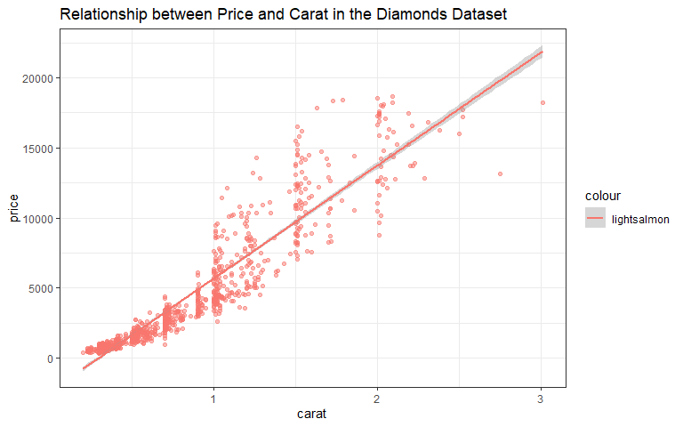
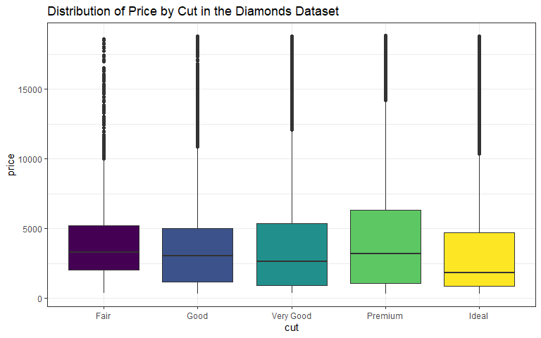
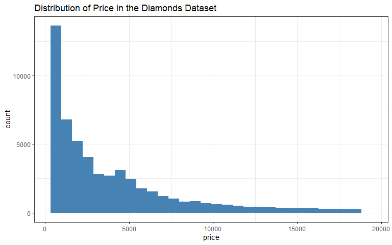

# Set Up

Use `install.packages("package_name")` to install packages from CRAN and `library(package_name)` to load packages for use in your current session.


```r
# Installing a package 
# install.packages("tidyverse")

# Loading the package for use
# library(tidyverse)
pacman::p_load(tidyverse)
```

# Data Exploration

-   **Dataset Structure**


```r
# Data structure
diamonds %>% glimpse()
```

```
## Rows: 53,940
## Columns: 10
## $ carat   <dbl> 0.23, 0.21, 0.23, 0.29, 0.31, 0.24, 0.24, 0.26, 0.22, 0.23, 0.…
## $ cut     <ord> Ideal, Premium, Good, Premium, Good, Very Good, Very Good, Ver…
## $ color   <ord> E, E, E, I, J, J, I, H, E, H, J, J, F, J, E, E, I, J, J, J, I,…
## $ clarity <ord> SI2, SI1, VS1, VS2, SI2, VVS2, VVS1, SI1, VS2, VS1, SI1, VS1, …
## $ depth   <dbl> 61.5, 59.8, 56.9, 62.4, 63.3, 62.8, 62.3, 61.9, 65.1, 59.4, 64…
## $ table   <dbl> 55, 61, 65, 58, 58, 57, 57, 55, 61, 61, 55, 56, 61, 54, 62, 58…
## $ price   <int> 326, 326, 327, 334, 335, 336, 336, 337, 337, 338, 339, 340, 34…
## $ x       <dbl> 3.95, 3.89, 4.05, 4.20, 4.34, 3.94, 3.95, 4.07, 3.87, 4.00, 4.…
## $ y       <dbl> 3.98, 3.84, 4.07, 4.23, 4.35, 3.96, 3.98, 4.11, 3.78, 4.05, 4.…
## $ z       <dbl> 2.43, 2.31, 2.31, 2.63, 2.75, 2.48, 2.47, 2.53, 2.49, 2.39, 2.…
```

-   **Top Rows in the Dataset**


```r
# top 6 rows
diamonds %>% head()
```

<div data-pagedtable="false">
  <script data-pagedtable-source type="application/json">
{"columns":[{"label":["carat"],"name":[1],"type":["dbl"],"align":["right"]},{"label":["cut"],"name":[2],"type":["ord"],"align":["right"]},{"label":["color"],"name":[3],"type":["ord"],"align":["right"]},{"label":["clarity"],"name":[4],"type":["ord"],"align":["right"]},{"label":["depth"],"name":[5],"type":["dbl"],"align":["right"]},{"label":["table"],"name":[6],"type":["dbl"],"align":["right"]},{"label":["price"],"name":[7],"type":["int"],"align":["right"]},{"label":["x"],"name":[8],"type":["dbl"],"align":["right"]},{"label":["y"],"name":[9],"type":["dbl"],"align":["right"]},{"label":["z"],"name":[10],"type":["dbl"],"align":["right"]}],"data":[{"1":"0.23","2":"Ideal","3":"E","4":"SI2","5":"61.5","6":"55","7":"326","8":"3.95","9":"3.98","10":"2.43"},{"1":"0.21","2":"Premium","3":"E","4":"SI1","5":"59.8","6":"61","7":"326","8":"3.89","9":"3.84","10":"2.31"},{"1":"0.23","2":"Good","3":"E","4":"VS1","5":"56.9","6":"65","7":"327","8":"4.05","9":"4.07","10":"2.31"},{"1":"0.29","2":"Premium","3":"I","4":"VS2","5":"62.4","6":"58","7":"334","8":"4.20","9":"4.23","10":"2.63"},{"1":"0.31","2":"Good","3":"J","4":"SI2","5":"63.3","6":"58","7":"335","8":"4.34","9":"4.35","10":"2.75"},{"1":"0.24","2":"Very Good","3":"J","4":"VVS2","5":"62.8","6":"57","7":"336","8":"3.94","9":"3.96","10":"2.48"}],"options":{"columns":{"min":{},"max":[10]},"rows":{"min":[10],"max":[10]},"pages":{}}}
  </script>
</div>

-   **Distribution of Categorical variables**


```r
# How many cut types are there
diamonds %>% count(cut)
```

<div data-pagedtable="false">
  <script data-pagedtable-source type="application/json">
{"columns":[{"label":["cut"],"name":[1],"type":["ord"],"align":["right"]},{"label":["n"],"name":[2],"type":["int"],"align":["right"]}],"data":[{"1":"Fair","2":"1610"},{"1":"Good","2":"4906"},{"1":"Very Good","2":"12082"},{"1":"Premium","2":"13791"},{"1":"Ideal","2":"21551"}],"options":{"columns":{"min":{},"max":[10]},"rows":{"min":[10],"max":[10]},"pages":{}}}
  </script>
</div>

-   **Dataset Summary Statistics**


```r
# Summary Statistics
diamonds %>% summary()
```

```
##      carat               cut        color        clarity          depth      
##  Min.   :0.2000   Fair     : 1610   D: 6775   SI1    :13065   Min.   :43.00  
##  1st Qu.:0.4000   Good     : 4906   E: 9797   VS2    :12258   1st Qu.:61.00  
##  Median :0.7000   Very Good:12082   F: 9542   SI2    : 9194   Median :61.80  
##  Mean   :0.7979   Premium  :13791   G:11292   VS1    : 8171   Mean   :61.75  
##  3rd Qu.:1.0400   Ideal    :21551   H: 8304   VVS2   : 5066   3rd Qu.:62.50  
##  Max.   :5.0100                     I: 5422   VVS1   : 3655   Max.   :79.00  
##                                     J: 2808   (Other): 2531                  
##      table           price             x                y         
##  Min.   :43.00   Min.   :  326   Min.   : 0.000   Min.   : 0.000  
##  1st Qu.:56.00   1st Qu.:  950   1st Qu.: 4.710   1st Qu.: 4.720  
##  Median :57.00   Median : 2401   Median : 5.700   Median : 5.710  
##  Mean   :57.46   Mean   : 3933   Mean   : 5.731   Mean   : 5.735  
##  3rd Qu.:59.00   3rd Qu.: 5324   3rd Qu.: 6.540   3rd Qu.: 6.540  
##  Max.   :95.00   Max.   :18823   Max.   :10.740   Max.   :58.900  
##                                                                   
##        z         
##  Min.   : 0.000  
##  1st Qu.: 2.910  
##  Median : 3.530  
##  Mean   : 3.539  
##  3rd Qu.: 4.040  
##  Max.   :31.800  
## 
```

# Data Visualization

-   **Most tidyverse functions take a dataset as their first argument**

## Scatter Plot


```r
# Example of a Scatter Plot 
diamonds %>%                                                                    # the data
  sample_n(size = 1000) %>%                                                     # Sample a few rows
  ggplot(aes(x = carat, y = price, color = "lightsalmon"))+                     # Aesthetics mapping 
  geom_point(show.legend = F, alpha = .5)+                                      # Geom layer (Adding Scatter points)
  geom_smooth(method = "lm")+                                                   # Another geom layer (Add a smooth line)
  labs(title =  "Relationship between Price and Carat in the Diamonds Dataset")+# Adding plot title
  theme(legend.position = "none")+                                              # Remove unnecessary Legend
  theme_bw()                                                                    # Add a theme
```

<!-- -->

## Box Plot


```r
# Example of a Box plot
diamonds %>%                                                             # the data
  ggplot(aes(x = cut, y = price, fill = cut))+                           # Aesthetics mapping 
  geom_boxplot(show.legend = F)+                                         # geom layer
  labs(title =  "Distribution of Price by Cut in the Diamonds Dataset")+ # adding plot title
  theme_bw()                                                             # Theme for the plot
```

<!-- -->

## Histogram


```r
# Example of Histogram
diamonds %>%  
  ggplot(aes(x = price))+                                 
  geom_histogram(fill = "steelblue", bins = 30)+
  labs(title =  "Distribution of Price in the Diamonds Dataset")+ 
  theme_bw()
```

<!-- -->

## Line Graphs for Time Series Data


```r
# Plotting time series data
library(timetk)

m4_daily %>%                     # the data set 
  filter(id == "D10") %>%        # filter for a specific group
  plot_time_series(              # Plotting function; two major arguments (date and value)
    .date_var = date, .value = value, .x_lab = "Date", .y_lab = "Value",.interactive = T
    )
```

```{=html}
<div class="plotly html-widget html-fill-item-overflow-hidden html-fill-item" id="htmlwidget-03346ec6f32cd9126c16" style="width:768px;height:480px;"></div>
<script type="application/json" data-for="htmlwidget-03346ec6f32cd9126c16">{"x":{"data":[{"x":["2014-07-03","2014-07-04","2014-07-05","2014-07-06","2014-07-07","2014-07-08","2014-07-09","2014-07-10","2014-07-11","2014-07-12","2014-07-13","2014-07-14","2014-07-15","2014-07-16","2014-07-17","2014-07-18","2014-07-19","2014-07-20","2014-07-21","2014-07-22","2014-07-23","2014-07-24","2014-07-25","2014-07-26","2014-07-27","2014-07-28","2014-07-29","2014-07-30","2014-07-31","2014-08-01","2014-08-02","2014-08-03","2014-08-04","2014-08-05","2014-08-06","2014-08-07","2014-08-08","2014-08-09","2014-08-10","2014-08-11","2014-08-12","2014-08-13","2014-08-14","2014-08-15","2014-08-16","2014-08-17","2014-08-18","2014-08-19","2014-08-20","2014-08-21","2014-08-22","2014-08-23","2014-08-24","2014-08-25","2014-08-26","2014-08-27","2014-08-28","2014-08-29","2014-08-30","2014-08-31","2014-09-01","2014-09-02","2014-09-03","2014-09-04","2014-09-05","2014-09-06","2014-09-07","2014-09-08","2014-09-09","2014-09-10","2014-09-11","2014-09-12","2014-09-13","2014-09-14","2014-09-15","2014-09-16","2014-09-17","2014-09-18","2014-09-19","2014-09-20","2014-09-21","2014-09-22","2014-09-23","2014-09-24","2014-09-25","2014-09-26","2014-09-27","2014-09-28","2014-09-29","2014-09-30","2014-10-01","2014-10-02","2014-10-03","2014-10-04","2014-10-05","2014-10-06","2014-10-07","2014-10-08","2014-10-09","2014-10-10","2014-10-11","2014-10-12","2014-10-13","2014-10-14","2014-10-15","2014-10-16","2014-10-17","2014-10-18","2014-10-19","2014-10-20","2014-10-21","2014-10-22","2014-10-23","2014-10-24","2014-10-25","2014-10-26","2014-10-27","2014-10-28","2014-10-29","2014-10-30","2014-10-31","2014-11-01","2014-11-02","2014-11-03","2014-11-04","2014-11-05","2014-11-06","2014-11-07","2014-11-08","2014-11-09","2014-11-10","2014-11-11","2014-11-12","2014-11-13","2014-11-14","2014-11-15","2014-11-16","2014-11-17","2014-11-18","2014-11-19","2014-11-20","2014-11-21","2014-11-22","2014-11-23","2014-11-24","2014-11-25","2014-11-26","2014-11-27","2014-11-28","2014-11-29","2014-11-30","2014-12-01","2014-12-02","2014-12-03","2014-12-04","2014-12-05","2014-12-06","2014-12-07","2014-12-08","2014-12-09","2014-12-10","2014-12-11","2014-12-12","2014-12-13","2014-12-14","2014-12-15","2014-12-16","2014-12-17","2014-12-18","2014-12-19","2014-12-20","2014-12-21","2014-12-22","2014-12-23","2014-12-24","2014-12-25","2014-12-26","2014-12-27","2014-12-28","2014-12-29","2014-12-30","2014-12-31","2015-01-01","2015-01-02","2015-01-03","2015-01-04","2015-01-05","2015-01-06","2015-01-07","2015-01-08","2015-01-09","2015-01-10","2015-01-11","2015-01-12","2015-01-13","2015-01-14","2015-01-15","2015-01-16","2015-01-17","2015-01-18","2015-01-19","2015-01-20","2015-01-21","2015-01-22","2015-01-23","2015-01-24","2015-01-25","2015-01-26","2015-01-27","2015-01-28","2015-01-29","2015-01-30","2015-01-31","2015-02-01","2015-02-02","2015-02-03","2015-02-04","2015-02-05","2015-02-06","2015-02-07","2015-02-08","2015-02-09","2015-02-10","2015-02-11","2015-02-12","2015-02-13","2015-02-14","2015-02-15","2015-02-16","2015-02-17","2015-02-18","2015-02-19","2015-02-20","2015-02-21","2015-02-22","2015-02-23","2015-02-24","2015-02-25","2015-02-26","2015-02-27","2015-02-28","2015-03-01","2015-03-02","2015-03-03","2015-03-04","2015-03-05","2015-03-06","2015-03-07","2015-03-08","2015-03-09","2015-03-10","2015-03-11","2015-03-12","2015-03-13","2015-03-14","2015-03-15","2015-03-16","2015-03-17","2015-03-18","2015-03-19","2015-03-20","2015-03-21","2015-03-22","2015-03-23","2015-03-24","2015-03-25","2015-03-26","2015-03-27","2015-03-28","2015-03-29","2015-03-30","2015-03-31","2015-04-01","2015-04-02","2015-04-03","2015-04-04","2015-04-05","2015-04-06","2015-04-07","2015-04-08","2015-04-09","2015-04-10","2015-04-11","2015-04-12","2015-04-13","2015-04-14","2015-04-15","2015-04-16","2015-04-17","2015-04-18","2015-04-19","2015-04-20","2015-04-21","2015-04-22","2015-04-23","2015-04-24","2015-04-25","2015-04-26","2015-04-27","2015-04-28","2015-04-29","2015-04-30","2015-05-01","2015-05-02","2015-05-03","2015-05-04","2015-05-05","2015-05-06","2015-05-07","2015-05-08","2015-05-09","2015-05-10","2015-05-11","2015-05-12","2015-05-13","2015-05-14","2015-05-15","2015-05-16","2015-05-17","2015-05-18","2015-05-19","2015-05-20","2015-05-21","2015-05-22","2015-05-23","2015-05-24","2015-05-25","2015-05-26","2015-05-27","2015-05-28","2015-05-29","2015-05-30","2015-05-31","2015-06-01","2015-06-02","2015-06-03","2015-06-04","2015-06-05","2015-06-06","2015-06-07","2015-06-08","2015-06-09","2015-06-10","2015-06-11","2015-06-12","2015-06-13","2015-06-14","2015-06-15","2015-06-16","2015-06-17","2015-06-18","2015-06-19","2015-06-20","2015-06-21","2015-06-22","2015-06-23","2015-06-24","2015-06-25","2015-06-26","2015-06-27","2015-06-28","2015-06-29","2015-06-30","2015-07-01","2015-07-02","2015-07-03","2015-07-04","2015-07-05","2015-07-06","2015-07-07","2015-07-08","2015-07-09","2015-07-10","2015-07-11","2015-07-12","2015-07-13","2015-07-14","2015-07-15","2015-07-16","2015-07-17","2015-07-18","2015-07-19","2015-07-20","2015-07-21","2015-07-22","2015-07-23","2015-07-24","2015-07-25","2015-07-26","2015-07-27","2015-07-28","2015-07-29","2015-07-30","2015-07-31","2015-08-01","2015-08-02","2015-08-03","2015-08-04","2015-08-05","2015-08-06","2015-08-07","2015-08-08","2015-08-09","2015-08-10","2015-08-11","2015-08-12","2015-08-13","2015-08-14","2015-08-15","2015-08-16","2015-08-17","2015-08-18","2015-08-19","2015-08-20","2015-08-21","2015-08-22","2015-08-23","2015-08-24","2015-08-25","2015-08-26","2015-08-27","2015-08-28","2015-08-29","2015-08-30","2015-08-31","2015-09-01","2015-09-02","2015-09-03","2015-09-04","2015-09-05","2015-09-06","2015-09-07","2015-09-08","2015-09-09","2015-09-10","2015-09-11","2015-09-12","2015-09-13","2015-09-14","2015-09-15","2015-09-16","2015-09-17","2015-09-18","2015-09-19","2015-09-20","2015-09-21","2015-09-22","2015-09-23","2015-09-24","2015-09-25","2015-09-26","2015-09-27","2015-09-28","2015-09-29","2015-09-30","2015-10-01","2015-10-02","2015-10-03","2015-10-04","2015-10-05","2015-10-06","2015-10-07","2015-10-08","2015-10-09","2015-10-10","2015-10-11","2015-10-12","2015-10-13","2015-10-14","2015-10-15","2015-10-16","2015-10-17","2015-10-18","2015-10-19","2015-10-20","2015-10-21","2015-10-22","2015-10-23","2015-10-24","2015-10-25","2015-10-26","2015-10-27","2015-10-28","2015-10-29","2015-10-30","2015-10-31","2015-11-01","2015-11-02","2015-11-03","2015-11-04","2015-11-05","2015-11-06","2015-11-07","2015-11-08","2015-11-09","2015-11-10","2015-11-11","2015-11-12","2015-11-13","2015-11-14","2015-11-15","2015-11-16","2015-11-17","2015-11-18","2015-11-19","2015-11-20","2015-11-21","2015-11-22","2015-11-23","2015-11-24","2015-11-25","2015-11-26","2015-11-27","2015-11-28","2015-11-29","2015-11-30","2015-12-01","2015-12-02","2015-12-03","2015-12-04","2015-12-05","2015-12-06","2015-12-07","2015-12-08","2015-12-09","2015-12-10","2015-12-11","2015-12-12","2015-12-13","2015-12-14","2015-12-15","2015-12-16","2015-12-17","2015-12-18","2015-12-19","2015-12-20","2015-12-21","2015-12-22","2015-12-23","2015-12-24","2015-12-25","2015-12-26","2015-12-27","2015-12-28","2015-12-29","2015-12-30","2015-12-31","2016-01-01","2016-01-02","2016-01-03","2016-01-04","2016-01-05","2016-01-06","2016-01-07","2016-01-08","2016-01-09","2016-01-10","2016-01-11","2016-01-12","2016-01-13","2016-01-14","2016-01-15","2016-01-16","2016-01-17","2016-01-18","2016-01-19","2016-01-20","2016-01-21","2016-01-22","2016-01-23","2016-01-24","2016-01-25","2016-01-26","2016-01-27","2016-01-28","2016-01-29","2016-01-30","2016-01-31","2016-02-01","2016-02-02","2016-02-03","2016-02-04","2016-02-05","2016-02-06","2016-02-07","2016-02-08","2016-02-09","2016-02-10","2016-02-11","2016-02-12","2016-02-13","2016-02-14","2016-02-15","2016-02-16","2016-02-17","2016-02-18","2016-02-19","2016-02-20","2016-02-21","2016-02-22","2016-02-23","2016-02-24","2016-02-25","2016-02-26","2016-02-27","2016-02-28","2016-02-29","2016-03-01","2016-03-02","2016-03-03","2016-03-04","2016-03-05","2016-03-06","2016-03-07","2016-03-08","2016-03-09","2016-03-10","2016-03-11","2016-03-12","2016-03-13","2016-03-14","2016-03-15","2016-03-16","2016-03-17","2016-03-18","2016-03-19","2016-03-20","2016-03-21","2016-03-22","2016-03-23","2016-03-24","2016-03-25","2016-03-26","2016-03-27","2016-03-28","2016-03-29","2016-03-30","2016-03-31","2016-04-01","2016-04-02","2016-04-03","2016-04-04","2016-04-05","2016-04-06","2016-04-07","2016-04-08","2016-04-09","2016-04-10","2016-04-11","2016-04-12","2016-04-13","2016-04-14","2016-04-15","2016-04-16","2016-04-17","2016-04-18","2016-04-19","2016-04-20","2016-04-21","2016-04-22","2016-04-23","2016-04-24","2016-04-25","2016-04-26","2016-04-27","2016-04-28","2016-04-29","2016-04-30","2016-05-01","2016-05-02","2016-05-03","2016-05-04","2016-05-05","2016-05-06"],"y":[2076.1999999999998,2073.4000000000001,2048.6999999999998,2048.9000000000001,2006.4000000000001,2017.5999999999999,2019.0999999999999,2007.4000000000001,2010,2001.5,1978.8,1988.3,2000.7,2010.5,2014.5,1962.5999999999999,1948,1943,1933.3,1891,1886.2,1896.5999999999999,1888.0999999999999,1876,1895.0999999999999,1886.2,1920,1912,1917.2,1922.5999999999999,1956.7,1956.5,1999.0999999999999,2002.9000000000001,2016.3,2017.3,2027.5,2015.2,2017.7,2005.8,2014.4000000000001,2019,2019.8,1989.7,1986.3,1988.2,2000.8,1988.3,1989,1998.9000000000001,1971.4000000000001,1967.0999999999999,1995.5999999999999,2011,2001.5999999999999,1971.9000000000001,1928.9000000000001,1914.7,1936.5,1921.3,1907.8,1925.0999999999999,1897.5999999999999,1878.8,1903.2,1916.8,1899.8,1881.5,1908.2,1863.2,1829.4000000000001,1797.7,1781.5999999999999,1809.9000000000001,1864.5999999999999,1907.9000000000001,1951.5,1973.8,1976.9000000000001,1990.3,1992.5999999999999,1981,1990.9000000000001,1962.3,1997.5999999999999,1987.9000000000001,1999.8,2000.2,1996.4000000000001,2023.5,2049.1999999999998,2044.7,2061.5,2064.5,2062,2064,2076,2090.1999999999998,2081.9000000000001,2143.0999999999999,2140.1999999999998,2154.9000000000001,2152.4000000000001,2143.3000000000002,2141.6999999999998,2125.5999999999999,2137.4000000000001,2141.6999999999998,2137.3000000000002,2134.3000000000002,2107.5999999999999,2132,2081.1999999999998,2069.5,2058.1999999999998,2029.9000000000001,2022.8,2096.0999999999999,2109.3000000000002,2119.9000000000001,2130,2133.3000000000002,2144.1999999999998,2139.9000000000001,2145.4000000000001,2153.1999999999998,2165.8000000000002,2135.9000000000001,2129.9000000000001,2121.9000000000001,2178,2208.9000000000001,2209.5,2245.4000000000001,2155.9000000000001,2176,2086.5,2123.5,2083.5,2115.1999999999998,2132.3000000000002,2140.6999999999998,2131.3000000000002,2162.1999999999998,2139.9000000000001,2160.9000000000001,2158.3000000000002,2164.8000000000002,2184.0999999999999,2216.6999999999998,2216.6999999999998,2244.3000000000002,2257.9000000000001,2280,2272.5999999999999,2301.4000000000001,2299.0999999999999,2313.5999999999999,2312.4000000000001,2308.5999999999999,2324.1999999999998,2333.0999999999999,2333.8000000000002,2321.9000000000001,2308.9000000000001,2317.5,2313.6999999999998,2290.5999999999999,2306.5,2295.3000000000002,2265.3000000000002,2249.8000000000002,2250.5999999999999,2275.5,2290,2287.4000000000001,2273.6999999999998,2270.0999999999999,2322,2327.3000000000002,2344.9000000000001,2327.8000000000002,2351,2302.6999999999998,2300.6999999999998,2341.1999999999998,2351.4000000000001,2363.9000000000001,2344.5,2368.5,2368.8000000000002,2330.0999999999999,2345.3000000000002,2341.6999999999998,2345.9000000000001,2342.3000000000002,2356,2352,2306.8000000000002,2310.0999999999999,2303.5999999999999,2321.0999999999999,2270.9000000000001,2255.0999999999999,2287.5,2253.1999999999998,2250.5999999999999,2233.3000000000002,2211.8000000000002,2253.1999999999998,2235.5999999999999,2216.9000000000001,2209.5999999999999,2285.6999999999998,2277.5,2258.5,2260.5999999999999,2273,2288.6999999999998,2297.9000000000001,2339,2340.8000000000002,2325.5999999999999,2324.5999999999999,2307.3000000000002,2305.5999999999999,2300.9000000000001,2306.5,2291.3000000000002,2284.4000000000001,2288.6999999999998,2275.6999999999998,2254.4000000000001,2258.5,2244.0999999999999,2247.8000000000002,2285.0999999999999,2278.5,2277.9000000000001,2280.8000000000002,2292.6999999999998,2290.6999999999998,2305.6999999999998,2330.9000000000001,2343,2363.4000000000001,2348.8000000000002,2344.3000000000002,2324.8000000000002,2310.9000000000001,2322.8000000000002,2333.0999999999999,2303.0999999999999,2322.9000000000001,2333.4000000000001,2340.6999999999998,2338.6999999999998,2367.1999999999998,2361.1999999999998,2364.3000000000002,2344.1999999999998,2340.6999999999998,2334,2327.0999999999999,2315.9000000000001,2367.4000000000001,2345.3000000000002,2290.5,2313.6999999999998,2330.5,2355.6999999999998,2392.4000000000001,2396.3000000000002,2390.5999999999999,2404.0999999999999,2378.9000000000001,2351.0999999999999,2378.4000000000001,2383.0999999999999,2394.9000000000001,2418.1999999999998,2435.5999999999999,2446.4000000000001,2490.6999999999998,2499.8000000000002,2480.1999999999998,2422.0999999999999,2252.3000000000002,2318.8000000000002,2249.3000000000002,2290.9000000000001,2319.5,2315.5,2284,2299.4000000000001,2345.1999999999998,2325,2340.5,2391.4000000000001,2328,2335.5999999999999,2368.4000000000001,2375.9000000000001,2374.0999999999999,2397.1999999999998,2385.9000000000001,2386.3000000000002,2332.5999999999999,2305.6999999999998,2267.9000000000001,2303.1999999999998,2280.5,2201.4000000000001,2185.0999999999999,2207.9000000000001,2200.5,2270.5999999999999,2301.8000000000002,2274.0999999999999,2296.8000000000002,2326.5999999999999,2324.1999999999998,2315.4000000000001,2296.5999999999999,2268.8000000000002,2292.1999999999998,2291.5999999999999,2301.6999999999998,2331.9000000000001,2307.1999999999998,2327.5999999999999,2338.3000000000002,2304.1999999999998,2288.5999999999999,2316.9000000000001,2280.6999999999998,2315.5999999999999,2333,2337.5999999999999,2330.3000000000002,2330.5999999999999,2317.4000000000001,2293.1999999999998,2333.5,2341.3000000000002,2310.5999999999999,2296.8000000000002,2356.0999999999999,2359.1999999999998,2410.1999999999998,2420.5,2423.0999999999999,2407.1999999999998,2434.8000000000002,2441.5999999999999,2445.5999999999999,2430.3000000000002,2451.5,2422.0999999999999,2378.5,2407.0999999999999,2372.1999999999998,2353.6999999999998,2316.0999999999999,2296.5999999999999,2285.8000000000002,2267.9000000000001,2288.5999999999999,2321.4000000000001,2261.0999999999999,2236.0999999999999,2247.5999999999999,2282.1999999999998,2291.9000000000001,2292.0999999999999,2313.3000000000002,2306.6999999999998,2283.3000000000002,2238.1999999999998,2228.4000000000001,2190.3000000000002,2124,2107,2062.5,2067.6999999999998,2068.5,2010,1957.5,2003.4000000000001,1925.5,1936.5999999999999,1979.0999999999999,1992.8,1951.0999999999999,1980.7,1988.0999999999999,1972.3,2014.7,1994.7,1985.9000000000001,1984.4000000000001,1993.7,1908.7,1856.5999999999999,1913.0999999999999,1873.5,1891.5999999999999,1954.4000000000001,1977,1988.9000000000001,1969.4000000000001,1984.5,1999.2,1998.0999999999999,2054.0999999999999,2095.3000000000002,2090.9000000000001,2100.6999999999998,2133.4000000000001,2157.8000000000002,2169.5,2155.5,2160.1999999999998,2157.9000000000001,2167.1999999999998,2181.5,2199.4000000000001,2188.5999999999999,2184.8000000000002,2218.1999999999998,2259.8000000000002,2275.3000000000002,2248.6999999999998,2254.5999999999999,2235.5,2250,2271.9000000000001,2316.6999999999998,2294.0999999999999,2294.9000000000001,2315.1999999999998,2268.8000000000002,2283.8000000000002,2300.6999999999998,2318.1999999999998,2336,2306.4000000000001,2329.3000000000002,2356.9000000000001,2348.3000000000002,2338.3000000000002,2358.6999999999998,2352.4000000000001,2368.0999999999999,2361,2351.8000000000002,2349,2359.4000000000001,2342.1999999999998,2292.4000000000001,2291.5999999999999,2301.1999999999998,2272.8000000000002,2284.0999999999999,2272.4000000000001,2281.5999999999999,2299.0999999999999,2301.9000000000001,2292.8000000000002,2283.8000000000002,2278.9000000000001,2287.6999999999998,2275.3000000000002,2256.5999999999999,2267.4000000000001,2290.0999999999999,2315.3000000000002,2366.5999999999999,2366.6999999999998,2359.5999999999999,2373.6999999999998,2350.1999999999998,2360.6999999999998,2355.5,2356.8000000000002,2359.0999999999999,2382.0999999999999,2381.1999999999998,2356.5999999999999,2332.6999999999998,2291.5,2272.1999999999998,2254.4000000000001,2271.4000000000001,2317.6999999999998,2326,2304.5999999999999,2321.9000000000001,2260.6999999999998,2243,2220.9000000000001,2281.5,2315.9000000000001,2353,2354.3000000000002,2334.5999999999999,2390.8000000000002,2418.8000000000002,2459.8000000000002,2479.8000000000002,2490.6999999999998,2501.3000000000002,2491.5999999999999,2486.0999999999999,2489.5999999999999,2489.6999999999998,2503.5999999999999,2506.1999999999998,2521.0999999999999,2527.6999999999998,2556.6999999999998,2535.5,2543.3000000000002,2495.5999999999999,2477.5,2451.1999999999998,2467.5,2472.5999999999999,2490.3000000000002,2485.0999999999999,2486.5,2496,2488.8000000000002,2478.5,2487,2464.6999999999998,2460,2453.5999999999999,2447.0999999999999,2482.1999999999998,2508.1999999999998,2492,2498.5,2469.5999999999999,2486,2490.5,2484.9000000000001,2483.5999999999999,2483.3000000000002,2469.9000000000001,2482.8000000000002,2450.1999999999998,2358.1999999999998,2396,2362.4000000000001,2356,2361.3000000000002,2356.0999999999999,2368.5,2340.4000000000001,2386.8000000000002,2397.9000000000001,2388.1999999999998,2394.5,2414.5999999999999,2421.8000000000002,2411.0999999999999,2397.4000000000001,2386.8000000000002,2386.4000000000001,2369,2396.0999999999999,2370.3000000000002,2362.8000000000002,2342.9000000000001,2336.5,2354.5,2353.1999999999998,2377.4000000000001,2371.3000000000002,2349.0999999999999,2317.4000000000001,2348.0999999999999,2328.8000000000002,2285.3000000000002,2285.9000000000001,2257.1999999999998,2271.8000000000002,2277.5,2249.9000000000001,2227.5,2216.0999999999999,2275.1999999999998,2251.6999999999998,2268.4000000000001,2312.8000000000002,2324.6999999999998,2330.9000000000001,2359,2357.1999999999998,2359.0999999999999,2376.3000000000002,2399.5,2411,2398.9000000000001,2417.1999999999998,2432.4000000000001,2389.6999999999998,2406.4000000000001,2357.3000000000002,2331,2352.4000000000001,2384.1999999999998,2422.3000000000002,2475.0999999999999,2497.4000000000001,2484.1999999999998,2493.3000000000002,2463.9000000000001,2434.5,2403.4000000000001,2426.4000000000001,2417.3000000000002,2431.9000000000001,2442.6999999999998,2416.3000000000002,2412.6999999999998,2433.5999999999999,2401.5,2411.1999999999998,2403.0999999999999,2406.4000000000001,2433.3000000000002,2437.5999999999999,2399,2393.4000000000001,2395.9000000000001,2403.4000000000001,2401.0999999999999,2403.9000000000001,2411.5999999999999,2424.3000000000002,2410,2418.6999999999998,2455.3000000000002,2523.0999999999999,2559,2550.9000000000001,2500.5,2501.9000000000001,2499.0999999999999,2491.8000000000002,2504.3000000000002,2508.8000000000002,2487.6999999999998,2488.0999999999999,2491.3000000000002,2525.8000000000002,2561.5,2540.4000000000001,2534.0999999999999,2556,2534.1999999999998,2542,2585.8000000000002,2579.9000000000001,2544,2572.9000000000001,2601,2630.6999999999998,2649.3000000000002,2631.8000000000002,2622.5,2620.0999999999999],"text":["date: 2014-07-03<br />.value: 2076.2","date: 2014-07-04<br />.value: 2073.4","date: 2014-07-05<br />.value: 2048.7","date: 2014-07-06<br />.value: 2048.9","date: 2014-07-07<br />.value: 2006.4","date: 2014-07-08<br />.value: 2017.6","date: 2014-07-09<br />.value: 2019.1","date: 2014-07-10<br />.value: 2007.4","date: 2014-07-11<br />.value: 2010.0","date: 2014-07-12<br />.value: 2001.5","date: 2014-07-13<br />.value: 1978.8","date: 2014-07-14<br />.value: 1988.3","date: 2014-07-15<br />.value: 2000.7","date: 2014-07-16<br />.value: 2010.5","date: 2014-07-17<br />.value: 2014.5","date: 2014-07-18<br />.value: 1962.6","date: 2014-07-19<br />.value: 1948.0","date: 2014-07-20<br />.value: 1943.0","date: 2014-07-21<br />.value: 1933.3","date: 2014-07-22<br />.value: 1891.0","date: 2014-07-23<br />.value: 1886.2","date: 2014-07-24<br />.value: 1896.6","date: 2014-07-25<br />.value: 1888.1","date: 2014-07-26<br />.value: 1876.0","date: 2014-07-27<br />.value: 1895.1","date: 2014-07-28<br />.value: 1886.2","date: 2014-07-29<br />.value: 1920.0","date: 2014-07-30<br />.value: 1912.0","date: 2014-07-31<br />.value: 1917.2","date: 2014-08-01<br />.value: 1922.6","date: 2014-08-02<br />.value: 1956.7","date: 2014-08-03<br />.value: 1956.5","date: 2014-08-04<br />.value: 1999.1","date: 2014-08-05<br />.value: 2002.9","date: 2014-08-06<br />.value: 2016.3","date: 2014-08-07<br />.value: 2017.3","date: 2014-08-08<br />.value: 2027.5","date: 2014-08-09<br />.value: 2015.2","date: 2014-08-10<br />.value: 2017.7","date: 2014-08-11<br />.value: 2005.8","date: 2014-08-12<br />.value: 2014.4","date: 2014-08-13<br />.value: 2019.0","date: 2014-08-14<br />.value: 2019.8","date: 2014-08-15<br />.value: 1989.7","date: 2014-08-16<br />.value: 1986.3","date: 2014-08-17<br />.value: 1988.2","date: 2014-08-18<br />.value: 2000.8","date: 2014-08-19<br />.value: 1988.3","date: 2014-08-20<br />.value: 1989.0","date: 2014-08-21<br />.value: 1998.9","date: 2014-08-22<br />.value: 1971.4","date: 2014-08-23<br />.value: 1967.1","date: 2014-08-24<br />.value: 1995.6","date: 2014-08-25<br />.value: 2011.0","date: 2014-08-26<br />.value: 2001.6","date: 2014-08-27<br />.value: 1971.9","date: 2014-08-28<br />.value: 1928.9","date: 2014-08-29<br />.value: 1914.7","date: 2014-08-30<br />.value: 1936.5","date: 2014-08-31<br />.value: 1921.3","date: 2014-09-01<br />.value: 1907.8","date: 2014-09-02<br />.value: 1925.1","date: 2014-09-03<br />.value: 1897.6","date: 2014-09-04<br />.value: 1878.8","date: 2014-09-05<br />.value: 1903.2","date: 2014-09-06<br />.value: 1916.8","date: 2014-09-07<br />.value: 1899.8","date: 2014-09-08<br />.value: 1881.5","date: 2014-09-09<br />.value: 1908.2","date: 2014-09-10<br />.value: 1863.2","date: 2014-09-11<br />.value: 1829.4","date: 2014-09-12<br />.value: 1797.7","date: 2014-09-13<br />.value: 1781.6","date: 2014-09-14<br />.value: 1809.9","date: 2014-09-15<br />.value: 1864.6","date: 2014-09-16<br />.value: 1907.9","date: 2014-09-17<br />.value: 1951.5","date: 2014-09-18<br />.value: 1973.8","date: 2014-09-19<br />.value: 1976.9","date: 2014-09-20<br />.value: 1990.3","date: 2014-09-21<br />.value: 1992.6","date: 2014-09-22<br />.value: 1981.0","date: 2014-09-23<br />.value: 1990.9","date: 2014-09-24<br />.value: 1962.3","date: 2014-09-25<br />.value: 1997.6","date: 2014-09-26<br />.value: 1987.9","date: 2014-09-27<br />.value: 1999.8","date: 2014-09-28<br />.value: 2000.2","date: 2014-09-29<br />.value: 1996.4","date: 2014-09-30<br />.value: 2023.5","date: 2014-10-01<br />.value: 2049.2","date: 2014-10-02<br />.value: 2044.7","date: 2014-10-03<br />.value: 2061.5","date: 2014-10-04<br />.value: 2064.5","date: 2014-10-05<br />.value: 2062.0","date: 2014-10-06<br />.value: 2064.0","date: 2014-10-07<br />.value: 2076.0","date: 2014-10-08<br />.value: 2090.2","date: 2014-10-09<br />.value: 2081.9","date: 2014-10-10<br />.value: 2143.1","date: 2014-10-11<br />.value: 2140.2","date: 2014-10-12<br />.value: 2154.9","date: 2014-10-13<br />.value: 2152.4","date: 2014-10-14<br />.value: 2143.3","date: 2014-10-15<br />.value: 2141.7","date: 2014-10-16<br />.value: 2125.6","date: 2014-10-17<br />.value: 2137.4","date: 2014-10-18<br />.value: 2141.7","date: 2014-10-19<br />.value: 2137.3","date: 2014-10-20<br />.value: 2134.3","date: 2014-10-21<br />.value: 2107.6","date: 2014-10-22<br />.value: 2132.0","date: 2014-10-23<br />.value: 2081.2","date: 2014-10-24<br />.value: 2069.5","date: 2014-10-25<br />.value: 2058.2","date: 2014-10-26<br />.value: 2029.9","date: 2014-10-27<br />.value: 2022.8","date: 2014-10-28<br />.value: 2096.1","date: 2014-10-29<br />.value: 2109.3","date: 2014-10-30<br />.value: 2119.9","date: 2014-10-31<br />.value: 2130.0","date: 2014-11-01<br />.value: 2133.3","date: 2014-11-02<br />.value: 2144.2","date: 2014-11-03<br />.value: 2139.9","date: 2014-11-04<br />.value: 2145.4","date: 2014-11-05<br />.value: 2153.2","date: 2014-11-06<br />.value: 2165.8","date: 2014-11-07<br />.value: 2135.9","date: 2014-11-08<br />.value: 2129.9","date: 2014-11-09<br />.value: 2121.9","date: 2014-11-10<br />.value: 2178.0","date: 2014-11-11<br />.value: 2208.9","date: 2014-11-12<br />.value: 2209.5","date: 2014-11-13<br />.value: 2245.4","date: 2014-11-14<br />.value: 2155.9","date: 2014-11-15<br />.value: 2176.0","date: 2014-11-16<br />.value: 2086.5","date: 2014-11-17<br />.value: 2123.5","date: 2014-11-18<br />.value: 2083.5","date: 2014-11-19<br />.value: 2115.2","date: 2014-11-20<br />.value: 2132.3","date: 2014-11-21<br />.value: 2140.7","date: 2014-11-22<br />.value: 2131.3","date: 2014-11-23<br />.value: 2162.2","date: 2014-11-24<br />.value: 2139.9","date: 2014-11-25<br />.value: 2160.9","date: 2014-11-26<br />.value: 2158.3","date: 2014-11-27<br />.value: 2164.8","date: 2014-11-28<br />.value: 2184.1","date: 2014-11-29<br />.value: 2216.7","date: 2014-11-30<br />.value: 2216.7","date: 2014-12-01<br />.value: 2244.3","date: 2014-12-02<br />.value: 2257.9","date: 2014-12-03<br />.value: 2280.0","date: 2014-12-04<br />.value: 2272.6","date: 2014-12-05<br />.value: 2301.4","date: 2014-12-06<br />.value: 2299.1","date: 2014-12-07<br />.value: 2313.6","date: 2014-12-08<br />.value: 2312.4","date: 2014-12-09<br />.value: 2308.6","date: 2014-12-10<br />.value: 2324.2","date: 2014-12-11<br />.value: 2333.1","date: 2014-12-12<br />.value: 2333.8","date: 2014-12-13<br />.value: 2321.9","date: 2014-12-14<br />.value: 2308.9","date: 2014-12-15<br />.value: 2317.5","date: 2014-12-16<br />.value: 2313.7","date: 2014-12-17<br />.value: 2290.6","date: 2014-12-18<br />.value: 2306.5","date: 2014-12-19<br />.value: 2295.3","date: 2014-12-20<br />.value: 2265.3","date: 2014-12-21<br />.value: 2249.8","date: 2014-12-22<br />.value: 2250.6","date: 2014-12-23<br />.value: 2275.5","date: 2014-12-24<br />.value: 2290.0","date: 2014-12-25<br />.value: 2287.4","date: 2014-12-26<br />.value: 2273.7","date: 2014-12-27<br />.value: 2270.1","date: 2014-12-28<br />.value: 2322.0","date: 2014-12-29<br />.value: 2327.3","date: 2014-12-30<br />.value: 2344.9","date: 2014-12-31<br />.value: 2327.8","date: 2015-01-01<br />.value: 2351.0","date: 2015-01-02<br />.value: 2302.7","date: 2015-01-03<br />.value: 2300.7","date: 2015-01-04<br />.value: 2341.2","date: 2015-01-05<br />.value: 2351.4","date: 2015-01-06<br />.value: 2363.9","date: 2015-01-07<br />.value: 2344.5","date: 2015-01-08<br />.value: 2368.5","date: 2015-01-09<br />.value: 2368.8","date: 2015-01-10<br />.value: 2330.1","date: 2015-01-11<br />.value: 2345.3","date: 2015-01-12<br />.value: 2341.7","date: 2015-01-13<br />.value: 2345.9","date: 2015-01-14<br />.value: 2342.3","date: 2015-01-15<br />.value: 2356.0","date: 2015-01-16<br />.value: 2352.0","date: 2015-01-17<br />.value: 2306.8","date: 2015-01-18<br />.value: 2310.1","date: 2015-01-19<br />.value: 2303.6","date: 2015-01-20<br />.value: 2321.1","date: 2015-01-21<br />.value: 2270.9","date: 2015-01-22<br />.value: 2255.1","date: 2015-01-23<br />.value: 2287.5","date: 2015-01-24<br />.value: 2253.2","date: 2015-01-25<br />.value: 2250.6","date: 2015-01-26<br />.value: 2233.3","date: 2015-01-27<br />.value: 2211.8","date: 2015-01-28<br />.value: 2253.2","date: 2015-01-29<br />.value: 2235.6","date: 2015-01-30<br />.value: 2216.9","date: 2015-01-31<br />.value: 2209.6","date: 2015-02-01<br />.value: 2285.7","date: 2015-02-02<br />.value: 2277.5","date: 2015-02-03<br />.value: 2258.5","date: 2015-02-04<br />.value: 2260.6","date: 2015-02-05<br />.value: 2273.0","date: 2015-02-06<br />.value: 2288.7","date: 2015-02-07<br />.value: 2297.9","date: 2015-02-08<br />.value: 2339.0","date: 2015-02-09<br />.value: 2340.8","date: 2015-02-10<br />.value: 2325.6","date: 2015-02-11<br />.value: 2324.6","date: 2015-02-12<br />.value: 2307.3","date: 2015-02-13<br />.value: 2305.6","date: 2015-02-14<br />.value: 2300.9","date: 2015-02-15<br />.value: 2306.5","date: 2015-02-16<br />.value: 2291.3","date: 2015-02-17<br />.value: 2284.4","date: 2015-02-18<br />.value: 2288.7","date: 2015-02-19<br />.value: 2275.7","date: 2015-02-20<br />.value: 2254.4","date: 2015-02-21<br />.value: 2258.5","date: 2015-02-22<br />.value: 2244.1","date: 2015-02-23<br />.value: 2247.8","date: 2015-02-24<br />.value: 2285.1","date: 2015-02-25<br />.value: 2278.5","date: 2015-02-26<br />.value: 2277.9","date: 2015-02-27<br />.value: 2280.8","date: 2015-02-28<br />.value: 2292.7","date: 2015-03-01<br />.value: 2290.7","date: 2015-03-02<br />.value: 2305.7","date: 2015-03-03<br />.value: 2330.9","date: 2015-03-04<br />.value: 2343.0","date: 2015-03-05<br />.value: 2363.4","date: 2015-03-06<br />.value: 2348.8","date: 2015-03-07<br />.value: 2344.3","date: 2015-03-08<br />.value: 2324.8","date: 2015-03-09<br />.value: 2310.9","date: 2015-03-10<br />.value: 2322.8","date: 2015-03-11<br />.value: 2333.1","date: 2015-03-12<br />.value: 2303.1","date: 2015-03-13<br />.value: 2322.9","date: 2015-03-14<br />.value: 2333.4","date: 2015-03-15<br />.value: 2340.7","date: 2015-03-16<br />.value: 2338.7","date: 2015-03-17<br />.value: 2367.2","date: 2015-03-18<br />.value: 2361.2","date: 2015-03-19<br />.value: 2364.3","date: 2015-03-20<br />.value: 2344.2","date: 2015-03-21<br />.value: 2340.7","date: 2015-03-22<br />.value: 2334.0","date: 2015-03-23<br />.value: 2327.1","date: 2015-03-24<br />.value: 2315.9","date: 2015-03-25<br />.value: 2367.4","date: 2015-03-26<br />.value: 2345.3","date: 2015-03-27<br />.value: 2290.5","date: 2015-03-28<br />.value: 2313.7","date: 2015-03-29<br />.value: 2330.5","date: 2015-03-30<br />.value: 2355.7","date: 2015-03-31<br />.value: 2392.4","date: 2015-04-01<br />.value: 2396.3","date: 2015-04-02<br />.value: 2390.6","date: 2015-04-03<br />.value: 2404.1","date: 2015-04-04<br />.value: 2378.9","date: 2015-04-05<br />.value: 2351.1","date: 2015-04-06<br />.value: 2378.4","date: 2015-04-07<br />.value: 2383.1","date: 2015-04-08<br />.value: 2394.9","date: 2015-04-09<br />.value: 2418.2","date: 2015-04-10<br />.value: 2435.6","date: 2015-04-11<br />.value: 2446.4","date: 2015-04-12<br />.value: 2490.7","date: 2015-04-13<br />.value: 2499.8","date: 2015-04-14<br />.value: 2480.2","date: 2015-04-15<br />.value: 2422.1","date: 2015-04-16<br />.value: 2252.3","date: 2015-04-17<br />.value: 2318.8","date: 2015-04-18<br />.value: 2249.3","date: 2015-04-19<br />.value: 2290.9","date: 2015-04-20<br />.value: 2319.5","date: 2015-04-21<br />.value: 2315.5","date: 2015-04-22<br />.value: 2284.0","date: 2015-04-23<br />.value: 2299.4","date: 2015-04-24<br />.value: 2345.2","date: 2015-04-25<br />.value: 2325.0","date: 2015-04-26<br />.value: 2340.5","date: 2015-04-27<br />.value: 2391.4","date: 2015-04-28<br />.value: 2328.0","date: 2015-04-29<br />.value: 2335.6","date: 2015-04-30<br />.value: 2368.4","date: 2015-05-01<br />.value: 2375.9","date: 2015-05-02<br />.value: 2374.1","date: 2015-05-03<br />.value: 2397.2","date: 2015-05-04<br />.value: 2385.9","date: 2015-05-05<br />.value: 2386.3","date: 2015-05-06<br />.value: 2332.6","date: 2015-05-07<br />.value: 2305.7","date: 2015-05-08<br />.value: 2267.9","date: 2015-05-09<br />.value: 2303.2","date: 2015-05-10<br />.value: 2280.5","date: 2015-05-11<br />.value: 2201.4","date: 2015-05-12<br />.value: 2185.1","date: 2015-05-13<br />.value: 2207.9","date: 2015-05-14<br />.value: 2200.5","date: 2015-05-15<br />.value: 2270.6","date: 2015-05-16<br />.value: 2301.8","date: 2015-05-17<br />.value: 2274.1","date: 2015-05-18<br />.value: 2296.8","date: 2015-05-19<br />.value: 2326.6","date: 2015-05-20<br />.value: 2324.2","date: 2015-05-21<br />.value: 2315.4","date: 2015-05-22<br />.value: 2296.6","date: 2015-05-23<br />.value: 2268.8","date: 2015-05-24<br />.value: 2292.2","date: 2015-05-25<br />.value: 2291.6","date: 2015-05-26<br />.value: 2301.7","date: 2015-05-27<br />.value: 2331.9","date: 2015-05-28<br />.value: 2307.2","date: 2015-05-29<br />.value: 2327.6","date: 2015-05-30<br />.value: 2338.3","date: 2015-05-31<br />.value: 2304.2","date: 2015-06-01<br />.value: 2288.6","date: 2015-06-02<br />.value: 2316.9","date: 2015-06-03<br />.value: 2280.7","date: 2015-06-04<br />.value: 2315.6","date: 2015-06-05<br />.value: 2333.0","date: 2015-06-06<br />.value: 2337.6","date: 2015-06-07<br />.value: 2330.3","date: 2015-06-08<br />.value: 2330.6","date: 2015-06-09<br />.value: 2317.4","date: 2015-06-10<br />.value: 2293.2","date: 2015-06-11<br />.value: 2333.5","date: 2015-06-12<br />.value: 2341.3","date: 2015-06-13<br />.value: 2310.6","date: 2015-06-14<br />.value: 2296.8","date: 2015-06-15<br />.value: 2356.1","date: 2015-06-16<br />.value: 2359.2","date: 2015-06-17<br />.value: 2410.2","date: 2015-06-18<br />.value: 2420.5","date: 2015-06-19<br />.value: 2423.1","date: 2015-06-20<br />.value: 2407.2","date: 2015-06-21<br />.value: 2434.8","date: 2015-06-22<br />.value: 2441.6","date: 2015-06-23<br />.value: 2445.6","date: 2015-06-24<br />.value: 2430.3","date: 2015-06-25<br />.value: 2451.5","date: 2015-06-26<br />.value: 2422.1","date: 2015-06-27<br />.value: 2378.5","date: 2015-06-28<br />.value: 2407.1","date: 2015-06-29<br />.value: 2372.2","date: 2015-06-30<br />.value: 2353.7","date: 2015-07-01<br />.value: 2316.1","date: 2015-07-02<br />.value: 2296.6","date: 2015-07-03<br />.value: 2285.8","date: 2015-07-04<br />.value: 2267.9","date: 2015-07-05<br />.value: 2288.6","date: 2015-07-06<br />.value: 2321.4","date: 2015-07-07<br />.value: 2261.1","date: 2015-07-08<br />.value: 2236.1","date: 2015-07-09<br />.value: 2247.6","date: 2015-07-10<br />.value: 2282.2","date: 2015-07-11<br />.value: 2291.9","date: 2015-07-12<br />.value: 2292.1","date: 2015-07-13<br />.value: 2313.3","date: 2015-07-14<br />.value: 2306.7","date: 2015-07-15<br />.value: 2283.3","date: 2015-07-16<br />.value: 2238.2","date: 2015-07-17<br />.value: 2228.4","date: 2015-07-18<br />.value: 2190.3","date: 2015-07-19<br />.value: 2124.0","date: 2015-07-20<br />.value: 2107.0","date: 2015-07-21<br />.value: 2062.5","date: 2015-07-22<br />.value: 2067.7","date: 2015-07-23<br />.value: 2068.5","date: 2015-07-24<br />.value: 2010.0","date: 2015-07-25<br />.value: 1957.5","date: 2015-07-26<br />.value: 2003.4","date: 2015-07-27<br />.value: 1925.5","date: 2015-07-28<br />.value: 1936.6","date: 2015-07-29<br />.value: 1979.1","date: 2015-07-30<br />.value: 1992.8","date: 2015-07-31<br />.value: 1951.1","date: 2015-08-01<br />.value: 1980.7","date: 2015-08-02<br />.value: 1988.1","date: 2015-08-03<br />.value: 1972.3","date: 2015-08-04<br />.value: 2014.7","date: 2015-08-05<br />.value: 1994.7","date: 2015-08-06<br />.value: 1985.9","date: 2015-08-07<br />.value: 1984.4","date: 2015-08-08<br />.value: 1993.7","date: 2015-08-09<br />.value: 1908.7","date: 2015-08-10<br />.value: 1856.6","date: 2015-08-11<br />.value: 1913.1","date: 2015-08-12<br />.value: 1873.5","date: 2015-08-13<br />.value: 1891.6","date: 2015-08-14<br />.value: 1954.4","date: 2015-08-15<br />.value: 1977.0","date: 2015-08-16<br />.value: 1988.9","date: 2015-08-17<br />.value: 1969.4","date: 2015-08-18<br />.value: 1984.5","date: 2015-08-19<br />.value: 1999.2","date: 2015-08-20<br />.value: 1998.1","date: 2015-08-21<br />.value: 2054.1","date: 2015-08-22<br />.value: 2095.3","date: 2015-08-23<br />.value: 2090.9","date: 2015-08-24<br />.value: 2100.7","date: 2015-08-25<br />.value: 2133.4","date: 2015-08-26<br />.value: 2157.8","date: 2015-08-27<br />.value: 2169.5","date: 2015-08-28<br />.value: 2155.5","date: 2015-08-29<br />.value: 2160.2","date: 2015-08-30<br />.value: 2157.9","date: 2015-08-31<br />.value: 2167.2","date: 2015-09-01<br />.value: 2181.5","date: 2015-09-02<br />.value: 2199.4","date: 2015-09-03<br />.value: 2188.6","date: 2015-09-04<br />.value: 2184.8","date: 2015-09-05<br />.value: 2218.2","date: 2015-09-06<br />.value: 2259.8","date: 2015-09-07<br />.value: 2275.3","date: 2015-09-08<br />.value: 2248.7","date: 2015-09-09<br />.value: 2254.6","date: 2015-09-10<br />.value: 2235.5","date: 2015-09-11<br />.value: 2250.0","date: 2015-09-12<br />.value: 2271.9","date: 2015-09-13<br />.value: 2316.7","date: 2015-09-14<br />.value: 2294.1","date: 2015-09-15<br />.value: 2294.9","date: 2015-09-16<br />.value: 2315.2","date: 2015-09-17<br />.value: 2268.8","date: 2015-09-18<br />.value: 2283.8","date: 2015-09-19<br />.value: 2300.7","date: 2015-09-20<br />.value: 2318.2","date: 2015-09-21<br />.value: 2336.0","date: 2015-09-22<br />.value: 2306.4","date: 2015-09-23<br />.value: 2329.3","date: 2015-09-24<br />.value: 2356.9","date: 2015-09-25<br />.value: 2348.3","date: 2015-09-26<br />.value: 2338.3","date: 2015-09-27<br />.value: 2358.7","date: 2015-09-28<br />.value: 2352.4","date: 2015-09-29<br />.value: 2368.1","date: 2015-09-30<br />.value: 2361.0","date: 2015-10-01<br />.value: 2351.8","date: 2015-10-02<br />.value: 2349.0","date: 2015-10-03<br />.value: 2359.4","date: 2015-10-04<br />.value: 2342.2","date: 2015-10-05<br />.value: 2292.4","date: 2015-10-06<br />.value: 2291.6","date: 2015-10-07<br />.value: 2301.2","date: 2015-10-08<br />.value: 2272.8","date: 2015-10-09<br />.value: 2284.1","date: 2015-10-10<br />.value: 2272.4","date: 2015-10-11<br />.value: 2281.6","date: 2015-10-12<br />.value: 2299.1","date: 2015-10-13<br />.value: 2301.9","date: 2015-10-14<br />.value: 2292.8","date: 2015-10-15<br />.value: 2283.8","date: 2015-10-16<br />.value: 2278.9","date: 2015-10-17<br />.value: 2287.7","date: 2015-10-18<br />.value: 2275.3","date: 2015-10-19<br />.value: 2256.6","date: 2015-10-20<br />.value: 2267.4","date: 2015-10-21<br />.value: 2290.1","date: 2015-10-22<br />.value: 2315.3","date: 2015-10-23<br />.value: 2366.6","date: 2015-10-24<br />.value: 2366.7","date: 2015-10-25<br />.value: 2359.6","date: 2015-10-26<br />.value: 2373.7","date: 2015-10-27<br />.value: 2350.2","date: 2015-10-28<br />.value: 2360.7","date: 2015-10-29<br />.value: 2355.5","date: 2015-10-30<br />.value: 2356.8","date: 2015-10-31<br />.value: 2359.1","date: 2015-11-01<br />.value: 2382.1","date: 2015-11-02<br />.value: 2381.2","date: 2015-11-03<br />.value: 2356.6","date: 2015-11-04<br />.value: 2332.7","date: 2015-11-05<br />.value: 2291.5","date: 2015-11-06<br />.value: 2272.2","date: 2015-11-07<br />.value: 2254.4","date: 2015-11-08<br />.value: 2271.4","date: 2015-11-09<br />.value: 2317.7","date: 2015-11-10<br />.value: 2326.0","date: 2015-11-11<br />.value: 2304.6","date: 2015-11-12<br />.value: 2321.9","date: 2015-11-13<br />.value: 2260.7","date: 2015-11-14<br />.value: 2243.0","date: 2015-11-15<br />.value: 2220.9","date: 2015-11-16<br />.value: 2281.5","date: 2015-11-17<br />.value: 2315.9","date: 2015-11-18<br />.value: 2353.0","date: 2015-11-19<br />.value: 2354.3","date: 2015-11-20<br />.value: 2334.6","date: 2015-11-21<br />.value: 2390.8","date: 2015-11-22<br />.value: 2418.8","date: 2015-11-23<br />.value: 2459.8","date: 2015-11-24<br />.value: 2479.8","date: 2015-11-25<br />.value: 2490.7","date: 2015-11-26<br />.value: 2501.3","date: 2015-11-27<br />.value: 2491.6","date: 2015-11-28<br />.value: 2486.1","date: 2015-11-29<br />.value: 2489.6","date: 2015-11-30<br />.value: 2489.7","date: 2015-12-01<br />.value: 2503.6","date: 2015-12-02<br />.value: 2506.2","date: 2015-12-03<br />.value: 2521.1","date: 2015-12-04<br />.value: 2527.7","date: 2015-12-05<br />.value: 2556.7","date: 2015-12-06<br />.value: 2535.5","date: 2015-12-07<br />.value: 2543.3","date: 2015-12-08<br />.value: 2495.6","date: 2015-12-09<br />.value: 2477.5","date: 2015-12-10<br />.value: 2451.2","date: 2015-12-11<br />.value: 2467.5","date: 2015-12-12<br />.value: 2472.6","date: 2015-12-13<br />.value: 2490.3","date: 2015-12-14<br />.value: 2485.1","date: 2015-12-15<br />.value: 2486.5","date: 2015-12-16<br />.value: 2496.0","date: 2015-12-17<br />.value: 2488.8","date: 2015-12-18<br />.value: 2478.5","date: 2015-12-19<br />.value: 2487.0","date: 2015-12-20<br />.value: 2464.7","date: 2015-12-21<br />.value: 2460.0","date: 2015-12-22<br />.value: 2453.6","date: 2015-12-23<br />.value: 2447.1","date: 2015-12-24<br />.value: 2482.2","date: 2015-12-25<br />.value: 2508.2","date: 2015-12-26<br />.value: 2492.0","date: 2015-12-27<br />.value: 2498.5","date: 2015-12-28<br />.value: 2469.6","date: 2015-12-29<br />.value: 2486.0","date: 2015-12-30<br />.value: 2490.5","date: 2015-12-31<br />.value: 2484.9","date: 2016-01-01<br />.value: 2483.6","date: 2016-01-02<br />.value: 2483.3","date: 2016-01-03<br />.value: 2469.9","date: 2016-01-04<br />.value: 2482.8","date: 2016-01-05<br />.value: 2450.2","date: 2016-01-06<br />.value: 2358.2","date: 2016-01-07<br />.value: 2396.0","date: 2016-01-08<br />.value: 2362.4","date: 2016-01-09<br />.value: 2356.0","date: 2016-01-10<br />.value: 2361.3","date: 2016-01-11<br />.value: 2356.1","date: 2016-01-12<br />.value: 2368.5","date: 2016-01-13<br />.value: 2340.4","date: 2016-01-14<br />.value: 2386.8","date: 2016-01-15<br />.value: 2397.9","date: 2016-01-16<br />.value: 2388.2","date: 2016-01-17<br />.value: 2394.5","date: 2016-01-18<br />.value: 2414.6","date: 2016-01-19<br />.value: 2421.8","date: 2016-01-20<br />.value: 2411.1","date: 2016-01-21<br />.value: 2397.4","date: 2016-01-22<br />.value: 2386.8","date: 2016-01-23<br />.value: 2386.4","date: 2016-01-24<br />.value: 2369.0","date: 2016-01-25<br />.value: 2396.1","date: 2016-01-26<br />.value: 2370.3","date: 2016-01-27<br />.value: 2362.8","date: 2016-01-28<br />.value: 2342.9","date: 2016-01-29<br />.value: 2336.5","date: 2016-01-30<br />.value: 2354.5","date: 2016-01-31<br />.value: 2353.2","date: 2016-02-01<br />.value: 2377.4","date: 2016-02-02<br />.value: 2371.3","date: 2016-02-03<br />.value: 2349.1","date: 2016-02-04<br />.value: 2317.4","date: 2016-02-05<br />.value: 2348.1","date: 2016-02-06<br />.value: 2328.8","date: 2016-02-07<br />.value: 2285.3","date: 2016-02-08<br />.value: 2285.9","date: 2016-02-09<br />.value: 2257.2","date: 2016-02-10<br />.value: 2271.8","date: 2016-02-11<br />.value: 2277.5","date: 2016-02-12<br />.value: 2249.9","date: 2016-02-13<br />.value: 2227.5","date: 2016-02-14<br />.value: 2216.1","date: 2016-02-15<br />.value: 2275.2","date: 2016-02-16<br />.value: 2251.7","date: 2016-02-17<br />.value: 2268.4","date: 2016-02-18<br />.value: 2312.8","date: 2016-02-19<br />.value: 2324.7","date: 2016-02-20<br />.value: 2330.9","date: 2016-02-21<br />.value: 2359.0","date: 2016-02-22<br />.value: 2357.2","date: 2016-02-23<br />.value: 2359.1","date: 2016-02-24<br />.value: 2376.3","date: 2016-02-25<br />.value: 2399.5","date: 2016-02-26<br />.value: 2411.0","date: 2016-02-27<br />.value: 2398.9","date: 2016-02-28<br />.value: 2417.2","date: 2016-02-29<br />.value: 2432.4","date: 2016-03-01<br />.value: 2389.7","date: 2016-03-02<br />.value: 2406.4","date: 2016-03-03<br />.value: 2357.3","date: 2016-03-04<br />.value: 2331.0","date: 2016-03-05<br />.value: 2352.4","date: 2016-03-06<br />.value: 2384.2","date: 2016-03-07<br />.value: 2422.3","date: 2016-03-08<br />.value: 2475.1","date: 2016-03-09<br />.value: 2497.4","date: 2016-03-10<br />.value: 2484.2","date: 2016-03-11<br />.value: 2493.3","date: 2016-03-12<br />.value: 2463.9","date: 2016-03-13<br />.value: 2434.5","date: 2016-03-14<br />.value: 2403.4","date: 2016-03-15<br />.value: 2426.4","date: 2016-03-16<br />.value: 2417.3","date: 2016-03-17<br />.value: 2431.9","date: 2016-03-18<br />.value: 2442.7","date: 2016-03-19<br />.value: 2416.3","date: 2016-03-20<br />.value: 2412.7","date: 2016-03-21<br />.value: 2433.6","date: 2016-03-22<br />.value: 2401.5","date: 2016-03-23<br />.value: 2411.2","date: 2016-03-24<br />.value: 2403.1","date: 2016-03-25<br />.value: 2406.4","date: 2016-03-26<br />.value: 2433.3","date: 2016-03-27<br />.value: 2437.6","date: 2016-03-28<br />.value: 2399.0","date: 2016-03-29<br />.value: 2393.4","date: 2016-03-30<br />.value: 2395.9","date: 2016-03-31<br />.value: 2403.4","date: 2016-04-01<br />.value: 2401.1","date: 2016-04-02<br />.value: 2403.9","date: 2016-04-03<br />.value: 2411.6","date: 2016-04-04<br />.value: 2424.3","date: 2016-04-05<br />.value: 2410.0","date: 2016-04-06<br />.value: 2418.7","date: 2016-04-07<br />.value: 2455.3","date: 2016-04-08<br />.value: 2523.1","date: 2016-04-09<br />.value: 2559.0","date: 2016-04-10<br />.value: 2550.9","date: 2016-04-11<br />.value: 2500.5","date: 2016-04-12<br />.value: 2501.9","date: 2016-04-13<br />.value: 2499.1","date: 2016-04-14<br />.value: 2491.8","date: 2016-04-15<br />.value: 2504.3","date: 2016-04-16<br />.value: 2508.8","date: 2016-04-17<br />.value: 2487.7","date: 2016-04-18<br />.value: 2488.1","date: 2016-04-19<br />.value: 2491.3","date: 2016-04-20<br />.value: 2525.8","date: 2016-04-21<br />.value: 2561.5","date: 2016-04-22<br />.value: 2540.4","date: 2016-04-23<br />.value: 2534.1","date: 2016-04-24<br />.value: 2556.0","date: 2016-04-25<br />.value: 2534.2","date: 2016-04-26<br />.value: 2542.0","date: 2016-04-27<br />.value: 2585.8","date: 2016-04-28<br />.value: 2579.9","date: 2016-04-29<br />.value: 2544.0","date: 2016-04-30<br />.value: 2572.9","date: 2016-05-01<br />.value: 2601.0","date: 2016-05-02<br />.value: 2630.7","date: 2016-05-03<br />.value: 2649.3","date: 2016-05-04<br />.value: 2631.8","date: 2016-05-05<br />.value: 2622.5","date: 2016-05-06<br />.value: 2620.1"],"type":"scatter","mode":"lines","line":{"width":1.8897637795275593,"color":"rgba(44,62,80,1)","dash":"solid"},"hoveron":"points","showlegend":false,"xaxis":"x","yaxis":"y","hoverinfo":"text","frame":null},{"x":["2014-07-03","2014-07-04","2014-07-05","2014-07-06","2014-07-07","2014-07-08","2014-07-09","2014-07-10","2014-07-11","2014-07-12","2014-07-13","2014-07-14","2014-07-15","2014-07-16","2014-07-17","2014-07-18","2014-07-19","2014-07-20","2014-07-21","2014-07-22","2014-07-23","2014-07-24","2014-07-25","2014-07-26","2014-07-27","2014-07-28","2014-07-29","2014-07-30","2014-07-31","2014-08-01","2014-08-02","2014-08-03","2014-08-04","2014-08-05","2014-08-06","2014-08-07","2014-08-08","2014-08-09","2014-08-10","2014-08-11","2014-08-12","2014-08-13","2014-08-14","2014-08-15","2014-08-16","2014-08-17","2014-08-18","2014-08-19","2014-08-20","2014-08-21","2014-08-22","2014-08-23","2014-08-24","2014-08-25","2014-08-26","2014-08-27","2014-08-28","2014-08-29","2014-08-30","2014-08-31","2014-09-01","2014-09-02","2014-09-03","2014-09-04","2014-09-05","2014-09-06","2014-09-07","2014-09-08","2014-09-09","2014-09-10","2014-09-11","2014-09-12","2014-09-13","2014-09-14","2014-09-15","2014-09-16","2014-09-17","2014-09-18","2014-09-19","2014-09-20","2014-09-21","2014-09-22","2014-09-23","2014-09-24","2014-09-25","2014-09-26","2014-09-27","2014-09-28","2014-09-29","2014-09-30","2014-10-01","2014-10-02","2014-10-03","2014-10-04","2014-10-05","2014-10-06","2014-10-07","2014-10-08","2014-10-09","2014-10-10","2014-10-11","2014-10-12","2014-10-13","2014-10-14","2014-10-15","2014-10-16","2014-10-17","2014-10-18","2014-10-19","2014-10-20","2014-10-21","2014-10-22","2014-10-23","2014-10-24","2014-10-25","2014-10-26","2014-10-27","2014-10-28","2014-10-29","2014-10-30","2014-10-31","2014-11-01","2014-11-02","2014-11-03","2014-11-04","2014-11-05","2014-11-06","2014-11-07","2014-11-08","2014-11-09","2014-11-10","2014-11-11","2014-11-12","2014-11-13","2014-11-14","2014-11-15","2014-11-16","2014-11-17","2014-11-18","2014-11-19","2014-11-20","2014-11-21","2014-11-22","2014-11-23","2014-11-24","2014-11-25","2014-11-26","2014-11-27","2014-11-28","2014-11-29","2014-11-30","2014-12-01","2014-12-02","2014-12-03","2014-12-04","2014-12-05","2014-12-06","2014-12-07","2014-12-08","2014-12-09","2014-12-10","2014-12-11","2014-12-12","2014-12-13","2014-12-14","2014-12-15","2014-12-16","2014-12-17","2014-12-18","2014-12-19","2014-12-20","2014-12-21","2014-12-22","2014-12-23","2014-12-24","2014-12-25","2014-12-26","2014-12-27","2014-12-28","2014-12-29","2014-12-30","2014-12-31","2015-01-01","2015-01-02","2015-01-03","2015-01-04","2015-01-05","2015-01-06","2015-01-07","2015-01-08","2015-01-09","2015-01-10","2015-01-11","2015-01-12","2015-01-13","2015-01-14","2015-01-15","2015-01-16","2015-01-17","2015-01-18","2015-01-19","2015-01-20","2015-01-21","2015-01-22","2015-01-23","2015-01-24","2015-01-25","2015-01-26","2015-01-27","2015-01-28","2015-01-29","2015-01-30","2015-01-31","2015-02-01","2015-02-02","2015-02-03","2015-02-04","2015-02-05","2015-02-06","2015-02-07","2015-02-08","2015-02-09","2015-02-10","2015-02-11","2015-02-12","2015-02-13","2015-02-14","2015-02-15","2015-02-16","2015-02-17","2015-02-18","2015-02-19","2015-02-20","2015-02-21","2015-02-22","2015-02-23","2015-02-24","2015-02-25","2015-02-26","2015-02-27","2015-02-28","2015-03-01","2015-03-02","2015-03-03","2015-03-04","2015-03-05","2015-03-06","2015-03-07","2015-03-08","2015-03-09","2015-03-10","2015-03-11","2015-03-12","2015-03-13","2015-03-14","2015-03-15","2015-03-16","2015-03-17","2015-03-18","2015-03-19","2015-03-20","2015-03-21","2015-03-22","2015-03-23","2015-03-24","2015-03-25","2015-03-26","2015-03-27","2015-03-28","2015-03-29","2015-03-30","2015-03-31","2015-04-01","2015-04-02","2015-04-03","2015-04-04","2015-04-05","2015-04-06","2015-04-07","2015-04-08","2015-04-09","2015-04-10","2015-04-11","2015-04-12","2015-04-13","2015-04-14","2015-04-15","2015-04-16","2015-04-17","2015-04-18","2015-04-19","2015-04-20","2015-04-21","2015-04-22","2015-04-23","2015-04-24","2015-04-25","2015-04-26","2015-04-27","2015-04-28","2015-04-29","2015-04-30","2015-05-01","2015-05-02","2015-05-03","2015-05-04","2015-05-05","2015-05-06","2015-05-07","2015-05-08","2015-05-09","2015-05-10","2015-05-11","2015-05-12","2015-05-13","2015-05-14","2015-05-15","2015-05-16","2015-05-17","2015-05-18","2015-05-19","2015-05-20","2015-05-21","2015-05-22","2015-05-23","2015-05-24","2015-05-25","2015-05-26","2015-05-27","2015-05-28","2015-05-29","2015-05-30","2015-05-31","2015-06-01","2015-06-02","2015-06-03","2015-06-04","2015-06-05","2015-06-06","2015-06-07","2015-06-08","2015-06-09","2015-06-10","2015-06-11","2015-06-12","2015-06-13","2015-06-14","2015-06-15","2015-06-16","2015-06-17","2015-06-18","2015-06-19","2015-06-20","2015-06-21","2015-06-22","2015-06-23","2015-06-24","2015-06-25","2015-06-26","2015-06-27","2015-06-28","2015-06-29","2015-06-30","2015-07-01","2015-07-02","2015-07-03","2015-07-04","2015-07-05","2015-07-06","2015-07-07","2015-07-08","2015-07-09","2015-07-10","2015-07-11","2015-07-12","2015-07-13","2015-07-14","2015-07-15","2015-07-16","2015-07-17","2015-07-18","2015-07-19","2015-07-20","2015-07-21","2015-07-22","2015-07-23","2015-07-24","2015-07-25","2015-07-26","2015-07-27","2015-07-28","2015-07-29","2015-07-30","2015-07-31","2015-08-01","2015-08-02","2015-08-03","2015-08-04","2015-08-05","2015-08-06","2015-08-07","2015-08-08","2015-08-09","2015-08-10","2015-08-11","2015-08-12","2015-08-13","2015-08-14","2015-08-15","2015-08-16","2015-08-17","2015-08-18","2015-08-19","2015-08-20","2015-08-21","2015-08-22","2015-08-23","2015-08-24","2015-08-25","2015-08-26","2015-08-27","2015-08-28","2015-08-29","2015-08-30","2015-08-31","2015-09-01","2015-09-02","2015-09-03","2015-09-04","2015-09-05","2015-09-06","2015-09-07","2015-09-08","2015-09-09","2015-09-10","2015-09-11","2015-09-12","2015-09-13","2015-09-14","2015-09-15","2015-09-16","2015-09-17","2015-09-18","2015-09-19","2015-09-20","2015-09-21","2015-09-22","2015-09-23","2015-09-24","2015-09-25","2015-09-26","2015-09-27","2015-09-28","2015-09-29","2015-09-30","2015-10-01","2015-10-02","2015-10-03","2015-10-04","2015-10-05","2015-10-06","2015-10-07","2015-10-08","2015-10-09","2015-10-10","2015-10-11","2015-10-12","2015-10-13","2015-10-14","2015-10-15","2015-10-16","2015-10-17","2015-10-18","2015-10-19","2015-10-20","2015-10-21","2015-10-22","2015-10-23","2015-10-24","2015-10-25","2015-10-26","2015-10-27","2015-10-28","2015-10-29","2015-10-30","2015-10-31","2015-11-01","2015-11-02","2015-11-03","2015-11-04","2015-11-05","2015-11-06","2015-11-07","2015-11-08","2015-11-09","2015-11-10","2015-11-11","2015-11-12","2015-11-13","2015-11-14","2015-11-15","2015-11-16","2015-11-17","2015-11-18","2015-11-19","2015-11-20","2015-11-21","2015-11-22","2015-11-23","2015-11-24","2015-11-25","2015-11-26","2015-11-27","2015-11-28","2015-11-29","2015-11-30","2015-12-01","2015-12-02","2015-12-03","2015-12-04","2015-12-05","2015-12-06","2015-12-07","2015-12-08","2015-12-09","2015-12-10","2015-12-11","2015-12-12","2015-12-13","2015-12-14","2015-12-15","2015-12-16","2015-12-17","2015-12-18","2015-12-19","2015-12-20","2015-12-21","2015-12-22","2015-12-23","2015-12-24","2015-12-25","2015-12-26","2015-12-27","2015-12-28","2015-12-29","2015-12-30","2015-12-31","2016-01-01","2016-01-02","2016-01-03","2016-01-04","2016-01-05","2016-01-06","2016-01-07","2016-01-08","2016-01-09","2016-01-10","2016-01-11","2016-01-12","2016-01-13","2016-01-14","2016-01-15","2016-01-16","2016-01-17","2016-01-18","2016-01-19","2016-01-20","2016-01-21","2016-01-22","2016-01-23","2016-01-24","2016-01-25","2016-01-26","2016-01-27","2016-01-28","2016-01-29","2016-01-30","2016-01-31","2016-02-01","2016-02-02","2016-02-03","2016-02-04","2016-02-05","2016-02-06","2016-02-07","2016-02-08","2016-02-09","2016-02-10","2016-02-11","2016-02-12","2016-02-13","2016-02-14","2016-02-15","2016-02-16","2016-02-17","2016-02-18","2016-02-19","2016-02-20","2016-02-21","2016-02-22","2016-02-23","2016-02-24","2016-02-25","2016-02-26","2016-02-27","2016-02-28","2016-02-29","2016-03-01","2016-03-02","2016-03-03","2016-03-04","2016-03-05","2016-03-06","2016-03-07","2016-03-08","2016-03-09","2016-03-10","2016-03-11","2016-03-12","2016-03-13","2016-03-14","2016-03-15","2016-03-16","2016-03-17","2016-03-18","2016-03-19","2016-03-20","2016-03-21","2016-03-22","2016-03-23","2016-03-24","2016-03-25","2016-03-26","2016-03-27","2016-03-28","2016-03-29","2016-03-30","2016-03-31","2016-04-01","2016-04-02","2016-04-03","2016-04-04","2016-04-05","2016-04-06","2016-04-07","2016-04-08","2016-04-09","2016-04-10","2016-04-11","2016-04-12","2016-04-13","2016-04-14","2016-04-15","2016-04-16","2016-04-17","2016-04-18","2016-04-19","2016-04-20","2016-04-21","2016-04-22","2016-04-23","2016-04-24","2016-04-25","2016-04-26","2016-04-27","2016-04-28","2016-04-29","2016-04-30","2016-05-01","2016-05-02","2016-05-03","2016-05-04","2016-05-05","2016-05-06"],"y":[1845.4589312490568,1848.7344627473033,1851.9982788286575,1855.2504067482719,1858.4908737612964,1861.7197071228829,1864.9369340881829,1868.1425819123476,1871.3366778505281,1874.5192491578757,1877.6903230895425,1880.8499269006786,1883.998087846436,1887.1348331819659,1890.2601901624196,1893.3741860429486,1896.4768480787041,1899.5682035248369,1902.648279636499,1905.7171036688419,1908.7747028770164,1911.8211045161736,1914.8563358414658,1917.8804241080429,1920.8933965710573,1923.8952804856599,1926.8861031070026,1929.8658916902359,1932.8346734905115,1935.7924757629805,1938.7393257627944,1941.6752507451047,1944.6002779650623,1947.5144346778191,1950.4177481385259,1953.3102456023339,1956.1919543243951,1959.0629015598599,1961.9231145638805,1964.7726205916078,1967.6114468981934,1970.4396207387874,1973.2571693685427,1976.0641200426103,1978.8605000161408,1981.646336544286,1984.4216568821971,1987.1864882850257,1989.9408580079228,1992.6847933060399,1995.4183214345278,1998.1414696485383,2000.8542652032227,2003.5567353537322,2006.2489073552185,2008.9308084628326,2011.6024659317254,2014.263907017049,2016.9151589739538,2019.5562490575919,2022.1872045231146,2024.8080526256729,2027.418820620418,2030.0195357625018,2032.6102253070749,2035.1909165092889,2037.7616366242951,2040.3224129072457,2042.8732726132901,2045.4142429975816,2047.9453513152696,2050.4666248215067,2052.9780907714444,2055.4797764202335,2057.9717090230251,2060.4539158349717,2062.9264241112228,2065.3892611069309,2067.8424540772471,2070.2860302773229,2072.7200169623093,2075.1444413873573,2077.5593308076186,2079.9647124782446,2082.3606136543867,2084.7472132082044,2087.1246335434307,2089.4928172125724,2091.8517067681391,2094.2012447626385,2096.5413737485792,2098.8720362784702,2101.1931749048199,2103.5047321801358,2105.8066506569266,2108.0988728877028,2110.3813414249703,2112.6539988212389,2114.9167876290162,2117.169650400811,2119.412529689133,2121.6453680464888,2123.8681080253878,2126.0806921783383,2128.2830630578487,2130.475163216428,2132.6569352065844,2134.8283215808256,2136.9892648916612,2139.1397076915982,2141.2795925331475,2143.4088619688146,2145.5274585511102,2147.6353248325418,2149.7324033656182,2151.8186367028479,2153.8939673967384,2155.9583379997998,2158.0116910645393,2160.0539691434656,2162.085114789088,2164.1050705539142,2166.1137789904528,2168.1111826512115,2170.0972240887004,2172.071845855427,2174.0349905038997,2175.986600586627,2177.9266186561172,2179.8549872648796,2181.7716489654217,2183.6765463102529,2185.5696218518806,2187.450818142815,2189.3200777355619,2191.1773431826323,2193.0225570365324,2194.8556618497732,2196.6766001748606,2198.4853145643056,2200.2817475706147,2202.0658417462973,2203.8375396438614,2205.5967838158158,2207.3435168146684,2209.0776811929286,2210.7992195031043,2212.5080742977038,2214.2041881292362,2215.8875035502092,2217.5579631131322,2219.2155093705123,2220.8600848748592,2222.4916321786814,2224.1100938344862,2225.715412394783,2227.3075304120803,2228.8863904388854,2230.4519350277087,2232.0041067310572,2233.5428481014401,2235.0681016913654,2236.5798100533411,2238.077915739877,2239.5623613034809,2241.0330892966608,2242.4900422719261,2243.9331627817837,2245.3623933787444,2246.7861498004263,2248.2126267249218,2249.6414351154476,2251.0721859352197,2252.5044901474539,2253.9379587153667,2255.3722026021746,2256.8068327710944,2258.2414601853407,2259.6756958081314,2261.1091506026823,2262.5414355322091,2263.9721615599292,2265.4009396490578,2266.8273807628111,2268.2510958644066,2269.6716959170594,2271.0887918839862,2272.5019947284031,2273.9109154135267,2275.3151649025735,2276.7143541587593,2278.1080941453001,2279.4959958254121,2280.8776701623124,2282.252728119217,2283.6207806593425,2284.9814387459041,2286.3343133421181,2287.6790154112018,2289.0151559163714,2290.3423458208422,2291.6601960878315,2292.9683176805543,2294.2663215622283,2295.5538186960689,2296.8304200452935,2298.0957365731165,2299.3493792427548,2300.590959017426,2301.8200868603449,2303.0363737347284,2304.2394306037927,2305.4288684307539,2306.6042981788282,2307.7653308112326,2308.9115772911828,2310.0426485818948,2311.1581556465853,2312.2577094484695,2313.3409209507654,2314.4074011166886,2315.4567609094552,2316.4886112922809,2317.5025632283832,2318.4982276809774,2319.4752156132804,2320.4331379885084,2321.3716057698771,2322.2902299206035,2323.1886214039032,2324.0663911829929,2324.9231502210882,2325.7585094814062,2326.5720799271635,2327.3634725215752,2328.1322982278584,2328.8781680092279,2329.6006928289025,2330.2994836500975,2330.9741514360276,2331.6243071499107,2332.249561754963,2332.8495262143997,2333.4238114914388,2333.9720285492945,2334.4937883511848,2334.9887018603249,2335.4563800399319,2335.8964338532214,2336.3084742634101,2336.6921122337135,2337.0469587273483,2337.3726247075319,2337.6458275729797,2337.8446614386085,2337.9708023419316,2338.0259263204639,2338.0117094117199,2337.929827653214,2337.7819570824604,2337.5697737369733,2337.2949536542683,2336.9591728718574,2336.5641074272576,2336.1114333579822,2335.6028267015449,2335.0399634954615,2334.4245197772439,2333.7581715844094,2333.0425949544715,2332.2794659249439,2331.4704605333413,2330.6172548171776,2329.7215248139682,2328.7849465612271,2327.8091960964684,2326.7959494572065,2325.7468826809554,2324.6636718052314,2323.5479928675468,2322.4015219054168,2321.2259349563556,2320.0229080578774,2318.7941172474975,2317.5412385627292,2316.265948041088,2314.9699217200869,2313.6548356372409,2312.3223658300649,2310.974188336073,2309.6119791927795,2308.2374144376981,2306.8521701083441,2305.4579222422317,2304.0563468768755,2302.6491200497894,2301.2379177984876,2299.8244161604857,2298.4102911732971,2296.9972188744359,2295.5868753014174,2294.1809364917553,2292.7810784829639,2291.3889773125584,2290.006309018052,2288.6347496369604,2287.2759752067968,2285.931661765077,2284.6034853493143,2283.2931219970233,2282.0022477457178,2280.732538632913,2279.4856706961232,2278.263319972863,2277.0671625006457,2275.8988743169866,2274.7601314594003,2273.6526099654011,2272.5779858725023,2271.5379352182199,2270.5341340400669,2269.5682583755579,2268.6419842622086,2267.7569877375317,2266.9149448390426,2266.1175316042554,2265.3664240706839,2264.6632982758442,2264.0098302572492,2263.407696052413,2262.8585716988509,2262.3641332340771,2261.9260566956063,2261.5460181209519,2261.2256935476294,2260.9667590131521,2260.7708905550353,2260.6005340820411,2260.4173233963788,2260.2217163757377,2260.0141708978049,2259.7951448402673,2259.5650960808125,2259.324482497128,2259.073761966903,2258.8133923678229,2258.5438315775755,2258.2655374738497,2257.9789679343312,2257.6845808367093,2257.3828340586701,2257.0741854779017,2256.7590929720914,2256.4380144189277,2256.1114076960962,2255.7797306812863,2255.4434412521846,2255.1029972864785,2254.758856661857,2254.4114772560051,2254.0613169466124,2253.7088336113648,2253.3544851279516,2252.9987293740587,2252.6420242273753,2252.284827565587,2251.9275972663822,2251.5707912074495,2251.2148672664748,2250.8602833211462,2250.5074972491516,2250.1569669281776,2249.809150235913,2249.4645050500444,2249.1234892482594,2248.7865607082454,2248.4541773076903,2248.1267969242813,2247.8048774357076,2247.4888767196535,2247.1792526538088,2246.876463115861,2246.5809659834968,2246.2932191344039,2246.01368044627,2245.7428077967829,2245.4810590636293,2245.2288921244981,2244.9867648570748,2244.7551351390484,2244.5344608481064,2244.3251998619353,2244.1278100582244,2243.9427493146591,2243.7704755089285,2243.6114465187197,2243.4661202217203,2243.3349544956172,2243.218407218098,2243.1169362668511,2243.0309995195635,2242.9610548539226,2242.9075601476156,2242.8709732783313,2242.8517521237559,2242.8503545615772,2242.8672384694833,2242.9028617251611,2242.9576822062982,2243.0321577905829,2243.126746355701,2243.2419057793427,2243.3780939391927,2243.5357687129399,2243.7153879782718,2243.9174096128763,2244.1422914944405,2244.3904915006506,2244.6624675091966,2244.9586773977639,2245.2795790440418,2245.625630325716,2245.9922274396995,2246.3743116958503,2246.7716586412762,2247.1840438230852,2247.6112427883854,2248.0530310842837,2248.5091842578895,2248.97947785631,2249.4636874266525,2249.9615885160256,2250.4729566715368,2250.9975674402949,2251.5351963694061,2252.0856190059803,2252.6486108971235,2253.2239475899446,2253.8114046315523,2254.4107575690523,2255.0217819495542,2255.6442533201653,2256.277947227994,2256.9226392201472,2257.5781048437339,2258.2441196458608,2258.9204591736366,2259.6068989741693,2260.3032145945667,2261.0091815819364,2261.7245754833862,2262.449171846024,2263.1827462169581,2263.9250741432961,2264.6759311721462,2265.435092850616,2266.2023347258128,2266.9774323448455,2267.7601612548224,2268.5502970028497,2269.347615136036,2270.1518912014899,2270.9629007463191,2271.7804193176307,2272.604222462533,2273.4340857281336,2274.2697846615411,2275.1110948098635,2275.9577917202078,2276.8096509396823,2277.6664480153945,2278.5279584944524,2279.3939579239654,2280.2642218510387,2281.1385258227824,2282.0166453863039,2282.89835608871,2283.7834334771101,2284.6716530986109,2285.5627905003212,2286.456621229348,2287.3529208328,2288.2514648577844,2289.1520288514098,2290.0543883607838,2290.9583189330137,2291.8635961152086,2292.7699954544751,2293.6772924979218,2294.5852627926565,2295.4936818857868,2296.4023253244218,2297.3109686556677,2298.2193874266327,2299.1273571844254,2300.0346534761534,2300.9410518489249,2301.8463278498475,2302.7502570260285,2303.6526149245765,2304.5531770925991,2305.4517190772049,2306.3480164255011,2307.2418446845954,2308.132979401596,2309.0211961236109,2309.9127150521772,2310.8138492874446,2311.7245137244399,2312.644623258192,2313.5740927837264,2314.5128371960727,2315.4607713902569,2316.4178102613073,2317.3838687042503,2318.3588616141133,2319.3427038859249,2320.3353104147113,2321.3365960955011,2322.3464758233217,2323.3648644931977,2324.3916770001601,2325.4268282392359,2326.47023310545,2327.5218064938317,2328.5814632994079,2329.6491184172069,2330.724686742255,2331.8080831695802,2332.8992225942097,2333.998019911171,2335.1043900154918,2336.2182478021991,2337.3395081663202,2338.4680860028825,2339.6038962069142,2340.7468536734423,2341.8968732974936,2343.0538699740969,2344.2177585982777,2345.3884540650647,2346.5658712694853,2347.7499251065669,2348.9405304713364,2350.137602258822,2351.3410553640501,2352.5508046820487,2353.7667651078459,2354.9888515364678,2356.2169788629431,2357.4510619822977,2358.6910157895604,2359.9367551797586,2361.1881950479183,2362.4452502890686,2363.707835798235,2364.9758664704473,2366.2492572007309,2367.5279228841141,2368.8117784156248,2370.1007386902893,2371.394718603136,2372.6936330491917,2373.9973969234834,2375.3059251210402,2376.6191325368877,2377.9369340660542,2379.2592446035669,2380.5859790444538,2381.9170522837412,2383.2523792164575,2384.59187473763,2385.9354537422855,2387.2830311254515,2388.6345217821563,2389.9898406074267,2391.3489024962901,2392.7116223437738,2394.0779150449052,2395.4476954947122,2396.8208785882221,2398.1973792204622,2399.5771122864594,2400.9599926812416,2402.3459352998366,2403.7348550372712,2405.1266667885729,2406.521285448769,2407.9186259128878,2409.3186030759562,2410.7214243454805,2412.1273784206164,2413.536502133863,2414.9488323177179,2416.3644058046812,2417.7832594272509,2419.2054300179275,2420.6309544092096,2422.0598694335945,2423.4922119235825,2424.9280187116733,2426.3673266303645,2427.8101725121564,2429.2565931895465,2430.7066254950346,2432.1603062611193,2433.6176723203007,2435.0787605050764,2436.5436076479455,2438.0122505814074,2439.4847261379623,2440.9610711501064,2442.441322450341,2443.9255168711638,2445.4136912450749,2446.9058824045728,2448.4021271821553,2449.9024624103231,2451.406924921574,2452.9155515484076,2454.4283791233229,2455.9454444788189,2457.4667844473938,2458.9924358615481,2460.5224355537785,2462.0568203565863,2463.5956271024693,2465.138892623926,2466.6866537534565,2468.2389473235594,2469.7958101667336,2471.3572791154779,2472.9233910022922,2474.4941826596737,2476.0696909201224,2477.6499526161383,2479.2350045802186,2480.8248836448629,2482.4196266425702,2484.01927040584,2485.6238517671709,2487.2334075590616,2488.847974614011,2490.4675897645193,2492.0922898430836,2493.7221116822043,2495.3570921143796,2496.9972679721091,2498.6426760878917,2500.2933532942257,2501.9493364236109,2503.6106623085457,2505.2773677815289,2506.9494896750602,2508.6270648216382,2510.3101300537619,2511.9987222039304,2513.6928781046427,2515.392634588397,2517.0980284876937,2518.8090966350301,2520.525875862907,2522.2484030038222,2523.9767148902743,2525.7108483547631,2527.4508402297879,2529.1967273478472,2530.9485465414396,2532.7063346430641,2534.4701284852204,2536.2399649004069,2538.0158807211228,2539.7979127798671,2541.5860979091385],"text":["date: 2014-07-03<br />.value_smooth: 1845.459","date: 2014-07-04<br />.value_smooth: 1848.734","date: 2014-07-05<br />.value_smooth: 1851.998","date: 2014-07-06<br />.value_smooth: 1855.250","date: 2014-07-07<br />.value_smooth: 1858.491","date: 2014-07-08<br />.value_smooth: 1861.720","date: 2014-07-09<br />.value_smooth: 1864.937","date: 2014-07-10<br />.value_smooth: 1868.143","date: 2014-07-11<br />.value_smooth: 1871.337","date: 2014-07-12<br />.value_smooth: 1874.519","date: 2014-07-13<br />.value_smooth: 1877.690","date: 2014-07-14<br />.value_smooth: 1880.850","date: 2014-07-15<br />.value_smooth: 1883.998","date: 2014-07-16<br />.value_smooth: 1887.135","date: 2014-07-17<br />.value_smooth: 1890.260","date: 2014-07-18<br />.value_smooth: 1893.374","date: 2014-07-19<br />.value_smooth: 1896.477","date: 2014-07-20<br />.value_smooth: 1899.568","date: 2014-07-21<br />.value_smooth: 1902.648","date: 2014-07-22<br />.value_smooth: 1905.717","date: 2014-07-23<br />.value_smooth: 1908.775","date: 2014-07-24<br />.value_smooth: 1911.821","date: 2014-07-25<br />.value_smooth: 1914.856","date: 2014-07-26<br />.value_smooth: 1917.880","date: 2014-07-27<br />.value_smooth: 1920.893","date: 2014-07-28<br />.value_smooth: 1923.895","date: 2014-07-29<br />.value_smooth: 1926.886","date: 2014-07-30<br />.value_smooth: 1929.866","date: 2014-07-31<br />.value_smooth: 1932.835","date: 2014-08-01<br />.value_smooth: 1935.792","date: 2014-08-02<br />.value_smooth: 1938.739","date: 2014-08-03<br />.value_smooth: 1941.675","date: 2014-08-04<br />.value_smooth: 1944.600","date: 2014-08-05<br />.value_smooth: 1947.514","date: 2014-08-06<br />.value_smooth: 1950.418","date: 2014-08-07<br />.value_smooth: 1953.310","date: 2014-08-08<br />.value_smooth: 1956.192","date: 2014-08-09<br />.value_smooth: 1959.063","date: 2014-08-10<br />.value_smooth: 1961.923","date: 2014-08-11<br />.value_smooth: 1964.773","date: 2014-08-12<br />.value_smooth: 1967.611","date: 2014-08-13<br />.value_smooth: 1970.440","date: 2014-08-14<br />.value_smooth: 1973.257","date: 2014-08-15<br />.value_smooth: 1976.064","date: 2014-08-16<br />.value_smooth: 1978.861","date: 2014-08-17<br />.value_smooth: 1981.646","date: 2014-08-18<br />.value_smooth: 1984.422","date: 2014-08-19<br />.value_smooth: 1987.186","date: 2014-08-20<br />.value_smooth: 1989.941","date: 2014-08-21<br />.value_smooth: 1992.685","date: 2014-08-22<br />.value_smooth: 1995.418","date: 2014-08-23<br />.value_smooth: 1998.141","date: 2014-08-24<br />.value_smooth: 2000.854","date: 2014-08-25<br />.value_smooth: 2003.557","date: 2014-08-26<br />.value_smooth: 2006.249","date: 2014-08-27<br />.value_smooth: 2008.931","date: 2014-08-28<br />.value_smooth: 2011.602","date: 2014-08-29<br />.value_smooth: 2014.264","date: 2014-08-30<br />.value_smooth: 2016.915","date: 2014-08-31<br />.value_smooth: 2019.556","date: 2014-09-01<br />.value_smooth: 2022.187","date: 2014-09-02<br />.value_smooth: 2024.808","date: 2014-09-03<br />.value_smooth: 2027.419","date: 2014-09-04<br />.value_smooth: 2030.020","date: 2014-09-05<br />.value_smooth: 2032.610","date: 2014-09-06<br />.value_smooth: 2035.191","date: 2014-09-07<br />.value_smooth: 2037.762","date: 2014-09-08<br />.value_smooth: 2040.322","date: 2014-09-09<br />.value_smooth: 2042.873","date: 2014-09-10<br />.value_smooth: 2045.414","date: 2014-09-11<br />.value_smooth: 2047.945","date: 2014-09-12<br />.value_smooth: 2050.467","date: 2014-09-13<br />.value_smooth: 2052.978","date: 2014-09-14<br />.value_smooth: 2055.480","date: 2014-09-15<br />.value_smooth: 2057.972","date: 2014-09-16<br />.value_smooth: 2060.454","date: 2014-09-17<br />.value_smooth: 2062.926","date: 2014-09-18<br />.value_smooth: 2065.389","date: 2014-09-19<br />.value_smooth: 2067.842","date: 2014-09-20<br />.value_smooth: 2070.286","date: 2014-09-21<br />.value_smooth: 2072.720","date: 2014-09-22<br />.value_smooth: 2075.144","date: 2014-09-23<br />.value_smooth: 2077.559","date: 2014-09-24<br />.value_smooth: 2079.965","date: 2014-09-25<br />.value_smooth: 2082.361","date: 2014-09-26<br />.value_smooth: 2084.747","date: 2014-09-27<br />.value_smooth: 2087.125","date: 2014-09-28<br />.value_smooth: 2089.493","date: 2014-09-29<br />.value_smooth: 2091.852","date: 2014-09-30<br />.value_smooth: 2094.201","date: 2014-10-01<br />.value_smooth: 2096.541","date: 2014-10-02<br />.value_smooth: 2098.872","date: 2014-10-03<br />.value_smooth: 2101.193","date: 2014-10-04<br />.value_smooth: 2103.505","date: 2014-10-05<br />.value_smooth: 2105.807","date: 2014-10-06<br />.value_smooth: 2108.099","date: 2014-10-07<br />.value_smooth: 2110.381","date: 2014-10-08<br />.value_smooth: 2112.654","date: 2014-10-09<br />.value_smooth: 2114.917","date: 2014-10-10<br />.value_smooth: 2117.170","date: 2014-10-11<br />.value_smooth: 2119.413","date: 2014-10-12<br />.value_smooth: 2121.645","date: 2014-10-13<br />.value_smooth: 2123.868","date: 2014-10-14<br />.value_smooth: 2126.081","date: 2014-10-15<br />.value_smooth: 2128.283","date: 2014-10-16<br />.value_smooth: 2130.475","date: 2014-10-17<br />.value_smooth: 2132.657","date: 2014-10-18<br />.value_smooth: 2134.828","date: 2014-10-19<br />.value_smooth: 2136.989","date: 2014-10-20<br />.value_smooth: 2139.140","date: 2014-10-21<br />.value_smooth: 2141.280","date: 2014-10-22<br />.value_smooth: 2143.409","date: 2014-10-23<br />.value_smooth: 2145.527","date: 2014-10-24<br />.value_smooth: 2147.635","date: 2014-10-25<br />.value_smooth: 2149.732","date: 2014-10-26<br />.value_smooth: 2151.819","date: 2014-10-27<br />.value_smooth: 2153.894","date: 2014-10-28<br />.value_smooth: 2155.958","date: 2014-10-29<br />.value_smooth: 2158.012","date: 2014-10-30<br />.value_smooth: 2160.054","date: 2014-10-31<br />.value_smooth: 2162.085","date: 2014-11-01<br />.value_smooth: 2164.105","date: 2014-11-02<br />.value_smooth: 2166.114","date: 2014-11-03<br />.value_smooth: 2168.111","date: 2014-11-04<br />.value_smooth: 2170.097","date: 2014-11-05<br />.value_smooth: 2172.072","date: 2014-11-06<br />.value_smooth: 2174.035","date: 2014-11-07<br />.value_smooth: 2175.987","date: 2014-11-08<br />.value_smooth: 2177.927","date: 2014-11-09<br />.value_smooth: 2179.855","date: 2014-11-10<br />.value_smooth: 2181.772","date: 2014-11-11<br />.value_smooth: 2183.677","date: 2014-11-12<br />.value_smooth: 2185.570","date: 2014-11-13<br />.value_smooth: 2187.451","date: 2014-11-14<br />.value_smooth: 2189.320","date: 2014-11-15<br />.value_smooth: 2191.177","date: 2014-11-16<br />.value_smooth: 2193.023","date: 2014-11-17<br />.value_smooth: 2194.856","date: 2014-11-18<br />.value_smooth: 2196.677","date: 2014-11-19<br />.value_smooth: 2198.485","date: 2014-11-20<br />.value_smooth: 2200.282","date: 2014-11-21<br />.value_smooth: 2202.066","date: 2014-11-22<br />.value_smooth: 2203.838","date: 2014-11-23<br />.value_smooth: 2205.597","date: 2014-11-24<br />.value_smooth: 2207.344","date: 2014-11-25<br />.value_smooth: 2209.078","date: 2014-11-26<br />.value_smooth: 2210.799","date: 2014-11-27<br />.value_smooth: 2212.508","date: 2014-11-28<br />.value_smooth: 2214.204","date: 2014-11-29<br />.value_smooth: 2215.888","date: 2014-11-30<br />.value_smooth: 2217.558","date: 2014-12-01<br />.value_smooth: 2219.216","date: 2014-12-02<br />.value_smooth: 2220.860","date: 2014-12-03<br />.value_smooth: 2222.492","date: 2014-12-04<br />.value_smooth: 2224.110","date: 2014-12-05<br />.value_smooth: 2225.715","date: 2014-12-06<br />.value_smooth: 2227.308","date: 2014-12-07<br />.value_smooth: 2228.886","date: 2014-12-08<br />.value_smooth: 2230.452","date: 2014-12-09<br />.value_smooth: 2232.004","date: 2014-12-10<br />.value_smooth: 2233.543","date: 2014-12-11<br />.value_smooth: 2235.068","date: 2014-12-12<br />.value_smooth: 2236.580","date: 2014-12-13<br />.value_smooth: 2238.078","date: 2014-12-14<br />.value_smooth: 2239.562","date: 2014-12-15<br />.value_smooth: 2241.033","date: 2014-12-16<br />.value_smooth: 2242.490","date: 2014-12-17<br />.value_smooth: 2243.933","date: 2014-12-18<br />.value_smooth: 2245.362","date: 2014-12-19<br />.value_smooth: 2246.786","date: 2014-12-20<br />.value_smooth: 2248.213","date: 2014-12-21<br />.value_smooth: 2249.641","date: 2014-12-22<br />.value_smooth: 2251.072","date: 2014-12-23<br />.value_smooth: 2252.504","date: 2014-12-24<br />.value_smooth: 2253.938","date: 2014-12-25<br />.value_smooth: 2255.372","date: 2014-12-26<br />.value_smooth: 2256.807","date: 2014-12-27<br />.value_smooth: 2258.241","date: 2014-12-28<br />.value_smooth: 2259.676","date: 2014-12-29<br />.value_smooth: 2261.109","date: 2014-12-30<br />.value_smooth: 2262.541","date: 2014-12-31<br />.value_smooth: 2263.972","date: 2015-01-01<br />.value_smooth: 2265.401","date: 2015-01-02<br />.value_smooth: 2266.827","date: 2015-01-03<br />.value_smooth: 2268.251","date: 2015-01-04<br />.value_smooth: 2269.672","date: 2015-01-05<br />.value_smooth: 2271.089","date: 2015-01-06<br />.value_smooth: 2272.502","date: 2015-01-07<br />.value_smooth: 2273.911","date: 2015-01-08<br />.value_smooth: 2275.315","date: 2015-01-09<br />.value_smooth: 2276.714","date: 2015-01-10<br />.value_smooth: 2278.108","date: 2015-01-11<br />.value_smooth: 2279.496","date: 2015-01-12<br />.value_smooth: 2280.878","date: 2015-01-13<br />.value_smooth: 2282.253","date: 2015-01-14<br />.value_smooth: 2283.621","date: 2015-01-15<br />.value_smooth: 2284.981","date: 2015-01-16<br />.value_smooth: 2286.334","date: 2015-01-17<br />.value_smooth: 2287.679","date: 2015-01-18<br />.value_smooth: 2289.015","date: 2015-01-19<br />.value_smooth: 2290.342","date: 2015-01-20<br />.value_smooth: 2291.660","date: 2015-01-21<br />.value_smooth: 2292.968","date: 2015-01-22<br />.value_smooth: 2294.266","date: 2015-01-23<br />.value_smooth: 2295.554","date: 2015-01-24<br />.value_smooth: 2296.830","date: 2015-01-25<br />.value_smooth: 2298.096","date: 2015-01-26<br />.value_smooth: 2299.349","date: 2015-01-27<br />.value_smooth: 2300.591","date: 2015-01-28<br />.value_smooth: 2301.820","date: 2015-01-29<br />.value_smooth: 2303.036","date: 2015-01-30<br />.value_smooth: 2304.239","date: 2015-01-31<br />.value_smooth: 2305.429","date: 2015-02-01<br />.value_smooth: 2306.604","date: 2015-02-02<br />.value_smooth: 2307.765","date: 2015-02-03<br />.value_smooth: 2308.912","date: 2015-02-04<br />.value_smooth: 2310.043","date: 2015-02-05<br />.value_smooth: 2311.158","date: 2015-02-06<br />.value_smooth: 2312.258","date: 2015-02-07<br />.value_smooth: 2313.341","date: 2015-02-08<br />.value_smooth: 2314.407","date: 2015-02-09<br />.value_smooth: 2315.457","date: 2015-02-10<br />.value_smooth: 2316.489","date: 2015-02-11<br />.value_smooth: 2317.503","date: 2015-02-12<br />.value_smooth: 2318.498","date: 2015-02-13<br />.value_smooth: 2319.475","date: 2015-02-14<br />.value_smooth: 2320.433","date: 2015-02-15<br />.value_smooth: 2321.372","date: 2015-02-16<br />.value_smooth: 2322.290","date: 2015-02-17<br />.value_smooth: 2323.189","date: 2015-02-18<br />.value_smooth: 2324.066","date: 2015-02-19<br />.value_smooth: 2324.923","date: 2015-02-20<br />.value_smooth: 2325.759","date: 2015-02-21<br />.value_smooth: 2326.572","date: 2015-02-22<br />.value_smooth: 2327.363","date: 2015-02-23<br />.value_smooth: 2328.132","date: 2015-02-24<br />.value_smooth: 2328.878","date: 2015-02-25<br />.value_smooth: 2329.601","date: 2015-02-26<br />.value_smooth: 2330.299","date: 2015-02-27<br />.value_smooth: 2330.974","date: 2015-02-28<br />.value_smooth: 2331.624","date: 2015-03-01<br />.value_smooth: 2332.250","date: 2015-03-02<br />.value_smooth: 2332.850","date: 2015-03-03<br />.value_smooth: 2333.424","date: 2015-03-04<br />.value_smooth: 2333.972","date: 2015-03-05<br />.value_smooth: 2334.494","date: 2015-03-06<br />.value_smooth: 2334.989","date: 2015-03-07<br />.value_smooth: 2335.456","date: 2015-03-08<br />.value_smooth: 2335.896","date: 2015-03-09<br />.value_smooth: 2336.308","date: 2015-03-10<br />.value_smooth: 2336.692","date: 2015-03-11<br />.value_smooth: 2337.047","date: 2015-03-12<br />.value_smooth: 2337.373","date: 2015-03-13<br />.value_smooth: 2337.646","date: 2015-03-14<br />.value_smooth: 2337.845","date: 2015-03-15<br />.value_smooth: 2337.971","date: 2015-03-16<br />.value_smooth: 2338.026","date: 2015-03-17<br />.value_smooth: 2338.012","date: 2015-03-18<br />.value_smooth: 2337.930","date: 2015-03-19<br />.value_smooth: 2337.782","date: 2015-03-20<br />.value_smooth: 2337.570","date: 2015-03-21<br />.value_smooth: 2337.295","date: 2015-03-22<br />.value_smooth: 2336.959","date: 2015-03-23<br />.value_smooth: 2336.564","date: 2015-03-24<br />.value_smooth: 2336.111","date: 2015-03-25<br />.value_smooth: 2335.603","date: 2015-03-26<br />.value_smooth: 2335.040","date: 2015-03-27<br />.value_smooth: 2334.425","date: 2015-03-28<br />.value_smooth: 2333.758","date: 2015-03-29<br />.value_smooth: 2333.043","date: 2015-03-30<br />.value_smooth: 2332.279","date: 2015-03-31<br />.value_smooth: 2331.470","date: 2015-04-01<br />.value_smooth: 2330.617","date: 2015-04-02<br />.value_smooth: 2329.722","date: 2015-04-03<br />.value_smooth: 2328.785","date: 2015-04-04<br />.value_smooth: 2327.809","date: 2015-04-05<br />.value_smooth: 2326.796","date: 2015-04-06<br />.value_smooth: 2325.747","date: 2015-04-07<br />.value_smooth: 2324.664","date: 2015-04-08<br />.value_smooth: 2323.548","date: 2015-04-09<br />.value_smooth: 2322.402","date: 2015-04-10<br />.value_smooth: 2321.226","date: 2015-04-11<br />.value_smooth: 2320.023","date: 2015-04-12<br />.value_smooth: 2318.794","date: 2015-04-13<br />.value_smooth: 2317.541","date: 2015-04-14<br />.value_smooth: 2316.266","date: 2015-04-15<br />.value_smooth: 2314.970","date: 2015-04-16<br />.value_smooth: 2313.655","date: 2015-04-17<br />.value_smooth: 2312.322","date: 2015-04-18<br />.value_smooth: 2310.974","date: 2015-04-19<br />.value_smooth: 2309.612","date: 2015-04-20<br />.value_smooth: 2308.237","date: 2015-04-21<br />.value_smooth: 2306.852","date: 2015-04-22<br />.value_smooth: 2305.458","date: 2015-04-23<br />.value_smooth: 2304.056","date: 2015-04-24<br />.value_smooth: 2302.649","date: 2015-04-25<br />.value_smooth: 2301.238","date: 2015-04-26<br />.value_smooth: 2299.824","date: 2015-04-27<br />.value_smooth: 2298.410","date: 2015-04-28<br />.value_smooth: 2296.997","date: 2015-04-29<br />.value_smooth: 2295.587","date: 2015-04-30<br />.value_smooth: 2294.181","date: 2015-05-01<br />.value_smooth: 2292.781","date: 2015-05-02<br />.value_smooth: 2291.389","date: 2015-05-03<br />.value_smooth: 2290.006","date: 2015-05-04<br />.value_smooth: 2288.635","date: 2015-05-05<br />.value_smooth: 2287.276","date: 2015-05-06<br />.value_smooth: 2285.932","date: 2015-05-07<br />.value_smooth: 2284.603","date: 2015-05-08<br />.value_smooth: 2283.293","date: 2015-05-09<br />.value_smooth: 2282.002","date: 2015-05-10<br />.value_smooth: 2280.733","date: 2015-05-11<br />.value_smooth: 2279.486","date: 2015-05-12<br />.value_smooth: 2278.263","date: 2015-05-13<br />.value_smooth: 2277.067","date: 2015-05-14<br />.value_smooth: 2275.899","date: 2015-05-15<br />.value_smooth: 2274.760","date: 2015-05-16<br />.value_smooth: 2273.653","date: 2015-05-17<br />.value_smooth: 2272.578","date: 2015-05-18<br />.value_smooth: 2271.538","date: 2015-05-19<br />.value_smooth: 2270.534","date: 2015-05-20<br />.value_smooth: 2269.568","date: 2015-05-21<br />.value_smooth: 2268.642","date: 2015-05-22<br />.value_smooth: 2267.757","date: 2015-05-23<br />.value_smooth: 2266.915","date: 2015-05-24<br />.value_smooth: 2266.118","date: 2015-05-25<br />.value_smooth: 2265.366","date: 2015-05-26<br />.value_smooth: 2264.663","date: 2015-05-27<br />.value_smooth: 2264.010","date: 2015-05-28<br />.value_smooth: 2263.408","date: 2015-05-29<br />.value_smooth: 2262.859","date: 2015-05-30<br />.value_smooth: 2262.364","date: 2015-05-31<br />.value_smooth: 2261.926","date: 2015-06-01<br />.value_smooth: 2261.546","date: 2015-06-02<br />.value_smooth: 2261.226","date: 2015-06-03<br />.value_smooth: 2260.967","date: 2015-06-04<br />.value_smooth: 2260.771","date: 2015-06-05<br />.value_smooth: 2260.601","date: 2015-06-06<br />.value_smooth: 2260.417","date: 2015-06-07<br />.value_smooth: 2260.222","date: 2015-06-08<br />.value_smooth: 2260.014","date: 2015-06-09<br />.value_smooth: 2259.795","date: 2015-06-10<br />.value_smooth: 2259.565","date: 2015-06-11<br />.value_smooth: 2259.324","date: 2015-06-12<br />.value_smooth: 2259.074","date: 2015-06-13<br />.value_smooth: 2258.813","date: 2015-06-14<br />.value_smooth: 2258.544","date: 2015-06-15<br />.value_smooth: 2258.266","date: 2015-06-16<br />.value_smooth: 2257.979","date: 2015-06-17<br />.value_smooth: 2257.685","date: 2015-06-18<br />.value_smooth: 2257.383","date: 2015-06-19<br />.value_smooth: 2257.074","date: 2015-06-20<br />.value_smooth: 2256.759","date: 2015-06-21<br />.value_smooth: 2256.438","date: 2015-06-22<br />.value_smooth: 2256.111","date: 2015-06-23<br />.value_smooth: 2255.780","date: 2015-06-24<br />.value_smooth: 2255.443","date: 2015-06-25<br />.value_smooth: 2255.103","date: 2015-06-26<br />.value_smooth: 2254.759","date: 2015-06-27<br />.value_smooth: 2254.411","date: 2015-06-28<br />.value_smooth: 2254.061","date: 2015-06-29<br />.value_smooth: 2253.709","date: 2015-06-30<br />.value_smooth: 2253.354","date: 2015-07-01<br />.value_smooth: 2252.999","date: 2015-07-02<br />.value_smooth: 2252.642","date: 2015-07-03<br />.value_smooth: 2252.285","date: 2015-07-04<br />.value_smooth: 2251.928","date: 2015-07-05<br />.value_smooth: 2251.571","date: 2015-07-06<br />.value_smooth: 2251.215","date: 2015-07-07<br />.value_smooth: 2250.860","date: 2015-07-08<br />.value_smooth: 2250.507","date: 2015-07-09<br />.value_smooth: 2250.157","date: 2015-07-10<br />.value_smooth: 2249.809","date: 2015-07-11<br />.value_smooth: 2249.465","date: 2015-07-12<br />.value_smooth: 2249.123","date: 2015-07-13<br />.value_smooth: 2248.787","date: 2015-07-14<br />.value_smooth: 2248.454","date: 2015-07-15<br />.value_smooth: 2248.127","date: 2015-07-16<br />.value_smooth: 2247.805","date: 2015-07-17<br />.value_smooth: 2247.489","date: 2015-07-18<br />.value_smooth: 2247.179","date: 2015-07-19<br />.value_smooth: 2246.876","date: 2015-07-20<br />.value_smooth: 2246.581","date: 2015-07-21<br />.value_smooth: 2246.293","date: 2015-07-22<br />.value_smooth: 2246.014","date: 2015-07-23<br />.value_smooth: 2245.743","date: 2015-07-24<br />.value_smooth: 2245.481","date: 2015-07-25<br />.value_smooth: 2245.229","date: 2015-07-26<br />.value_smooth: 2244.987","date: 2015-07-27<br />.value_smooth: 2244.755","date: 2015-07-28<br />.value_smooth: 2244.534","date: 2015-07-29<br />.value_smooth: 2244.325","date: 2015-07-30<br />.value_smooth: 2244.128","date: 2015-07-31<br />.value_smooth: 2243.943","date: 2015-08-01<br />.value_smooth: 2243.770","date: 2015-08-02<br />.value_smooth: 2243.611","date: 2015-08-03<br />.value_smooth: 2243.466","date: 2015-08-04<br />.value_smooth: 2243.335","date: 2015-08-05<br />.value_smooth: 2243.218","date: 2015-08-06<br />.value_smooth: 2243.117","date: 2015-08-07<br />.value_smooth: 2243.031","date: 2015-08-08<br />.value_smooth: 2242.961","date: 2015-08-09<br />.value_smooth: 2242.908","date: 2015-08-10<br />.value_smooth: 2242.871","date: 2015-08-11<br />.value_smooth: 2242.852","date: 2015-08-12<br />.value_smooth: 2242.850","date: 2015-08-13<br />.value_smooth: 2242.867","date: 2015-08-14<br />.value_smooth: 2242.903","date: 2015-08-15<br />.value_smooth: 2242.958","date: 2015-08-16<br />.value_smooth: 2243.032","date: 2015-08-17<br />.value_smooth: 2243.127","date: 2015-08-18<br />.value_smooth: 2243.242","date: 2015-08-19<br />.value_smooth: 2243.378","date: 2015-08-20<br />.value_smooth: 2243.536","date: 2015-08-21<br />.value_smooth: 2243.715","date: 2015-08-22<br />.value_smooth: 2243.917","date: 2015-08-23<br />.value_smooth: 2244.142","date: 2015-08-24<br />.value_smooth: 2244.390","date: 2015-08-25<br />.value_smooth: 2244.662","date: 2015-08-26<br />.value_smooth: 2244.959","date: 2015-08-27<br />.value_smooth: 2245.280","date: 2015-08-28<br />.value_smooth: 2245.626","date: 2015-08-29<br />.value_smooth: 2245.992","date: 2015-08-30<br />.value_smooth: 2246.374","date: 2015-08-31<br />.value_smooth: 2246.772","date: 2015-09-01<br />.value_smooth: 2247.184","date: 2015-09-02<br />.value_smooth: 2247.611","date: 2015-09-03<br />.value_smooth: 2248.053","date: 2015-09-04<br />.value_smooth: 2248.509","date: 2015-09-05<br />.value_smooth: 2248.979","date: 2015-09-06<br />.value_smooth: 2249.464","date: 2015-09-07<br />.value_smooth: 2249.962","date: 2015-09-08<br />.value_smooth: 2250.473","date: 2015-09-09<br />.value_smooth: 2250.998","date: 2015-09-10<br />.value_smooth: 2251.535","date: 2015-09-11<br />.value_smooth: 2252.086","date: 2015-09-12<br />.value_smooth: 2252.649","date: 2015-09-13<br />.value_smooth: 2253.224","date: 2015-09-14<br />.value_smooth: 2253.811","date: 2015-09-15<br />.value_smooth: 2254.411","date: 2015-09-16<br />.value_smooth: 2255.022","date: 2015-09-17<br />.value_smooth: 2255.644","date: 2015-09-18<br />.value_smooth: 2256.278","date: 2015-09-19<br />.value_smooth: 2256.923","date: 2015-09-20<br />.value_smooth: 2257.578","date: 2015-09-21<br />.value_smooth: 2258.244","date: 2015-09-22<br />.value_smooth: 2258.920","date: 2015-09-23<br />.value_smooth: 2259.607","date: 2015-09-24<br />.value_smooth: 2260.303","date: 2015-09-25<br />.value_smooth: 2261.009","date: 2015-09-26<br />.value_smooth: 2261.725","date: 2015-09-27<br />.value_smooth: 2262.449","date: 2015-09-28<br />.value_smooth: 2263.183","date: 2015-09-29<br />.value_smooth: 2263.925","date: 2015-09-30<br />.value_smooth: 2264.676","date: 2015-10-01<br />.value_smooth: 2265.435","date: 2015-10-02<br />.value_smooth: 2266.202","date: 2015-10-03<br />.value_smooth: 2266.977","date: 2015-10-04<br />.value_smooth: 2267.760","date: 2015-10-05<br />.value_smooth: 2268.550","date: 2015-10-06<br />.value_smooth: 2269.348","date: 2015-10-07<br />.value_smooth: 2270.152","date: 2015-10-08<br />.value_smooth: 2270.963","date: 2015-10-09<br />.value_smooth: 2271.780","date: 2015-10-10<br />.value_smooth: 2272.604","date: 2015-10-11<br />.value_smooth: 2273.434","date: 2015-10-12<br />.value_smooth: 2274.270","date: 2015-10-13<br />.value_smooth: 2275.111","date: 2015-10-14<br />.value_smooth: 2275.958","date: 2015-10-15<br />.value_smooth: 2276.810","date: 2015-10-16<br />.value_smooth: 2277.666","date: 2015-10-17<br />.value_smooth: 2278.528","date: 2015-10-18<br />.value_smooth: 2279.394","date: 2015-10-19<br />.value_smooth: 2280.264","date: 2015-10-20<br />.value_smooth: 2281.139","date: 2015-10-21<br />.value_smooth: 2282.017","date: 2015-10-22<br />.value_smooth: 2282.898","date: 2015-10-23<br />.value_smooth: 2283.783","date: 2015-10-24<br />.value_smooth: 2284.672","date: 2015-10-25<br />.value_smooth: 2285.563","date: 2015-10-26<br />.value_smooth: 2286.457","date: 2015-10-27<br />.value_smooth: 2287.353","date: 2015-10-28<br />.value_smooth: 2288.251","date: 2015-10-29<br />.value_smooth: 2289.152","date: 2015-10-30<br />.value_smooth: 2290.054","date: 2015-10-31<br />.value_smooth: 2290.958","date: 2015-11-01<br />.value_smooth: 2291.864","date: 2015-11-02<br />.value_smooth: 2292.770","date: 2015-11-03<br />.value_smooth: 2293.677","date: 2015-11-04<br />.value_smooth: 2294.585","date: 2015-11-05<br />.value_smooth: 2295.494","date: 2015-11-06<br />.value_smooth: 2296.402","date: 2015-11-07<br />.value_smooth: 2297.311","date: 2015-11-08<br />.value_smooth: 2298.219","date: 2015-11-09<br />.value_smooth: 2299.127","date: 2015-11-10<br />.value_smooth: 2300.035","date: 2015-11-11<br />.value_smooth: 2300.941","date: 2015-11-12<br />.value_smooth: 2301.846","date: 2015-11-13<br />.value_smooth: 2302.750","date: 2015-11-14<br />.value_smooth: 2303.653","date: 2015-11-15<br />.value_smooth: 2304.553","date: 2015-11-16<br />.value_smooth: 2305.452","date: 2015-11-17<br />.value_smooth: 2306.348","date: 2015-11-18<br />.value_smooth: 2307.242","date: 2015-11-19<br />.value_smooth: 2308.133","date: 2015-11-20<br />.value_smooth: 2309.021","date: 2015-11-21<br />.value_smooth: 2309.913","date: 2015-11-22<br />.value_smooth: 2310.814","date: 2015-11-23<br />.value_smooth: 2311.725","date: 2015-11-24<br />.value_smooth: 2312.645","date: 2015-11-25<br />.value_smooth: 2313.574","date: 2015-11-26<br />.value_smooth: 2314.513","date: 2015-11-27<br />.value_smooth: 2315.461","date: 2015-11-28<br />.value_smooth: 2316.418","date: 2015-11-29<br />.value_smooth: 2317.384","date: 2015-11-30<br />.value_smooth: 2318.359","date: 2015-12-01<br />.value_smooth: 2319.343","date: 2015-12-02<br />.value_smooth: 2320.335","date: 2015-12-03<br />.value_smooth: 2321.337","date: 2015-12-04<br />.value_smooth: 2322.346","date: 2015-12-05<br />.value_smooth: 2323.365","date: 2015-12-06<br />.value_smooth: 2324.392","date: 2015-12-07<br />.value_smooth: 2325.427","date: 2015-12-08<br />.value_smooth: 2326.470","date: 2015-12-09<br />.value_smooth: 2327.522","date: 2015-12-10<br />.value_smooth: 2328.581","date: 2015-12-11<br />.value_smooth: 2329.649","date: 2015-12-12<br />.value_smooth: 2330.725","date: 2015-12-13<br />.value_smooth: 2331.808","date: 2015-12-14<br />.value_smooth: 2332.899","date: 2015-12-15<br />.value_smooth: 2333.998","date: 2015-12-16<br />.value_smooth: 2335.104","date: 2015-12-17<br />.value_smooth: 2336.218","date: 2015-12-18<br />.value_smooth: 2337.340","date: 2015-12-19<br />.value_smooth: 2338.468","date: 2015-12-20<br />.value_smooth: 2339.604","date: 2015-12-21<br />.value_smooth: 2340.747","date: 2015-12-22<br />.value_smooth: 2341.897","date: 2015-12-23<br />.value_smooth: 2343.054","date: 2015-12-24<br />.value_smooth: 2344.218","date: 2015-12-25<br />.value_smooth: 2345.388","date: 2015-12-26<br />.value_smooth: 2346.566","date: 2015-12-27<br />.value_smooth: 2347.750","date: 2015-12-28<br />.value_smooth: 2348.941","date: 2015-12-29<br />.value_smooth: 2350.138","date: 2015-12-30<br />.value_smooth: 2351.341","date: 2015-12-31<br />.value_smooth: 2352.551","date: 2016-01-01<br />.value_smooth: 2353.767","date: 2016-01-02<br />.value_smooth: 2354.989","date: 2016-01-03<br />.value_smooth: 2356.217","date: 2016-01-04<br />.value_smooth: 2357.451","date: 2016-01-05<br />.value_smooth: 2358.691","date: 2016-01-06<br />.value_smooth: 2359.937","date: 2016-01-07<br />.value_smooth: 2361.188","date: 2016-01-08<br />.value_smooth: 2362.445","date: 2016-01-09<br />.value_smooth: 2363.708","date: 2016-01-10<br />.value_smooth: 2364.976","date: 2016-01-11<br />.value_smooth: 2366.249","date: 2016-01-12<br />.value_smooth: 2367.528","date: 2016-01-13<br />.value_smooth: 2368.812","date: 2016-01-14<br />.value_smooth: 2370.101","date: 2016-01-15<br />.value_smooth: 2371.395","date: 2016-01-16<br />.value_smooth: 2372.694","date: 2016-01-17<br />.value_smooth: 2373.997","date: 2016-01-18<br />.value_smooth: 2375.306","date: 2016-01-19<br />.value_smooth: 2376.619","date: 2016-01-20<br />.value_smooth: 2377.937","date: 2016-01-21<br />.value_smooth: 2379.259","date: 2016-01-22<br />.value_smooth: 2380.586","date: 2016-01-23<br />.value_smooth: 2381.917","date: 2016-01-24<br />.value_smooth: 2383.252","date: 2016-01-25<br />.value_smooth: 2384.592","date: 2016-01-26<br />.value_smooth: 2385.935","date: 2016-01-27<br />.value_smooth: 2387.283","date: 2016-01-28<br />.value_smooth: 2388.635","date: 2016-01-29<br />.value_smooth: 2389.990","date: 2016-01-30<br />.value_smooth: 2391.349","date: 2016-01-31<br />.value_smooth: 2392.712","date: 2016-02-01<br />.value_smooth: 2394.078","date: 2016-02-02<br />.value_smooth: 2395.448","date: 2016-02-03<br />.value_smooth: 2396.821","date: 2016-02-04<br />.value_smooth: 2398.197","date: 2016-02-05<br />.value_smooth: 2399.577","date: 2016-02-06<br />.value_smooth: 2400.960","date: 2016-02-07<br />.value_smooth: 2402.346","date: 2016-02-08<br />.value_smooth: 2403.735","date: 2016-02-09<br />.value_smooth: 2405.127","date: 2016-02-10<br />.value_smooth: 2406.521","date: 2016-02-11<br />.value_smooth: 2407.919","date: 2016-02-12<br />.value_smooth: 2409.319","date: 2016-02-13<br />.value_smooth: 2410.721","date: 2016-02-14<br />.value_smooth: 2412.127","date: 2016-02-15<br />.value_smooth: 2413.537","date: 2016-02-16<br />.value_smooth: 2414.949","date: 2016-02-17<br />.value_smooth: 2416.364","date: 2016-02-18<br />.value_smooth: 2417.783","date: 2016-02-19<br />.value_smooth: 2419.205","date: 2016-02-20<br />.value_smooth: 2420.631","date: 2016-02-21<br />.value_smooth: 2422.060","date: 2016-02-22<br />.value_smooth: 2423.492","date: 2016-02-23<br />.value_smooth: 2424.928","date: 2016-02-24<br />.value_smooth: 2426.367","date: 2016-02-25<br />.value_smooth: 2427.810","date: 2016-02-26<br />.value_smooth: 2429.257","date: 2016-02-27<br />.value_smooth: 2430.707","date: 2016-02-28<br />.value_smooth: 2432.160","date: 2016-02-29<br />.value_smooth: 2433.618","date: 2016-03-01<br />.value_smooth: 2435.079","date: 2016-03-02<br />.value_smooth: 2436.544","date: 2016-03-03<br />.value_smooth: 2438.012","date: 2016-03-04<br />.value_smooth: 2439.485","date: 2016-03-05<br />.value_smooth: 2440.961","date: 2016-03-06<br />.value_smooth: 2442.441","date: 2016-03-07<br />.value_smooth: 2443.926","date: 2016-03-08<br />.value_smooth: 2445.414","date: 2016-03-09<br />.value_smooth: 2446.906","date: 2016-03-10<br />.value_smooth: 2448.402","date: 2016-03-11<br />.value_smooth: 2449.902","date: 2016-03-12<br />.value_smooth: 2451.407","date: 2016-03-13<br />.value_smooth: 2452.916","date: 2016-03-14<br />.value_smooth: 2454.428","date: 2016-03-15<br />.value_smooth: 2455.945","date: 2016-03-16<br />.value_smooth: 2457.467","date: 2016-03-17<br />.value_smooth: 2458.992","date: 2016-03-18<br />.value_smooth: 2460.522","date: 2016-03-19<br />.value_smooth: 2462.057","date: 2016-03-20<br />.value_smooth: 2463.596","date: 2016-03-21<br />.value_smooth: 2465.139","date: 2016-03-22<br />.value_smooth: 2466.687","date: 2016-03-23<br />.value_smooth: 2468.239","date: 2016-03-24<br />.value_smooth: 2469.796","date: 2016-03-25<br />.value_smooth: 2471.357","date: 2016-03-26<br />.value_smooth: 2472.923","date: 2016-03-27<br />.value_smooth: 2474.494","date: 2016-03-28<br />.value_smooth: 2476.070","date: 2016-03-29<br />.value_smooth: 2477.650","date: 2016-03-30<br />.value_smooth: 2479.235","date: 2016-03-31<br />.value_smooth: 2480.825","date: 2016-04-01<br />.value_smooth: 2482.420","date: 2016-04-02<br />.value_smooth: 2484.019","date: 2016-04-03<br />.value_smooth: 2485.624","date: 2016-04-04<br />.value_smooth: 2487.233","date: 2016-04-05<br />.value_smooth: 2488.848","date: 2016-04-06<br />.value_smooth: 2490.468","date: 2016-04-07<br />.value_smooth: 2492.092","date: 2016-04-08<br />.value_smooth: 2493.722","date: 2016-04-09<br />.value_smooth: 2495.357","date: 2016-04-10<br />.value_smooth: 2496.997","date: 2016-04-11<br />.value_smooth: 2498.643","date: 2016-04-12<br />.value_smooth: 2500.293","date: 2016-04-13<br />.value_smooth: 2501.949","date: 2016-04-14<br />.value_smooth: 2503.611","date: 2016-04-15<br />.value_smooth: 2505.277","date: 2016-04-16<br />.value_smooth: 2506.949","date: 2016-04-17<br />.value_smooth: 2508.627","date: 2016-04-18<br />.value_smooth: 2510.310","date: 2016-04-19<br />.value_smooth: 2511.999","date: 2016-04-20<br />.value_smooth: 2513.693","date: 2016-04-21<br />.value_smooth: 2515.393","date: 2016-04-22<br />.value_smooth: 2517.098","date: 2016-04-23<br />.value_smooth: 2518.809","date: 2016-04-24<br />.value_smooth: 2520.526","date: 2016-04-25<br />.value_smooth: 2522.248","date: 2016-04-26<br />.value_smooth: 2523.977","date: 2016-04-27<br />.value_smooth: 2525.711","date: 2016-04-28<br />.value_smooth: 2527.451","date: 2016-04-29<br />.value_smooth: 2529.197","date: 2016-04-30<br />.value_smooth: 2530.949","date: 2016-05-01<br />.value_smooth: 2532.706","date: 2016-05-02<br />.value_smooth: 2534.470","date: 2016-05-03<br />.value_smooth: 2536.240","date: 2016-05-04<br />.value_smooth: 2538.016","date: 2016-05-05<br />.value_smooth: 2539.798","date: 2016-05-06<br />.value_smooth: 2541.586"],"type":"scatter","mode":"lines","line":{"width":3.7795275590551185,"color":"rgba(51,102,255,1)","dash":"solid"},"hoveron":"points","showlegend":false,"xaxis":"x","yaxis":"y","hoverinfo":"text","frame":null}],"layout":{"margin":{"t":45.223744292237441,"r":7.3059360730593621,"b":41.643835616438366,"l":48.949771689497737},"plot_bgcolor":"rgba(255,255,255,1)","paper_bgcolor":"rgba(255,255,255,1)","font":{"color":"rgba(44,62,80,1)","family":"","size":14.611872146118724},"title":{"text":"Time Series Plot","font":{"color":"rgba(44,62,80,1)","family":"","size":17.534246575342465},"x":0,"xref":"paper"},"xaxis":{"domain":[0,1],"automargin":true,"type":"date","autorange":true,"range":["2014-05-30","2016-06-08"],"tickmode":"auto","ticktext":["2014-07","2015-01","2015-07","2016-01"],"tickvals":[16252,16436,16617,16801],"categoryorder":"array","categoryarray":["2014-07","2015-01","2015-07","2016-01"],"nticks":null,"ticks":"outside","tickcolor":"rgba(204,204,204,1)","ticklen":3.6529680365296811,"tickwidth":0.22139200221392005,"showticklabels":true,"tickfont":{"color":"rgba(44,62,80,1)","family":"","size":11.68949771689498},"tickangle":-0,"showline":false,"linecolor":null,"linewidth":0,"showgrid":true,"gridcolor":"rgba(204,204,204,1)","gridwidth":0.22139200221392005,"zeroline":false,"anchor":"y","title":{"text":"Date","font":{"color":"rgba(44,62,80,1)","family":"","size":14.611872146118724}},"hoverformat":".2f"},"yaxis":{"domain":[0,1],"automargin":true,"type":"linear","autorange":true,"range":[1738.2149999999999,2692.6850000000004],"tickmode":"auto","ticktext":["1750","2000","2250","2500"],"tickvals":[1750,2000,2250,2500],"categoryorder":"array","categoryarray":["1750","2000","2250","2500"],"nticks":null,"ticks":"outside","tickcolor":"rgba(204,204,204,1)","ticklen":3.6529680365296811,"tickwidth":0.22139200221392005,"showticklabels":true,"tickfont":{"color":"rgba(44,62,80,1)","family":"","size":11.689497716894984},"tickangle":-0,"showline":false,"linecolor":null,"linewidth":0,"showgrid":true,"gridcolor":"rgba(204,204,204,1)","gridwidth":0.22139200221392005,"zeroline":false,"anchor":"x","title":{"text":"Value","font":{"color":"rgba(44,62,80,1)","family":"","size":14.611872146118724}},"hoverformat":".2f"},"shapes":[{"type":"rect","fillcolor":"transparent","line":{"color":"rgba(44,62,80,1)","width":0.33208800332088001,"linetype":"solid"},"yref":"paper","xref":"paper","x0":0,"x1":1,"y0":0,"y1":1}],"showlegend":false,"legend":{"bgcolor":"rgba(255,255,255,1)","bordercolor":"transparent","borderwidth":1.8897637795275593,"font":{"color":"rgba(44,62,80,1)","family":"","size":11.68949771689498}},"hovermode":"closest","barmode":"relative"},"config":{"doubleClick":"reset","modeBarButtonsToAdd":["hoverclosest","hovercompare"],"showSendToCloud":false},"source":"A","attrs":{"260c438823fc":{"x":{},"y":{},"type":"scatter"},"260c7e97435":{"x":{},"y":{}}},"cur_data":"260c438823fc","visdat":{"260c438823fc":["function (y) ","x"],"260c7e97435":["function (y) ","x"]},"highlight":{"on":"plotly_click","persistent":false,"dynamic":false,"selectize":false,"opacityDim":0.20000000000000001,"selected":{"opacity":1},"debounce":0},"shinyEvents":["plotly_hover","plotly_click","plotly_selected","plotly_relayout","plotly_brushed","plotly_brushing","plotly_clickannotation","plotly_doubleclick","plotly_deselect","plotly_afterplot","plotly_sunburstclick"],"base_url":"https://plot.ly"},"evals":[],"jsHooks":[]}</script>
```

## Anomaly detection


```r
# Checking Anomalies in data
m4_daily %>%                      # the data set 
  filter(id == "D10") %>%         # filter for a specific group
  plot_anomaly_diagnostics(       # Plotting function; two major Arguments (date and value)
    .date_var = date, .value = value, .x_lab = "Date", .y_lab = "Value",.interactive = T
  )
```

```{=html}
<div class="plotly html-widget html-fill-item-overflow-hidden html-fill-item" id="htmlwidget-3b77cf1479b7a719ebb2" style="width:768px;height:480px;"></div>
<script type="application/json" data-for="htmlwidget-3b77cf1479b7a719ebb2">{"x":{"data":[{"x":[16254,16255,16256,16257,16258,16259,16260,16261,16262,16263,16264,16265,16266,16267,16268,16269,16270,16271,16272,16273,16274,16275,16276,16277,16278,16279,16280,16281,16282,16283,16284,16285,16286,16287,16288,16289,16290,16291,16292,16293,16294,16295,16296,16297,16298,16299,16300,16301,16302,16303,16304,16305,16306,16307,16308,16309,16310,16311,16312,16313,16314,16315,16316,16317,16318,16319,16320,16321,16322,16323,16324,16325,16326,16327,16328,16329,16330,16331,16332,16333,16334,16335,16336,16337,16338,16339,16340,16341,16342,16343,16344,16345,16346,16347,16348,16349,16350,16351,16352,16353,16354,16355,16356,16357,16358,16359,16360,16361,16362,16363,16364,16365,16366,16367,16368,16369,16370,16371,16372,16373,16374,16375,16376,16377,16378,16379,16380,16381,16382,16383,16384,16385,16386,16387,16388,16389,16390,16391,16392,16393,16394,16395,16396,16397,16398,16399,16400,16401,16402,16403,16404,16405,16406,16407,16408,16409,16410,16411,16412,16413,16414,16415,16416,16417,16418,16419,16420,16421,16422,16423,16424,16425,16426,16427,16428,16429,16430,16431,16432,16433,16434,16435,16436,16437,16438,16439,16440,16441,16442,16443,16444,16445,16446,16447,16448,16449,16450,16451,16452,16453,16454,16455,16456,16457,16458,16459,16460,16461,16462,16463,16464,16465,16466,16467,16468,16469,16470,16471,16472,16473,16474,16475,16476,16477,16478,16479,16480,16481,16482,16483,16484,16485,16486,16487,16488,16489,16490,16491,16492,16493,16494,16495,16496,16497,16498,16499,16500,16501,16502,16503,16504,16505,16506,16507,16508,16509,16510,16511,16512,16513,16514,16515,16516,16517,16518,16519,16520,16521,16522,16523,16524,16525,16526,16527,16528,16529,16530,16531,16532,16533,16534,16535,16536,16537,16538,16539,16540,16541,16542,16543,16544,16545,16546,16547,16548,16549,16550,16551,16552,16553,16554,16555,16556,16557,16558,16559,16560,16561,16562,16563,16564,16565,16566,16567,16568,16569,16570,16571,16572,16573,16574,16575,16576,16577,16578,16579,16580,16581,16582,16583,16584,16585,16586,16587,16588,16589,16590,16591,16592,16593,16594,16595,16596,16597,16598,16599,16600,16601,16602,16603,16604,16605,16606,16607,16608,16609,16610,16611,16612,16613,16614,16615,16616,16617,16618,16619,16620,16621,16622,16623,16624,16625,16626,16627,16628,16629,16630,16631,16632,16633,16634,16635,16636,16637,16638,16639,16640,16641,16642,16643,16644,16645,16646,16647,16648,16649,16650,16651,16652,16653,16654,16655,16656,16657,16658,16659,16660,16661,16662,16663,16664,16665,16666,16667,16668,16669,16670,16671,16672,16673,16674,16675,16676,16677,16678,16679,16680,16681,16682,16683,16684,16685,16686,16687,16688,16689,16690,16691,16692,16693,16694,16695,16696,16697,16698,16699,16700,16701,16702,16703,16704,16705,16706,16707,16708,16709,16710,16711,16712,16713,16714,16715,16716,16717,16718,16719,16720,16721,16722,16723,16724,16725,16726,16727,16728,16729,16730,16731,16732,16733,16734,16735,16736,16737,16738,16739,16740,16741,16742,16743,16744,16745,16746,16747,16748,16749,16750,16751,16752,16753,16754,16755,16756,16757,16758,16759,16760,16761,16762,16763,16764,16765,16766,16767,16768,16769,16770,16771,16772,16773,16774,16775,16776,16777,16778,16779,16780,16781,16782,16783,16784,16785,16786,16787,16788,16789,16790,16791,16792,16793,16794,16795,16796,16797,16798,16799,16800,16801,16802,16803,16804,16805,16806,16807,16808,16809,16810,16811,16812,16813,16814,16815,16816,16817,16818,16819,16820,16821,16822,16823,16824,16825,16826,16827,16828,16829,16830,16831,16832,16833,16834,16835,16836,16837,16838,16839,16840,16841,16842,16843,16844,16845,16846,16847,16848,16849,16850,16851,16852,16853,16854,16855,16856,16857,16858,16859,16860,16861,16862,16863,16864,16865,16866,16867,16868,16869,16870,16871,16872,16873,16874,16875,16876,16877,16878,16879,16880,16881,16882,16883,16884,16885,16886,16887,16888,16889,16890,16891,16892,16893,16894,16895,16896,16897,16898,16899,16900,16901,16902,16903,16904,16905,16906,16907,16908,16909,16910,16911,16912,16913,16914,16915,16916,16917,16918,16919,16920,16921,16922,16923,16924,16925,16926,16927,16927,16927,16926,16925,16924,16923,16922,16921,16920,16919,16918,16917,16916,16915,16914,16913,16912,16911,16910,16909,16908,16907,16906,16905,16904,16903,16902,16901,16900,16899,16898,16897,16896,16895,16894,16893,16892,16891,16890,16889,16888,16887,16886,16885,16884,16883,16882,16881,16880,16879,16878,16877,16876,16875,16874,16873,16872,16871,16870,16869,16868,16867,16866,16865,16864,16863,16862,16861,16860,16859,16858,16857,16856,16855,16854,16853,16852,16851,16850,16849,16848,16847,16846,16845,16844,16843,16842,16841,16840,16839,16838,16837,16836,16835,16834,16833,16832,16831,16830,16829,16828,16827,16826,16825,16824,16823,16822,16821,16820,16819,16818,16817,16816,16815,16814,16813,16812,16811,16810,16809,16808,16807,16806,16805,16804,16803,16802,16801,16800,16799,16798,16797,16796,16795,16794,16793,16792,16791,16790,16789,16788,16787,16786,16785,16784,16783,16782,16781,16780,16779,16778,16777,16776,16775,16774,16773,16772,16771,16770,16769,16768,16767,16766,16765,16764,16763,16762,16761,16760,16759,16758,16757,16756,16755,16754,16753,16752,16751,16750,16749,16748,16747,16746,16745,16744,16743,16742,16741,16740,16739,16738,16737,16736,16735,16734,16733,16732,16731,16730,16729,16728,16727,16726,16725,16724,16723,16722,16721,16720,16719,16718,16717,16716,16715,16714,16713,16712,16711,16710,16709,16708,16707,16706,16705,16704,16703,16702,16701,16700,16699,16698,16697,16696,16695,16694,16693,16692,16691,16690,16689,16688,16687,16686,16685,16684,16683,16682,16681,16680,16679,16678,16677,16676,16675,16674,16673,16672,16671,16670,16669,16668,16667,16666,16665,16664,16663,16662,16661,16660,16659,16658,16657,16656,16655,16654,16653,16652,16651,16650,16649,16648,16647,16646,16645,16644,16643,16642,16641,16640,16639,16638,16637,16636,16635,16634,16633,16632,16631,16630,16629,16628,16627,16626,16625,16624,16623,16622,16621,16620,16619,16618,16617,16616,16615,16614,16613,16612,16611,16610,16609,16608,16607,16606,16605,16604,16603,16602,16601,16600,16599,16598,16597,16596,16595,16594,16593,16592,16591,16590,16589,16588,16587,16586,16585,16584,16583,16582,16581,16580,16579,16578,16577,16576,16575,16574,16573,16572,16571,16570,16569,16568,16567,16566,16565,16564,16563,16562,16561,16560,16559,16558,16557,16556,16555,16554,16553,16552,16551,16550,16549,16548,16547,16546,16545,16544,16543,16542,16541,16540,16539,16538,16537,16536,16535,16534,16533,16532,16531,16530,16529,16528,16527,16526,16525,16524,16523,16522,16521,16520,16519,16518,16517,16516,16515,16514,16513,16512,16511,16510,16509,16508,16507,16506,16505,16504,16503,16502,16501,16500,16499,16498,16497,16496,16495,16494,16493,16492,16491,16490,16489,16488,16487,16486,16485,16484,16483,16482,16481,16480,16479,16478,16477,16476,16475,16474,16473,16472,16471,16470,16469,16468,16467,16466,16465,16464,16463,16462,16461,16460,16459,16458,16457,16456,16455,16454,16453,16452,16451,16450,16449,16448,16447,16446,16445,16444,16443,16442,16441,16440,16439,16438,16437,16436,16435,16434,16433,16432,16431,16430,16429,16428,16427,16426,16425,16424,16423,16422,16421,16420,16419,16418,16417,16416,16415,16414,16413,16412,16411,16410,16409,16408,16407,16406,16405,16404,16403,16402,16401,16400,16399,16398,16397,16396,16395,16394,16393,16392,16391,16390,16389,16388,16387,16386,16385,16384,16383,16382,16381,16380,16379,16378,16377,16376,16375,16374,16373,16372,16371,16370,16369,16368,16367,16366,16365,16364,16363,16362,16361,16360,16359,16358,16357,16356,16355,16354,16353,16352,16351,16350,16349,16348,16347,16346,16345,16344,16343,16342,16341,16340,16339,16338,16337,16336,16335,16334,16333,16332,16331,16330,16329,16328,16327,16326,16325,16324,16323,16322,16321,16320,16319,16318,16317,16316,16315,16314,16313,16312,16311,16310,16309,16308,16307,16306,16305,16304,16303,16302,16301,16300,16299,16298,16297,16296,16295,16294,16293,16292,16291,16290,16289,16288,16287,16286,16285,16284,16283,16282,16281,16280,16279,16278,16277,16276,16275,16274,16273,16272,16271,16270,16269,16268,16267,16266,16265,16264,16263,16262,16261,16260,16259,16258,16257,16256,16255,16254,16254],"y":[1740.1874374553931,1739.1068574389287,1737.2461463716081,1737.7934431210183,1739.1397869722673,1739.2759748908734,1737.4764283173631,1734.0877943022392,1733.0072142857748,1731.1465032184542,1731.6937999678644,1733.0508168087463,1733.1976777169857,1731.4088041331088,1728.0308431076178,1726.9609360807867,1725.1108980030995,1725.6688677421425,1727.0258845830244,1727.1727454912639,1725.3838719073869,1721.9060633736854,1720.7363088386433,1718.786423252745,1719.2445454835774,1720.5017148162483,1720.5487282162767,1718.6600071241887,1715.1821985904871,1714.012444055445,1712.0625584695467,1712.4763209707708,1713.6891305738327,1713.6917842442526,1711.7587034225562,1708.2365351592457,1707.0224208945951,1705.0281755790879,1705.441938080312,1706.6547476833739,1706.6574013537938,1705.3530911743806,1702.4596935533532,1701.8743499309858,1700.5088752577617,1701.5514084012684,1703.392988646614,1704.0244129593166,1702.7201027799033,1699.8267051588759,1699.2413615365085,1698.9621871523332,1701.0910205848891,1704.0189011192829,1705.7366257210347,1705.5186158306697,1703.711518498691,1704.2124751653723,1703.933300781197,1706.0621342137529,1708.9900147481467,1711.377960787569,1711.8301723348754,1710.6932964405678,1711.8644745449201,1712.2555215984157,1715.0545764686422,1718.6526784407069,1721.0406244801297,1721.4928360274357,1720.3559601331281,1722.1676125208724,1723.19913385776,1726.6386630113784,1730.8772392668352,1733.90565958965,1734.998345420348,1734.5019438094323,1736.3135961971766,1737.3451175340642,1740.7846466876827,1745.8699645218835,1749.7451264234419,1751.6845538328839,1752.0348938007123,1754.6932877672002,1756.5715506828319,1760.8578214151944,1765.9431392493952,1769.8183011509536,1771.7577285603957,1772.9554807645609,1776.4612869673861,1779.1869621193546,1784.3206450880539,1790.2533751585916,1794.9759492964863,1797.7627889422661,1798.9605411464308,1802.466347349256,1805.1920225012245,1809.9696911568458,1815.5464069143063,1819.9129667391235,1822.3437920718252,1823.1855299629124,1826.3353218526599,1828.7049826915509,1833.4826513471721,1839.0593671046327,1843.4259269294498,1845.3190915566156,1845.6231687421669,1848.235299926378,1850.067300059733,1854.3073080098184,1859.3463630617425,1863.1752621810238,1865.0684268081895,1865.3725039937408,1867.984635177952,1869.9469801011383,1874.3173328410553,1879.4867326828107,1883.4459765919232,1885.4694860089203,1885.9039079843033,1888.6463839583457,1890.608728881532,1894.979081621449,1900.1484814632045,1904.352742190822,1906.6212684263246,1907.3007072202122,1910.2882000127602,1912.4955617544515,1917.1109313128732,1922.5253479731341,1926.7296087007517,1928.9981349362542,1929.6775737301418,1932.8025383271665,1935.1473718733346,1939.9002132362334,1945.4521017009706,1949.7938342330654,1952.1998322730446,1953.016742871409,1956.1417074684337,1958.4865410146017,1963.2393823775005,1968.7759905515345,1973.1024427929251,1975.4931605422007,1976.2947908498618,1979.4044751561828,1981.7340284116472,1986.4715894838423,1992.0081976578763,1996.3346498992669,1998.7253676485425,1999.0992663899506,2001.7812191300186,2003.6830408192304,2007.9928703251726,2013.1017469329536,2017.0004676080916,2018.9634537911143,2019.3373525325223,2022.0193052725904,2023.9211269618022,2026.8791285484535,2030.6361772369437,2033.1830699927914,2033.7942282565232,2032.8162990786404,2034.1464238994176,2034.6964176693386,2037.6544192559904,2041.4114679444806,2043.9583607003278,2043.1920696901743,2040.8366912384063,2040.7893667852986,2039.9619112813343,2041.5424635941004,2043.9220630087052,2045.0915064906671,2044.3252154805141,2041.969837028746,2041.9225125756379,2040.6511691772348,2041.787833595562,2043.7235451157276,2044.4491007032507,2043.2389217986583,2040.4396554524515,2039.9484431049045,2038.6770997065009,2039.8137641248281,2041.7494756449942,2042.4252372366186,2041.1652643361276,2038.3162039940225,2037.775197650577,2036.4540602562752,2037.5409306787037,2039.4268482029711,2040.102609794596,2038.842636894105,2035.9935765519995,2035.4947032188998,2034.2156988349443,2035.3447022677187,2037.2727528023324,2037.9906474043028,2036.7728075141576,2033.9658801823985,2033.4670068492987,2032.1880024653433,2033.3170058981177,2035.8825295003317,2037.2378971699027,2036.6575303473578,2034.4880760831988,2034.6266758176998,2033.9851445013446,2035.7516210017197,2038.3171446039332,2039.6725122735043,2039.0921454509598,2037.7531002965766,2038.7221091408533,2038.9109869342738,2041.5078725444246,2044.9038052564142,2047.0895820357609,2047.3396243229922,2046.000579168609,2046.9695880128857,2047.1584658063061,2050.2015188662394,2054.0436190280116,2056.6755632571408,2057.3717729941545,2056.4788952895542,2057.8940715836134,2058.5291168268163,2061.5721698867496,2065.4142700485218,2068.046214277651,2068.4374960957398,2067.2396904722136,2068.3499388473479,2068.6800561716254,2071.4181813126338,2074.955353555481,2077.2823698656848,2077.6736516837736,2076.4758460602475,2077.5860944353817,2077.4325053968455,2079.6869241750396,2082.7403900550726,2084.5837000024626,2084.4912754577372,2082.8097634713977,2083.4363054837177,2083.2827164451814,2085.5371352233756,2088.5906011034085,2089.7096570392059,2088.8929784828883,2086.4872124849558,2086.3895004856831,2085.5116574355548,2087.0418222021563,2089.3710340705966,2090.490090006394,2089.6734114500764,2087.2676454521438,2086.4489510144558,2084.8501255259116,2085.6593078540977,2087.2675372841227,2087.6656107815052,2086.1279497867718,2083.0012013504238,2082.1825069127358,2080.5836814241916,2081.3928637523777,2082.6590005248358,2082.7149813646515,2080.8352277123513,2077.366386618437,2076.2055995231822,2074.2646813770712,2074.7317710476909,2075.9979078201491,2076.0538886599647,2074.1741350076645,2070.6555238882606,2069.4449667675167,2067.4542785959165,2067.8715982410467,2069.0879649880153,2069.0941758023414,2067.164652124552,2063.6460410051482,2062.4354838844042,2060.4447957128041,2061.4462252705007,2063.2467019300361,2063.8370226569282,2062.4916088917053,2059.5571076848678,2058.9306604766903,2057.5240822176565,2058.5255117753527,2060.3259884348881,2060.9163091617806,2060.3964740461106,2058.287551488826,2058.4866829302014,2057.9056833207205,2059.73269152797,2062.3587468370588,2063.7746462135042,2063.2548110978341,2061.1458885405495,2061.3450199819249,2060.4786044868415,2062.0201968084889,2064.3608362319746,2065.4913197228175,2064.6860687215449,2062.2917302786582,2062.205445834431,2061.3390303393476,2062.880622660995,2065.2212620844807,2065.7459931856356,2064.334989794675,2061.3348989620999,2060.6428621281848,2059.1706942434134,2060.1065341753724,2061.8414212091702,2062.3661523103251,2060.9551489193645,2057.9550580867894,2056.3591184302695,2053.9830477228934,2054.0149848322476,2054.8459690434406,2054.4667973219912,2052.1518911084258,2048.247897453246,2046.651957796726,2044.2758870893499,2044.3078241987041,2043.3472324966374,2041.1764848619282,2037.0700027351031,2031.3744331666635,2027.9869175968838,2023.8192709762484,2022.0596321723428,2021.0990404702761,2018.9282928355669,2014.8218107087419,2006.9322077260595,2001.3506587420366,1994.9889787071575,1991.0353064890091,1987.8806813726997,1983.5159003237468,1977.2153847826785,1969.3257817999961,1963.7442328159736,1957.3825527810945,1957.1624052876246,1957.7413048959934,1957.1100485717193,1954.5430577553298,1950.3869794973257,1948.5389552379816,1945.9107999277812,1945.6906524343112,1946.2695520426801,1945.638295718406,1943.4759697426048,1939.724556325189,1938.2811969064333,1936.0577064368213,1936.2422237839392,1937.2257882328963,1936.9991967492106,1934.8368707734094,1931.0854573559936,1929.6420979372378,1926.758448466484,1926.2828068124604,1926.6062122602757,1925.7194617754481,1922.896976798505,1918.4854043799473,1916.3818859600497,1913.4982364892958,1913.0225948352722,1913.3460002830875,1912.6187078766698,1909.9556809781366,1905.7035666379893,1903.7595062965015,1901.0353149041575,1900.7191313285439,1901.2019948547691,1900.4747024483518,1897.8116755498186,1893.5595612096708,1899.2620942619642,1904.1844962634013,1911.5149060815688,1919.6443630015751,1926.5636639889381,1931.547230484186,1934.9417095378194,1940.6442425901128,1945.5666445915499,1952.8970544097174,1959.5208088844643,1964.9344074265682,1968.4122714765567,1970.3010480849307,1974.4978786919651,1977.9145782481428,1983.7392856210508,1990.3630400957977,1995.7766386379017,1999.2545026878902,1999.7089928770256,2002.4715370648214,2004.4539502017606,2008.8443711554301,2014.0338392109388,2018.0131513338042,2020.0567289645542,2020.5112191536896,2023.2737633414854,2025.2561764784245,2028.8685847302313,2033.2800400838764,2036.4813395048786,2037.7469044337658,2037.4233819210385,2039.4079134069707,2040.6123138420467,2044.2247220938534,2048.636177447499,2051.8374768685012,2051.9662078457141,2050.5058513813119,2051.3535489155697,2051.4211153989718,2053.8966896991042,2057.1713111010749,2059.2357765704028,2059.3645075476156,2057.9041510832139,2058.7518486174718,2058.9641928026222,2061.5845448045029,2065.0039439082225,2067.2131870792991,2067.4866957582603,2066.171116995607,2067.1635922316136,2067.375936416764,2069.9962884186448,2073.4156875223644,2076.9977565042009,2078.6440909939215,2078.7013380420281,2081.0666390887941,2082.6518090847044,2086.644986897345,2091.437211811824,2095.0192807936605,2096.6656152833812,2096.7228623314877,2099.758825782782,2102.0146581832196,2106.678498400388,2112.1413857193952,2116.3941171057595,2118.7111140000079,2119.4390234526422,2122.4749869039365,2124.7308193043741,2129.3946595215425,2134.5348581452658,2138.4649008363463,2140.4592090353112,2140.8644297926617,2143.577704548672,2145.5108482538262,2149.8519997757107,2154.9921983994341,2158.9222410905145,2160.9165492894795,2160.7930129200672,2162.9775305493149,2164.3819171277064,2168.1943115228282,2172.8057530197884,2176.2070385841062,2177.6725896563084,2177.5490532868962,2179.7335709161439,2181.1379574945354,2183.9760256206869,2187.6131408486772,2190.0401001440241,2190.5313249472561,2189.4334623088735,2190.6436536691508,2191.073713978572,2193.911782104723,2197.5488973327133,2199.9758566280607,2198.5275189946306,2195.4900939195859,2194.7607228432012,2193.2512207159602,2194.1497264054497,2195.8472791967783,2196.3346760554637,2194.8863384220335,2191.8489133469889,2191.1195422706041,2187.9772036470699,2187.2428728402656,2187.3075891353005,2186.1621494976926,2183.0809753679687,2178.4107137966307,2176.0485062239527,2172.9061676004185,2172.1718367936141,2172.2365530886491,2170.2520340606497,2166.3317805405345,2160.8224395788052,2157.6211526157358,2153.6397346018098,2152.0663244046145,2151.2919613092581,2149.3074422812588,2145.3871887611435,2139.8778477994142,2137.0725217447666,2133.4870646392633,2132.3096153504903,2131.9312131635556,2130.3426550439781,2126.8183624322855,2121.7049823789785,2118.8996563243309,2115.3141992188271,2114.1367499300541,2115.0811770810774,2114.8154482994578,2112.6139850257232,2108.8234343103736,2107.340937593684,2105.0783098261381,2105.2236898753226,2106.1681170263464,2105.9023882447268,2103.7009249709918,2101.3411640500112,2101.2894571276906,2100.4576191545138,2102.0337889980674,2104.4090059434602,2105.5740669562097,2104.8033934768437,2102.4436325558631,2102.3919256335425,2101.5600876603658,2103.7869369843161,2106.8128334101052,2108.6285739032514,2108.5085799042822,2106.7994984636985,2107.3984710217746,2107.2173125289946,2109.4441618529449,2112.4700582787341,2114.2857987718803,2114.7148090861688,2113.5547319588427,2114.7027088301766,2115.0705546506542,2117.8464082878622,2121.4213090269091,2123.786053833313,2124.2150641476014,2123.0549870202753,2124.2029638916092,2125.6244633551028,2129.4539706353266,2134.0825250173893,2137.5009234668091,2138.9835874241135,2138.8771639398037,2141.0787944541535,2142.500293917647,2146.3298011978709,2150.9583555799336,2154.9343499785059,2156.9746098849628,2157.4257823498051,2160.1850088133074,2162.1641042259539,2166.5512074553303,2171.7373577865455,2175.7133521851179,2177.7536120915747,2178.2047845564171,2181.3409445120924,2183.6969734169115,2188.461010138461,2194.0240939618493,2198.3770218525951,2200.7942152512251,2201.6223212082405,2204.7584811639158,2207.1145100687349,2211.8785467902844,2217.4786812778534,2221.868659832779,2224.3229038955897,2225.1880605167853,2228.3612711366413,2230.7543507056412,2235.5554380913709,2241.1555725789399,2245.5455511338655,2247.9997951966761,2248.9593942806596,2252.2270473633034,2254.7145693950906,2259.6100992436081,2265.304676193965,2269.7890972116784,2272.3377837372764,2273.2973828212598,2276.5650359039037,2279.0525579356909,2284.0909372282858,2289.9283636227196,2294.5556340845101,2297.2471700541855,2298.3496185822464,2301.7601211089673,2304.3904925848319,2309.4288718774264,2315.2662982718603,2319.8935687336511,2322.6928958854887,2323.9031355957113,2327.4214293045943,2327.4214293045943,2843.8729538574835,2840.3546601486005,2839.1444204383779,2836.3450932865403,2831.7178228247494,2825.8803964303156,2820.8420171377211,2818.2116456618564,2814.8011431351356,2813.6986946070747,2811.0071586373992,2806.3798881756088,2800.542461781175,2795.50408248858,2793.0165604567928,2789.748907374149,2788.7893082901655,2786.2406217645675,2781.7562007468541,2776.0616237964973,2771.1660939479798,2768.6785719161926,2765.4109188335487,2764.4513197495653,2761.9970756867547,2757.6070971318291,2752.0069626442601,2747.2058752585303,2744.8127956895305,2741.6395850696745,2740.7744284484788,2738.3201843856682,2733.9302058307426,2728.3300713431736,2723.5660346216241,2721.210005716805,2718.0738457611296,2717.2457398041142,2714.8285464054843,2710.4756185147385,2704.9125346913502,2700.1484979698007,2697.7924690649816,2694.6563091093062,2694.2051366444639,2692.164876738007,2688.1888823394347,2683.0027320082195,2678.6156287788431,2676.6365333661965,2673.8773069026943,2673.4261344378519,2671.3858745313951,2667.4098801328228,2662.7813257507601,2658.9518184705362,2657.5303190070426,2655.3286884926929,2655.4351119770026,2653.9524480196983,2650.5340495702785,2645.9054951882158,2642.0759879079919,2640.6544884444984,2639.5065115731645,2640.6665887004906,2640.2375783862021,2637.8728335797982,2634.2979328407514,2631.5220792035434,2631.1542333830657,2630.0062565117319,2631.1663336390579,2630.7373233247695,2628.9215828316233,2625.8956864058341,2623.6688370818838,2623.8499955746638,2623.2510230165876,2624.9601044571714,2625.0800984561406,2623.2643579629944,2620.2384615372052,2618.0116122132549,2618.8434501864317,2618.8951571087523,2621.2549180297328,2622.0255915090988,2620.8605304963494,2618.4853135509566,2616.909143707403,2617.7409816805798,2617.7926886029004,2620.1524495238809,2622.353912797616,2622.6196415792356,2621.6752144282118,2621.5298343790273,2623.7924621465731,2625.2749588632628,2629.0655095786124,2631.266972852347,2631.5327016339666,2630.5882744829432,2631.7657237717162,2635.35118087722,2638.1565069318676,2643.2698869851747,2646.7941795968673,2648.3827377164448,2648.7611399033794,2649.9385891921524,2653.5240462976558,2656.3293723523034,2661.8387133140327,2665.7589668341479,2667.7434858621473,2668.5178489575037,2670.0912591546989,2674.072677168625,2677.2739641316944,2682.7833050934237,2686.7035586135389,2688.6880776415383,2688.6233613465033,2689.3576921533077,2692.5000307768419,2694.8622383495199,2699.5324999208578,2702.6136740505817,2703.7591136881897,2703.6943973931548,2704.4287281999591,2707.5710668234933,2708.300437899878,2711.3378629749227,2712.7862006083528,2712.2988037496675,2710.6012509583388,2709.7027452688494,2711.2122473960903,2711.9416184724751,2714.9790435475197,2716.4273811809499,2714.0004218856025,2710.3633066576122,2707.5252385314611,2707.09517822204,2705.8849868617626,2706.9828495001452,2706.4916246969133,2704.0646654015663,2700.427550173576,2697.5894820474246,2696.1850954690331,2694.0005778397854,2694.1241142091976,2692.6585631369953,2689.2572775726776,2684.6458360757174,2680.8334416805956,2679.4290551022041,2677.2445374729564,2677.3680738423686,2675.3737656434037,2671.4437229523232,2666.3035243285999,2661.9623728067154,2660.0292291015612,2657.3159543455508,2656.9107335882004,2654.9164253892354,2650.986382698155,2645.8461840744317,2641.1823438572633,2638.9265114568257,2635.8905480055314,2635.1626385528971,2632.8456416586487,2628.5929102722844,2623.1300229532771,2618.4661827361087,2616.2103503356711,2613.1743868843769,2613.1171398362703,2611.4708053465497,2607.8887363647132,2603.0965114502342,2599.1033336375936,2597.5181636416833,2595.1528625949172,2595.0956155468107,2593.44928105709,2589.8672120752535,2586.4478129715339,2583.8274609696532,2583.6151167845028,2582.6226415484962,2583.9382203111495,2583.6647116321883,2581.4554684611116,2578.0360693573921,2575.4157173555113,2575.2033731703609,2574.3556756361031,2575.8160321005048,2575.6873011232919,2573.6228356539641,2570.3482142519933,2567.8726399518609,2567.8050734684589,2566.9573759342011,2568.4177323986032,2568.2890014213904,2565.0877020003882,2560.6762466467426,2557.0638383949358,2555.8594379598599,2553.8749064739277,2554.198428986655,2552.9328640577678,2549.7315646367656,2545.3201092831205,2541.7077010313137,2539.7252878943746,2536.9627437065787,2536.5082535174433,2534.4646758866934,2530.485363763828,2525.2958957083192,2520.9054747546497,2518.9230616177106,2516.1605174299148,2515.7060272407793,2512.2281631907908,2506.8145646486869,2500.19081017394,2494.366102801032,2490.9494032448542,2486.7525726378199,2484.8637960294459,2481.3859319794574,2475.9723334373534,2469.3485789626066,2462.0181691444391,2457.0957671430019,2451.3932340907086,2447.9987550370752,2443.0151885418272,2436.0958875544643,2427.966430634458,2420.6360208162905,2415.7136188148534,2410.01108576256,2414.2632001027077,2416.9262270012409,2417.6535194076582,2417.170655881433,2417.4868394570467,2420.2110308493907,2422.1550911908785,2426.4072055310257,2429.0702324295589,2429.7975248359767,2429.4741193881614,2429.9497610421849,2432.8334105129388,2434.9369289328365,2439.3485013513941,2442.1709863283372,2443.0577368131649,2442.7343313653496,2443.2099730193731,2446.093622490127,2447.5369819088828,2451.2883953262985,2453.4507213020997,2453.6773127857855,2452.6937483368283,2452.5092309897104,2454.7327214593224,2456.1760808780782,2459.9274942954939,2462.0898202712951,2462.7210765955692,2462.1421769872004,2462.3623244806704,2464.9904797908707,2466.8385040502149,2470.9945823082189,2473.5615731246085,2474.1928294488825,2473.6139298405137,2473.8340773339837,2480.1957573688628,2485.7773063528853,2493.6669093355677,2499.967424876636,2504.3322059255888,2507.4868310418983,2511.4405032600466,2517.8021832949257,2523.3837322789486,2531.273335261631,2535.3798173884561,2537.5505650231653,2538.511156725232,2540.2707955291376,2544.438442149773,2547.8259577195527,2553.5215272879923,2557.6280094148174,2559.7987570495266,2560.7593487515933,2560.7274116422391,2563.1034823496152,2564.6994220061351,2568.603415661315,2570.9183218748803,2571.2974935963298,2570.4665093851368,2570.4345722757826,2572.8106429831587,2574.4065826396786,2577.4066734722537,2578.8176768632143,2578.2929457620594,2576.5580587282616,2575.6222187963026,2577.094386681074,2577.7864235149891,2580.7865143475642,2582.1975177385248,2581.6727866373699,2579.3321472138841,2577.7905548922367,2578.6569703873201,2578.7432548315473,2581.137593274434,2581.9428442757066,2580.8123607848638,2578.4717213613781,2576.9301290397307,2577.7965445348141,2577.5974130934387,2579.7063356507233,2580.2261707663934,2578.810271389948,2576.1842160808592,2574.3572078736097,2574.9382074830905,2574.7390760417152,2576.8479985989998,2577.3678337146698,2576.7775129877773,2574.9770363282419,2573.9756067705457,2575.3821850295794,2576.008632237757,2578.9431334445944,2580.2885472098174,2579.6982264829253,2577.8977498233899,2576.8963202656932,2578.8870084372934,2580.0975655580373,2583.6161766774412,2585.5457003552306,2585.5394895409045,2584.3231227939359,2583.9058031488057,2585.8964913204059,2587.1070484411498,2590.6256595605537,2592.5054132128539,2592.4494323730382,2591.1832956005801,2590.7162059299603,2592.6571240760713,2593.8179111713262,2597.2867522652405,2599.1665059175407,2599.110525077725,2597.8443883052669,2597.0352059770808,2598.634031465625,2599.452725903313,2602.5794743396609,2604.1171353343943,2603.7190618370119,2602.1108324069869,2601.3016500788008,2602.900475567345,2603.719170005033,2606.1249360029656,2606.9416145592832,2605.8225586234857,2603.4933467550454,2601.9631819884439,2602.8410250385723,2602.9387370378449,2605.3445030357775,2606.1611815920951,2605.0421256562977,2601.9886597762647,2599.7342409980706,2599.8878300366068,2599.2612880242868,2600.9428000106263,2601.0352245553518,2599.1919146079617,2596.1384487279288,2593.8840299497347,2594.0376189882709,2592.9273706131366,2594.1251762366628,2593.733894418574,2591.4068781083702,2587.869705865523,2585.1315807245146,2584.801463400237,2583.6912150251028,2584.889020648629,2584.4977388305401,2581.8657946014109,2578.0236944396388,2574.9806413797055,2574.3455961365025,2572.9304198424434,2573.8232975470437,2573.1270878100299,2570.4951435809007,2566.6530434191286,2563.6099903591953,2563.4211125657748,2562.4521037214981,2563.7911488758814,2563.5411065886501,2561.3553298093034,2557.9593970973137,2555.3625114871629,2555.1736336937424,2554.2046248494657,2555.543670003849,2556.1240368263934,2554.7686691568224,2552.2031455546089,2550.4366690542338,2551.078200370589,2550.939600636088,2553.109054900247,2553.6894217227918,2552.3340540532208,2549.7685304510069,2548.6395270182325,2549.9185314021879,2550.4174047352876,2553.2243320670468,2554.4421719571919,2553.7242773552216,2551.7962268206079,2550.6672233878335,2551.9462277717889,2552.4451011048886,2555.2941614469942,2556.5541343474852,2555.8783727558603,2553.9924552315929,2552.9055848091643,2554.2267222034661,2554.7677285469117,2557.6167888890168,2558.8767617895078,2558.2010001978833,2556.2652886777173,2555.1286242593901,2556.3999676577937,2556.8911800053406,2559.6904463515475,2560.9006252561398,2560.1750696686167,2558.2393581484512,2557.102693730124,2558.3740371285271,2558.4213615816352,2560.7767400334033,2561.5430310435563,2560.3735875615944,2557.9939881469895,2556.4134358342235,2557.2408913381878,2557.2882157912954,2559.6435942430635,2560.409885253217,2557.8629924973698,2554.1059438088796,2551.1479422222278,2550.5979484523068,2549.2678236315296,2550.2457528094124,2549.6345945456806,2547.0877017898329,2543.3306531013427,2540.3726515146914,2538.4708298254795,2535.7888770854115,2535.4149783440034,2533.4519921609808,2529.5532714858427,2524.4443948780618,2520.1345653721196,2518.2327436829078,2515.5507909428397,2515.1768922014317,2512.786174452156,2508.4597222107654,2502.9231140367315,2498.1855529645363,2495.855999709072,2492.746315402751,2491.9446850950899,2489.5539673458143,2485.2275151044237,2479.6909069303897,2474.9380655674909,2472.5932320213228,2469.4682674242981,2468.6513568259338,2466.2453587859545,2461.9036262538598,2456.3517377891226,2451.5988964262237,2449.2540628800557,2446.129098283031,2445.4496594891434,2443.1811332536408,2438.9768725260233,2433.5624558657623,2428.9470863073407,2426.7397245656493,2423.7522317731014,2423.0727929792138,2420.8042667437112,2416.6000060160936,2411.4306061743382,2407.0602534344212,2405.0979085112349,2402.3554325371924,2401.9210105618095,2399.8975011448124,2395.9382572356999,2390.7688573939445,2386.3985046540274,2384.4361597308412,2381.82402854663,2381.5199513610787,2379.6267867339129,2375.7978876146317,2370.7588325627075,2366.5188246126222,2364.6868244792672,2362.074693295056,2361.7706161095048,2359.877451482339,2355.5108916575218,2349.9341759000613,2345.15650724444,2342.7868464055491,2339.6370545158015,2338.7953166247144,2336.3644912920126,2331.9979314671955,2326.421215709735,2321.6435470541137,2318.9178719021452,2315.41206569932,2314.2143134951552,2311.4274738493755,2306.7048997114807,2300.7721696409426,2295.6384866722437,2292.9128115202748,2289.4070053174501,2288.2092531132848,2286.2698257038428,2282.3946638022844,2277.3093459680831,2273.0230752357211,2271.1448123200894,2268.486418353601,2268.1360783857731,2266.1966509763306,2262.3214890747727,2257.2361712405718,2253.7966420869534,2252.7651207500658,2250.9534683623215,2251.4498699732371,2250.3571841425392,2247.3287638197244,2243.0901875642676,2239.6506584106492,2238.6191370737615,2236.8074846860172,2237.9443605803249,2237.4921490330189,2235.1042029935961,2231.5061010215313,2228.7070461513049,2228.3159990978093,2227.144820993457,2228.2816968877642,2227.8294853404582,2225.4415393010358,2222.513658766642,2220.3848253340861,2220.6639997182615,2220.1630430515802,2221.9701403835588,2222.1881502739234,2220.470425672172,2217.5425451377778,2215.4137117052223,2215.6928860893977,2216.2782297117651,2219.1716273327925,2220.4759375122057,2219.8445131995031,2218.0029329541576,2216.9603998106504,2218.3258744838749,2218.9112181062419,2221.8046157272693,2223.108925906683,2223.1062722362631,2221.8934626332011,2221.4797001319771,2223.4739454474839,2224.6880597121349,2228.2102279754454,2230.1433087971418,2230.1406551267219,2228.9278455236599,2228.5140830224359,2230.4639686083342,2231.6337231433763,2235.1115316770779,2237.0002527691659,2236.9532393691375,2235.6960700364662,2235.2379478056337,2237.187833391532,2238.3575879265745,2241.8353964602757,2243.6242700441526,2243.4774091359136,2242.1203922950317,2241.5624225559886,2243.4124606336759,2244.482367660507,2247.860328685998,2249.6492022698749,2249.5023413616354,2248.1453245207535,2247.5980277713434,2249.458738838664,2250.5393188551279,2253.9279528702518,2255.7274994437621,2255.591311525156,2254.2449676739075,2253.6976709244973,2255.5583819918179,2256.6389620082819,1740.1874374553931],"text":["date: 2014-07-03<br />observed: 2076.2<br />recomposed_l1: 1740.187<br />recomposed_l2: 2256.639","date: 2014-07-04<br />observed: 2073.4<br />recomposed_l1: 1739.107<br />recomposed_l2: 2255.558","date: 2014-07-05<br />observed: 2048.7<br />recomposed_l1: 1737.246<br />recomposed_l2: 2253.698","date: 2014-07-06<br />observed: 2048.9<br />recomposed_l1: 1737.793<br />recomposed_l2: 2254.245","date: 2014-07-07<br />observed: 2006.4<br />recomposed_l1: 1739.140<br />recomposed_l2: 2255.591","date: 2014-07-08<br />observed: 2017.6<br />recomposed_l1: 1739.276<br />recomposed_l2: 2255.727","date: 2014-07-09<br />observed: 2019.1<br />recomposed_l1: 1737.476<br />recomposed_l2: 2253.928","date: 2014-07-10<br />observed: 2007.4<br />recomposed_l1: 1734.088<br />recomposed_l2: 2250.539","date: 2014-07-11<br />observed: 2010.0<br />recomposed_l1: 1733.007<br />recomposed_l2: 2249.459","date: 2014-07-12<br />observed: 2001.5<br />recomposed_l1: 1731.147<br />recomposed_l2: 2247.598","date: 2014-07-13<br />observed: 1978.8<br />recomposed_l1: 1731.694<br />recomposed_l2: 2248.145","date: 2014-07-14<br />observed: 1988.3<br />recomposed_l1: 1733.051<br />recomposed_l2: 2249.502","date: 2014-07-15<br />observed: 2000.7<br />recomposed_l1: 1733.198<br />recomposed_l2: 2249.649","date: 2014-07-16<br />observed: 2010.5<br />recomposed_l1: 1731.409<br />recomposed_l2: 2247.860","date: 2014-07-17<br />observed: 2014.5<br />recomposed_l1: 1728.031<br />recomposed_l2: 2244.482","date: 2014-07-18<br />observed: 1962.6<br />recomposed_l1: 1726.961<br />recomposed_l2: 2243.412","date: 2014-07-19<br />observed: 1948.0<br />recomposed_l1: 1725.111<br />recomposed_l2: 2241.562","date: 2014-07-20<br />observed: 1943.0<br />recomposed_l1: 1725.669<br />recomposed_l2: 2242.120","date: 2014-07-21<br />observed: 1933.3<br />recomposed_l1: 1727.026<br />recomposed_l2: 2243.477","date: 2014-07-22<br />observed: 1891.0<br />recomposed_l1: 1727.173<br />recomposed_l2: 2243.624","date: 2014-07-23<br />observed: 1886.2<br />recomposed_l1: 1725.384<br />recomposed_l2: 2241.835","date: 2014-07-24<br />observed: 1896.6<br />recomposed_l1: 1721.906<br />recomposed_l2: 2238.358","date: 2014-07-25<br />observed: 1888.1<br />recomposed_l1: 1720.736<br />recomposed_l2: 2237.188","date: 2014-07-26<br />observed: 1876.0<br />recomposed_l1: 1718.786<br />recomposed_l2: 2235.238","date: 2014-07-27<br />observed: 1895.1<br />recomposed_l1: 1719.245<br />recomposed_l2: 2235.696","date: 2014-07-28<br />observed: 1886.2<br />recomposed_l1: 1720.502<br />recomposed_l2: 2236.953","date: 2014-07-29<br />observed: 1920.0<br />recomposed_l1: 1720.549<br />recomposed_l2: 2237.000","date: 2014-07-30<br />observed: 1912.0<br />recomposed_l1: 1718.660<br />recomposed_l2: 2235.112","date: 2014-07-31<br />observed: 1917.2<br />recomposed_l1: 1715.182<br />recomposed_l2: 2231.634","date: 2014-08-01<br />observed: 1922.6<br />recomposed_l1: 1714.012<br />recomposed_l2: 2230.464","date: 2014-08-02<br />observed: 1956.7<br />recomposed_l1: 1712.063<br />recomposed_l2: 2228.514","date: 2014-08-03<br />observed: 1956.5<br />recomposed_l1: 1712.476<br />recomposed_l2: 2228.928","date: 2014-08-04<br />observed: 1999.1<br />recomposed_l1: 1713.689<br />recomposed_l2: 2230.141","date: 2014-08-05<br />observed: 2002.9<br />recomposed_l1: 1713.692<br />recomposed_l2: 2230.143","date: 2014-08-06<br />observed: 2016.3<br />recomposed_l1: 1711.759<br />recomposed_l2: 2228.210","date: 2014-08-07<br />observed: 2017.3<br />recomposed_l1: 1708.237<br />recomposed_l2: 2224.688","date: 2014-08-08<br />observed: 2027.5<br />recomposed_l1: 1707.022<br />recomposed_l2: 2223.474","date: 2014-08-09<br />observed: 2015.2<br />recomposed_l1: 1705.028<br />recomposed_l2: 2221.480","date: 2014-08-10<br />observed: 2017.7<br />recomposed_l1: 1705.442<br />recomposed_l2: 2221.893","date: 2014-08-11<br />observed: 2005.8<br />recomposed_l1: 1706.655<br />recomposed_l2: 2223.106","date: 2014-08-12<br />observed: 2014.4<br />recomposed_l1: 1706.657<br />recomposed_l2: 2223.109","date: 2014-08-13<br />observed: 2019.0<br />recomposed_l1: 1705.353<br />recomposed_l2: 2221.805","date: 2014-08-14<br />observed: 2019.8<br />recomposed_l1: 1702.460<br />recomposed_l2: 2218.911","date: 2014-08-15<br />observed: 1989.7<br />recomposed_l1: 1701.874<br />recomposed_l2: 2218.326","date: 2014-08-16<br />observed: 1986.3<br />recomposed_l1: 1700.509<br />recomposed_l2: 2216.960","date: 2014-08-17<br />observed: 1988.2<br />recomposed_l1: 1701.551<br />recomposed_l2: 2218.003","date: 2014-08-18<br />observed: 2000.8<br />recomposed_l1: 1703.393<br />recomposed_l2: 2219.845","date: 2014-08-19<br />observed: 1988.3<br />recomposed_l1: 1704.024<br />recomposed_l2: 2220.476","date: 2014-08-20<br />observed: 1989.0<br />recomposed_l1: 1702.720<br />recomposed_l2: 2219.172","date: 2014-08-21<br />observed: 1998.9<br />recomposed_l1: 1699.827<br />recomposed_l2: 2216.278","date: 2014-08-22<br />observed: 1971.4<br />recomposed_l1: 1699.241<br />recomposed_l2: 2215.693","date: 2014-08-23<br />observed: 1967.1<br />recomposed_l1: 1698.962<br />recomposed_l2: 2215.414","date: 2014-08-24<br />observed: 1995.6<br />recomposed_l1: 1701.091<br />recomposed_l2: 2217.543","date: 2014-08-25<br />observed: 2011.0<br />recomposed_l1: 1704.019<br />recomposed_l2: 2220.470","date: 2014-08-26<br />observed: 2001.6<br />recomposed_l1: 1705.737<br />recomposed_l2: 2222.188","date: 2014-08-27<br />observed: 1971.9<br />recomposed_l1: 1705.519<br />recomposed_l2: 2221.970","date: 2014-08-28<br />observed: 1928.9<br />recomposed_l1: 1703.712<br />recomposed_l2: 2220.163","date: 2014-08-29<br />observed: 1914.7<br />recomposed_l1: 1704.212<br />recomposed_l2: 2220.664","date: 2014-08-30<br />observed: 1936.5<br />recomposed_l1: 1703.933<br />recomposed_l2: 2220.385","date: 2014-08-31<br />observed: 1921.3<br />recomposed_l1: 1706.062<br />recomposed_l2: 2222.514","date: 2014-09-01<br />observed: 1907.8<br />recomposed_l1: 1708.990<br />recomposed_l2: 2225.442","date: 2014-09-02<br />observed: 1925.1<br />recomposed_l1: 1711.378<br />recomposed_l2: 2227.829","date: 2014-09-03<br />observed: 1897.6<br />recomposed_l1: 1711.830<br />recomposed_l2: 2228.282","date: 2014-09-04<br />observed: 1878.8<br />recomposed_l1: 1710.693<br />recomposed_l2: 2227.145","date: 2014-09-05<br />observed: 1903.2<br />recomposed_l1: 1711.864<br />recomposed_l2: 2228.316","date: 2014-09-06<br />observed: 1916.8<br />recomposed_l1: 1712.256<br />recomposed_l2: 2228.707","date: 2014-09-07<br />observed: 1899.8<br />recomposed_l1: 1715.055<br />recomposed_l2: 2231.506","date: 2014-09-08<br />observed: 1881.5<br />recomposed_l1: 1718.653<br />recomposed_l2: 2235.104","date: 2014-09-09<br />observed: 1908.2<br />recomposed_l1: 1721.041<br />recomposed_l2: 2237.492","date: 2014-09-10<br />observed: 1863.2<br />recomposed_l1: 1721.493<br />recomposed_l2: 2237.944","date: 2014-09-11<br />observed: 1829.4<br />recomposed_l1: 1720.356<br />recomposed_l2: 2236.807","date: 2014-09-12<br />observed: 1797.7<br />recomposed_l1: 1722.168<br />recomposed_l2: 2238.619","date: 2014-09-13<br />observed: 1781.6<br />recomposed_l1: 1723.199<br />recomposed_l2: 2239.651","date: 2014-09-14<br />observed: 1809.9<br />recomposed_l1: 1726.639<br />recomposed_l2: 2243.090","date: 2014-09-15<br />observed: 1864.6<br />recomposed_l1: 1730.877<br />recomposed_l2: 2247.329","date: 2014-09-16<br />observed: 1907.9<br />recomposed_l1: 1733.906<br />recomposed_l2: 2250.357","date: 2014-09-17<br />observed: 1951.5<br />recomposed_l1: 1734.998<br />recomposed_l2: 2251.450","date: 2014-09-18<br />observed: 1973.8<br />recomposed_l1: 1734.502<br />recomposed_l2: 2250.953","date: 2014-09-19<br />observed: 1976.9<br />recomposed_l1: 1736.314<br />recomposed_l2: 2252.765","date: 2014-09-20<br />observed: 1990.3<br />recomposed_l1: 1737.345<br />recomposed_l2: 2253.797","date: 2014-09-21<br />observed: 1992.6<br />recomposed_l1: 1740.785<br />recomposed_l2: 2257.236","date: 2014-09-22<br />observed: 1981.0<br />recomposed_l1: 1745.870<br />recomposed_l2: 2262.321","date: 2014-09-23<br />observed: 1990.9<br />recomposed_l1: 1749.745<br />recomposed_l2: 2266.197","date: 2014-09-24<br />observed: 1962.3<br />recomposed_l1: 1751.685<br />recomposed_l2: 2268.136","date: 2014-09-25<br />observed: 1997.6<br />recomposed_l1: 1752.035<br />recomposed_l2: 2268.486","date: 2014-09-26<br />observed: 1987.9<br />recomposed_l1: 1754.693<br />recomposed_l2: 2271.145","date: 2014-09-27<br />observed: 1999.8<br />recomposed_l1: 1756.572<br />recomposed_l2: 2273.023","date: 2014-09-28<br />observed: 2000.2<br />recomposed_l1: 1760.858<br />recomposed_l2: 2277.309","date: 2014-09-29<br />observed: 1996.4<br />recomposed_l1: 1765.943<br />recomposed_l2: 2282.395","date: 2014-09-30<br />observed: 2023.5<br />recomposed_l1: 1769.818<br />recomposed_l2: 2286.270","date: 2014-10-01<br />observed: 2049.2<br />recomposed_l1: 1771.758<br />recomposed_l2: 2288.209","date: 2014-10-02<br />observed: 2044.7<br />recomposed_l1: 1772.955<br />recomposed_l2: 2289.407","date: 2014-10-03<br />observed: 2061.5<br />recomposed_l1: 1776.461<br />recomposed_l2: 2292.913","date: 2014-10-04<br />observed: 2064.5<br />recomposed_l1: 1779.187<br />recomposed_l2: 2295.638","date: 2014-10-05<br />observed: 2062.0<br />recomposed_l1: 1784.321<br />recomposed_l2: 2300.772","date: 2014-10-06<br />observed: 2064.0<br />recomposed_l1: 1790.253<br />recomposed_l2: 2306.705","date: 2014-10-07<br />observed: 2076.0<br />recomposed_l1: 1794.976<br />recomposed_l2: 2311.427","date: 2014-10-08<br />observed: 2090.2<br />recomposed_l1: 1797.763<br />recomposed_l2: 2314.214","date: 2014-10-09<br />observed: 2081.9<br />recomposed_l1: 1798.961<br />recomposed_l2: 2315.412","date: 2014-10-10<br />observed: 2143.1<br />recomposed_l1: 1802.466<br />recomposed_l2: 2318.918","date: 2014-10-11<br />observed: 2140.2<br />recomposed_l1: 1805.192<br />recomposed_l2: 2321.644","date: 2014-10-12<br />observed: 2154.9<br />recomposed_l1: 1809.970<br />recomposed_l2: 2326.421","date: 2014-10-13<br />observed: 2152.4<br />recomposed_l1: 1815.546<br />recomposed_l2: 2331.998","date: 2014-10-14<br />observed: 2143.3<br />recomposed_l1: 1819.913<br />recomposed_l2: 2336.364","date: 2014-10-15<br />observed: 2141.7<br />recomposed_l1: 1822.344<br />recomposed_l2: 2338.795","date: 2014-10-16<br />observed: 2125.6<br />recomposed_l1: 1823.186<br />recomposed_l2: 2339.637","date: 2014-10-17<br />observed: 2137.4<br />recomposed_l1: 1826.335<br />recomposed_l2: 2342.787","date: 2014-10-18<br />observed: 2141.7<br />recomposed_l1: 1828.705<br />recomposed_l2: 2345.157","date: 2014-10-19<br />observed: 2137.3<br />recomposed_l1: 1833.483<br />recomposed_l2: 2349.934","date: 2014-10-20<br />observed: 2134.3<br />recomposed_l1: 1839.059<br />recomposed_l2: 2355.511","date: 2014-10-21<br />observed: 2107.6<br />recomposed_l1: 1843.426<br />recomposed_l2: 2359.877","date: 2014-10-22<br />observed: 2132.0<br />recomposed_l1: 1845.319<br />recomposed_l2: 2361.771","date: 2014-10-23<br />observed: 2081.2<br />recomposed_l1: 1845.623<br />recomposed_l2: 2362.075","date: 2014-10-24<br />observed: 2069.5<br />recomposed_l1: 1848.235<br />recomposed_l2: 2364.687","date: 2014-10-25<br />observed: 2058.2<br />recomposed_l1: 1850.067<br />recomposed_l2: 2366.519","date: 2014-10-26<br />observed: 2029.9<br />recomposed_l1: 1854.307<br />recomposed_l2: 2370.759","date: 2014-10-27<br />observed: 2022.8<br />recomposed_l1: 1859.346<br />recomposed_l2: 2375.798","date: 2014-10-28<br />observed: 2096.1<br />recomposed_l1: 1863.175<br />recomposed_l2: 2379.627","date: 2014-10-29<br />observed: 2109.3<br />recomposed_l1: 1865.068<br />recomposed_l2: 2381.520","date: 2014-10-30<br />observed: 2119.9<br />recomposed_l1: 1865.373<br />recomposed_l2: 2381.824","date: 2014-10-31<br />observed: 2130.0<br />recomposed_l1: 1867.985<br />recomposed_l2: 2384.436","date: 2014-11-01<br />observed: 2133.3<br />recomposed_l1: 1869.947<br />recomposed_l2: 2386.399","date: 2014-11-02<br />observed: 2144.2<br />recomposed_l1: 1874.317<br />recomposed_l2: 2390.769","date: 2014-11-03<br />observed: 2139.9<br />recomposed_l1: 1879.487<br />recomposed_l2: 2395.938","date: 2014-11-04<br />observed: 2145.4<br />recomposed_l1: 1883.446<br />recomposed_l2: 2399.898","date: 2014-11-05<br />observed: 2153.2<br />recomposed_l1: 1885.469<br />recomposed_l2: 2401.921","date: 2014-11-06<br />observed: 2165.8<br />recomposed_l1: 1885.904<br />recomposed_l2: 2402.355","date: 2014-11-07<br />observed: 2135.9<br />recomposed_l1: 1888.646<br />recomposed_l2: 2405.098","date: 2014-11-08<br />observed: 2129.9<br />recomposed_l1: 1890.609<br />recomposed_l2: 2407.060","date: 2014-11-09<br />observed: 2121.9<br />recomposed_l1: 1894.979<br />recomposed_l2: 2411.431","date: 2014-11-10<br />observed: 2178.0<br />recomposed_l1: 1900.148<br />recomposed_l2: 2416.600","date: 2014-11-11<br />observed: 2208.9<br />recomposed_l1: 1904.353<br />recomposed_l2: 2420.804","date: 2014-11-12<br />observed: 2209.5<br />recomposed_l1: 1906.621<br />recomposed_l2: 2423.073","date: 2014-11-13<br />observed: 2245.4<br />recomposed_l1: 1907.301<br />recomposed_l2: 2423.752","date: 2014-11-14<br />observed: 2155.9<br />recomposed_l1: 1910.288<br />recomposed_l2: 2426.740","date: 2014-11-15<br />observed: 2176.0<br />recomposed_l1: 1912.496<br />recomposed_l2: 2428.947","date: 2014-11-16<br />observed: 2086.5<br />recomposed_l1: 1917.111<br />recomposed_l2: 2433.562","date: 2014-11-17<br />observed: 2123.5<br />recomposed_l1: 1922.525<br />recomposed_l2: 2438.977","date: 2014-11-18<br />observed: 2083.5<br />recomposed_l1: 1926.730<br />recomposed_l2: 2443.181","date: 2014-11-19<br />observed: 2115.2<br />recomposed_l1: 1928.998<br />recomposed_l2: 2445.450","date: 2014-11-20<br />observed: 2132.3<br />recomposed_l1: 1929.678<br />recomposed_l2: 2446.129","date: 2014-11-21<br />observed: 2140.7<br />recomposed_l1: 1932.803<br />recomposed_l2: 2449.254","date: 2014-11-22<br />observed: 2131.3<br />recomposed_l1: 1935.147<br />recomposed_l2: 2451.599","date: 2014-11-23<br />observed: 2162.2<br />recomposed_l1: 1939.900<br />recomposed_l2: 2456.352","date: 2014-11-24<br />observed: 2139.9<br />recomposed_l1: 1945.452<br />recomposed_l2: 2461.904","date: 2014-11-25<br />observed: 2160.9<br />recomposed_l1: 1949.794<br />recomposed_l2: 2466.245","date: 2014-11-26<br />observed: 2158.3<br />recomposed_l1: 1952.200<br />recomposed_l2: 2468.651","date: 2014-11-27<br />observed: 2164.8<br />recomposed_l1: 1953.017<br />recomposed_l2: 2469.468","date: 2014-11-28<br />observed: 2184.1<br />recomposed_l1: 1956.142<br />recomposed_l2: 2472.593","date: 2014-11-29<br />observed: 2216.7<br />recomposed_l1: 1958.487<br />recomposed_l2: 2474.938","date: 2014-11-30<br />observed: 2216.7<br />recomposed_l1: 1963.239<br />recomposed_l2: 2479.691","date: 2014-12-01<br />observed: 2244.3<br />recomposed_l1: 1968.776<br />recomposed_l2: 2485.228","date: 2014-12-02<br />observed: 2257.9<br />recomposed_l1: 1973.102<br />recomposed_l2: 2489.554","date: 2014-12-03<br />observed: 2280.0<br />recomposed_l1: 1975.493<br />recomposed_l2: 2491.945","date: 2014-12-04<br />observed: 2272.6<br />recomposed_l1: 1976.295<br />recomposed_l2: 2492.746","date: 2014-12-05<br />observed: 2301.4<br />recomposed_l1: 1979.404<br />recomposed_l2: 2495.856","date: 2014-12-06<br />observed: 2299.1<br />recomposed_l1: 1981.734<br />recomposed_l2: 2498.186","date: 2014-12-07<br />observed: 2313.6<br />recomposed_l1: 1986.472<br />recomposed_l2: 2502.923","date: 2014-12-08<br />observed: 2312.4<br />recomposed_l1: 1992.008<br />recomposed_l2: 2508.460","date: 2014-12-09<br />observed: 2308.6<br />recomposed_l1: 1996.335<br />recomposed_l2: 2512.786","date: 2014-12-10<br />observed: 2324.2<br />recomposed_l1: 1998.725<br />recomposed_l2: 2515.177","date: 2014-12-11<br />observed: 2333.1<br />recomposed_l1: 1999.099<br />recomposed_l2: 2515.551","date: 2014-12-12<br />observed: 2333.8<br />recomposed_l1: 2001.781<br />recomposed_l2: 2518.233","date: 2014-12-13<br />observed: 2321.9<br />recomposed_l1: 2003.683<br />recomposed_l2: 2520.135","date: 2014-12-14<br />observed: 2308.9<br />recomposed_l1: 2007.993<br />recomposed_l2: 2524.444","date: 2014-12-15<br />observed: 2317.5<br />recomposed_l1: 2013.102<br />recomposed_l2: 2529.553","date: 2014-12-16<br />observed: 2313.7<br />recomposed_l1: 2017.000<br />recomposed_l2: 2533.452","date: 2014-12-17<br />observed: 2290.6<br />recomposed_l1: 2018.963<br />recomposed_l2: 2535.415","date: 2014-12-18<br />observed: 2306.5<br />recomposed_l1: 2019.337<br />recomposed_l2: 2535.789","date: 2014-12-19<br />observed: 2295.3<br />recomposed_l1: 2022.019<br />recomposed_l2: 2538.471","date: 2014-12-20<br />observed: 2265.3<br />recomposed_l1: 2023.921<br />recomposed_l2: 2540.373","date: 2014-12-21<br />observed: 2249.8<br />recomposed_l1: 2026.879<br />recomposed_l2: 2543.331","date: 2014-12-22<br />observed: 2250.6<br />recomposed_l1: 2030.636<br />recomposed_l2: 2547.088","date: 2014-12-23<br />observed: 2275.5<br />recomposed_l1: 2033.183<br />recomposed_l2: 2549.635","date: 2014-12-24<br />observed: 2290.0<br />recomposed_l1: 2033.794<br />recomposed_l2: 2550.246","date: 2014-12-25<br />observed: 2287.4<br />recomposed_l1: 2032.816<br />recomposed_l2: 2549.268","date: 2014-12-26<br />observed: 2273.7<br />recomposed_l1: 2034.146<br />recomposed_l2: 2550.598","date: 2014-12-27<br />observed: 2270.1<br />recomposed_l1: 2034.696<br />recomposed_l2: 2551.148","date: 2014-12-28<br />observed: 2322.0<br />recomposed_l1: 2037.654<br />recomposed_l2: 2554.106","date: 2014-12-29<br />observed: 2327.3<br />recomposed_l1: 2041.411<br />recomposed_l2: 2557.863","date: 2014-12-30<br />observed: 2344.9<br />recomposed_l1: 2043.958<br />recomposed_l2: 2560.410","date: 2014-12-31<br />observed: 2327.8<br />recomposed_l1: 2043.192<br />recomposed_l2: 2559.644","date: 2015-01-01<br />observed: 2351.0<br />recomposed_l1: 2040.837<br />recomposed_l2: 2557.288","date: 2015-01-02<br />observed: 2302.7<br />recomposed_l1: 2040.789<br />recomposed_l2: 2557.241","date: 2015-01-03<br />observed: 2300.7<br />recomposed_l1: 2039.962<br />recomposed_l2: 2556.413","date: 2015-01-04<br />observed: 2341.2<br />recomposed_l1: 2041.542<br />recomposed_l2: 2557.994","date: 2015-01-05<br />observed: 2351.4<br />recomposed_l1: 2043.922<br />recomposed_l2: 2560.374","date: 2015-01-06<br />observed: 2363.9<br />recomposed_l1: 2045.092<br />recomposed_l2: 2561.543","date: 2015-01-07<br />observed: 2344.5<br />recomposed_l1: 2044.325<br />recomposed_l2: 2560.777","date: 2015-01-08<br />observed: 2368.5<br />recomposed_l1: 2041.970<br />recomposed_l2: 2558.421","date: 2015-01-09<br />observed: 2368.8<br />recomposed_l1: 2041.923<br />recomposed_l2: 2558.374","date: 2015-01-10<br />observed: 2330.1<br />recomposed_l1: 2040.651<br />recomposed_l2: 2557.103","date: 2015-01-11<br />observed: 2345.3<br />recomposed_l1: 2041.788<br />recomposed_l2: 2558.239","date: 2015-01-12<br />observed: 2341.7<br />recomposed_l1: 2043.724<br />recomposed_l2: 2560.175","date: 2015-01-13<br />observed: 2345.9<br />recomposed_l1: 2044.449<br />recomposed_l2: 2560.901","date: 2015-01-14<br />observed: 2342.3<br />recomposed_l1: 2043.239<br />recomposed_l2: 2559.690","date: 2015-01-15<br />observed: 2356.0<br />recomposed_l1: 2040.440<br />recomposed_l2: 2556.891","date: 2015-01-16<br />observed: 2352.0<br />recomposed_l1: 2039.948<br />recomposed_l2: 2556.400","date: 2015-01-17<br />observed: 2306.8<br />recomposed_l1: 2038.677<br />recomposed_l2: 2555.129","date: 2015-01-18<br />observed: 2310.1<br />recomposed_l1: 2039.814<br />recomposed_l2: 2556.265","date: 2015-01-19<br />observed: 2303.6<br />recomposed_l1: 2041.749<br />recomposed_l2: 2558.201","date: 2015-01-20<br />observed: 2321.1<br />recomposed_l1: 2042.425<br />recomposed_l2: 2558.877","date: 2015-01-21<br />observed: 2270.9<br />recomposed_l1: 2041.165<br />recomposed_l2: 2557.617","date: 2015-01-22<br />observed: 2255.1<br />recomposed_l1: 2038.316<br />recomposed_l2: 2554.768","date: 2015-01-23<br />observed: 2287.5<br />recomposed_l1: 2037.775<br />recomposed_l2: 2554.227","date: 2015-01-24<br />observed: 2253.2<br />recomposed_l1: 2036.454<br />recomposed_l2: 2552.906","date: 2015-01-25<br />observed: 2250.6<br />recomposed_l1: 2037.541<br />recomposed_l2: 2553.992","date: 2015-01-26<br />observed: 2233.3<br />recomposed_l1: 2039.427<br />recomposed_l2: 2555.878","date: 2015-01-27<br />observed: 2211.8<br />recomposed_l1: 2040.103<br />recomposed_l2: 2556.554","date: 2015-01-28<br />observed: 2253.2<br />recomposed_l1: 2038.843<br />recomposed_l2: 2555.294","date: 2015-01-29<br />observed: 2235.6<br />recomposed_l1: 2035.994<br />recomposed_l2: 2552.445","date: 2015-01-30<br />observed: 2216.9<br />recomposed_l1: 2035.495<br />recomposed_l2: 2551.946","date: 2015-01-31<br />observed: 2209.6<br />recomposed_l1: 2034.216<br />recomposed_l2: 2550.667","date: 2015-02-01<br />observed: 2285.7<br />recomposed_l1: 2035.345<br />recomposed_l2: 2551.796","date: 2015-02-02<br />observed: 2277.5<br />recomposed_l1: 2037.273<br />recomposed_l2: 2553.724","date: 2015-02-03<br />observed: 2258.5<br />recomposed_l1: 2037.991<br />recomposed_l2: 2554.442","date: 2015-02-04<br />observed: 2260.6<br />recomposed_l1: 2036.773<br />recomposed_l2: 2553.224","date: 2015-02-05<br />observed: 2273.0<br />recomposed_l1: 2033.966<br />recomposed_l2: 2550.417","date: 2015-02-06<br />observed: 2288.7<br />recomposed_l1: 2033.467<br />recomposed_l2: 2549.919","date: 2015-02-07<br />observed: 2297.9<br />recomposed_l1: 2032.188<br />recomposed_l2: 2548.640","date: 2015-02-08<br />observed: 2339.0<br />recomposed_l1: 2033.317<br />recomposed_l2: 2549.769","date: 2015-02-09<br />observed: 2340.8<br />recomposed_l1: 2035.883<br />recomposed_l2: 2552.334","date: 2015-02-10<br />observed: 2325.6<br />recomposed_l1: 2037.238<br />recomposed_l2: 2553.689","date: 2015-02-11<br />observed: 2324.6<br />recomposed_l1: 2036.658<br />recomposed_l2: 2553.109","date: 2015-02-12<br />observed: 2307.3<br />recomposed_l1: 2034.488<br />recomposed_l2: 2550.940","date: 2015-02-13<br />observed: 2305.6<br />recomposed_l1: 2034.627<br />recomposed_l2: 2551.078","date: 2015-02-14<br />observed: 2300.9<br />recomposed_l1: 2033.985<br />recomposed_l2: 2550.437","date: 2015-02-15<br />observed: 2306.5<br />recomposed_l1: 2035.752<br />recomposed_l2: 2552.203","date: 2015-02-16<br />observed: 2291.3<br />recomposed_l1: 2038.317<br />recomposed_l2: 2554.769","date: 2015-02-17<br />observed: 2284.4<br />recomposed_l1: 2039.673<br />recomposed_l2: 2556.124","date: 2015-02-18<br />observed: 2288.7<br />recomposed_l1: 2039.092<br />recomposed_l2: 2555.544","date: 2015-02-19<br />observed: 2275.7<br />recomposed_l1: 2037.753<br />recomposed_l2: 2554.205","date: 2015-02-20<br />observed: 2254.4<br />recomposed_l1: 2038.722<br />recomposed_l2: 2555.174","date: 2015-02-21<br />observed: 2258.5<br />recomposed_l1: 2038.911<br />recomposed_l2: 2555.363","date: 2015-02-22<br />observed: 2244.1<br />recomposed_l1: 2041.508<br />recomposed_l2: 2557.959","date: 2015-02-23<br />observed: 2247.8<br />recomposed_l1: 2044.904<br />recomposed_l2: 2561.355","date: 2015-02-24<br />observed: 2285.1<br />recomposed_l1: 2047.090<br />recomposed_l2: 2563.541","date: 2015-02-25<br />observed: 2278.5<br />recomposed_l1: 2047.340<br />recomposed_l2: 2563.791","date: 2015-02-26<br />observed: 2277.9<br />recomposed_l1: 2046.001<br />recomposed_l2: 2562.452","date: 2015-02-27<br />observed: 2280.8<br />recomposed_l1: 2046.970<br />recomposed_l2: 2563.421","date: 2015-02-28<br />observed: 2292.7<br />recomposed_l1: 2047.158<br />recomposed_l2: 2563.610","date: 2015-03-01<br />observed: 2290.7<br />recomposed_l1: 2050.202<br />recomposed_l2: 2566.653","date: 2015-03-02<br />observed: 2305.7<br />recomposed_l1: 2054.044<br />recomposed_l2: 2570.495","date: 2015-03-03<br />observed: 2330.9<br />recomposed_l1: 2056.676<br />recomposed_l2: 2573.127","date: 2015-03-04<br />observed: 2343.0<br />recomposed_l1: 2057.372<br />recomposed_l2: 2573.823","date: 2015-03-05<br />observed: 2363.4<br />recomposed_l1: 2056.479<br />recomposed_l2: 2572.930","date: 2015-03-06<br />observed: 2348.8<br />recomposed_l1: 2057.894<br />recomposed_l2: 2574.346","date: 2015-03-07<br />observed: 2344.3<br />recomposed_l1: 2058.529<br />recomposed_l2: 2574.981","date: 2015-03-08<br />observed: 2324.8<br />recomposed_l1: 2061.572<br />recomposed_l2: 2578.024","date: 2015-03-09<br />observed: 2310.9<br />recomposed_l1: 2065.414<br />recomposed_l2: 2581.866","date: 2015-03-10<br />observed: 2322.8<br />recomposed_l1: 2068.046<br />recomposed_l2: 2584.498","date: 2015-03-11<br />observed: 2333.1<br />recomposed_l1: 2068.437<br />recomposed_l2: 2584.889","date: 2015-03-12<br />observed: 2303.1<br />recomposed_l1: 2067.240<br />recomposed_l2: 2583.691","date: 2015-03-13<br />observed: 2322.9<br />recomposed_l1: 2068.350<br />recomposed_l2: 2584.801","date: 2015-03-14<br />observed: 2333.4<br />recomposed_l1: 2068.680<br />recomposed_l2: 2585.132","date: 2015-03-15<br />observed: 2340.7<br />recomposed_l1: 2071.418<br />recomposed_l2: 2587.870","date: 2015-03-16<br />observed: 2338.7<br />recomposed_l1: 2074.955<br />recomposed_l2: 2591.407","date: 2015-03-17<br />observed: 2367.2<br />recomposed_l1: 2077.282<br />recomposed_l2: 2593.734","date: 2015-03-18<br />observed: 2361.2<br />recomposed_l1: 2077.674<br />recomposed_l2: 2594.125","date: 2015-03-19<br />observed: 2364.3<br />recomposed_l1: 2076.476<br />recomposed_l2: 2592.927","date: 2015-03-20<br />observed: 2344.2<br />recomposed_l1: 2077.586<br />recomposed_l2: 2594.038","date: 2015-03-21<br />observed: 2340.7<br />recomposed_l1: 2077.433<br />recomposed_l2: 2593.884","date: 2015-03-22<br />observed: 2334.0<br />recomposed_l1: 2079.687<br />recomposed_l2: 2596.138","date: 2015-03-23<br />observed: 2327.1<br />recomposed_l1: 2082.740<br />recomposed_l2: 2599.192","date: 2015-03-24<br />observed: 2315.9<br />recomposed_l1: 2084.584<br />recomposed_l2: 2601.035","date: 2015-03-25<br />observed: 2367.4<br />recomposed_l1: 2084.491<br />recomposed_l2: 2600.943","date: 2015-03-26<br />observed: 2345.3<br />recomposed_l1: 2082.810<br />recomposed_l2: 2599.261","date: 2015-03-27<br />observed: 2290.5<br />recomposed_l1: 2083.436<br />recomposed_l2: 2599.888","date: 2015-03-28<br />observed: 2313.7<br />recomposed_l1: 2083.283<br />recomposed_l2: 2599.734","date: 2015-03-29<br />observed: 2330.5<br />recomposed_l1: 2085.537<br />recomposed_l2: 2601.989","date: 2015-03-30<br />observed: 2355.7<br />recomposed_l1: 2088.591<br />recomposed_l2: 2605.042","date: 2015-03-31<br />observed: 2392.4<br />recomposed_l1: 2089.710<br />recomposed_l2: 2606.161","date: 2015-04-01<br />observed: 2396.3<br />recomposed_l1: 2088.893<br />recomposed_l2: 2605.345","date: 2015-04-02<br />observed: 2390.6<br />recomposed_l1: 2086.487<br />recomposed_l2: 2602.939","date: 2015-04-03<br />observed: 2404.1<br />recomposed_l1: 2086.390<br />recomposed_l2: 2602.841","date: 2015-04-04<br />observed: 2378.9<br />recomposed_l1: 2085.512<br />recomposed_l2: 2601.963","date: 2015-04-05<br />observed: 2351.1<br />recomposed_l1: 2087.042<br />recomposed_l2: 2603.493","date: 2015-04-06<br />observed: 2378.4<br />recomposed_l1: 2089.371<br />recomposed_l2: 2605.823","date: 2015-04-07<br />observed: 2383.1<br />recomposed_l1: 2090.490<br />recomposed_l2: 2606.942","date: 2015-04-08<br />observed: 2394.9<br />recomposed_l1: 2089.673<br />recomposed_l2: 2606.125","date: 2015-04-09<br />observed: 2418.2<br />recomposed_l1: 2087.268<br />recomposed_l2: 2603.719","date: 2015-04-10<br />observed: 2435.6<br />recomposed_l1: 2086.449<br />recomposed_l2: 2602.900","date: 2015-04-11<br />observed: 2446.4<br />recomposed_l1: 2084.850<br />recomposed_l2: 2601.302","date: 2015-04-12<br />observed: 2490.7<br />recomposed_l1: 2085.659<br />recomposed_l2: 2602.111","date: 2015-04-13<br />observed: 2499.8<br />recomposed_l1: 2087.268<br />recomposed_l2: 2603.719","date: 2015-04-14<br />observed: 2480.2<br />recomposed_l1: 2087.666<br />recomposed_l2: 2604.117","date: 2015-04-15<br />observed: 2422.1<br />recomposed_l1: 2086.128<br />recomposed_l2: 2602.579","date: 2015-04-16<br />observed: 2252.3<br />recomposed_l1: 2083.001<br />recomposed_l2: 2599.453","date: 2015-04-17<br />observed: 2318.8<br />recomposed_l1: 2082.183<br />recomposed_l2: 2598.634","date: 2015-04-18<br />observed: 2249.3<br />recomposed_l1: 2080.584<br />recomposed_l2: 2597.035","date: 2015-04-19<br />observed: 2290.9<br />recomposed_l1: 2081.393<br />recomposed_l2: 2597.844","date: 2015-04-20<br />observed: 2319.5<br />recomposed_l1: 2082.659<br />recomposed_l2: 2599.111","date: 2015-04-21<br />observed: 2315.5<br />recomposed_l1: 2082.715<br />recomposed_l2: 2599.167","date: 2015-04-22<br />observed: 2284.0<br />recomposed_l1: 2080.835<br />recomposed_l2: 2597.287","date: 2015-04-23<br />observed: 2299.4<br />recomposed_l1: 2077.366<br />recomposed_l2: 2593.818","date: 2015-04-24<br />observed: 2345.2<br />recomposed_l1: 2076.206<br />recomposed_l2: 2592.657","date: 2015-04-25<br />observed: 2325.0<br />recomposed_l1: 2074.265<br />recomposed_l2: 2590.716","date: 2015-04-26<br />observed: 2340.5<br />recomposed_l1: 2074.732<br />recomposed_l2: 2591.183","date: 2015-04-27<br />observed: 2391.4<br />recomposed_l1: 2075.998<br />recomposed_l2: 2592.449","date: 2015-04-28<br />observed: 2328.0<br />recomposed_l1: 2076.054<br />recomposed_l2: 2592.505","date: 2015-04-29<br />observed: 2335.6<br />recomposed_l1: 2074.174<br />recomposed_l2: 2590.626","date: 2015-04-30<br />observed: 2368.4<br />recomposed_l1: 2070.656<br />recomposed_l2: 2587.107","date: 2015-05-01<br />observed: 2375.9<br />recomposed_l1: 2069.445<br />recomposed_l2: 2585.896","date: 2015-05-02<br />observed: 2374.1<br />recomposed_l1: 2067.454<br />recomposed_l2: 2583.906","date: 2015-05-03<br />observed: 2397.2<br />recomposed_l1: 2067.872<br />recomposed_l2: 2584.323","date: 2015-05-04<br />observed: 2385.9<br />recomposed_l1: 2069.088<br />recomposed_l2: 2585.539","date: 2015-05-05<br />observed: 2386.3<br />recomposed_l1: 2069.094<br />recomposed_l2: 2585.546","date: 2015-05-06<br />observed: 2332.6<br />recomposed_l1: 2067.165<br />recomposed_l2: 2583.616","date: 2015-05-07<br />observed: 2305.7<br />recomposed_l1: 2063.646<br />recomposed_l2: 2580.098","date: 2015-05-08<br />observed: 2267.9<br />recomposed_l1: 2062.435<br />recomposed_l2: 2578.887","date: 2015-05-09<br />observed: 2303.2<br />recomposed_l1: 2060.445<br />recomposed_l2: 2576.896","date: 2015-05-10<br />observed: 2280.5<br />recomposed_l1: 2061.446<br />recomposed_l2: 2577.898","date: 2015-05-11<br />observed: 2201.4<br />recomposed_l1: 2063.247<br />recomposed_l2: 2579.698","date: 2015-05-12<br />observed: 2185.1<br />recomposed_l1: 2063.837<br />recomposed_l2: 2580.289","date: 2015-05-13<br />observed: 2207.9<br />recomposed_l1: 2062.492<br />recomposed_l2: 2578.943","date: 2015-05-14<br />observed: 2200.5<br />recomposed_l1: 2059.557<br />recomposed_l2: 2576.009","date: 2015-05-15<br />observed: 2270.6<br />recomposed_l1: 2058.931<br />recomposed_l2: 2575.382","date: 2015-05-16<br />observed: 2301.8<br />recomposed_l1: 2057.524<br />recomposed_l2: 2573.976","date: 2015-05-17<br />observed: 2274.1<br />recomposed_l1: 2058.526<br />recomposed_l2: 2574.977","date: 2015-05-18<br />observed: 2296.8<br />recomposed_l1: 2060.326<br />recomposed_l2: 2576.778","date: 2015-05-19<br />observed: 2326.6<br />recomposed_l1: 2060.916<br />recomposed_l2: 2577.368","date: 2015-05-20<br />observed: 2324.2<br />recomposed_l1: 2060.396<br />recomposed_l2: 2576.848","date: 2015-05-21<br />observed: 2315.4<br />recomposed_l1: 2058.288<br />recomposed_l2: 2574.739","date: 2015-05-22<br />observed: 2296.6<br />recomposed_l1: 2058.487<br />recomposed_l2: 2574.938","date: 2015-05-23<br />observed: 2268.8<br />recomposed_l1: 2057.906<br />recomposed_l2: 2574.357","date: 2015-05-24<br />observed: 2292.2<br />recomposed_l1: 2059.733<br />recomposed_l2: 2576.184","date: 2015-05-25<br />observed: 2291.6<br />recomposed_l1: 2062.359<br />recomposed_l2: 2578.810","date: 2015-05-26<br />observed: 2301.7<br />recomposed_l1: 2063.775<br />recomposed_l2: 2580.226","date: 2015-05-27<br />observed: 2331.9<br />recomposed_l1: 2063.255<br />recomposed_l2: 2579.706","date: 2015-05-28<br />observed: 2307.2<br />recomposed_l1: 2061.146<br />recomposed_l2: 2577.597","date: 2015-05-29<br />observed: 2327.6<br />recomposed_l1: 2061.345<br />recomposed_l2: 2577.797","date: 2015-05-30<br />observed: 2338.3<br />recomposed_l1: 2060.479<br />recomposed_l2: 2576.930","date: 2015-05-31<br />observed: 2304.2<br />recomposed_l1: 2062.020<br />recomposed_l2: 2578.472","date: 2015-06-01<br />observed: 2288.6<br />recomposed_l1: 2064.361<br />recomposed_l2: 2580.812","date: 2015-06-02<br />observed: 2316.9<br />recomposed_l1: 2065.491<br />recomposed_l2: 2581.943","date: 2015-06-03<br />observed: 2280.7<br />recomposed_l1: 2064.686<br />recomposed_l2: 2581.138","date: 2015-06-04<br />observed: 2315.6<br />recomposed_l1: 2062.292<br />recomposed_l2: 2578.743","date: 2015-06-05<br />observed: 2333.0<br />recomposed_l1: 2062.205<br />recomposed_l2: 2578.657","date: 2015-06-06<br />observed: 2337.6<br />recomposed_l1: 2061.339<br />recomposed_l2: 2577.791","date: 2015-06-07<br />observed: 2330.3<br />recomposed_l1: 2062.881<br />recomposed_l2: 2579.332","date: 2015-06-08<br />observed: 2330.6<br />recomposed_l1: 2065.221<br />recomposed_l2: 2581.673","date: 2015-06-09<br />observed: 2317.4<br />recomposed_l1: 2065.746<br />recomposed_l2: 2582.198","date: 2015-06-10<br />observed: 2293.2<br />recomposed_l1: 2064.335<br />recomposed_l2: 2580.787","date: 2015-06-11<br />observed: 2333.5<br />recomposed_l1: 2061.335<br />recomposed_l2: 2577.786","date: 2015-06-12<br />observed: 2341.3<br />recomposed_l1: 2060.643<br />recomposed_l2: 2577.094","date: 2015-06-13<br />observed: 2310.6<br />recomposed_l1: 2059.171<br />recomposed_l2: 2575.622","date: 2015-06-14<br />observed: 2296.8<br />recomposed_l1: 2060.107<br />recomposed_l2: 2576.558","date: 2015-06-15<br />observed: 2356.1<br />recomposed_l1: 2061.841<br />recomposed_l2: 2578.293","date: 2015-06-16<br />observed: 2359.2<br />recomposed_l1: 2062.366<br />recomposed_l2: 2578.818","date: 2015-06-17<br />observed: 2410.2<br />recomposed_l1: 2060.955<br />recomposed_l2: 2577.407","date: 2015-06-18<br />observed: 2420.5<br />recomposed_l1: 2057.955<br />recomposed_l2: 2574.407","date: 2015-06-19<br />observed: 2423.1<br />recomposed_l1: 2056.359<br />recomposed_l2: 2572.811","date: 2015-06-20<br />observed: 2407.2<br />recomposed_l1: 2053.983<br />recomposed_l2: 2570.435","date: 2015-06-21<br />observed: 2434.8<br />recomposed_l1: 2054.015<br />recomposed_l2: 2570.467","date: 2015-06-22<br />observed: 2441.6<br />recomposed_l1: 2054.846<br />recomposed_l2: 2571.297","date: 2015-06-23<br />observed: 2445.6<br />recomposed_l1: 2054.467<br />recomposed_l2: 2570.918","date: 2015-06-24<br />observed: 2430.3<br />recomposed_l1: 2052.152<br />recomposed_l2: 2568.603","date: 2015-06-25<br />observed: 2451.5<br />recomposed_l1: 2048.248<br />recomposed_l2: 2564.699","date: 2015-06-26<br />observed: 2422.1<br />recomposed_l1: 2046.652<br />recomposed_l2: 2563.103","date: 2015-06-27<br />observed: 2378.5<br />recomposed_l1: 2044.276<br />recomposed_l2: 2560.727","date: 2015-06-28<br />observed: 2407.1<br />recomposed_l1: 2044.308<br />recomposed_l2: 2560.759","date: 2015-06-29<br />observed: 2372.2<br />recomposed_l1: 2043.347<br />recomposed_l2: 2559.799","date: 2015-06-30<br />observed: 2353.7<br />recomposed_l1: 2041.176<br />recomposed_l2: 2557.628","date: 2015-07-01<br />observed: 2316.1<br />recomposed_l1: 2037.070<br />recomposed_l2: 2553.522","date: 2015-07-02<br />observed: 2296.6<br />recomposed_l1: 2031.374<br />recomposed_l2: 2547.826","date: 2015-07-03<br />observed: 2285.8<br />recomposed_l1: 2027.987<br />recomposed_l2: 2544.438","date: 2015-07-04<br />observed: 2267.9<br />recomposed_l1: 2023.819<br />recomposed_l2: 2540.271","date: 2015-07-05<br />observed: 2288.6<br />recomposed_l1: 2022.060<br />recomposed_l2: 2538.511","date: 2015-07-06<br />observed: 2321.4<br />recomposed_l1: 2021.099<br />recomposed_l2: 2537.551","date: 2015-07-07<br />observed: 2261.1<br />recomposed_l1: 2018.928<br />recomposed_l2: 2535.380","date: 2015-07-08<br />observed: 2236.1<br />recomposed_l1: 2014.822<br />recomposed_l2: 2531.273","date: 2015-07-09<br />observed: 2247.6<br />recomposed_l1: 2006.932<br />recomposed_l2: 2523.384","date: 2015-07-10<br />observed: 2282.2<br />recomposed_l1: 2001.351<br />recomposed_l2: 2517.802","date: 2015-07-11<br />observed: 2291.9<br />recomposed_l1: 1994.989<br />recomposed_l2: 2511.441","date: 2015-07-12<br />observed: 2292.1<br />recomposed_l1: 1991.035<br />recomposed_l2: 2507.487","date: 2015-07-13<br />observed: 2313.3<br />recomposed_l1: 1987.881<br />recomposed_l2: 2504.332","date: 2015-07-14<br />observed: 2306.7<br />recomposed_l1: 1983.516<br />recomposed_l2: 2499.967","date: 2015-07-15<br />observed: 2283.3<br />recomposed_l1: 1977.215<br />recomposed_l2: 2493.667","date: 2015-07-16<br />observed: 2238.2<br />recomposed_l1: 1969.326<br />recomposed_l2: 2485.777","date: 2015-07-17<br />observed: 2228.4<br />recomposed_l1: 1963.744<br />recomposed_l2: 2480.196","date: 2015-07-18<br />observed: 2190.3<br />recomposed_l1: 1957.383<br />recomposed_l2: 2473.834","date: 2015-07-19<br />observed: 2124.0<br />recomposed_l1: 1957.162<br />recomposed_l2: 2473.614","date: 2015-07-20<br />observed: 2107.0<br />recomposed_l1: 1957.741<br />recomposed_l2: 2474.193","date: 2015-07-21<br />observed: 2062.5<br />recomposed_l1: 1957.110<br />recomposed_l2: 2473.562","date: 2015-07-22<br />observed: 2067.7<br />recomposed_l1: 1954.543<br />recomposed_l2: 2470.995","date: 2015-07-23<br />observed: 2068.5<br />recomposed_l1: 1950.387<br />recomposed_l2: 2466.839","date: 2015-07-24<br />observed: 2010.0<br />recomposed_l1: 1948.539<br />recomposed_l2: 2464.990","date: 2015-07-25<br />observed: 1957.5<br />recomposed_l1: 1945.911<br />recomposed_l2: 2462.362","date: 2015-07-26<br />observed: 2003.4<br />recomposed_l1: 1945.691<br />recomposed_l2: 2462.142","date: 2015-07-27<br />observed: 1925.5<br />recomposed_l1: 1946.270<br />recomposed_l2: 2462.721","date: 2015-07-28<br />observed: 1936.6<br />recomposed_l1: 1945.638<br />recomposed_l2: 2462.090","date: 2015-07-29<br />observed: 1979.1<br />recomposed_l1: 1943.476<br />recomposed_l2: 2459.927","date: 2015-07-30<br />observed: 1992.8<br />recomposed_l1: 1939.725<br />recomposed_l2: 2456.176","date: 2015-07-31<br />observed: 1951.1<br />recomposed_l1: 1938.281<br />recomposed_l2: 2454.733","date: 2015-08-01<br />observed: 1980.7<br />recomposed_l1: 1936.058<br />recomposed_l2: 2452.509","date: 2015-08-02<br />observed: 1988.1<br />recomposed_l1: 1936.242<br />recomposed_l2: 2452.694","date: 2015-08-03<br />observed: 1972.3<br />recomposed_l1: 1937.226<br />recomposed_l2: 2453.677","date: 2015-08-04<br />observed: 2014.7<br />recomposed_l1: 1936.999<br />recomposed_l2: 2453.451","date: 2015-08-05<br />observed: 1994.7<br />recomposed_l1: 1934.837<br />recomposed_l2: 2451.288","date: 2015-08-06<br />observed: 1985.9<br />recomposed_l1: 1931.085<br />recomposed_l2: 2447.537","date: 2015-08-07<br />observed: 1984.4<br />recomposed_l1: 1929.642<br />recomposed_l2: 2446.094","date: 2015-08-08<br />observed: 1993.7<br />recomposed_l1: 1926.758<br />recomposed_l2: 2443.210","date: 2015-08-09<br />observed: 1908.7<br />recomposed_l1: 1926.283<br />recomposed_l2: 2442.734","date: 2015-08-10<br />observed: 1856.6<br />recomposed_l1: 1926.606<br />recomposed_l2: 2443.058","date: 2015-08-11<br />observed: 1913.1<br />recomposed_l1: 1925.719<br />recomposed_l2: 2442.171","date: 2015-08-12<br />observed: 1873.5<br />recomposed_l1: 1922.897<br />recomposed_l2: 2439.349","date: 2015-08-13<br />observed: 1891.6<br />recomposed_l1: 1918.485<br />recomposed_l2: 2434.937","date: 2015-08-14<br />observed: 1954.4<br />recomposed_l1: 1916.382<br />recomposed_l2: 2432.833","date: 2015-08-15<br />observed: 1977.0<br />recomposed_l1: 1913.498<br />recomposed_l2: 2429.950","date: 2015-08-16<br />observed: 1988.9<br />recomposed_l1: 1913.023<br />recomposed_l2: 2429.474","date: 2015-08-17<br />observed: 1969.4<br />recomposed_l1: 1913.346<br />recomposed_l2: 2429.798","date: 2015-08-18<br />observed: 1984.5<br />recomposed_l1: 1912.619<br />recomposed_l2: 2429.070","date: 2015-08-19<br />observed: 1999.2<br />recomposed_l1: 1909.956<br />recomposed_l2: 2426.407","date: 2015-08-20<br />observed: 1998.1<br />recomposed_l1: 1905.704<br />recomposed_l2: 2422.155","date: 2015-08-21<br />observed: 2054.1<br />recomposed_l1: 1903.760<br />recomposed_l2: 2420.211","date: 2015-08-22<br />observed: 2095.3<br />recomposed_l1: 1901.035<br />recomposed_l2: 2417.487","date: 2015-08-23<br />observed: 2090.9<br />recomposed_l1: 1900.719<br />recomposed_l2: 2417.171","date: 2015-08-24<br />observed: 2100.7<br />recomposed_l1: 1901.202<br />recomposed_l2: 2417.654","date: 2015-08-25<br />observed: 2133.4<br />recomposed_l1: 1900.475<br />recomposed_l2: 2416.926","date: 2015-08-26<br />observed: 2157.8<br />recomposed_l1: 1897.812<br />recomposed_l2: 2414.263","date: 2015-08-27<br />observed: 2169.5<br />recomposed_l1: 1893.560<br />recomposed_l2: 2410.011","date: 2015-08-28<br />observed: 2155.5<br />recomposed_l1: 1899.262<br />recomposed_l2: 2415.714","date: 2015-08-29<br />observed: 2160.2<br />recomposed_l1: 1904.184<br />recomposed_l2: 2420.636","date: 2015-08-30<br />observed: 2157.9<br />recomposed_l1: 1911.515<br />recomposed_l2: 2427.966","date: 2015-08-31<br />observed: 2167.2<br />recomposed_l1: 1919.644<br />recomposed_l2: 2436.096","date: 2015-09-01<br />observed: 2181.5<br />recomposed_l1: 1926.564<br />recomposed_l2: 2443.015","date: 2015-09-02<br />observed: 2199.4<br />recomposed_l1: 1931.547<br />recomposed_l2: 2447.999","date: 2015-09-03<br />observed: 2188.6<br />recomposed_l1: 1934.942<br />recomposed_l2: 2451.393","date: 2015-09-04<br />observed: 2184.8<br />recomposed_l1: 1940.644<br />recomposed_l2: 2457.096","date: 2015-09-05<br />observed: 2218.2<br />recomposed_l1: 1945.567<br />recomposed_l2: 2462.018","date: 2015-09-06<br />observed: 2259.8<br />recomposed_l1: 1952.897<br />recomposed_l2: 2469.349","date: 2015-09-07<br />observed: 2275.3<br />recomposed_l1: 1959.521<br />recomposed_l2: 2475.972","date: 2015-09-08<br />observed: 2248.7<br />recomposed_l1: 1964.934<br />recomposed_l2: 2481.386","date: 2015-09-09<br />observed: 2254.6<br />recomposed_l1: 1968.412<br />recomposed_l2: 2484.864","date: 2015-09-10<br />observed: 2235.5<br />recomposed_l1: 1970.301<br />recomposed_l2: 2486.753","date: 2015-09-11<br />observed: 2250.0<br />recomposed_l1: 1974.498<br />recomposed_l2: 2490.949","date: 2015-09-12<br />observed: 2271.9<br />recomposed_l1: 1977.915<br />recomposed_l2: 2494.366","date: 2015-09-13<br />observed: 2316.7<br />recomposed_l1: 1983.739<br />recomposed_l2: 2500.191","date: 2015-09-14<br />observed: 2294.1<br />recomposed_l1: 1990.363<br />recomposed_l2: 2506.815","date: 2015-09-15<br />observed: 2294.9<br />recomposed_l1: 1995.777<br />recomposed_l2: 2512.228","date: 2015-09-16<br />observed: 2315.2<br />recomposed_l1: 1999.255<br />recomposed_l2: 2515.706","date: 2015-09-17<br />observed: 2268.8<br />recomposed_l1: 1999.709<br />recomposed_l2: 2516.161","date: 2015-09-18<br />observed: 2283.8<br />recomposed_l1: 2002.472<br />recomposed_l2: 2518.923","date: 2015-09-19<br />observed: 2300.7<br />recomposed_l1: 2004.454<br />recomposed_l2: 2520.905","date: 2015-09-20<br />observed: 2318.2<br />recomposed_l1: 2008.844<br />recomposed_l2: 2525.296","date: 2015-09-21<br />observed: 2336.0<br />recomposed_l1: 2014.034<br />recomposed_l2: 2530.485","date: 2015-09-22<br />observed: 2306.4<br />recomposed_l1: 2018.013<br />recomposed_l2: 2534.465","date: 2015-09-23<br />observed: 2329.3<br />recomposed_l1: 2020.057<br />recomposed_l2: 2536.508","date: 2015-09-24<br />observed: 2356.9<br />recomposed_l1: 2020.511<br />recomposed_l2: 2536.963","date: 2015-09-25<br />observed: 2348.3<br />recomposed_l1: 2023.274<br />recomposed_l2: 2539.725","date: 2015-09-26<br />observed: 2338.3<br />recomposed_l1: 2025.256<br />recomposed_l2: 2541.708","date: 2015-09-27<br />observed: 2358.7<br />recomposed_l1: 2028.869<br />recomposed_l2: 2545.320","date: 2015-09-28<br />observed: 2352.4<br />recomposed_l1: 2033.280<br />recomposed_l2: 2549.732","date: 2015-09-29<br />observed: 2368.1<br />recomposed_l1: 2036.481<br />recomposed_l2: 2552.933","date: 2015-09-30<br />observed: 2361.0<br />recomposed_l1: 2037.747<br />recomposed_l2: 2554.198","date: 2015-10-01<br />observed: 2351.8<br />recomposed_l1: 2037.423<br />recomposed_l2: 2553.875","date: 2015-10-02<br />observed: 2349.0<br />recomposed_l1: 2039.408<br />recomposed_l2: 2555.859","date: 2015-10-03<br />observed: 2359.4<br />recomposed_l1: 2040.612<br />recomposed_l2: 2557.064","date: 2015-10-04<br />observed: 2342.2<br />recomposed_l1: 2044.225<br />recomposed_l2: 2560.676","date: 2015-10-05<br />observed: 2292.4<br />recomposed_l1: 2048.636<br />recomposed_l2: 2565.088","date: 2015-10-06<br />observed: 2291.6<br />recomposed_l1: 2051.837<br />recomposed_l2: 2568.289","date: 2015-10-07<br />observed: 2301.2<br />recomposed_l1: 2051.966<br />recomposed_l2: 2568.418","date: 2015-10-08<br />observed: 2272.8<br />recomposed_l1: 2050.506<br />recomposed_l2: 2566.957","date: 2015-10-09<br />observed: 2284.1<br />recomposed_l1: 2051.354<br />recomposed_l2: 2567.805","date: 2015-10-10<br />observed: 2272.4<br />recomposed_l1: 2051.421<br />recomposed_l2: 2567.873","date: 2015-10-11<br />observed: 2281.6<br />recomposed_l1: 2053.897<br />recomposed_l2: 2570.348","date: 2015-10-12<br />observed: 2299.1<br />recomposed_l1: 2057.171<br />recomposed_l2: 2573.623","date: 2015-10-13<br />observed: 2301.9<br />recomposed_l1: 2059.236<br />recomposed_l2: 2575.687","date: 2015-10-14<br />observed: 2292.8<br />recomposed_l1: 2059.365<br />recomposed_l2: 2575.816","date: 2015-10-15<br />observed: 2283.8<br />recomposed_l1: 2057.904<br />recomposed_l2: 2574.356","date: 2015-10-16<br />observed: 2278.9<br />recomposed_l1: 2058.752<br />recomposed_l2: 2575.203","date: 2015-10-17<br />observed: 2287.7<br />recomposed_l1: 2058.964<br />recomposed_l2: 2575.416","date: 2015-10-18<br />observed: 2275.3<br />recomposed_l1: 2061.585<br />recomposed_l2: 2578.036","date: 2015-10-19<br />observed: 2256.6<br />recomposed_l1: 2065.004<br />recomposed_l2: 2581.455","date: 2015-10-20<br />observed: 2267.4<br />recomposed_l1: 2067.213<br />recomposed_l2: 2583.665","date: 2015-10-21<br />observed: 2290.1<br />recomposed_l1: 2067.487<br />recomposed_l2: 2583.938","date: 2015-10-22<br />observed: 2315.3<br />recomposed_l1: 2066.171<br />recomposed_l2: 2582.623","date: 2015-10-23<br />observed: 2366.6<br />recomposed_l1: 2067.164<br />recomposed_l2: 2583.615","date: 2015-10-24<br />observed: 2366.7<br />recomposed_l1: 2067.376<br />recomposed_l2: 2583.827","date: 2015-10-25<br />observed: 2359.6<br />recomposed_l1: 2069.996<br />recomposed_l2: 2586.448","date: 2015-10-26<br />observed: 2373.7<br />recomposed_l1: 2073.416<br />recomposed_l2: 2589.867","date: 2015-10-27<br />observed: 2350.2<br />recomposed_l1: 2076.998<br />recomposed_l2: 2593.449","date: 2015-10-28<br />observed: 2360.7<br />recomposed_l1: 2078.644<br />recomposed_l2: 2595.096","date: 2015-10-29<br />observed: 2355.5<br />recomposed_l1: 2078.701<br />recomposed_l2: 2595.153","date: 2015-10-30<br />observed: 2356.8<br />recomposed_l1: 2081.067<br />recomposed_l2: 2597.518","date: 2015-10-31<br />observed: 2359.1<br />recomposed_l1: 2082.652<br />recomposed_l2: 2599.103","date: 2015-11-01<br />observed: 2382.1<br />recomposed_l1: 2086.645<br />recomposed_l2: 2603.097","date: 2015-11-02<br />observed: 2381.2<br />recomposed_l1: 2091.437<br />recomposed_l2: 2607.889","date: 2015-11-03<br />observed: 2356.6<br />recomposed_l1: 2095.019<br />recomposed_l2: 2611.471","date: 2015-11-04<br />observed: 2332.7<br />recomposed_l1: 2096.666<br />recomposed_l2: 2613.117","date: 2015-11-05<br />observed: 2291.5<br />recomposed_l1: 2096.723<br />recomposed_l2: 2613.174","date: 2015-11-06<br />observed: 2272.2<br />recomposed_l1: 2099.759<br />recomposed_l2: 2616.210","date: 2015-11-07<br />observed: 2254.4<br />recomposed_l1: 2102.015<br />recomposed_l2: 2618.466","date: 2015-11-08<br />observed: 2271.4<br />recomposed_l1: 2106.678<br />recomposed_l2: 2623.130","date: 2015-11-09<br />observed: 2317.7<br />recomposed_l1: 2112.141<br />recomposed_l2: 2628.593","date: 2015-11-10<br />observed: 2326.0<br />recomposed_l1: 2116.394<br />recomposed_l2: 2632.846","date: 2015-11-11<br />observed: 2304.6<br />recomposed_l1: 2118.711<br />recomposed_l2: 2635.163","date: 2015-11-12<br />observed: 2321.9<br />recomposed_l1: 2119.439<br />recomposed_l2: 2635.891","date: 2015-11-13<br />observed: 2260.7<br />recomposed_l1: 2122.475<br />recomposed_l2: 2638.927","date: 2015-11-14<br />observed: 2243.0<br />recomposed_l1: 2124.731<br />recomposed_l2: 2641.182","date: 2015-11-15<br />observed: 2220.9<br />recomposed_l1: 2129.395<br />recomposed_l2: 2645.846","date: 2015-11-16<br />observed: 2281.5<br />recomposed_l1: 2134.535<br />recomposed_l2: 2650.986","date: 2015-11-17<br />observed: 2315.9<br />recomposed_l1: 2138.465<br />recomposed_l2: 2654.916","date: 2015-11-18<br />observed: 2353.0<br />recomposed_l1: 2140.459<br />recomposed_l2: 2656.911","date: 2015-11-19<br />observed: 2354.3<br />recomposed_l1: 2140.864<br />recomposed_l2: 2657.316","date: 2015-11-20<br />observed: 2334.6<br />recomposed_l1: 2143.578<br />recomposed_l2: 2660.029","date: 2015-11-21<br />observed: 2390.8<br />recomposed_l1: 2145.511<br />recomposed_l2: 2661.962","date: 2015-11-22<br />observed: 2418.8<br />recomposed_l1: 2149.852<br />recomposed_l2: 2666.304","date: 2015-11-23<br />observed: 2459.8<br />recomposed_l1: 2154.992<br />recomposed_l2: 2671.444","date: 2015-11-24<br />observed: 2479.8<br />recomposed_l1: 2158.922<br />recomposed_l2: 2675.374","date: 2015-11-25<br />observed: 2490.7<br />recomposed_l1: 2160.917<br />recomposed_l2: 2677.368","date: 2015-11-26<br />observed: 2501.3<br />recomposed_l1: 2160.793<br />recomposed_l2: 2677.245","date: 2015-11-27<br />observed: 2491.6<br />recomposed_l1: 2162.978<br />recomposed_l2: 2679.429","date: 2015-11-28<br />observed: 2486.1<br />recomposed_l1: 2164.382<br />recomposed_l2: 2680.833","date: 2015-11-29<br />observed: 2489.6<br />recomposed_l1: 2168.194<br />recomposed_l2: 2684.646","date: 2015-11-30<br />observed: 2489.7<br />recomposed_l1: 2172.806<br />recomposed_l2: 2689.257","date: 2015-12-01<br />observed: 2503.6<br />recomposed_l1: 2176.207<br />recomposed_l2: 2692.659","date: 2015-12-02<br />observed: 2506.2<br />recomposed_l1: 2177.673<br />recomposed_l2: 2694.124","date: 2015-12-03<br />observed: 2521.1<br />recomposed_l1: 2177.549<br />recomposed_l2: 2694.001","date: 2015-12-04<br />observed: 2527.7<br />recomposed_l1: 2179.734<br />recomposed_l2: 2696.185","date: 2015-12-05<br />observed: 2556.7<br />recomposed_l1: 2181.138<br />recomposed_l2: 2697.589","date: 2015-12-06<br />observed: 2535.5<br />recomposed_l1: 2183.976<br />recomposed_l2: 2700.428","date: 2015-12-07<br />observed: 2543.3<br />recomposed_l1: 2187.613<br />recomposed_l2: 2704.065","date: 2015-12-08<br />observed: 2495.6<br />recomposed_l1: 2190.040<br />recomposed_l2: 2706.492","date: 2015-12-09<br />observed: 2477.5<br />recomposed_l1: 2190.531<br />recomposed_l2: 2706.983","date: 2015-12-10<br />observed: 2451.2<br />recomposed_l1: 2189.433<br />recomposed_l2: 2705.885","date: 2015-12-11<br />observed: 2467.5<br />recomposed_l1: 2190.644<br />recomposed_l2: 2707.095","date: 2015-12-12<br />observed: 2472.6<br />recomposed_l1: 2191.074<br />recomposed_l2: 2707.525","date: 2015-12-13<br />observed: 2490.3<br />recomposed_l1: 2193.912<br />recomposed_l2: 2710.363","date: 2015-12-14<br />observed: 2485.1<br />recomposed_l1: 2197.549<br />recomposed_l2: 2714.000","date: 2015-12-15<br />observed: 2486.5<br />recomposed_l1: 2199.976<br />recomposed_l2: 2716.427","date: 2015-12-16<br />observed: 2496.0<br />recomposed_l1: 2198.528<br />recomposed_l2: 2714.979","date: 2015-12-17<br />observed: 2488.8<br />recomposed_l1: 2195.490<br />recomposed_l2: 2711.942","date: 2015-12-18<br />observed: 2478.5<br />recomposed_l1: 2194.761<br />recomposed_l2: 2711.212","date: 2015-12-19<br />observed: 2487.0<br />recomposed_l1: 2193.251<br />recomposed_l2: 2709.703","date: 2015-12-20<br />observed: 2464.7<br />recomposed_l1: 2194.150<br />recomposed_l2: 2710.601","date: 2015-12-21<br />observed: 2460.0<br />recomposed_l1: 2195.847<br />recomposed_l2: 2712.299","date: 2015-12-22<br />observed: 2453.6<br />recomposed_l1: 2196.335<br />recomposed_l2: 2712.786","date: 2015-12-23<br />observed: 2447.1<br />recomposed_l1: 2194.886<br />recomposed_l2: 2711.338","date: 2015-12-24<br />observed: 2482.2<br />recomposed_l1: 2191.849<br />recomposed_l2: 2708.300","date: 2015-12-25<br />observed: 2508.2<br />recomposed_l1: 2191.120<br />recomposed_l2: 2707.571","date: 2015-12-26<br />observed: 2492.0<br />recomposed_l1: 2187.977<br />recomposed_l2: 2704.429","date: 2015-12-27<br />observed: 2498.5<br />recomposed_l1: 2187.243<br />recomposed_l2: 2703.694","date: 2015-12-28<br />observed: 2469.6<br />recomposed_l1: 2187.308<br />recomposed_l2: 2703.759","date: 2015-12-29<br />observed: 2486.0<br />recomposed_l1: 2186.162<br />recomposed_l2: 2702.614","date: 2015-12-30<br />observed: 2490.5<br />recomposed_l1: 2183.081<br />recomposed_l2: 2699.532","date: 2015-12-31<br />observed: 2484.9<br />recomposed_l1: 2178.411<br />recomposed_l2: 2694.862","date: 2016-01-01<br />observed: 2483.6<br />recomposed_l1: 2176.049<br />recomposed_l2: 2692.500","date: 2016-01-02<br />observed: 2483.3<br />recomposed_l1: 2172.906<br />recomposed_l2: 2689.358","date: 2016-01-03<br />observed: 2469.9<br />recomposed_l1: 2172.172<br />recomposed_l2: 2688.623","date: 2016-01-04<br />observed: 2482.8<br />recomposed_l1: 2172.237<br />recomposed_l2: 2688.688","date: 2016-01-05<br />observed: 2450.2<br />recomposed_l1: 2170.252<br />recomposed_l2: 2686.704","date: 2016-01-06<br />observed: 2358.2<br />recomposed_l1: 2166.332<br />recomposed_l2: 2682.783","date: 2016-01-07<br />observed: 2396.0<br />recomposed_l1: 2160.822<br />recomposed_l2: 2677.274","date: 2016-01-08<br />observed: 2362.4<br />recomposed_l1: 2157.621<br />recomposed_l2: 2674.073","date: 2016-01-09<br />observed: 2356.0<br />recomposed_l1: 2153.640<br />recomposed_l2: 2670.091","date: 2016-01-10<br />observed: 2361.3<br />recomposed_l1: 2152.066<br />recomposed_l2: 2668.518","date: 2016-01-11<br />observed: 2356.1<br />recomposed_l1: 2151.292<br />recomposed_l2: 2667.743","date: 2016-01-12<br />observed: 2368.5<br />recomposed_l1: 2149.307<br />recomposed_l2: 2665.759","date: 2016-01-13<br />observed: 2340.4<br />recomposed_l1: 2145.387<br />recomposed_l2: 2661.839","date: 2016-01-14<br />observed: 2386.8<br />recomposed_l1: 2139.878<br />recomposed_l2: 2656.329","date: 2016-01-15<br />observed: 2397.9<br />recomposed_l1: 2137.073<br />recomposed_l2: 2653.524","date: 2016-01-16<br />observed: 2388.2<br />recomposed_l1: 2133.487<br />recomposed_l2: 2649.939","date: 2016-01-17<br />observed: 2394.5<br />recomposed_l1: 2132.310<br />recomposed_l2: 2648.761","date: 2016-01-18<br />observed: 2414.6<br />recomposed_l1: 2131.931<br />recomposed_l2: 2648.383","date: 2016-01-19<br />observed: 2421.8<br />recomposed_l1: 2130.343<br />recomposed_l2: 2646.794","date: 2016-01-20<br />observed: 2411.1<br />recomposed_l1: 2126.818<br />recomposed_l2: 2643.270","date: 2016-01-21<br />observed: 2397.4<br />recomposed_l1: 2121.705<br />recomposed_l2: 2638.157","date: 2016-01-22<br />observed: 2386.8<br />recomposed_l1: 2118.900<br />recomposed_l2: 2635.351","date: 2016-01-23<br />observed: 2386.4<br />recomposed_l1: 2115.314<br />recomposed_l2: 2631.766","date: 2016-01-24<br />observed: 2369.0<br />recomposed_l1: 2114.137<br />recomposed_l2: 2630.588","date: 2016-01-25<br />observed: 2396.1<br />recomposed_l1: 2115.081<br />recomposed_l2: 2631.533","date: 2016-01-26<br />observed: 2370.3<br />recomposed_l1: 2114.815<br />recomposed_l2: 2631.267","date: 2016-01-27<br />observed: 2362.8<br />recomposed_l1: 2112.614<br />recomposed_l2: 2629.066","date: 2016-01-28<br />observed: 2342.9<br />recomposed_l1: 2108.823<br />recomposed_l2: 2625.275","date: 2016-01-29<br />observed: 2336.5<br />recomposed_l1: 2107.341<br />recomposed_l2: 2623.792","date: 2016-01-30<br />observed: 2354.5<br />recomposed_l1: 2105.078<br />recomposed_l2: 2621.530","date: 2016-01-31<br />observed: 2353.2<br />recomposed_l1: 2105.224<br />recomposed_l2: 2621.675","date: 2016-02-01<br />observed: 2377.4<br />recomposed_l1: 2106.168<br />recomposed_l2: 2622.620","date: 2016-02-02<br />observed: 2371.3<br />recomposed_l1: 2105.902<br />recomposed_l2: 2622.354","date: 2016-02-03<br />observed: 2349.1<br />recomposed_l1: 2103.701<br />recomposed_l2: 2620.152","date: 2016-02-04<br />observed: 2317.4<br />recomposed_l1: 2101.341<br />recomposed_l2: 2617.793","date: 2016-02-05<br />observed: 2348.1<br />recomposed_l1: 2101.289<br />recomposed_l2: 2617.741","date: 2016-02-06<br />observed: 2328.8<br />recomposed_l1: 2100.458<br />recomposed_l2: 2616.909","date: 2016-02-07<br />observed: 2285.3<br />recomposed_l1: 2102.034<br />recomposed_l2: 2618.485","date: 2016-02-08<br />observed: 2285.9<br />recomposed_l1: 2104.409<br />recomposed_l2: 2620.861","date: 2016-02-09<br />observed: 2257.2<br />recomposed_l1: 2105.574<br />recomposed_l2: 2622.026","date: 2016-02-10<br />observed: 2271.8<br />recomposed_l1: 2104.803<br />recomposed_l2: 2621.255","date: 2016-02-11<br />observed: 2277.5<br />recomposed_l1: 2102.444<br />recomposed_l2: 2618.895","date: 2016-02-12<br />observed: 2249.9<br />recomposed_l1: 2102.392<br />recomposed_l2: 2618.843","date: 2016-02-13<br />observed: 2227.5<br />recomposed_l1: 2101.560<br />recomposed_l2: 2618.012","date: 2016-02-14<br />observed: 2216.1<br />recomposed_l1: 2103.787<br />recomposed_l2: 2620.238","date: 2016-02-15<br />observed: 2275.2<br />recomposed_l1: 2106.813<br />recomposed_l2: 2623.264","date: 2016-02-16<br />observed: 2251.7<br />recomposed_l1: 2108.629<br />recomposed_l2: 2625.080","date: 2016-02-17<br />observed: 2268.4<br />recomposed_l1: 2108.509<br />recomposed_l2: 2624.960","date: 2016-02-18<br />observed: 2312.8<br />recomposed_l1: 2106.799<br />recomposed_l2: 2623.251","date: 2016-02-19<br />observed: 2324.7<br />recomposed_l1: 2107.398<br />recomposed_l2: 2623.850","date: 2016-02-20<br />observed: 2330.9<br />recomposed_l1: 2107.217<br />recomposed_l2: 2623.669","date: 2016-02-21<br />observed: 2359.0<br />recomposed_l1: 2109.444<br />recomposed_l2: 2625.896","date: 2016-02-22<br />observed: 2357.2<br />recomposed_l1: 2112.470<br />recomposed_l2: 2628.922","date: 2016-02-23<br />observed: 2359.1<br />recomposed_l1: 2114.286<br />recomposed_l2: 2630.737","date: 2016-02-24<br />observed: 2376.3<br />recomposed_l1: 2114.715<br />recomposed_l2: 2631.166","date: 2016-02-25<br />observed: 2399.5<br />recomposed_l1: 2113.555<br />recomposed_l2: 2630.006","date: 2016-02-26<br />observed: 2411.0<br />recomposed_l1: 2114.703<br />recomposed_l2: 2631.154","date: 2016-02-27<br />observed: 2398.9<br />recomposed_l1: 2115.071<br />recomposed_l2: 2631.522","date: 2016-02-28<br />observed: 2417.2<br />recomposed_l1: 2117.846<br />recomposed_l2: 2634.298","date: 2016-02-29<br />observed: 2432.4<br />recomposed_l1: 2121.421<br />recomposed_l2: 2637.873","date: 2016-03-01<br />observed: 2389.7<br />recomposed_l1: 2123.786<br />recomposed_l2: 2640.238","date: 2016-03-02<br />observed: 2406.4<br />recomposed_l1: 2124.215<br />recomposed_l2: 2640.667","date: 2016-03-03<br />observed: 2357.3<br />recomposed_l1: 2123.055<br />recomposed_l2: 2639.507","date: 2016-03-04<br />observed: 2331.0<br />recomposed_l1: 2124.203<br />recomposed_l2: 2640.654","date: 2016-03-05<br />observed: 2352.4<br />recomposed_l1: 2125.624<br />recomposed_l2: 2642.076","date: 2016-03-06<br />observed: 2384.2<br />recomposed_l1: 2129.454<br />recomposed_l2: 2645.905","date: 2016-03-07<br />observed: 2422.3<br />recomposed_l1: 2134.083<br />recomposed_l2: 2650.534","date: 2016-03-08<br />observed: 2475.1<br />recomposed_l1: 2137.501<br />recomposed_l2: 2653.952","date: 2016-03-09<br />observed: 2497.4<br />recomposed_l1: 2138.984<br />recomposed_l2: 2655.435","date: 2016-03-10<br />observed: 2484.2<br />recomposed_l1: 2138.877<br />recomposed_l2: 2655.329","date: 2016-03-11<br />observed: 2493.3<br />recomposed_l1: 2141.079<br />recomposed_l2: 2657.530","date: 2016-03-12<br />observed: 2463.9<br />recomposed_l1: 2142.500<br />recomposed_l2: 2658.952","date: 2016-03-13<br />observed: 2434.5<br />recomposed_l1: 2146.330<br />recomposed_l2: 2662.781","date: 2016-03-14<br />observed: 2403.4<br />recomposed_l1: 2150.958<br />recomposed_l2: 2667.410","date: 2016-03-15<br />observed: 2426.4<br />recomposed_l1: 2154.934<br />recomposed_l2: 2671.386","date: 2016-03-16<br />observed: 2417.3<br />recomposed_l1: 2156.975<br />recomposed_l2: 2673.426","date: 2016-03-17<br />observed: 2431.9<br />recomposed_l1: 2157.426<br />recomposed_l2: 2673.877","date: 2016-03-18<br />observed: 2442.7<br />recomposed_l1: 2160.185<br />recomposed_l2: 2676.637","date: 2016-03-19<br />observed: 2416.3<br />recomposed_l1: 2162.164<br />recomposed_l2: 2678.616","date: 2016-03-20<br />observed: 2412.7<br />recomposed_l1: 2166.551<br />recomposed_l2: 2683.003","date: 2016-03-21<br />observed: 2433.6<br />recomposed_l1: 2171.737<br />recomposed_l2: 2688.189","date: 2016-03-22<br />observed: 2401.5<br />recomposed_l1: 2175.713<br />recomposed_l2: 2692.165","date: 2016-03-23<br />observed: 2411.2<br />recomposed_l1: 2177.754<br />recomposed_l2: 2694.205","date: 2016-03-24<br />observed: 2403.1<br />recomposed_l1: 2178.205<br />recomposed_l2: 2694.656","date: 2016-03-25<br />observed: 2406.4<br />recomposed_l1: 2181.341<br />recomposed_l2: 2697.792","date: 2016-03-26<br />observed: 2433.3<br />recomposed_l1: 2183.697<br />recomposed_l2: 2700.148","date: 2016-03-27<br />observed: 2437.6<br />recomposed_l1: 2188.461<br />recomposed_l2: 2704.913","date: 2016-03-28<br />observed: 2399.0<br />recomposed_l1: 2194.024<br />recomposed_l2: 2710.476","date: 2016-03-29<br />observed: 2393.4<br />recomposed_l1: 2198.377<br />recomposed_l2: 2714.829","date: 2016-03-30<br />observed: 2395.9<br />recomposed_l1: 2200.794<br />recomposed_l2: 2717.246","date: 2016-03-31<br />observed: 2403.4<br />recomposed_l1: 2201.622<br />recomposed_l2: 2718.074","date: 2016-04-01<br />observed: 2401.1<br />recomposed_l1: 2204.758<br />recomposed_l2: 2721.210","date: 2016-04-02<br />observed: 2403.9<br />recomposed_l1: 2207.115<br />recomposed_l2: 2723.566","date: 2016-04-03<br />observed: 2411.6<br />recomposed_l1: 2211.879<br />recomposed_l2: 2728.330","date: 2016-04-04<br />observed: 2424.3<br />recomposed_l1: 2217.479<br />recomposed_l2: 2733.930","date: 2016-04-05<br />observed: 2410.0<br />recomposed_l1: 2221.869<br />recomposed_l2: 2738.320","date: 2016-04-06<br />observed: 2418.7<br />recomposed_l1: 2224.323<br />recomposed_l2: 2740.774","date: 2016-04-07<br />observed: 2455.3<br />recomposed_l1: 2225.188<br />recomposed_l2: 2741.640","date: 2016-04-08<br />observed: 2523.1<br />recomposed_l1: 2228.361<br />recomposed_l2: 2744.813","date: 2016-04-09<br />observed: 2559.0<br />recomposed_l1: 2230.754<br />recomposed_l2: 2747.206","date: 2016-04-10<br />observed: 2550.9<br />recomposed_l1: 2235.555<br />recomposed_l2: 2752.007","date: 2016-04-11<br />observed: 2500.5<br />recomposed_l1: 2241.156<br />recomposed_l2: 2757.607","date: 2016-04-12<br />observed: 2501.9<br />recomposed_l1: 2245.546<br />recomposed_l2: 2761.997","date: 2016-04-13<br />observed: 2499.1<br />recomposed_l1: 2248.000<br />recomposed_l2: 2764.451","date: 2016-04-14<br />observed: 2491.8<br />recomposed_l1: 2248.959<br />recomposed_l2: 2765.411","date: 2016-04-15<br />observed: 2504.3<br />recomposed_l1: 2252.227<br />recomposed_l2: 2768.679","date: 2016-04-16<br />observed: 2508.8<br />recomposed_l1: 2254.715<br />recomposed_l2: 2771.166","date: 2016-04-17<br />observed: 2487.7<br />recomposed_l1: 2259.610<br />recomposed_l2: 2776.062","date: 2016-04-18<br />observed: 2488.1<br />recomposed_l1: 2265.305<br />recomposed_l2: 2781.756","date: 2016-04-19<br />observed: 2491.3<br />recomposed_l1: 2269.789<br />recomposed_l2: 2786.241","date: 2016-04-20<br />observed: 2525.8<br />recomposed_l1: 2272.338<br />recomposed_l2: 2788.789","date: 2016-04-21<br />observed: 2561.5<br />recomposed_l1: 2273.297<br />recomposed_l2: 2789.749","date: 2016-04-22<br />observed: 2540.4<br />recomposed_l1: 2276.565<br />recomposed_l2: 2793.017","date: 2016-04-23<br />observed: 2534.1<br />recomposed_l1: 2279.053<br />recomposed_l2: 2795.504","date: 2016-04-24<br />observed: 2556.0<br />recomposed_l1: 2284.091<br />recomposed_l2: 2800.542","date: 2016-04-25<br />observed: 2534.2<br />recomposed_l1: 2289.928<br />recomposed_l2: 2806.380","date: 2016-04-26<br />observed: 2542.0<br />recomposed_l1: 2294.556<br />recomposed_l2: 2811.007","date: 2016-04-27<br />observed: 2585.8<br />recomposed_l1: 2297.247<br />recomposed_l2: 2813.699","date: 2016-04-28<br />observed: 2579.9<br />recomposed_l1: 2298.350<br />recomposed_l2: 2814.801","date: 2016-04-29<br />observed: 2544.0<br />recomposed_l1: 2301.760<br />recomposed_l2: 2818.212","date: 2016-04-30<br />observed: 2572.9<br />recomposed_l1: 2304.390<br />recomposed_l2: 2820.842","date: 2016-05-01<br />observed: 2601.0<br />recomposed_l1: 2309.429<br />recomposed_l2: 2825.880","date: 2016-05-02<br />observed: 2630.7<br />recomposed_l1: 2315.266<br />recomposed_l2: 2831.718","date: 2016-05-03<br />observed: 2649.3<br />recomposed_l1: 2319.894<br />recomposed_l2: 2836.345","date: 2016-05-04<br />observed: 2631.8<br />recomposed_l1: 2322.693<br />recomposed_l2: 2839.144","date: 2016-05-05<br />observed: 2622.5<br />recomposed_l1: 2323.903<br />recomposed_l2: 2840.355","date: 2016-05-06<br />observed: 2620.1<br />recomposed_l1: 2327.421<br />recomposed_l2: 2843.873","date: 2016-05-06<br />observed: 2620.1<br />recomposed_l1: 2327.421<br />recomposed_l2: 2843.873","date: 2016-05-06<br />observed: 2620.1<br />recomposed_l1: 2327.421<br />recomposed_l2: 2843.873","date: 2016-05-05<br />observed: 2622.5<br />recomposed_l1: 2323.903<br />recomposed_l2: 2840.355","date: 2016-05-04<br />observed: 2631.8<br />recomposed_l1: 2322.693<br />recomposed_l2: 2839.144","date: 2016-05-03<br />observed: 2649.3<br />recomposed_l1: 2319.894<br />recomposed_l2: 2836.345","date: 2016-05-02<br />observed: 2630.7<br />recomposed_l1: 2315.266<br />recomposed_l2: 2831.718","date: 2016-05-01<br />observed: 2601.0<br />recomposed_l1: 2309.429<br />recomposed_l2: 2825.880","date: 2016-04-30<br />observed: 2572.9<br />recomposed_l1: 2304.390<br />recomposed_l2: 2820.842","date: 2016-04-29<br />observed: 2544.0<br />recomposed_l1: 2301.760<br />recomposed_l2: 2818.212","date: 2016-04-28<br />observed: 2579.9<br />recomposed_l1: 2298.350<br />recomposed_l2: 2814.801","date: 2016-04-27<br />observed: 2585.8<br />recomposed_l1: 2297.247<br />recomposed_l2: 2813.699","date: 2016-04-26<br />observed: 2542.0<br />recomposed_l1: 2294.556<br />recomposed_l2: 2811.007","date: 2016-04-25<br />observed: 2534.2<br />recomposed_l1: 2289.928<br />recomposed_l2: 2806.380","date: 2016-04-24<br />observed: 2556.0<br />recomposed_l1: 2284.091<br />recomposed_l2: 2800.542","date: 2016-04-23<br />observed: 2534.1<br />recomposed_l1: 2279.053<br />recomposed_l2: 2795.504","date: 2016-04-22<br />observed: 2540.4<br />recomposed_l1: 2276.565<br />recomposed_l2: 2793.017","date: 2016-04-21<br />observed: 2561.5<br />recomposed_l1: 2273.297<br />recomposed_l2: 2789.749","date: 2016-04-20<br />observed: 2525.8<br />recomposed_l1: 2272.338<br />recomposed_l2: 2788.789","date: 2016-04-19<br />observed: 2491.3<br />recomposed_l1: 2269.789<br />recomposed_l2: 2786.241","date: 2016-04-18<br />observed: 2488.1<br />recomposed_l1: 2265.305<br />recomposed_l2: 2781.756","date: 2016-04-17<br />observed: 2487.7<br />recomposed_l1: 2259.610<br />recomposed_l2: 2776.062","date: 2016-04-16<br />observed: 2508.8<br />recomposed_l1: 2254.715<br />recomposed_l2: 2771.166","date: 2016-04-15<br />observed: 2504.3<br />recomposed_l1: 2252.227<br />recomposed_l2: 2768.679","date: 2016-04-14<br />observed: 2491.8<br />recomposed_l1: 2248.959<br />recomposed_l2: 2765.411","date: 2016-04-13<br />observed: 2499.1<br />recomposed_l1: 2248.000<br />recomposed_l2: 2764.451","date: 2016-04-12<br />observed: 2501.9<br />recomposed_l1: 2245.546<br />recomposed_l2: 2761.997","date: 2016-04-11<br />observed: 2500.5<br />recomposed_l1: 2241.156<br />recomposed_l2: 2757.607","date: 2016-04-10<br />observed: 2550.9<br />recomposed_l1: 2235.555<br />recomposed_l2: 2752.007","date: 2016-04-09<br />observed: 2559.0<br />recomposed_l1: 2230.754<br />recomposed_l2: 2747.206","date: 2016-04-08<br />observed: 2523.1<br />recomposed_l1: 2228.361<br />recomposed_l2: 2744.813","date: 2016-04-07<br />observed: 2455.3<br />recomposed_l1: 2225.188<br />recomposed_l2: 2741.640","date: 2016-04-06<br />observed: 2418.7<br />recomposed_l1: 2224.323<br />recomposed_l2: 2740.774","date: 2016-04-05<br />observed: 2410.0<br />recomposed_l1: 2221.869<br />recomposed_l2: 2738.320","date: 2016-04-04<br />observed: 2424.3<br />recomposed_l1: 2217.479<br />recomposed_l2: 2733.930","date: 2016-04-03<br />observed: 2411.6<br />recomposed_l1: 2211.879<br />recomposed_l2: 2728.330","date: 2016-04-02<br />observed: 2403.9<br />recomposed_l1: 2207.115<br />recomposed_l2: 2723.566","date: 2016-04-01<br />observed: 2401.1<br />recomposed_l1: 2204.758<br />recomposed_l2: 2721.210","date: 2016-03-31<br />observed: 2403.4<br />recomposed_l1: 2201.622<br />recomposed_l2: 2718.074","date: 2016-03-30<br />observed: 2395.9<br />recomposed_l1: 2200.794<br />recomposed_l2: 2717.246","date: 2016-03-29<br />observed: 2393.4<br />recomposed_l1: 2198.377<br />recomposed_l2: 2714.829","date: 2016-03-28<br />observed: 2399.0<br />recomposed_l1: 2194.024<br />recomposed_l2: 2710.476","date: 2016-03-27<br />observed: 2437.6<br />recomposed_l1: 2188.461<br />recomposed_l2: 2704.913","date: 2016-03-26<br />observed: 2433.3<br />recomposed_l1: 2183.697<br />recomposed_l2: 2700.148","date: 2016-03-25<br />observed: 2406.4<br />recomposed_l1: 2181.341<br />recomposed_l2: 2697.792","date: 2016-03-24<br />observed: 2403.1<br />recomposed_l1: 2178.205<br />recomposed_l2: 2694.656","date: 2016-03-23<br />observed: 2411.2<br />recomposed_l1: 2177.754<br />recomposed_l2: 2694.205","date: 2016-03-22<br />observed: 2401.5<br />recomposed_l1: 2175.713<br />recomposed_l2: 2692.165","date: 2016-03-21<br />observed: 2433.6<br />recomposed_l1: 2171.737<br />recomposed_l2: 2688.189","date: 2016-03-20<br />observed: 2412.7<br />recomposed_l1: 2166.551<br />recomposed_l2: 2683.003","date: 2016-03-19<br />observed: 2416.3<br />recomposed_l1: 2162.164<br />recomposed_l2: 2678.616","date: 2016-03-18<br />observed: 2442.7<br />recomposed_l1: 2160.185<br />recomposed_l2: 2676.637","date: 2016-03-17<br />observed: 2431.9<br />recomposed_l1: 2157.426<br />recomposed_l2: 2673.877","date: 2016-03-16<br />observed: 2417.3<br />recomposed_l1: 2156.975<br />recomposed_l2: 2673.426","date: 2016-03-15<br />observed: 2426.4<br />recomposed_l1: 2154.934<br />recomposed_l2: 2671.386","date: 2016-03-14<br />observed: 2403.4<br />recomposed_l1: 2150.958<br />recomposed_l2: 2667.410","date: 2016-03-13<br />observed: 2434.5<br />recomposed_l1: 2146.330<br />recomposed_l2: 2662.781","date: 2016-03-12<br />observed: 2463.9<br />recomposed_l1: 2142.500<br />recomposed_l2: 2658.952","date: 2016-03-11<br />observed: 2493.3<br />recomposed_l1: 2141.079<br />recomposed_l2: 2657.530","date: 2016-03-10<br />observed: 2484.2<br />recomposed_l1: 2138.877<br />recomposed_l2: 2655.329","date: 2016-03-09<br />observed: 2497.4<br />recomposed_l1: 2138.984<br />recomposed_l2: 2655.435","date: 2016-03-08<br />observed: 2475.1<br />recomposed_l1: 2137.501<br />recomposed_l2: 2653.952","date: 2016-03-07<br />observed: 2422.3<br />recomposed_l1: 2134.083<br />recomposed_l2: 2650.534","date: 2016-03-06<br />observed: 2384.2<br />recomposed_l1: 2129.454<br />recomposed_l2: 2645.905","date: 2016-03-05<br />observed: 2352.4<br />recomposed_l1: 2125.624<br />recomposed_l2: 2642.076","date: 2016-03-04<br />observed: 2331.0<br />recomposed_l1: 2124.203<br />recomposed_l2: 2640.654","date: 2016-03-03<br />observed: 2357.3<br />recomposed_l1: 2123.055<br />recomposed_l2: 2639.507","date: 2016-03-02<br />observed: 2406.4<br />recomposed_l1: 2124.215<br />recomposed_l2: 2640.667","date: 2016-03-01<br />observed: 2389.7<br />recomposed_l1: 2123.786<br />recomposed_l2: 2640.238","date: 2016-02-29<br />observed: 2432.4<br />recomposed_l1: 2121.421<br />recomposed_l2: 2637.873","date: 2016-02-28<br />observed: 2417.2<br />recomposed_l1: 2117.846<br />recomposed_l2: 2634.298","date: 2016-02-27<br />observed: 2398.9<br />recomposed_l1: 2115.071<br />recomposed_l2: 2631.522","date: 2016-02-26<br />observed: 2411.0<br />recomposed_l1: 2114.703<br />recomposed_l2: 2631.154","date: 2016-02-25<br />observed: 2399.5<br />recomposed_l1: 2113.555<br />recomposed_l2: 2630.006","date: 2016-02-24<br />observed: 2376.3<br />recomposed_l1: 2114.715<br />recomposed_l2: 2631.166","date: 2016-02-23<br />observed: 2359.1<br />recomposed_l1: 2114.286<br />recomposed_l2: 2630.737","date: 2016-02-22<br />observed: 2357.2<br />recomposed_l1: 2112.470<br />recomposed_l2: 2628.922","date: 2016-02-21<br />observed: 2359.0<br />recomposed_l1: 2109.444<br />recomposed_l2: 2625.896","date: 2016-02-20<br />observed: 2330.9<br />recomposed_l1: 2107.217<br />recomposed_l2: 2623.669","date: 2016-02-19<br />observed: 2324.7<br />recomposed_l1: 2107.398<br />recomposed_l2: 2623.850","date: 2016-02-18<br />observed: 2312.8<br />recomposed_l1: 2106.799<br />recomposed_l2: 2623.251","date: 2016-02-17<br />observed: 2268.4<br />recomposed_l1: 2108.509<br />recomposed_l2: 2624.960","date: 2016-02-16<br />observed: 2251.7<br />recomposed_l1: 2108.629<br />recomposed_l2: 2625.080","date: 2016-02-15<br />observed: 2275.2<br />recomposed_l1: 2106.813<br />recomposed_l2: 2623.264","date: 2016-02-14<br />observed: 2216.1<br />recomposed_l1: 2103.787<br />recomposed_l2: 2620.238","date: 2016-02-13<br />observed: 2227.5<br />recomposed_l1: 2101.560<br />recomposed_l2: 2618.012","date: 2016-02-12<br />observed: 2249.9<br />recomposed_l1: 2102.392<br />recomposed_l2: 2618.843","date: 2016-02-11<br />observed: 2277.5<br />recomposed_l1: 2102.444<br />recomposed_l2: 2618.895","date: 2016-02-10<br />observed: 2271.8<br />recomposed_l1: 2104.803<br />recomposed_l2: 2621.255","date: 2016-02-09<br />observed: 2257.2<br />recomposed_l1: 2105.574<br />recomposed_l2: 2622.026","date: 2016-02-08<br />observed: 2285.9<br />recomposed_l1: 2104.409<br />recomposed_l2: 2620.861","date: 2016-02-07<br />observed: 2285.3<br />recomposed_l1: 2102.034<br />recomposed_l2: 2618.485","date: 2016-02-06<br />observed: 2328.8<br />recomposed_l1: 2100.458<br />recomposed_l2: 2616.909","date: 2016-02-05<br />observed: 2348.1<br />recomposed_l1: 2101.289<br />recomposed_l2: 2617.741","date: 2016-02-04<br />observed: 2317.4<br />recomposed_l1: 2101.341<br />recomposed_l2: 2617.793","date: 2016-02-03<br />observed: 2349.1<br />recomposed_l1: 2103.701<br />recomposed_l2: 2620.152","date: 2016-02-02<br />observed: 2371.3<br />recomposed_l1: 2105.902<br />recomposed_l2: 2622.354","date: 2016-02-01<br />observed: 2377.4<br />recomposed_l1: 2106.168<br />recomposed_l2: 2622.620","date: 2016-01-31<br />observed: 2353.2<br />recomposed_l1: 2105.224<br />recomposed_l2: 2621.675","date: 2016-01-30<br />observed: 2354.5<br />recomposed_l1: 2105.078<br />recomposed_l2: 2621.530","date: 2016-01-29<br />observed: 2336.5<br />recomposed_l1: 2107.341<br />recomposed_l2: 2623.792","date: 2016-01-28<br />observed: 2342.9<br />recomposed_l1: 2108.823<br />recomposed_l2: 2625.275","date: 2016-01-27<br />observed: 2362.8<br />recomposed_l1: 2112.614<br />recomposed_l2: 2629.066","date: 2016-01-26<br />observed: 2370.3<br />recomposed_l1: 2114.815<br />recomposed_l2: 2631.267","date: 2016-01-25<br />observed: 2396.1<br />recomposed_l1: 2115.081<br />recomposed_l2: 2631.533","date: 2016-01-24<br />observed: 2369.0<br />recomposed_l1: 2114.137<br />recomposed_l2: 2630.588","date: 2016-01-23<br />observed: 2386.4<br />recomposed_l1: 2115.314<br />recomposed_l2: 2631.766","date: 2016-01-22<br />observed: 2386.8<br />recomposed_l1: 2118.900<br />recomposed_l2: 2635.351","date: 2016-01-21<br />observed: 2397.4<br />recomposed_l1: 2121.705<br />recomposed_l2: 2638.157","date: 2016-01-20<br />observed: 2411.1<br />recomposed_l1: 2126.818<br />recomposed_l2: 2643.270","date: 2016-01-19<br />observed: 2421.8<br />recomposed_l1: 2130.343<br />recomposed_l2: 2646.794","date: 2016-01-18<br />observed: 2414.6<br />recomposed_l1: 2131.931<br />recomposed_l2: 2648.383","date: 2016-01-17<br />observed: 2394.5<br />recomposed_l1: 2132.310<br />recomposed_l2: 2648.761","date: 2016-01-16<br />observed: 2388.2<br />recomposed_l1: 2133.487<br />recomposed_l2: 2649.939","date: 2016-01-15<br />observed: 2397.9<br />recomposed_l1: 2137.073<br />recomposed_l2: 2653.524","date: 2016-01-14<br />observed: 2386.8<br />recomposed_l1: 2139.878<br />recomposed_l2: 2656.329","date: 2016-01-13<br />observed: 2340.4<br />recomposed_l1: 2145.387<br />recomposed_l2: 2661.839","date: 2016-01-12<br />observed: 2368.5<br />recomposed_l1: 2149.307<br />recomposed_l2: 2665.759","date: 2016-01-11<br />observed: 2356.1<br />recomposed_l1: 2151.292<br />recomposed_l2: 2667.743","date: 2016-01-10<br />observed: 2361.3<br />recomposed_l1: 2152.066<br />recomposed_l2: 2668.518","date: 2016-01-09<br />observed: 2356.0<br />recomposed_l1: 2153.640<br />recomposed_l2: 2670.091","date: 2016-01-08<br />observed: 2362.4<br />recomposed_l1: 2157.621<br />recomposed_l2: 2674.073","date: 2016-01-07<br />observed: 2396.0<br />recomposed_l1: 2160.822<br />recomposed_l2: 2677.274","date: 2016-01-06<br />observed: 2358.2<br />recomposed_l1: 2166.332<br />recomposed_l2: 2682.783","date: 2016-01-05<br />observed: 2450.2<br />recomposed_l1: 2170.252<br />recomposed_l2: 2686.704","date: 2016-01-04<br />observed: 2482.8<br />recomposed_l1: 2172.237<br />recomposed_l2: 2688.688","date: 2016-01-03<br />observed: 2469.9<br />recomposed_l1: 2172.172<br />recomposed_l2: 2688.623","date: 2016-01-02<br />observed: 2483.3<br />recomposed_l1: 2172.906<br />recomposed_l2: 2689.358","date: 2016-01-01<br />observed: 2483.6<br />recomposed_l1: 2176.049<br />recomposed_l2: 2692.500","date: 2015-12-31<br />observed: 2484.9<br />recomposed_l1: 2178.411<br />recomposed_l2: 2694.862","date: 2015-12-30<br />observed: 2490.5<br />recomposed_l1: 2183.081<br />recomposed_l2: 2699.532","date: 2015-12-29<br />observed: 2486.0<br />recomposed_l1: 2186.162<br />recomposed_l2: 2702.614","date: 2015-12-28<br />observed: 2469.6<br />recomposed_l1: 2187.308<br />recomposed_l2: 2703.759","date: 2015-12-27<br />observed: 2498.5<br />recomposed_l1: 2187.243<br />recomposed_l2: 2703.694","date: 2015-12-26<br />observed: 2492.0<br />recomposed_l1: 2187.977<br />recomposed_l2: 2704.429","date: 2015-12-25<br />observed: 2508.2<br />recomposed_l1: 2191.120<br />recomposed_l2: 2707.571","date: 2015-12-24<br />observed: 2482.2<br />recomposed_l1: 2191.849<br />recomposed_l2: 2708.300","date: 2015-12-23<br />observed: 2447.1<br />recomposed_l1: 2194.886<br />recomposed_l2: 2711.338","date: 2015-12-22<br />observed: 2453.6<br />recomposed_l1: 2196.335<br />recomposed_l2: 2712.786","date: 2015-12-21<br />observed: 2460.0<br />recomposed_l1: 2195.847<br />recomposed_l2: 2712.299","date: 2015-12-20<br />observed: 2464.7<br />recomposed_l1: 2194.150<br />recomposed_l2: 2710.601","date: 2015-12-19<br />observed: 2487.0<br />recomposed_l1: 2193.251<br />recomposed_l2: 2709.703","date: 2015-12-18<br />observed: 2478.5<br />recomposed_l1: 2194.761<br />recomposed_l2: 2711.212","date: 2015-12-17<br />observed: 2488.8<br />recomposed_l1: 2195.490<br />recomposed_l2: 2711.942","date: 2015-12-16<br />observed: 2496.0<br />recomposed_l1: 2198.528<br />recomposed_l2: 2714.979","date: 2015-12-15<br />observed: 2486.5<br />recomposed_l1: 2199.976<br />recomposed_l2: 2716.427","date: 2015-12-14<br />observed: 2485.1<br />recomposed_l1: 2197.549<br />recomposed_l2: 2714.000","date: 2015-12-13<br />observed: 2490.3<br />recomposed_l1: 2193.912<br />recomposed_l2: 2710.363","date: 2015-12-12<br />observed: 2472.6<br />recomposed_l1: 2191.074<br />recomposed_l2: 2707.525","date: 2015-12-11<br />observed: 2467.5<br />recomposed_l1: 2190.644<br />recomposed_l2: 2707.095","date: 2015-12-10<br />observed: 2451.2<br />recomposed_l1: 2189.433<br />recomposed_l2: 2705.885","date: 2015-12-09<br />observed: 2477.5<br />recomposed_l1: 2190.531<br />recomposed_l2: 2706.983","date: 2015-12-08<br />observed: 2495.6<br />recomposed_l1: 2190.040<br />recomposed_l2: 2706.492","date: 2015-12-07<br />observed: 2543.3<br />recomposed_l1: 2187.613<br />recomposed_l2: 2704.065","date: 2015-12-06<br />observed: 2535.5<br />recomposed_l1: 2183.976<br />recomposed_l2: 2700.428","date: 2015-12-05<br />observed: 2556.7<br />recomposed_l1: 2181.138<br />recomposed_l2: 2697.589","date: 2015-12-04<br />observed: 2527.7<br />recomposed_l1: 2179.734<br />recomposed_l2: 2696.185","date: 2015-12-03<br />observed: 2521.1<br />recomposed_l1: 2177.549<br />recomposed_l2: 2694.001","date: 2015-12-02<br />observed: 2506.2<br />recomposed_l1: 2177.673<br />recomposed_l2: 2694.124","date: 2015-12-01<br />observed: 2503.6<br />recomposed_l1: 2176.207<br />recomposed_l2: 2692.659","date: 2015-11-30<br />observed: 2489.7<br />recomposed_l1: 2172.806<br />recomposed_l2: 2689.257","date: 2015-11-29<br />observed: 2489.6<br />recomposed_l1: 2168.194<br />recomposed_l2: 2684.646","date: 2015-11-28<br />observed: 2486.1<br />recomposed_l1: 2164.382<br />recomposed_l2: 2680.833","date: 2015-11-27<br />observed: 2491.6<br />recomposed_l1: 2162.978<br />recomposed_l2: 2679.429","date: 2015-11-26<br />observed: 2501.3<br />recomposed_l1: 2160.793<br />recomposed_l2: 2677.245","date: 2015-11-25<br />observed: 2490.7<br />recomposed_l1: 2160.917<br />recomposed_l2: 2677.368","date: 2015-11-24<br />observed: 2479.8<br />recomposed_l1: 2158.922<br />recomposed_l2: 2675.374","date: 2015-11-23<br />observed: 2459.8<br />recomposed_l1: 2154.992<br />recomposed_l2: 2671.444","date: 2015-11-22<br />observed: 2418.8<br />recomposed_l1: 2149.852<br />recomposed_l2: 2666.304","date: 2015-11-21<br />observed: 2390.8<br />recomposed_l1: 2145.511<br />recomposed_l2: 2661.962","date: 2015-11-20<br />observed: 2334.6<br />recomposed_l1: 2143.578<br />recomposed_l2: 2660.029","date: 2015-11-19<br />observed: 2354.3<br />recomposed_l1: 2140.864<br />recomposed_l2: 2657.316","date: 2015-11-18<br />observed: 2353.0<br />recomposed_l1: 2140.459<br />recomposed_l2: 2656.911","date: 2015-11-17<br />observed: 2315.9<br />recomposed_l1: 2138.465<br />recomposed_l2: 2654.916","date: 2015-11-16<br />observed: 2281.5<br />recomposed_l1: 2134.535<br />recomposed_l2: 2650.986","date: 2015-11-15<br />observed: 2220.9<br />recomposed_l1: 2129.395<br />recomposed_l2: 2645.846","date: 2015-11-14<br />observed: 2243.0<br />recomposed_l1: 2124.731<br />recomposed_l2: 2641.182","date: 2015-11-13<br />observed: 2260.7<br />recomposed_l1: 2122.475<br />recomposed_l2: 2638.927","date: 2015-11-12<br />observed: 2321.9<br />recomposed_l1: 2119.439<br />recomposed_l2: 2635.891","date: 2015-11-11<br />observed: 2304.6<br />recomposed_l1: 2118.711<br />recomposed_l2: 2635.163","date: 2015-11-10<br />observed: 2326.0<br />recomposed_l1: 2116.394<br />recomposed_l2: 2632.846","date: 2015-11-09<br />observed: 2317.7<br />recomposed_l1: 2112.141<br />recomposed_l2: 2628.593","date: 2015-11-08<br />observed: 2271.4<br />recomposed_l1: 2106.678<br />recomposed_l2: 2623.130","date: 2015-11-07<br />observed: 2254.4<br />recomposed_l1: 2102.015<br />recomposed_l2: 2618.466","date: 2015-11-06<br />observed: 2272.2<br />recomposed_l1: 2099.759<br />recomposed_l2: 2616.210","date: 2015-11-05<br />observed: 2291.5<br />recomposed_l1: 2096.723<br />recomposed_l2: 2613.174","date: 2015-11-04<br />observed: 2332.7<br />recomposed_l1: 2096.666<br />recomposed_l2: 2613.117","date: 2015-11-03<br />observed: 2356.6<br />recomposed_l1: 2095.019<br />recomposed_l2: 2611.471","date: 2015-11-02<br />observed: 2381.2<br />recomposed_l1: 2091.437<br />recomposed_l2: 2607.889","date: 2015-11-01<br />observed: 2382.1<br />recomposed_l1: 2086.645<br />recomposed_l2: 2603.097","date: 2015-10-31<br />observed: 2359.1<br />recomposed_l1: 2082.652<br />recomposed_l2: 2599.103","date: 2015-10-30<br />observed: 2356.8<br />recomposed_l1: 2081.067<br />recomposed_l2: 2597.518","date: 2015-10-29<br />observed: 2355.5<br />recomposed_l1: 2078.701<br />recomposed_l2: 2595.153","date: 2015-10-28<br />observed: 2360.7<br />recomposed_l1: 2078.644<br />recomposed_l2: 2595.096","date: 2015-10-27<br />observed: 2350.2<br />recomposed_l1: 2076.998<br />recomposed_l2: 2593.449","date: 2015-10-26<br />observed: 2373.7<br />recomposed_l1: 2073.416<br />recomposed_l2: 2589.867","date: 2015-10-25<br />observed: 2359.6<br />recomposed_l1: 2069.996<br />recomposed_l2: 2586.448","date: 2015-10-24<br />observed: 2366.7<br />recomposed_l1: 2067.376<br />recomposed_l2: 2583.827","date: 2015-10-23<br />observed: 2366.6<br />recomposed_l1: 2067.164<br />recomposed_l2: 2583.615","date: 2015-10-22<br />observed: 2315.3<br />recomposed_l1: 2066.171<br />recomposed_l2: 2582.623","date: 2015-10-21<br />observed: 2290.1<br />recomposed_l1: 2067.487<br />recomposed_l2: 2583.938","date: 2015-10-20<br />observed: 2267.4<br />recomposed_l1: 2067.213<br />recomposed_l2: 2583.665","date: 2015-10-19<br />observed: 2256.6<br />recomposed_l1: 2065.004<br />recomposed_l2: 2581.455","date: 2015-10-18<br />observed: 2275.3<br />recomposed_l1: 2061.585<br />recomposed_l2: 2578.036","date: 2015-10-17<br />observed: 2287.7<br />recomposed_l1: 2058.964<br />recomposed_l2: 2575.416","date: 2015-10-16<br />observed: 2278.9<br />recomposed_l1: 2058.752<br />recomposed_l2: 2575.203","date: 2015-10-15<br />observed: 2283.8<br />recomposed_l1: 2057.904<br />recomposed_l2: 2574.356","date: 2015-10-14<br />observed: 2292.8<br />recomposed_l1: 2059.365<br />recomposed_l2: 2575.816","date: 2015-10-13<br />observed: 2301.9<br />recomposed_l1: 2059.236<br />recomposed_l2: 2575.687","date: 2015-10-12<br />observed: 2299.1<br />recomposed_l1: 2057.171<br />recomposed_l2: 2573.623","date: 2015-10-11<br />observed: 2281.6<br />recomposed_l1: 2053.897<br />recomposed_l2: 2570.348","date: 2015-10-10<br />observed: 2272.4<br />recomposed_l1: 2051.421<br />recomposed_l2: 2567.873","date: 2015-10-09<br />observed: 2284.1<br />recomposed_l1: 2051.354<br />recomposed_l2: 2567.805","date: 2015-10-08<br />observed: 2272.8<br />recomposed_l1: 2050.506<br />recomposed_l2: 2566.957","date: 2015-10-07<br />observed: 2301.2<br />recomposed_l1: 2051.966<br />recomposed_l2: 2568.418","date: 2015-10-06<br />observed: 2291.6<br />recomposed_l1: 2051.837<br />recomposed_l2: 2568.289","date: 2015-10-05<br />observed: 2292.4<br />recomposed_l1: 2048.636<br />recomposed_l2: 2565.088","date: 2015-10-04<br />observed: 2342.2<br />recomposed_l1: 2044.225<br />recomposed_l2: 2560.676","date: 2015-10-03<br />observed: 2359.4<br />recomposed_l1: 2040.612<br />recomposed_l2: 2557.064","date: 2015-10-02<br />observed: 2349.0<br />recomposed_l1: 2039.408<br />recomposed_l2: 2555.859","date: 2015-10-01<br />observed: 2351.8<br />recomposed_l1: 2037.423<br />recomposed_l2: 2553.875","date: 2015-09-30<br />observed: 2361.0<br />recomposed_l1: 2037.747<br />recomposed_l2: 2554.198","date: 2015-09-29<br />observed: 2368.1<br />recomposed_l1: 2036.481<br />recomposed_l2: 2552.933","date: 2015-09-28<br />observed: 2352.4<br />recomposed_l1: 2033.280<br />recomposed_l2: 2549.732","date: 2015-09-27<br />observed: 2358.7<br />recomposed_l1: 2028.869<br />recomposed_l2: 2545.320","date: 2015-09-26<br />observed: 2338.3<br />recomposed_l1: 2025.256<br />recomposed_l2: 2541.708","date: 2015-09-25<br />observed: 2348.3<br />recomposed_l1: 2023.274<br />recomposed_l2: 2539.725","date: 2015-09-24<br />observed: 2356.9<br />recomposed_l1: 2020.511<br />recomposed_l2: 2536.963","date: 2015-09-23<br />observed: 2329.3<br />recomposed_l1: 2020.057<br />recomposed_l2: 2536.508","date: 2015-09-22<br />observed: 2306.4<br />recomposed_l1: 2018.013<br />recomposed_l2: 2534.465","date: 2015-09-21<br />observed: 2336.0<br />recomposed_l1: 2014.034<br />recomposed_l2: 2530.485","date: 2015-09-20<br />observed: 2318.2<br />recomposed_l1: 2008.844<br />recomposed_l2: 2525.296","date: 2015-09-19<br />observed: 2300.7<br />recomposed_l1: 2004.454<br />recomposed_l2: 2520.905","date: 2015-09-18<br />observed: 2283.8<br />recomposed_l1: 2002.472<br />recomposed_l2: 2518.923","date: 2015-09-17<br />observed: 2268.8<br />recomposed_l1: 1999.709<br />recomposed_l2: 2516.161","date: 2015-09-16<br />observed: 2315.2<br />recomposed_l1: 1999.255<br />recomposed_l2: 2515.706","date: 2015-09-15<br />observed: 2294.9<br />recomposed_l1: 1995.777<br />recomposed_l2: 2512.228","date: 2015-09-14<br />observed: 2294.1<br />recomposed_l1: 1990.363<br />recomposed_l2: 2506.815","date: 2015-09-13<br />observed: 2316.7<br />recomposed_l1: 1983.739<br />recomposed_l2: 2500.191","date: 2015-09-12<br />observed: 2271.9<br />recomposed_l1: 1977.915<br />recomposed_l2: 2494.366","date: 2015-09-11<br />observed: 2250.0<br />recomposed_l1: 1974.498<br />recomposed_l2: 2490.949","date: 2015-09-10<br />observed: 2235.5<br />recomposed_l1: 1970.301<br />recomposed_l2: 2486.753","date: 2015-09-09<br />observed: 2254.6<br />recomposed_l1: 1968.412<br />recomposed_l2: 2484.864","date: 2015-09-08<br />observed: 2248.7<br />recomposed_l1: 1964.934<br />recomposed_l2: 2481.386","date: 2015-09-07<br />observed: 2275.3<br />recomposed_l1: 1959.521<br />recomposed_l2: 2475.972","date: 2015-09-06<br />observed: 2259.8<br />recomposed_l1: 1952.897<br />recomposed_l2: 2469.349","date: 2015-09-05<br />observed: 2218.2<br />recomposed_l1: 1945.567<br />recomposed_l2: 2462.018","date: 2015-09-04<br />observed: 2184.8<br />recomposed_l1: 1940.644<br />recomposed_l2: 2457.096","date: 2015-09-03<br />observed: 2188.6<br />recomposed_l1: 1934.942<br />recomposed_l2: 2451.393","date: 2015-09-02<br />observed: 2199.4<br />recomposed_l1: 1931.547<br />recomposed_l2: 2447.999","date: 2015-09-01<br />observed: 2181.5<br />recomposed_l1: 1926.564<br />recomposed_l2: 2443.015","date: 2015-08-31<br />observed: 2167.2<br />recomposed_l1: 1919.644<br />recomposed_l2: 2436.096","date: 2015-08-30<br />observed: 2157.9<br />recomposed_l1: 1911.515<br />recomposed_l2: 2427.966","date: 2015-08-29<br />observed: 2160.2<br />recomposed_l1: 1904.184<br />recomposed_l2: 2420.636","date: 2015-08-28<br />observed: 2155.5<br />recomposed_l1: 1899.262<br />recomposed_l2: 2415.714","date: 2015-08-27<br />observed: 2169.5<br />recomposed_l1: 1893.560<br />recomposed_l2: 2410.011","date: 2015-08-26<br />observed: 2157.8<br />recomposed_l1: 1897.812<br />recomposed_l2: 2414.263","date: 2015-08-25<br />observed: 2133.4<br />recomposed_l1: 1900.475<br />recomposed_l2: 2416.926","date: 2015-08-24<br />observed: 2100.7<br />recomposed_l1: 1901.202<br />recomposed_l2: 2417.654","date: 2015-08-23<br />observed: 2090.9<br />recomposed_l1: 1900.719<br />recomposed_l2: 2417.171","date: 2015-08-22<br />observed: 2095.3<br />recomposed_l1: 1901.035<br />recomposed_l2: 2417.487","date: 2015-08-21<br />observed: 2054.1<br />recomposed_l1: 1903.760<br />recomposed_l2: 2420.211","date: 2015-08-20<br />observed: 1998.1<br />recomposed_l1: 1905.704<br />recomposed_l2: 2422.155","date: 2015-08-19<br />observed: 1999.2<br />recomposed_l1: 1909.956<br />recomposed_l2: 2426.407","date: 2015-08-18<br />observed: 1984.5<br />recomposed_l1: 1912.619<br />recomposed_l2: 2429.070","date: 2015-08-17<br />observed: 1969.4<br />recomposed_l1: 1913.346<br />recomposed_l2: 2429.798","date: 2015-08-16<br />observed: 1988.9<br />recomposed_l1: 1913.023<br />recomposed_l2: 2429.474","date: 2015-08-15<br />observed: 1977.0<br />recomposed_l1: 1913.498<br />recomposed_l2: 2429.950","date: 2015-08-14<br />observed: 1954.4<br />recomposed_l1: 1916.382<br />recomposed_l2: 2432.833","date: 2015-08-13<br />observed: 1891.6<br />recomposed_l1: 1918.485<br />recomposed_l2: 2434.937","date: 2015-08-12<br />observed: 1873.5<br />recomposed_l1: 1922.897<br />recomposed_l2: 2439.349","date: 2015-08-11<br />observed: 1913.1<br />recomposed_l1: 1925.719<br />recomposed_l2: 2442.171","date: 2015-08-10<br />observed: 1856.6<br />recomposed_l1: 1926.606<br />recomposed_l2: 2443.058","date: 2015-08-09<br />observed: 1908.7<br />recomposed_l1: 1926.283<br />recomposed_l2: 2442.734","date: 2015-08-08<br />observed: 1993.7<br />recomposed_l1: 1926.758<br />recomposed_l2: 2443.210","date: 2015-08-07<br />observed: 1984.4<br />recomposed_l1: 1929.642<br />recomposed_l2: 2446.094","date: 2015-08-06<br />observed: 1985.9<br />recomposed_l1: 1931.085<br />recomposed_l2: 2447.537","date: 2015-08-05<br />observed: 1994.7<br />recomposed_l1: 1934.837<br />recomposed_l2: 2451.288","date: 2015-08-04<br />observed: 2014.7<br />recomposed_l1: 1936.999<br />recomposed_l2: 2453.451","date: 2015-08-03<br />observed: 1972.3<br />recomposed_l1: 1937.226<br />recomposed_l2: 2453.677","date: 2015-08-02<br />observed: 1988.1<br />recomposed_l1: 1936.242<br />recomposed_l2: 2452.694","date: 2015-08-01<br />observed: 1980.7<br />recomposed_l1: 1936.058<br />recomposed_l2: 2452.509","date: 2015-07-31<br />observed: 1951.1<br />recomposed_l1: 1938.281<br />recomposed_l2: 2454.733","date: 2015-07-30<br />observed: 1992.8<br />recomposed_l1: 1939.725<br />recomposed_l2: 2456.176","date: 2015-07-29<br />observed: 1979.1<br />recomposed_l1: 1943.476<br />recomposed_l2: 2459.927","date: 2015-07-28<br />observed: 1936.6<br />recomposed_l1: 1945.638<br />recomposed_l2: 2462.090","date: 2015-07-27<br />observed: 1925.5<br />recomposed_l1: 1946.270<br />recomposed_l2: 2462.721","date: 2015-07-26<br />observed: 2003.4<br />recomposed_l1: 1945.691<br />recomposed_l2: 2462.142","date: 2015-07-25<br />observed: 1957.5<br />recomposed_l1: 1945.911<br />recomposed_l2: 2462.362","date: 2015-07-24<br />observed: 2010.0<br />recomposed_l1: 1948.539<br />recomposed_l2: 2464.990","date: 2015-07-23<br />observed: 2068.5<br />recomposed_l1: 1950.387<br />recomposed_l2: 2466.839","date: 2015-07-22<br />observed: 2067.7<br />recomposed_l1: 1954.543<br />recomposed_l2: 2470.995","date: 2015-07-21<br />observed: 2062.5<br />recomposed_l1: 1957.110<br />recomposed_l2: 2473.562","date: 2015-07-20<br />observed: 2107.0<br />recomposed_l1: 1957.741<br />recomposed_l2: 2474.193","date: 2015-07-19<br />observed: 2124.0<br />recomposed_l1: 1957.162<br />recomposed_l2: 2473.614","date: 2015-07-18<br />observed: 2190.3<br />recomposed_l1: 1957.383<br />recomposed_l2: 2473.834","date: 2015-07-17<br />observed: 2228.4<br />recomposed_l1: 1963.744<br />recomposed_l2: 2480.196","date: 2015-07-16<br />observed: 2238.2<br />recomposed_l1: 1969.326<br />recomposed_l2: 2485.777","date: 2015-07-15<br />observed: 2283.3<br />recomposed_l1: 1977.215<br />recomposed_l2: 2493.667","date: 2015-07-14<br />observed: 2306.7<br />recomposed_l1: 1983.516<br />recomposed_l2: 2499.967","date: 2015-07-13<br />observed: 2313.3<br />recomposed_l1: 1987.881<br />recomposed_l2: 2504.332","date: 2015-07-12<br />observed: 2292.1<br />recomposed_l1: 1991.035<br />recomposed_l2: 2507.487","date: 2015-07-11<br />observed: 2291.9<br />recomposed_l1: 1994.989<br />recomposed_l2: 2511.441","date: 2015-07-10<br />observed: 2282.2<br />recomposed_l1: 2001.351<br />recomposed_l2: 2517.802","date: 2015-07-09<br />observed: 2247.6<br />recomposed_l1: 2006.932<br />recomposed_l2: 2523.384","date: 2015-07-08<br />observed: 2236.1<br />recomposed_l1: 2014.822<br />recomposed_l2: 2531.273","date: 2015-07-07<br />observed: 2261.1<br />recomposed_l1: 2018.928<br />recomposed_l2: 2535.380","date: 2015-07-06<br />observed: 2321.4<br />recomposed_l1: 2021.099<br />recomposed_l2: 2537.551","date: 2015-07-05<br />observed: 2288.6<br />recomposed_l1: 2022.060<br />recomposed_l2: 2538.511","date: 2015-07-04<br />observed: 2267.9<br />recomposed_l1: 2023.819<br />recomposed_l2: 2540.271","date: 2015-07-03<br />observed: 2285.8<br />recomposed_l1: 2027.987<br />recomposed_l2: 2544.438","date: 2015-07-02<br />observed: 2296.6<br />recomposed_l1: 2031.374<br />recomposed_l2: 2547.826","date: 2015-07-01<br />observed: 2316.1<br />recomposed_l1: 2037.070<br />recomposed_l2: 2553.522","date: 2015-06-30<br />observed: 2353.7<br />recomposed_l1: 2041.176<br />recomposed_l2: 2557.628","date: 2015-06-29<br />observed: 2372.2<br />recomposed_l1: 2043.347<br />recomposed_l2: 2559.799","date: 2015-06-28<br />observed: 2407.1<br />recomposed_l1: 2044.308<br />recomposed_l2: 2560.759","date: 2015-06-27<br />observed: 2378.5<br />recomposed_l1: 2044.276<br />recomposed_l2: 2560.727","date: 2015-06-26<br />observed: 2422.1<br />recomposed_l1: 2046.652<br />recomposed_l2: 2563.103","date: 2015-06-25<br />observed: 2451.5<br />recomposed_l1: 2048.248<br />recomposed_l2: 2564.699","date: 2015-06-24<br />observed: 2430.3<br />recomposed_l1: 2052.152<br />recomposed_l2: 2568.603","date: 2015-06-23<br />observed: 2445.6<br />recomposed_l1: 2054.467<br />recomposed_l2: 2570.918","date: 2015-06-22<br />observed: 2441.6<br />recomposed_l1: 2054.846<br />recomposed_l2: 2571.297","date: 2015-06-21<br />observed: 2434.8<br />recomposed_l1: 2054.015<br />recomposed_l2: 2570.467","date: 2015-06-20<br />observed: 2407.2<br />recomposed_l1: 2053.983<br />recomposed_l2: 2570.435","date: 2015-06-19<br />observed: 2423.1<br />recomposed_l1: 2056.359<br />recomposed_l2: 2572.811","date: 2015-06-18<br />observed: 2420.5<br />recomposed_l1: 2057.955<br />recomposed_l2: 2574.407","date: 2015-06-17<br />observed: 2410.2<br />recomposed_l1: 2060.955<br />recomposed_l2: 2577.407","date: 2015-06-16<br />observed: 2359.2<br />recomposed_l1: 2062.366<br />recomposed_l2: 2578.818","date: 2015-06-15<br />observed: 2356.1<br />recomposed_l1: 2061.841<br />recomposed_l2: 2578.293","date: 2015-06-14<br />observed: 2296.8<br />recomposed_l1: 2060.107<br />recomposed_l2: 2576.558","date: 2015-06-13<br />observed: 2310.6<br />recomposed_l1: 2059.171<br />recomposed_l2: 2575.622","date: 2015-06-12<br />observed: 2341.3<br />recomposed_l1: 2060.643<br />recomposed_l2: 2577.094","date: 2015-06-11<br />observed: 2333.5<br />recomposed_l1: 2061.335<br />recomposed_l2: 2577.786","date: 2015-06-10<br />observed: 2293.2<br />recomposed_l1: 2064.335<br />recomposed_l2: 2580.787","date: 2015-06-09<br />observed: 2317.4<br />recomposed_l1: 2065.746<br />recomposed_l2: 2582.198","date: 2015-06-08<br />observed: 2330.6<br />recomposed_l1: 2065.221<br />recomposed_l2: 2581.673","date: 2015-06-07<br />observed: 2330.3<br />recomposed_l1: 2062.881<br />recomposed_l2: 2579.332","date: 2015-06-06<br />observed: 2337.6<br />recomposed_l1: 2061.339<br />recomposed_l2: 2577.791","date: 2015-06-05<br />observed: 2333.0<br />recomposed_l1: 2062.205<br />recomposed_l2: 2578.657","date: 2015-06-04<br />observed: 2315.6<br />recomposed_l1: 2062.292<br />recomposed_l2: 2578.743","date: 2015-06-03<br />observed: 2280.7<br />recomposed_l1: 2064.686<br />recomposed_l2: 2581.138","date: 2015-06-02<br />observed: 2316.9<br />recomposed_l1: 2065.491<br />recomposed_l2: 2581.943","date: 2015-06-01<br />observed: 2288.6<br />recomposed_l1: 2064.361<br />recomposed_l2: 2580.812","date: 2015-05-31<br />observed: 2304.2<br />recomposed_l1: 2062.020<br />recomposed_l2: 2578.472","date: 2015-05-30<br />observed: 2338.3<br />recomposed_l1: 2060.479<br />recomposed_l2: 2576.930","date: 2015-05-29<br />observed: 2327.6<br />recomposed_l1: 2061.345<br />recomposed_l2: 2577.797","date: 2015-05-28<br />observed: 2307.2<br />recomposed_l1: 2061.146<br />recomposed_l2: 2577.597","date: 2015-05-27<br />observed: 2331.9<br />recomposed_l1: 2063.255<br />recomposed_l2: 2579.706","date: 2015-05-26<br />observed: 2301.7<br />recomposed_l1: 2063.775<br />recomposed_l2: 2580.226","date: 2015-05-25<br />observed: 2291.6<br />recomposed_l1: 2062.359<br />recomposed_l2: 2578.810","date: 2015-05-24<br />observed: 2292.2<br />recomposed_l1: 2059.733<br />recomposed_l2: 2576.184","date: 2015-05-23<br />observed: 2268.8<br />recomposed_l1: 2057.906<br />recomposed_l2: 2574.357","date: 2015-05-22<br />observed: 2296.6<br />recomposed_l1: 2058.487<br />recomposed_l2: 2574.938","date: 2015-05-21<br />observed: 2315.4<br />recomposed_l1: 2058.288<br />recomposed_l2: 2574.739","date: 2015-05-20<br />observed: 2324.2<br />recomposed_l1: 2060.396<br />recomposed_l2: 2576.848","date: 2015-05-19<br />observed: 2326.6<br />recomposed_l1: 2060.916<br />recomposed_l2: 2577.368","date: 2015-05-18<br />observed: 2296.8<br />recomposed_l1: 2060.326<br />recomposed_l2: 2576.778","date: 2015-05-17<br />observed: 2274.1<br />recomposed_l1: 2058.526<br />recomposed_l2: 2574.977","date: 2015-05-16<br />observed: 2301.8<br />recomposed_l1: 2057.524<br />recomposed_l2: 2573.976","date: 2015-05-15<br />observed: 2270.6<br />recomposed_l1: 2058.931<br />recomposed_l2: 2575.382","date: 2015-05-14<br />observed: 2200.5<br />recomposed_l1: 2059.557<br />recomposed_l2: 2576.009","date: 2015-05-13<br />observed: 2207.9<br />recomposed_l1: 2062.492<br />recomposed_l2: 2578.943","date: 2015-05-12<br />observed: 2185.1<br />recomposed_l1: 2063.837<br />recomposed_l2: 2580.289","date: 2015-05-11<br />observed: 2201.4<br />recomposed_l1: 2063.247<br />recomposed_l2: 2579.698","date: 2015-05-10<br />observed: 2280.5<br />recomposed_l1: 2061.446<br />recomposed_l2: 2577.898","date: 2015-05-09<br />observed: 2303.2<br />recomposed_l1: 2060.445<br />recomposed_l2: 2576.896","date: 2015-05-08<br />observed: 2267.9<br />recomposed_l1: 2062.435<br />recomposed_l2: 2578.887","date: 2015-05-07<br />observed: 2305.7<br />recomposed_l1: 2063.646<br />recomposed_l2: 2580.098","date: 2015-05-06<br />observed: 2332.6<br />recomposed_l1: 2067.165<br />recomposed_l2: 2583.616","date: 2015-05-05<br />observed: 2386.3<br />recomposed_l1: 2069.094<br />recomposed_l2: 2585.546","date: 2015-05-04<br />observed: 2385.9<br />recomposed_l1: 2069.088<br />recomposed_l2: 2585.539","date: 2015-05-03<br />observed: 2397.2<br />recomposed_l1: 2067.872<br />recomposed_l2: 2584.323","date: 2015-05-02<br />observed: 2374.1<br />recomposed_l1: 2067.454<br />recomposed_l2: 2583.906","date: 2015-05-01<br />observed: 2375.9<br />recomposed_l1: 2069.445<br />recomposed_l2: 2585.896","date: 2015-04-30<br />observed: 2368.4<br />recomposed_l1: 2070.656<br />recomposed_l2: 2587.107","date: 2015-04-29<br />observed: 2335.6<br />recomposed_l1: 2074.174<br />recomposed_l2: 2590.626","date: 2015-04-28<br />observed: 2328.0<br />recomposed_l1: 2076.054<br />recomposed_l2: 2592.505","date: 2015-04-27<br />observed: 2391.4<br />recomposed_l1: 2075.998<br />recomposed_l2: 2592.449","date: 2015-04-26<br />observed: 2340.5<br />recomposed_l1: 2074.732<br />recomposed_l2: 2591.183","date: 2015-04-25<br />observed: 2325.0<br />recomposed_l1: 2074.265<br />recomposed_l2: 2590.716","date: 2015-04-24<br />observed: 2345.2<br />recomposed_l1: 2076.206<br />recomposed_l2: 2592.657","date: 2015-04-23<br />observed: 2299.4<br />recomposed_l1: 2077.366<br />recomposed_l2: 2593.818","date: 2015-04-22<br />observed: 2284.0<br />recomposed_l1: 2080.835<br />recomposed_l2: 2597.287","date: 2015-04-21<br />observed: 2315.5<br />recomposed_l1: 2082.715<br />recomposed_l2: 2599.167","date: 2015-04-20<br />observed: 2319.5<br />recomposed_l1: 2082.659<br />recomposed_l2: 2599.111","date: 2015-04-19<br />observed: 2290.9<br />recomposed_l1: 2081.393<br />recomposed_l2: 2597.844","date: 2015-04-18<br />observed: 2249.3<br />recomposed_l1: 2080.584<br />recomposed_l2: 2597.035","date: 2015-04-17<br />observed: 2318.8<br />recomposed_l1: 2082.183<br />recomposed_l2: 2598.634","date: 2015-04-16<br />observed: 2252.3<br />recomposed_l1: 2083.001<br />recomposed_l2: 2599.453","date: 2015-04-15<br />observed: 2422.1<br />recomposed_l1: 2086.128<br />recomposed_l2: 2602.579","date: 2015-04-14<br />observed: 2480.2<br />recomposed_l1: 2087.666<br />recomposed_l2: 2604.117","date: 2015-04-13<br />observed: 2499.8<br />recomposed_l1: 2087.268<br />recomposed_l2: 2603.719","date: 2015-04-12<br />observed: 2490.7<br />recomposed_l1: 2085.659<br />recomposed_l2: 2602.111","date: 2015-04-11<br />observed: 2446.4<br />recomposed_l1: 2084.850<br />recomposed_l2: 2601.302","date: 2015-04-10<br />observed: 2435.6<br />recomposed_l1: 2086.449<br />recomposed_l2: 2602.900","date: 2015-04-09<br />observed: 2418.2<br />recomposed_l1: 2087.268<br />recomposed_l2: 2603.719","date: 2015-04-08<br />observed: 2394.9<br />recomposed_l1: 2089.673<br />recomposed_l2: 2606.125","date: 2015-04-07<br />observed: 2383.1<br />recomposed_l1: 2090.490<br />recomposed_l2: 2606.942","date: 2015-04-06<br />observed: 2378.4<br />recomposed_l1: 2089.371<br />recomposed_l2: 2605.823","date: 2015-04-05<br />observed: 2351.1<br />recomposed_l1: 2087.042<br />recomposed_l2: 2603.493","date: 2015-04-04<br />observed: 2378.9<br />recomposed_l1: 2085.512<br />recomposed_l2: 2601.963","date: 2015-04-03<br />observed: 2404.1<br />recomposed_l1: 2086.390<br />recomposed_l2: 2602.841","date: 2015-04-02<br />observed: 2390.6<br />recomposed_l1: 2086.487<br />recomposed_l2: 2602.939","date: 2015-04-01<br />observed: 2396.3<br />recomposed_l1: 2088.893<br />recomposed_l2: 2605.345","date: 2015-03-31<br />observed: 2392.4<br />recomposed_l1: 2089.710<br />recomposed_l2: 2606.161","date: 2015-03-30<br />observed: 2355.7<br />recomposed_l1: 2088.591<br />recomposed_l2: 2605.042","date: 2015-03-29<br />observed: 2330.5<br />recomposed_l1: 2085.537<br />recomposed_l2: 2601.989","date: 2015-03-28<br />observed: 2313.7<br />recomposed_l1: 2083.283<br />recomposed_l2: 2599.734","date: 2015-03-27<br />observed: 2290.5<br />recomposed_l1: 2083.436<br />recomposed_l2: 2599.888","date: 2015-03-26<br />observed: 2345.3<br />recomposed_l1: 2082.810<br />recomposed_l2: 2599.261","date: 2015-03-25<br />observed: 2367.4<br />recomposed_l1: 2084.491<br />recomposed_l2: 2600.943","date: 2015-03-24<br />observed: 2315.9<br />recomposed_l1: 2084.584<br />recomposed_l2: 2601.035","date: 2015-03-23<br />observed: 2327.1<br />recomposed_l1: 2082.740<br />recomposed_l2: 2599.192","date: 2015-03-22<br />observed: 2334.0<br />recomposed_l1: 2079.687<br />recomposed_l2: 2596.138","date: 2015-03-21<br />observed: 2340.7<br />recomposed_l1: 2077.433<br />recomposed_l2: 2593.884","date: 2015-03-20<br />observed: 2344.2<br />recomposed_l1: 2077.586<br />recomposed_l2: 2594.038","date: 2015-03-19<br />observed: 2364.3<br />recomposed_l1: 2076.476<br />recomposed_l2: 2592.927","date: 2015-03-18<br />observed: 2361.2<br />recomposed_l1: 2077.674<br />recomposed_l2: 2594.125","date: 2015-03-17<br />observed: 2367.2<br />recomposed_l1: 2077.282<br />recomposed_l2: 2593.734","date: 2015-03-16<br />observed: 2338.7<br />recomposed_l1: 2074.955<br />recomposed_l2: 2591.407","date: 2015-03-15<br />observed: 2340.7<br />recomposed_l1: 2071.418<br />recomposed_l2: 2587.870","date: 2015-03-14<br />observed: 2333.4<br />recomposed_l1: 2068.680<br />recomposed_l2: 2585.132","date: 2015-03-13<br />observed: 2322.9<br />recomposed_l1: 2068.350<br />recomposed_l2: 2584.801","date: 2015-03-12<br />observed: 2303.1<br />recomposed_l1: 2067.240<br />recomposed_l2: 2583.691","date: 2015-03-11<br />observed: 2333.1<br />recomposed_l1: 2068.437<br />recomposed_l2: 2584.889","date: 2015-03-10<br />observed: 2322.8<br />recomposed_l1: 2068.046<br />recomposed_l2: 2584.498","date: 2015-03-09<br />observed: 2310.9<br />recomposed_l1: 2065.414<br />recomposed_l2: 2581.866","date: 2015-03-08<br />observed: 2324.8<br />recomposed_l1: 2061.572<br />recomposed_l2: 2578.024","date: 2015-03-07<br />observed: 2344.3<br />recomposed_l1: 2058.529<br />recomposed_l2: 2574.981","date: 2015-03-06<br />observed: 2348.8<br />recomposed_l1: 2057.894<br />recomposed_l2: 2574.346","date: 2015-03-05<br />observed: 2363.4<br />recomposed_l1: 2056.479<br />recomposed_l2: 2572.930","date: 2015-03-04<br />observed: 2343.0<br />recomposed_l1: 2057.372<br />recomposed_l2: 2573.823","date: 2015-03-03<br />observed: 2330.9<br />recomposed_l1: 2056.676<br />recomposed_l2: 2573.127","date: 2015-03-02<br />observed: 2305.7<br />recomposed_l1: 2054.044<br />recomposed_l2: 2570.495","date: 2015-03-01<br />observed: 2290.7<br />recomposed_l1: 2050.202<br />recomposed_l2: 2566.653","date: 2015-02-28<br />observed: 2292.7<br />recomposed_l1: 2047.158<br />recomposed_l2: 2563.610","date: 2015-02-27<br />observed: 2280.8<br />recomposed_l1: 2046.970<br />recomposed_l2: 2563.421","date: 2015-02-26<br />observed: 2277.9<br />recomposed_l1: 2046.001<br />recomposed_l2: 2562.452","date: 2015-02-25<br />observed: 2278.5<br />recomposed_l1: 2047.340<br />recomposed_l2: 2563.791","date: 2015-02-24<br />observed: 2285.1<br />recomposed_l1: 2047.090<br />recomposed_l2: 2563.541","date: 2015-02-23<br />observed: 2247.8<br />recomposed_l1: 2044.904<br />recomposed_l2: 2561.355","date: 2015-02-22<br />observed: 2244.1<br />recomposed_l1: 2041.508<br />recomposed_l2: 2557.959","date: 2015-02-21<br />observed: 2258.5<br />recomposed_l1: 2038.911<br />recomposed_l2: 2555.363","date: 2015-02-20<br />observed: 2254.4<br />recomposed_l1: 2038.722<br />recomposed_l2: 2555.174","date: 2015-02-19<br />observed: 2275.7<br />recomposed_l1: 2037.753<br />recomposed_l2: 2554.205","date: 2015-02-18<br />observed: 2288.7<br />recomposed_l1: 2039.092<br />recomposed_l2: 2555.544","date: 2015-02-17<br />observed: 2284.4<br />recomposed_l1: 2039.673<br />recomposed_l2: 2556.124","date: 2015-02-16<br />observed: 2291.3<br />recomposed_l1: 2038.317<br />recomposed_l2: 2554.769","date: 2015-02-15<br />observed: 2306.5<br />recomposed_l1: 2035.752<br />recomposed_l2: 2552.203","date: 2015-02-14<br />observed: 2300.9<br />recomposed_l1: 2033.985<br />recomposed_l2: 2550.437","date: 2015-02-13<br />observed: 2305.6<br />recomposed_l1: 2034.627<br />recomposed_l2: 2551.078","date: 2015-02-12<br />observed: 2307.3<br />recomposed_l1: 2034.488<br />recomposed_l2: 2550.940","date: 2015-02-11<br />observed: 2324.6<br />recomposed_l1: 2036.658<br />recomposed_l2: 2553.109","date: 2015-02-10<br />observed: 2325.6<br />recomposed_l1: 2037.238<br />recomposed_l2: 2553.689","date: 2015-02-09<br />observed: 2340.8<br />recomposed_l1: 2035.883<br />recomposed_l2: 2552.334","date: 2015-02-08<br />observed: 2339.0<br />recomposed_l1: 2033.317<br />recomposed_l2: 2549.769","date: 2015-02-07<br />observed: 2297.9<br />recomposed_l1: 2032.188<br />recomposed_l2: 2548.640","date: 2015-02-06<br />observed: 2288.7<br />recomposed_l1: 2033.467<br />recomposed_l2: 2549.919","date: 2015-02-05<br />observed: 2273.0<br />recomposed_l1: 2033.966<br />recomposed_l2: 2550.417","date: 2015-02-04<br />observed: 2260.6<br />recomposed_l1: 2036.773<br />recomposed_l2: 2553.224","date: 2015-02-03<br />observed: 2258.5<br />recomposed_l1: 2037.991<br />recomposed_l2: 2554.442","date: 2015-02-02<br />observed: 2277.5<br />recomposed_l1: 2037.273<br />recomposed_l2: 2553.724","date: 2015-02-01<br />observed: 2285.7<br />recomposed_l1: 2035.345<br />recomposed_l2: 2551.796","date: 2015-01-31<br />observed: 2209.6<br />recomposed_l1: 2034.216<br />recomposed_l2: 2550.667","date: 2015-01-30<br />observed: 2216.9<br />recomposed_l1: 2035.495<br />recomposed_l2: 2551.946","date: 2015-01-29<br />observed: 2235.6<br />recomposed_l1: 2035.994<br />recomposed_l2: 2552.445","date: 2015-01-28<br />observed: 2253.2<br />recomposed_l1: 2038.843<br />recomposed_l2: 2555.294","date: 2015-01-27<br />observed: 2211.8<br />recomposed_l1: 2040.103<br />recomposed_l2: 2556.554","date: 2015-01-26<br />observed: 2233.3<br />recomposed_l1: 2039.427<br />recomposed_l2: 2555.878","date: 2015-01-25<br />observed: 2250.6<br />recomposed_l1: 2037.541<br />recomposed_l2: 2553.992","date: 2015-01-24<br />observed: 2253.2<br />recomposed_l1: 2036.454<br />recomposed_l2: 2552.906","date: 2015-01-23<br />observed: 2287.5<br />recomposed_l1: 2037.775<br />recomposed_l2: 2554.227","date: 2015-01-22<br />observed: 2255.1<br />recomposed_l1: 2038.316<br />recomposed_l2: 2554.768","date: 2015-01-21<br />observed: 2270.9<br />recomposed_l1: 2041.165<br />recomposed_l2: 2557.617","date: 2015-01-20<br />observed: 2321.1<br />recomposed_l1: 2042.425<br />recomposed_l2: 2558.877","date: 2015-01-19<br />observed: 2303.6<br />recomposed_l1: 2041.749<br />recomposed_l2: 2558.201","date: 2015-01-18<br />observed: 2310.1<br />recomposed_l1: 2039.814<br />recomposed_l2: 2556.265","date: 2015-01-17<br />observed: 2306.8<br />recomposed_l1: 2038.677<br />recomposed_l2: 2555.129","date: 2015-01-16<br />observed: 2352.0<br />recomposed_l1: 2039.948<br />recomposed_l2: 2556.400","date: 2015-01-15<br />observed: 2356.0<br />recomposed_l1: 2040.440<br />recomposed_l2: 2556.891","date: 2015-01-14<br />observed: 2342.3<br />recomposed_l1: 2043.239<br />recomposed_l2: 2559.690","date: 2015-01-13<br />observed: 2345.9<br />recomposed_l1: 2044.449<br />recomposed_l2: 2560.901","date: 2015-01-12<br />observed: 2341.7<br />recomposed_l1: 2043.724<br />recomposed_l2: 2560.175","date: 2015-01-11<br />observed: 2345.3<br />recomposed_l1: 2041.788<br />recomposed_l2: 2558.239","date: 2015-01-10<br />observed: 2330.1<br />recomposed_l1: 2040.651<br />recomposed_l2: 2557.103","date: 2015-01-09<br />observed: 2368.8<br />recomposed_l1: 2041.923<br />recomposed_l2: 2558.374","date: 2015-01-08<br />observed: 2368.5<br />recomposed_l1: 2041.970<br />recomposed_l2: 2558.421","date: 2015-01-07<br />observed: 2344.5<br />recomposed_l1: 2044.325<br />recomposed_l2: 2560.777","date: 2015-01-06<br />observed: 2363.9<br />recomposed_l1: 2045.092<br />recomposed_l2: 2561.543","date: 2015-01-05<br />observed: 2351.4<br />recomposed_l1: 2043.922<br />recomposed_l2: 2560.374","date: 2015-01-04<br />observed: 2341.2<br />recomposed_l1: 2041.542<br />recomposed_l2: 2557.994","date: 2015-01-03<br />observed: 2300.7<br />recomposed_l1: 2039.962<br />recomposed_l2: 2556.413","date: 2015-01-02<br />observed: 2302.7<br />recomposed_l1: 2040.789<br />recomposed_l2: 2557.241","date: 2015-01-01<br />observed: 2351.0<br />recomposed_l1: 2040.837<br />recomposed_l2: 2557.288","date: 2014-12-31<br />observed: 2327.8<br />recomposed_l1: 2043.192<br />recomposed_l2: 2559.644","date: 2014-12-30<br />observed: 2344.9<br />recomposed_l1: 2043.958<br />recomposed_l2: 2560.410","date: 2014-12-29<br />observed: 2327.3<br />recomposed_l1: 2041.411<br />recomposed_l2: 2557.863","date: 2014-12-28<br />observed: 2322.0<br />recomposed_l1: 2037.654<br />recomposed_l2: 2554.106","date: 2014-12-27<br />observed: 2270.1<br />recomposed_l1: 2034.696<br />recomposed_l2: 2551.148","date: 2014-12-26<br />observed: 2273.7<br />recomposed_l1: 2034.146<br />recomposed_l2: 2550.598","date: 2014-12-25<br />observed: 2287.4<br />recomposed_l1: 2032.816<br />recomposed_l2: 2549.268","date: 2014-12-24<br />observed: 2290.0<br />recomposed_l1: 2033.794<br />recomposed_l2: 2550.246","date: 2014-12-23<br />observed: 2275.5<br />recomposed_l1: 2033.183<br />recomposed_l2: 2549.635","date: 2014-12-22<br />observed: 2250.6<br />recomposed_l1: 2030.636<br />recomposed_l2: 2547.088","date: 2014-12-21<br />observed: 2249.8<br />recomposed_l1: 2026.879<br />recomposed_l2: 2543.331","date: 2014-12-20<br />observed: 2265.3<br />recomposed_l1: 2023.921<br />recomposed_l2: 2540.373","date: 2014-12-19<br />observed: 2295.3<br />recomposed_l1: 2022.019<br />recomposed_l2: 2538.471","date: 2014-12-18<br />observed: 2306.5<br />recomposed_l1: 2019.337<br />recomposed_l2: 2535.789","date: 2014-12-17<br />observed: 2290.6<br />recomposed_l1: 2018.963<br />recomposed_l2: 2535.415","date: 2014-12-16<br />observed: 2313.7<br />recomposed_l1: 2017.000<br />recomposed_l2: 2533.452","date: 2014-12-15<br />observed: 2317.5<br />recomposed_l1: 2013.102<br />recomposed_l2: 2529.553","date: 2014-12-14<br />observed: 2308.9<br />recomposed_l1: 2007.993<br />recomposed_l2: 2524.444","date: 2014-12-13<br />observed: 2321.9<br />recomposed_l1: 2003.683<br />recomposed_l2: 2520.135","date: 2014-12-12<br />observed: 2333.8<br />recomposed_l1: 2001.781<br />recomposed_l2: 2518.233","date: 2014-12-11<br />observed: 2333.1<br />recomposed_l1: 1999.099<br />recomposed_l2: 2515.551","date: 2014-12-10<br />observed: 2324.2<br />recomposed_l1: 1998.725<br />recomposed_l2: 2515.177","date: 2014-12-09<br />observed: 2308.6<br />recomposed_l1: 1996.335<br />recomposed_l2: 2512.786","date: 2014-12-08<br />observed: 2312.4<br />recomposed_l1: 1992.008<br />recomposed_l2: 2508.460","date: 2014-12-07<br />observed: 2313.6<br />recomposed_l1: 1986.472<br />recomposed_l2: 2502.923","date: 2014-12-06<br />observed: 2299.1<br />recomposed_l1: 1981.734<br />recomposed_l2: 2498.186","date: 2014-12-05<br />observed: 2301.4<br />recomposed_l1: 1979.404<br />recomposed_l2: 2495.856","date: 2014-12-04<br />observed: 2272.6<br />recomposed_l1: 1976.295<br />recomposed_l2: 2492.746","date: 2014-12-03<br />observed: 2280.0<br />recomposed_l1: 1975.493<br />recomposed_l2: 2491.945","date: 2014-12-02<br />observed: 2257.9<br />recomposed_l1: 1973.102<br />recomposed_l2: 2489.554","date: 2014-12-01<br />observed: 2244.3<br />recomposed_l1: 1968.776<br />recomposed_l2: 2485.228","date: 2014-11-30<br />observed: 2216.7<br />recomposed_l1: 1963.239<br />recomposed_l2: 2479.691","date: 2014-11-29<br />observed: 2216.7<br />recomposed_l1: 1958.487<br />recomposed_l2: 2474.938","date: 2014-11-28<br />observed: 2184.1<br />recomposed_l1: 1956.142<br />recomposed_l2: 2472.593","date: 2014-11-27<br />observed: 2164.8<br />recomposed_l1: 1953.017<br />recomposed_l2: 2469.468","date: 2014-11-26<br />observed: 2158.3<br />recomposed_l1: 1952.200<br />recomposed_l2: 2468.651","date: 2014-11-25<br />observed: 2160.9<br />recomposed_l1: 1949.794<br />recomposed_l2: 2466.245","date: 2014-11-24<br />observed: 2139.9<br />recomposed_l1: 1945.452<br />recomposed_l2: 2461.904","date: 2014-11-23<br />observed: 2162.2<br />recomposed_l1: 1939.900<br />recomposed_l2: 2456.352","date: 2014-11-22<br />observed: 2131.3<br />recomposed_l1: 1935.147<br />recomposed_l2: 2451.599","date: 2014-11-21<br />observed: 2140.7<br />recomposed_l1: 1932.803<br />recomposed_l2: 2449.254","date: 2014-11-20<br />observed: 2132.3<br />recomposed_l1: 1929.678<br />recomposed_l2: 2446.129","date: 2014-11-19<br />observed: 2115.2<br />recomposed_l1: 1928.998<br />recomposed_l2: 2445.450","date: 2014-11-18<br />observed: 2083.5<br />recomposed_l1: 1926.730<br />recomposed_l2: 2443.181","date: 2014-11-17<br />observed: 2123.5<br />recomposed_l1: 1922.525<br />recomposed_l2: 2438.977","date: 2014-11-16<br />observed: 2086.5<br />recomposed_l1: 1917.111<br />recomposed_l2: 2433.562","date: 2014-11-15<br />observed: 2176.0<br />recomposed_l1: 1912.496<br />recomposed_l2: 2428.947","date: 2014-11-14<br />observed: 2155.9<br />recomposed_l1: 1910.288<br />recomposed_l2: 2426.740","date: 2014-11-13<br />observed: 2245.4<br />recomposed_l1: 1907.301<br />recomposed_l2: 2423.752","date: 2014-11-12<br />observed: 2209.5<br />recomposed_l1: 1906.621<br />recomposed_l2: 2423.073","date: 2014-11-11<br />observed: 2208.9<br />recomposed_l1: 1904.353<br />recomposed_l2: 2420.804","date: 2014-11-10<br />observed: 2178.0<br />recomposed_l1: 1900.148<br />recomposed_l2: 2416.600","date: 2014-11-09<br />observed: 2121.9<br />recomposed_l1: 1894.979<br />recomposed_l2: 2411.431","date: 2014-11-08<br />observed: 2129.9<br />recomposed_l1: 1890.609<br />recomposed_l2: 2407.060","date: 2014-11-07<br />observed: 2135.9<br />recomposed_l1: 1888.646<br />recomposed_l2: 2405.098","date: 2014-11-06<br />observed: 2165.8<br />recomposed_l1: 1885.904<br />recomposed_l2: 2402.355","date: 2014-11-05<br />observed: 2153.2<br />recomposed_l1: 1885.469<br />recomposed_l2: 2401.921","date: 2014-11-04<br />observed: 2145.4<br />recomposed_l1: 1883.446<br />recomposed_l2: 2399.898","date: 2014-11-03<br />observed: 2139.9<br />recomposed_l1: 1879.487<br />recomposed_l2: 2395.938","date: 2014-11-02<br />observed: 2144.2<br />recomposed_l1: 1874.317<br />recomposed_l2: 2390.769","date: 2014-11-01<br />observed: 2133.3<br />recomposed_l1: 1869.947<br />recomposed_l2: 2386.399","date: 2014-10-31<br />observed: 2130.0<br />recomposed_l1: 1867.985<br />recomposed_l2: 2384.436","date: 2014-10-30<br />observed: 2119.9<br />recomposed_l1: 1865.373<br />recomposed_l2: 2381.824","date: 2014-10-29<br />observed: 2109.3<br />recomposed_l1: 1865.068<br />recomposed_l2: 2381.520","date: 2014-10-28<br />observed: 2096.1<br />recomposed_l1: 1863.175<br />recomposed_l2: 2379.627","date: 2014-10-27<br />observed: 2022.8<br />recomposed_l1: 1859.346<br />recomposed_l2: 2375.798","date: 2014-10-26<br />observed: 2029.9<br />recomposed_l1: 1854.307<br />recomposed_l2: 2370.759","date: 2014-10-25<br />observed: 2058.2<br />recomposed_l1: 1850.067<br />recomposed_l2: 2366.519","date: 2014-10-24<br />observed: 2069.5<br />recomposed_l1: 1848.235<br />recomposed_l2: 2364.687","date: 2014-10-23<br />observed: 2081.2<br />recomposed_l1: 1845.623<br />recomposed_l2: 2362.075","date: 2014-10-22<br />observed: 2132.0<br />recomposed_l1: 1845.319<br />recomposed_l2: 2361.771","date: 2014-10-21<br />observed: 2107.6<br />recomposed_l1: 1843.426<br />recomposed_l2: 2359.877","date: 2014-10-20<br />observed: 2134.3<br />recomposed_l1: 1839.059<br />recomposed_l2: 2355.511","date: 2014-10-19<br />observed: 2137.3<br />recomposed_l1: 1833.483<br />recomposed_l2: 2349.934","date: 2014-10-18<br />observed: 2141.7<br />recomposed_l1: 1828.705<br />recomposed_l2: 2345.157","date: 2014-10-17<br />observed: 2137.4<br />recomposed_l1: 1826.335<br />recomposed_l2: 2342.787","date: 2014-10-16<br />observed: 2125.6<br />recomposed_l1: 1823.186<br />recomposed_l2: 2339.637","date: 2014-10-15<br />observed: 2141.7<br />recomposed_l1: 1822.344<br />recomposed_l2: 2338.795","date: 2014-10-14<br />observed: 2143.3<br />recomposed_l1: 1819.913<br />recomposed_l2: 2336.364","date: 2014-10-13<br />observed: 2152.4<br />recomposed_l1: 1815.546<br />recomposed_l2: 2331.998","date: 2014-10-12<br />observed: 2154.9<br />recomposed_l1: 1809.970<br />recomposed_l2: 2326.421","date: 2014-10-11<br />observed: 2140.2<br />recomposed_l1: 1805.192<br />recomposed_l2: 2321.644","date: 2014-10-10<br />observed: 2143.1<br />recomposed_l1: 1802.466<br />recomposed_l2: 2318.918","date: 2014-10-09<br />observed: 2081.9<br />recomposed_l1: 1798.961<br />recomposed_l2: 2315.412","date: 2014-10-08<br />observed: 2090.2<br />recomposed_l1: 1797.763<br />recomposed_l2: 2314.214","date: 2014-10-07<br />observed: 2076.0<br />recomposed_l1: 1794.976<br />recomposed_l2: 2311.427","date: 2014-10-06<br />observed: 2064.0<br />recomposed_l1: 1790.253<br />recomposed_l2: 2306.705","date: 2014-10-05<br />observed: 2062.0<br />recomposed_l1: 1784.321<br />recomposed_l2: 2300.772","date: 2014-10-04<br />observed: 2064.5<br />recomposed_l1: 1779.187<br />recomposed_l2: 2295.638","date: 2014-10-03<br />observed: 2061.5<br />recomposed_l1: 1776.461<br />recomposed_l2: 2292.913","date: 2014-10-02<br />observed: 2044.7<br />recomposed_l1: 1772.955<br />recomposed_l2: 2289.407","date: 2014-10-01<br />observed: 2049.2<br />recomposed_l1: 1771.758<br />recomposed_l2: 2288.209","date: 2014-09-30<br />observed: 2023.5<br />recomposed_l1: 1769.818<br />recomposed_l2: 2286.270","date: 2014-09-29<br />observed: 1996.4<br />recomposed_l1: 1765.943<br />recomposed_l2: 2282.395","date: 2014-09-28<br />observed: 2000.2<br />recomposed_l1: 1760.858<br />recomposed_l2: 2277.309","date: 2014-09-27<br />observed: 1999.8<br />recomposed_l1: 1756.572<br />recomposed_l2: 2273.023","date: 2014-09-26<br />observed: 1987.9<br />recomposed_l1: 1754.693<br />recomposed_l2: 2271.145","date: 2014-09-25<br />observed: 1997.6<br />recomposed_l1: 1752.035<br />recomposed_l2: 2268.486","date: 2014-09-24<br />observed: 1962.3<br />recomposed_l1: 1751.685<br />recomposed_l2: 2268.136","date: 2014-09-23<br />observed: 1990.9<br />recomposed_l1: 1749.745<br />recomposed_l2: 2266.197","date: 2014-09-22<br />observed: 1981.0<br />recomposed_l1: 1745.870<br />recomposed_l2: 2262.321","date: 2014-09-21<br />observed: 1992.6<br />recomposed_l1: 1740.785<br />recomposed_l2: 2257.236","date: 2014-09-20<br />observed: 1990.3<br />recomposed_l1: 1737.345<br />recomposed_l2: 2253.797","date: 2014-09-19<br />observed: 1976.9<br />recomposed_l1: 1736.314<br />recomposed_l2: 2252.765","date: 2014-09-18<br />observed: 1973.8<br />recomposed_l1: 1734.502<br />recomposed_l2: 2250.953","date: 2014-09-17<br />observed: 1951.5<br />recomposed_l1: 1734.998<br />recomposed_l2: 2251.450","date: 2014-09-16<br />observed: 1907.9<br />recomposed_l1: 1733.906<br />recomposed_l2: 2250.357","date: 2014-09-15<br />observed: 1864.6<br />recomposed_l1: 1730.877<br />recomposed_l2: 2247.329","date: 2014-09-14<br />observed: 1809.9<br />recomposed_l1: 1726.639<br />recomposed_l2: 2243.090","date: 2014-09-13<br />observed: 1781.6<br />recomposed_l1: 1723.199<br />recomposed_l2: 2239.651","date: 2014-09-12<br />observed: 1797.7<br />recomposed_l1: 1722.168<br />recomposed_l2: 2238.619","date: 2014-09-11<br />observed: 1829.4<br />recomposed_l1: 1720.356<br />recomposed_l2: 2236.807","date: 2014-09-10<br />observed: 1863.2<br />recomposed_l1: 1721.493<br />recomposed_l2: 2237.944","date: 2014-09-09<br />observed: 1908.2<br />recomposed_l1: 1721.041<br />recomposed_l2: 2237.492","date: 2014-09-08<br />observed: 1881.5<br />recomposed_l1: 1718.653<br />recomposed_l2: 2235.104","date: 2014-09-07<br />observed: 1899.8<br />recomposed_l1: 1715.055<br />recomposed_l2: 2231.506","date: 2014-09-06<br />observed: 1916.8<br />recomposed_l1: 1712.256<br />recomposed_l2: 2228.707","date: 2014-09-05<br />observed: 1903.2<br />recomposed_l1: 1711.864<br />recomposed_l2: 2228.316","date: 2014-09-04<br />observed: 1878.8<br />recomposed_l1: 1710.693<br />recomposed_l2: 2227.145","date: 2014-09-03<br />observed: 1897.6<br />recomposed_l1: 1711.830<br />recomposed_l2: 2228.282","date: 2014-09-02<br />observed: 1925.1<br />recomposed_l1: 1711.378<br />recomposed_l2: 2227.829","date: 2014-09-01<br />observed: 1907.8<br />recomposed_l1: 1708.990<br />recomposed_l2: 2225.442","date: 2014-08-31<br />observed: 1921.3<br />recomposed_l1: 1706.062<br />recomposed_l2: 2222.514","date: 2014-08-30<br />observed: 1936.5<br />recomposed_l1: 1703.933<br />recomposed_l2: 2220.385","date: 2014-08-29<br />observed: 1914.7<br />recomposed_l1: 1704.212<br />recomposed_l2: 2220.664","date: 2014-08-28<br />observed: 1928.9<br />recomposed_l1: 1703.712<br />recomposed_l2: 2220.163","date: 2014-08-27<br />observed: 1971.9<br />recomposed_l1: 1705.519<br />recomposed_l2: 2221.970","date: 2014-08-26<br />observed: 2001.6<br />recomposed_l1: 1705.737<br />recomposed_l2: 2222.188","date: 2014-08-25<br />observed: 2011.0<br />recomposed_l1: 1704.019<br />recomposed_l2: 2220.470","date: 2014-08-24<br />observed: 1995.6<br />recomposed_l1: 1701.091<br />recomposed_l2: 2217.543","date: 2014-08-23<br />observed: 1967.1<br />recomposed_l1: 1698.962<br />recomposed_l2: 2215.414","date: 2014-08-22<br />observed: 1971.4<br />recomposed_l1: 1699.241<br />recomposed_l2: 2215.693","date: 2014-08-21<br />observed: 1998.9<br />recomposed_l1: 1699.827<br />recomposed_l2: 2216.278","date: 2014-08-20<br />observed: 1989.0<br />recomposed_l1: 1702.720<br />recomposed_l2: 2219.172","date: 2014-08-19<br />observed: 1988.3<br />recomposed_l1: 1704.024<br />recomposed_l2: 2220.476","date: 2014-08-18<br />observed: 2000.8<br />recomposed_l1: 1703.393<br />recomposed_l2: 2219.845","date: 2014-08-17<br />observed: 1988.2<br />recomposed_l1: 1701.551<br />recomposed_l2: 2218.003","date: 2014-08-16<br />observed: 1986.3<br />recomposed_l1: 1700.509<br />recomposed_l2: 2216.960","date: 2014-08-15<br />observed: 1989.7<br />recomposed_l1: 1701.874<br />recomposed_l2: 2218.326","date: 2014-08-14<br />observed: 2019.8<br />recomposed_l1: 1702.460<br />recomposed_l2: 2218.911","date: 2014-08-13<br />observed: 2019.0<br />recomposed_l1: 1705.353<br />recomposed_l2: 2221.805","date: 2014-08-12<br />observed: 2014.4<br />recomposed_l1: 1706.657<br />recomposed_l2: 2223.109","date: 2014-08-11<br />observed: 2005.8<br />recomposed_l1: 1706.655<br />recomposed_l2: 2223.106","date: 2014-08-10<br />observed: 2017.7<br />recomposed_l1: 1705.442<br />recomposed_l2: 2221.893","date: 2014-08-09<br />observed: 2015.2<br />recomposed_l1: 1705.028<br />recomposed_l2: 2221.480","date: 2014-08-08<br />observed: 2027.5<br />recomposed_l1: 1707.022<br />recomposed_l2: 2223.474","date: 2014-08-07<br />observed: 2017.3<br />recomposed_l1: 1708.237<br />recomposed_l2: 2224.688","date: 2014-08-06<br />observed: 2016.3<br />recomposed_l1: 1711.759<br />recomposed_l2: 2228.210","date: 2014-08-05<br />observed: 2002.9<br />recomposed_l1: 1713.692<br />recomposed_l2: 2230.143","date: 2014-08-04<br />observed: 1999.1<br />recomposed_l1: 1713.689<br />recomposed_l2: 2230.141","date: 2014-08-03<br />observed: 1956.5<br />recomposed_l1: 1712.476<br />recomposed_l2: 2228.928","date: 2014-08-02<br />observed: 1956.7<br />recomposed_l1: 1712.063<br />recomposed_l2: 2228.514","date: 2014-08-01<br />observed: 1922.6<br />recomposed_l1: 1714.012<br />recomposed_l2: 2230.464","date: 2014-07-31<br />observed: 1917.2<br />recomposed_l1: 1715.182<br />recomposed_l2: 2231.634","date: 2014-07-30<br />observed: 1912.0<br />recomposed_l1: 1718.660<br />recomposed_l2: 2235.112","date: 2014-07-29<br />observed: 1920.0<br />recomposed_l1: 1720.549<br />recomposed_l2: 2237.000","date: 2014-07-28<br />observed: 1886.2<br />recomposed_l1: 1720.502<br />recomposed_l2: 2236.953","date: 2014-07-27<br />observed: 1895.1<br />recomposed_l1: 1719.245<br />recomposed_l2: 2235.696","date: 2014-07-26<br />observed: 1876.0<br />recomposed_l1: 1718.786<br />recomposed_l2: 2235.238","date: 2014-07-25<br />observed: 1888.1<br />recomposed_l1: 1720.736<br />recomposed_l2: 2237.188","date: 2014-07-24<br />observed: 1896.6<br />recomposed_l1: 1721.906<br />recomposed_l2: 2238.358","date: 2014-07-23<br />observed: 1886.2<br />recomposed_l1: 1725.384<br />recomposed_l2: 2241.835","date: 2014-07-22<br />observed: 1891.0<br />recomposed_l1: 1727.173<br />recomposed_l2: 2243.624","date: 2014-07-21<br />observed: 1933.3<br />recomposed_l1: 1727.026<br />recomposed_l2: 2243.477","date: 2014-07-20<br />observed: 1943.0<br />recomposed_l1: 1725.669<br />recomposed_l2: 2242.120","date: 2014-07-19<br />observed: 1948.0<br />recomposed_l1: 1725.111<br />recomposed_l2: 2241.562","date: 2014-07-18<br />observed: 1962.6<br />recomposed_l1: 1726.961<br />recomposed_l2: 2243.412","date: 2014-07-17<br />observed: 2014.5<br />recomposed_l1: 1728.031<br />recomposed_l2: 2244.482","date: 2014-07-16<br />observed: 2010.5<br />recomposed_l1: 1731.409<br />recomposed_l2: 2247.860","date: 2014-07-15<br />observed: 2000.7<br />recomposed_l1: 1733.198<br />recomposed_l2: 2249.649","date: 2014-07-14<br />observed: 1988.3<br />recomposed_l1: 1733.051<br />recomposed_l2: 2249.502","date: 2014-07-13<br />observed: 1978.8<br />recomposed_l1: 1731.694<br />recomposed_l2: 2248.145","date: 2014-07-12<br />observed: 2001.5<br />recomposed_l1: 1731.147<br />recomposed_l2: 2247.598","date: 2014-07-11<br />observed: 2010.0<br />recomposed_l1: 1733.007<br />recomposed_l2: 2249.459","date: 2014-07-10<br />observed: 2007.4<br />recomposed_l1: 1734.088<br />recomposed_l2: 2250.539","date: 2014-07-09<br />observed: 2019.1<br />recomposed_l1: 1737.476<br />recomposed_l2: 2253.928","date: 2014-07-08<br />observed: 2017.6<br />recomposed_l1: 1739.276<br />recomposed_l2: 2255.727","date: 2014-07-07<br />observed: 2006.4<br />recomposed_l1: 1739.140<br />recomposed_l2: 2255.591","date: 2014-07-06<br />observed: 2048.9<br />recomposed_l1: 1737.793<br />recomposed_l2: 2254.245","date: 2014-07-05<br />observed: 2048.7<br />recomposed_l1: 1737.246<br />recomposed_l2: 2253.698","date: 2014-07-04<br />observed: 2073.4<br />recomposed_l1: 1739.107<br />recomposed_l2: 2255.558","date: 2014-07-03<br />observed: 2076.2<br />recomposed_l1: 1740.187<br />recomposed_l2: 2256.639","date: 2014-07-03<br />observed: 2076.2<br />recomposed_l1: 1740.187<br />recomposed_l2: 2256.639"],"type":"scatter","mode":"lines","line":{"width":1.8897637795275593,"color":"transparent","dash":"solid"},"fill":"toself","fillcolor":"rgba(51,51,51,0.2)","hoveron":"points","showlegend":false,"xaxis":"x","yaxis":"y","hoverinfo":"text","frame":null},{"x":[16254,16255,16256,16257,16258,16259,16260,16261,16262,16263,16264,16265,16266,16267,16268,16269,16270,16271,16272,16273,16274,16275,16276,16277,16278,16279,16280,16281,16282,16283,16284,16285,16286,16287,16288,16289,16290,16291,16292,16293,16294,16295,16296,16297,16298,16299,16300,16301,16302,16303,16304,16305,16306,16307,16308,16309,16310,16311,16312,16313,16314,16315,16316,16317,16318,16319,16320,16321,16322,16323,16324,16325,16326,16327,16328,16329,16330,16331,16332,16333,16334,16335,16336,16337,16338,16339,16340,16341,16342,16343,16344,16345,16346,16347,16348,16349,16350,16351,16352,16353,16354,16355,16356,16357,16358,16359,16360,16361,16362,16363,16364,16365,16366,16367,16368,16369,16370,16371,16372,16373,16374,16375,16376,16377,16378,16379,16380,16381,16382,16383,16384,16385,16386,16387,16388,16389,16390,16391,16392,16393,16394,16395,16396,16397,16398,16399,16400,16401,16402,16403,16404,16405,16406,16407,16408,16409,16410,16411,16412,16413,16414,16415,16416,16417,16418,16419,16420,16421,16422,16423,16424,16425,16426,16427,16428,16429,16430,16431,16432,16433,16434,16435,16436,16437,16438,16439,16440,16441,16442,16443,16444,16445,16446,16447,16448,16449,16450,16451,16452,16453,16454,16455,16456,16457,16458,16459,16460,16461,16462,16463,16464,16465,16466,16467,16468,16469,16470,16471,16472,16473,16474,16475,16476,16477,16478,16479,16480,16481,16482,16483,16484,16485,16486,16487,16488,16489,16490,16491,16492,16493,16494,16495,16496,16497,16498,16499,16500,16501,16502,16503,16504,16505,16506,16507,16508,16509,16510,16511,16512,16513,16514,16515,16516,16517,16518,16519,16520,16521,16522,16523,16524,16525,16526,16527,16528,16529,16530,16531,16532,16533,16534,16535,16536,16537,16538,16539,16540,16541,16542,16543,16544,16545,16546,16547,16548,16549,16550,16551,16552,16553,16554,16555,16556,16557,16558,16559,16560,16561,16562,16563,16564,16565,16566,16567,16568,16569,16570,16571,16572,16573,16574,16575,16576,16577,16578,16579,16580,16581,16582,16583,16584,16585,16586,16587,16588,16589,16590,16591,16592,16593,16594,16595,16596,16597,16598,16599,16600,16601,16602,16603,16604,16605,16606,16607,16608,16609,16610,16611,16612,16613,16614,16615,16616,16617,16618,16619,16620,16621,16622,16623,16624,16625,16626,16627,16628,16629,16630,16631,16632,16633,16634,16635,16636,16637,16638,16639,16640,16641,16642,16643,16644,16645,16646,16647,16648,16649,16650,16651,16652,16653,16654,16655,16656,16657,16658,16659,16660,16661,16662,16663,16664,16665,16666,16667,16668,16669,16670,16671,16672,16673,16674,16675,16676,16677,16678,16679,16680,16681,16682,16683,16684,16685,16686,16687,16688,16689,16690,16691,16692,16693,16694,16695,16696,16697,16698,16699,16700,16701,16702,16703,16704,16705,16706,16707,16708,16709,16710,16711,16712,16713,16714,16715,16716,16717,16718,16719,16720,16721,16722,16723,16724,16725,16726,16727,16728,16729,16730,16731,16732,16733,16734,16735,16736,16737,16738,16739,16740,16741,16742,16743,16744,16745,16746,16747,16748,16749,16750,16751,16752,16753,16754,16755,16756,16757,16758,16759,16760,16761,16762,16763,16764,16765,16766,16767,16768,16769,16770,16771,16772,16773,16774,16775,16776,16777,16778,16779,16780,16781,16782,16783,16784,16785,16786,16787,16788,16789,16790,16791,16792,16793,16794,16795,16796,16797,16798,16799,16800,16801,16802,16803,16804,16805,16806,16807,16808,16809,16810,16811,16812,16813,16814,16815,16816,16817,16818,16819,16820,16821,16822,16823,16824,16825,16826,16827,16828,16829,16830,16831,16832,16833,16834,16835,16836,16837,16838,16839,16840,16841,16842,16843,16844,16845,16846,16847,16848,16849,16850,16851,16852,16853,16854,16855,16856,16857,16858,16859,16860,16861,16862,16863,16864,16865,16866,16867,16868,16869,16870,16871,16872,16873,16874,16875,16876,16877,16878,16879,16880,16881,16882,16883,16884,16885,16886,16887,16888,16889,16890,16891,16892,16893,16894,16895,16896,16897,16898,16899,16900,16901,16902,16903,16904,16905,16906,16907,16908,16909,16910,16911,16912,16913,16914,16915,16916,16917,16918,16919,16920,16921,16922,16923,16924,16925,16926,16927],"y":[2076.1999999999998,2073.4000000000001,2048.6999999999998,2048.9000000000001,2006.4000000000001,2017.5999999999999,2019.0999999999999,2007.4000000000001,2010,2001.5,1978.8,1988.3,2000.7,2010.5,2014.5,1962.5999999999999,1948,1943,1933.3,1891,1886.2,1896.5999999999999,1888.0999999999999,1876,1895.0999999999999,1886.2,1920,1912,1917.2,1922.5999999999999,1956.7,1956.5,1999.0999999999999,2002.9000000000001,2016.3,2017.3,2027.5,2015.2,2017.7,2005.8,2014.4000000000001,2019,2019.8,1989.7,1986.3,1988.2,2000.8,1988.3,1989,1998.9000000000001,1971.4000000000001,1967.0999999999999,1995.5999999999999,2011,2001.5999999999999,1971.9000000000001,1928.9000000000001,1914.7,1936.5,1921.3,1907.8,1925.0999999999999,1897.5999999999999,1878.8,1903.2,1916.8,1899.8,1881.5,1908.2,1863.2,1829.4000000000001,1797.7,1781.5999999999999,1809.9000000000001,1864.5999999999999,1907.9000000000001,1951.5,1973.8,1976.9000000000001,1990.3,1992.5999999999999,1981,1990.9000000000001,1962.3,1997.5999999999999,1987.9000000000001,1999.8,2000.2,1996.4000000000001,2023.5,2049.1999999999998,2044.7,2061.5,2064.5,2062,2064,2076,2090.1999999999998,2081.9000000000001,2143.0999999999999,2140.1999999999998,2154.9000000000001,2152.4000000000001,2143.3000000000002,2141.6999999999998,2125.5999999999999,2137.4000000000001,2141.6999999999998,2137.3000000000002,2134.3000000000002,2107.5999999999999,2132,2081.1999999999998,2069.5,2058.1999999999998,2029.9000000000001,2022.8,2096.0999999999999,2109.3000000000002,2119.9000000000001,2130,2133.3000000000002,2144.1999999999998,2139.9000000000001,2145.4000000000001,2153.1999999999998,2165.8000000000002,2135.9000000000001,2129.9000000000001,2121.9000000000001,2178,2208.9000000000001,2209.5,2245.4000000000001,2155.9000000000001,2176,2086.5,2123.5,2083.5,2115.1999999999998,2132.3000000000002,2140.6999999999998,2131.3000000000002,2162.1999999999998,2139.9000000000001,2160.9000000000001,2158.3000000000002,2164.8000000000002,2184.0999999999999,2216.6999999999998,2216.6999999999998,2244.3000000000002,2257.9000000000001,2280,2272.5999999999999,2301.4000000000001,2299.0999999999999,2313.5999999999999,2312.4000000000001,2308.5999999999999,2324.1999999999998,2333.0999999999999,2333.8000000000002,2321.9000000000001,2308.9000000000001,2317.5,2313.6999999999998,2290.5999999999999,2306.5,2295.3000000000002,2265.3000000000002,2249.8000000000002,2250.5999999999999,2275.5,2290,2287.4000000000001,2273.6999999999998,2270.0999999999999,2322,2327.3000000000002,2344.9000000000001,2327.8000000000002,2351,2302.6999999999998,2300.6999999999998,2341.1999999999998,2351.4000000000001,2363.9000000000001,2344.5,2368.5,2368.8000000000002,2330.0999999999999,2345.3000000000002,2341.6999999999998,2345.9000000000001,2342.3000000000002,2356,2352,2306.8000000000002,2310.0999999999999,2303.5999999999999,2321.0999999999999,2270.9000000000001,2255.0999999999999,2287.5,2253.1999999999998,2250.5999999999999,2233.3000000000002,2211.8000000000002,2253.1999999999998,2235.5999999999999,2216.9000000000001,2209.5999999999999,2285.6999999999998,2277.5,2258.5,2260.5999999999999,2273,2288.6999999999998,2297.9000000000001,2339,2340.8000000000002,2325.5999999999999,2324.5999999999999,2307.3000000000002,2305.5999999999999,2300.9000000000001,2306.5,2291.3000000000002,2284.4000000000001,2288.6999999999998,2275.6999999999998,2254.4000000000001,2258.5,2244.0999999999999,2247.8000000000002,2285.0999999999999,2278.5,2277.9000000000001,2280.8000000000002,2292.6999999999998,2290.6999999999998,2305.6999999999998,2330.9000000000001,2343,2363.4000000000001,2348.8000000000002,2344.3000000000002,2324.8000000000002,2310.9000000000001,2322.8000000000002,2333.0999999999999,2303.0999999999999,2322.9000000000001,2333.4000000000001,2340.6999999999998,2338.6999999999998,2367.1999999999998,2361.1999999999998,2364.3000000000002,2344.1999999999998,2340.6999999999998,2334,2327.0999999999999,2315.9000000000001,2367.4000000000001,2345.3000000000002,2290.5,2313.6999999999998,2330.5,2355.6999999999998,2392.4000000000001,2396.3000000000002,2390.5999999999999,2404.0999999999999,2378.9000000000001,2351.0999999999999,2378.4000000000001,2383.0999999999999,2394.9000000000001,2418.1999999999998,2435.5999999999999,2446.4000000000001,2490.6999999999998,2499.8000000000002,2480.1999999999998,2422.0999999999999,2252.3000000000002,2318.8000000000002,2249.3000000000002,2290.9000000000001,2319.5,2315.5,2284,2299.4000000000001,2345.1999999999998,2325,2340.5,2391.4000000000001,2328,2335.5999999999999,2368.4000000000001,2375.9000000000001,2374.0999999999999,2397.1999999999998,2385.9000000000001,2386.3000000000002,2332.5999999999999,2305.6999999999998,2267.9000000000001,2303.1999999999998,2280.5,2201.4000000000001,2185.0999999999999,2207.9000000000001,2200.5,2270.5999999999999,2301.8000000000002,2274.0999999999999,2296.8000000000002,2326.5999999999999,2324.1999999999998,2315.4000000000001,2296.5999999999999,2268.8000000000002,2292.1999999999998,2291.5999999999999,2301.6999999999998,2331.9000000000001,2307.1999999999998,2327.5999999999999,2338.3000000000002,2304.1999999999998,2288.5999999999999,2316.9000000000001,2280.6999999999998,2315.5999999999999,2333,2337.5999999999999,2330.3000000000002,2330.5999999999999,2317.4000000000001,2293.1999999999998,2333.5,2341.3000000000002,2310.5999999999999,2296.8000000000002,2356.0999999999999,2359.1999999999998,2410.1999999999998,2420.5,2423.0999999999999,2407.1999999999998,2434.8000000000002,2441.5999999999999,2445.5999999999999,2430.3000000000002,2451.5,2422.0999999999999,2378.5,2407.0999999999999,2372.1999999999998,2353.6999999999998,2316.0999999999999,2296.5999999999999,2285.8000000000002,2267.9000000000001,2288.5999999999999,2321.4000000000001,2261.0999999999999,2236.0999999999999,2247.5999999999999,2282.1999999999998,2291.9000000000001,2292.0999999999999,2313.3000000000002,2306.6999999999998,2283.3000000000002,2238.1999999999998,2228.4000000000001,2190.3000000000002,2124,2107,2062.5,2067.6999999999998,2068.5,2010,1957.5000000000002,2003.4000000000001,1925.5,1936.5999999999997,1979.1000000000001,1992.8,1951.0999999999999,1980.7000000000003,1988.0999999999999,1972.3,2014.6999999999998,1994.7000000000003,1985.9000000000001,1984.4000000000001,1993.7000000000003,1908.7,1856.5999999999999,1913.0999999999997,1873.5000000000002,1891.5999999999999,1954.4000000000001,1977.0000000000002,1988.9000000000001,1969.4000000000001,1984.4999999999998,1999.2000000000003,1998.0999999999999,2054.0999999999999,2095.3000000000002,2090.9000000000001,2100.6999999999998,2133.4000000000001,2157.8000000000002,2169.5,2155.5,2160.1999999999998,2157.9000000000001,2167.1999999999998,2181.5,2199.4000000000001,2188.5999999999999,2184.8000000000002,2218.1999999999998,2259.8000000000002,2275.3000000000002,2248.6999999999998,2254.5999999999999,2235.5,2250,2271.9000000000001,2316.6999999999998,2294.0999999999999,2294.9000000000001,2315.1999999999998,2268.8000000000002,2283.8000000000002,2300.6999999999998,2318.1999999999998,2336,2306.4000000000001,2329.3000000000002,2356.9000000000001,2348.3000000000002,2338.3000000000002,2358.6999999999998,2352.4000000000001,2368.0999999999999,2361,2351.8000000000002,2349,2359.4000000000001,2342.1999999999998,2292.4000000000001,2291.5999999999999,2301.1999999999998,2272.8000000000002,2284.0999999999999,2272.4000000000001,2281.5999999999999,2299.0999999999999,2301.9000000000001,2292.8000000000002,2283.8000000000002,2278.9000000000001,2287.6999999999998,2275.3000000000002,2256.5999999999999,2267.4000000000001,2290.0999999999999,2315.3000000000002,2366.5999999999999,2366.6999999999998,2359.5999999999999,2373.6999999999998,2350.1999999999998,2360.6999999999998,2355.5,2356.8000000000002,2359.0999999999999,2382.0999999999999,2381.1999999999998,2356.5999999999999,2332.6999999999998,2291.5,2272.1999999999998,2254.4000000000001,2271.4000000000001,2317.6999999999998,2326,2304.5999999999999,2321.9000000000001,2260.6999999999998,2243,2220.9000000000001,2281.5,2315.9000000000001,2353,2354.3000000000002,2334.5999999999999,2390.8000000000002,2418.8000000000002,2459.8000000000002,2479.8000000000002,2490.6999999999998,2501.3000000000002,2491.5999999999999,2486.0999999999999,2489.5999999999999,2489.6999999999998,2503.5999999999999,2506.1999999999998,2521.0999999999999,2527.6999999999998,2556.6999999999998,2535.5,2543.3000000000002,2495.5999999999999,2477.5,2451.1999999999998,2467.5,2472.5999999999999,2490.3000000000002,2485.0999999999999,2486.5,2496,2488.8000000000002,2478.5,2487,2464.6999999999998,2460,2453.5999999999999,2447.0999999999999,2482.1999999999998,2508.1999999999998,2492,2498.5,2469.5999999999999,2486,2490.5,2484.9000000000001,2483.5999999999999,2483.3000000000002,2469.9000000000001,2482.8000000000002,2450.1999999999998,2358.1999999999998,2396,2362.4000000000001,2356,2361.3000000000002,2356.0999999999999,2368.5,2340.4000000000001,2386.8000000000002,2397.9000000000001,2388.1999999999998,2394.5,2414.5999999999999,2421.8000000000002,2411.0999999999999,2397.4000000000001,2386.8000000000002,2386.4000000000001,2369,2396.0999999999999,2370.3000000000002,2362.8000000000002,2342.9000000000001,2336.5,2354.5,2353.1999999999998,2377.4000000000001,2371.3000000000002,2349.0999999999999,2317.4000000000001,2348.0999999999999,2328.8000000000002,2285.3000000000002,2285.9000000000001,2257.1999999999998,2271.8000000000002,2277.5,2249.9000000000001,2227.5,2216.0999999999999,2275.1999999999998,2251.6999999999998,2268.4000000000001,2312.8000000000002,2324.6999999999998,2330.9000000000001,2359,2357.1999999999998,2359.0999999999999,2376.3000000000002,2399.5,2411,2398.9000000000001,2417.1999999999998,2432.4000000000001,2389.6999999999998,2406.4000000000001,2357.3000000000002,2331,2352.4000000000001,2384.1999999999998,2422.3000000000002,2475.0999999999999,2497.4000000000001,2484.1999999999998,2493.3000000000002,2463.9000000000001,2434.5,2403.4000000000001,2426.4000000000001,2417.3000000000002,2431.9000000000001,2442.6999999999998,2416.3000000000002,2412.6999999999998,2433.5999999999999,2401.5,2411.1999999999998,2403.0999999999999,2406.4000000000001,2433.3000000000002,2437.5999999999999,2399,2393.4000000000001,2395.9000000000001,2403.4000000000001,2401.0999999999999,2403.9000000000001,2411.5999999999999,2424.3000000000002,2410,2418.6999999999998,2455.3000000000002,2523.0999999999999,2559,2550.9000000000001,2500.5,2501.9000000000001,2499.0999999999999,2491.8000000000002,2504.3000000000002,2508.8000000000002,2487.6999999999998,2488.0999999999999,2491.3000000000002,2525.8000000000002,2561.5,2540.4000000000001,2534.0999999999999,2556,2534.1999999999998,2542,2585.8000000000002,2579.9000000000001,2544,2572.9000000000001,2601,2630.6999999999998,2649.3000000000002,2631.8000000000002,2622.5,2620.0999999999999],"text":["date: 2014-07-03<br />observed: 2076.2","date: 2014-07-04<br />observed: 2073.4","date: 2014-07-05<br />observed: 2048.7","date: 2014-07-06<br />observed: 2048.9","date: 2014-07-07<br />observed: 2006.4","date: 2014-07-08<br />observed: 2017.6","date: 2014-07-09<br />observed: 2019.1","date: 2014-07-10<br />observed: 2007.4","date: 2014-07-11<br />observed: 2010.0","date: 2014-07-12<br />observed: 2001.5","date: 2014-07-13<br />observed: 1978.8","date: 2014-07-14<br />observed: 1988.3","date: 2014-07-15<br />observed: 2000.7","date: 2014-07-16<br />observed: 2010.5","date: 2014-07-17<br />observed: 2014.5","date: 2014-07-18<br />observed: 1962.6","date: 2014-07-19<br />observed: 1948.0","date: 2014-07-20<br />observed: 1943.0","date: 2014-07-21<br />observed: 1933.3","date: 2014-07-22<br />observed: 1891.0","date: 2014-07-23<br />observed: 1886.2","date: 2014-07-24<br />observed: 1896.6","date: 2014-07-25<br />observed: 1888.1","date: 2014-07-26<br />observed: 1876.0","date: 2014-07-27<br />observed: 1895.1","date: 2014-07-28<br />observed: 1886.2","date: 2014-07-29<br />observed: 1920.0","date: 2014-07-30<br />observed: 1912.0","date: 2014-07-31<br />observed: 1917.2","date: 2014-08-01<br />observed: 1922.6","date: 2014-08-02<br />observed: 1956.7","date: 2014-08-03<br />observed: 1956.5","date: 2014-08-04<br />observed: 1999.1","date: 2014-08-05<br />observed: 2002.9","date: 2014-08-06<br />observed: 2016.3","date: 2014-08-07<br />observed: 2017.3","date: 2014-08-08<br />observed: 2027.5","date: 2014-08-09<br />observed: 2015.2","date: 2014-08-10<br />observed: 2017.7","date: 2014-08-11<br />observed: 2005.8","date: 2014-08-12<br />observed: 2014.4","date: 2014-08-13<br />observed: 2019.0","date: 2014-08-14<br />observed: 2019.8","date: 2014-08-15<br />observed: 1989.7","date: 2014-08-16<br />observed: 1986.3","date: 2014-08-17<br />observed: 1988.2","date: 2014-08-18<br />observed: 2000.8","date: 2014-08-19<br />observed: 1988.3","date: 2014-08-20<br />observed: 1989.0","date: 2014-08-21<br />observed: 1998.9","date: 2014-08-22<br />observed: 1971.4","date: 2014-08-23<br />observed: 1967.1","date: 2014-08-24<br />observed: 1995.6","date: 2014-08-25<br />observed: 2011.0","date: 2014-08-26<br />observed: 2001.6","date: 2014-08-27<br />observed: 1971.9","date: 2014-08-28<br />observed: 1928.9","date: 2014-08-29<br />observed: 1914.7","date: 2014-08-30<br />observed: 1936.5","date: 2014-08-31<br />observed: 1921.3","date: 2014-09-01<br />observed: 1907.8","date: 2014-09-02<br />observed: 1925.1","date: 2014-09-03<br />observed: 1897.6","date: 2014-09-04<br />observed: 1878.8","date: 2014-09-05<br />observed: 1903.2","date: 2014-09-06<br />observed: 1916.8","date: 2014-09-07<br />observed: 1899.8","date: 2014-09-08<br />observed: 1881.5","date: 2014-09-09<br />observed: 1908.2","date: 2014-09-10<br />observed: 1863.2","date: 2014-09-11<br />observed: 1829.4","date: 2014-09-12<br />observed: 1797.7","date: 2014-09-13<br />observed: 1781.6","date: 2014-09-14<br />observed: 1809.9","date: 2014-09-15<br />observed: 1864.6","date: 2014-09-16<br />observed: 1907.9","date: 2014-09-17<br />observed: 1951.5","date: 2014-09-18<br />observed: 1973.8","date: 2014-09-19<br />observed: 1976.9","date: 2014-09-20<br />observed: 1990.3","date: 2014-09-21<br />observed: 1992.6","date: 2014-09-22<br />observed: 1981.0","date: 2014-09-23<br />observed: 1990.9","date: 2014-09-24<br />observed: 1962.3","date: 2014-09-25<br />observed: 1997.6","date: 2014-09-26<br />observed: 1987.9","date: 2014-09-27<br />observed: 1999.8","date: 2014-09-28<br />observed: 2000.2","date: 2014-09-29<br />observed: 1996.4","date: 2014-09-30<br />observed: 2023.5","date: 2014-10-01<br />observed: 2049.2","date: 2014-10-02<br />observed: 2044.7","date: 2014-10-03<br />observed: 2061.5","date: 2014-10-04<br />observed: 2064.5","date: 2014-10-05<br />observed: 2062.0","date: 2014-10-06<br />observed: 2064.0","date: 2014-10-07<br />observed: 2076.0","date: 2014-10-08<br />observed: 2090.2","date: 2014-10-09<br />observed: 2081.9","date: 2014-10-10<br />observed: 2143.1","date: 2014-10-11<br />observed: 2140.2","date: 2014-10-12<br />observed: 2154.9","date: 2014-10-13<br />observed: 2152.4","date: 2014-10-14<br />observed: 2143.3","date: 2014-10-15<br />observed: 2141.7","date: 2014-10-16<br />observed: 2125.6","date: 2014-10-17<br />observed: 2137.4","date: 2014-10-18<br />observed: 2141.7","date: 2014-10-19<br />observed: 2137.3","date: 2014-10-20<br />observed: 2134.3","date: 2014-10-21<br />observed: 2107.6","date: 2014-10-22<br />observed: 2132.0","date: 2014-10-23<br />observed: 2081.2","date: 2014-10-24<br />observed: 2069.5","date: 2014-10-25<br />observed: 2058.2","date: 2014-10-26<br />observed: 2029.9","date: 2014-10-27<br />observed: 2022.8","date: 2014-10-28<br />observed: 2096.1","date: 2014-10-29<br />observed: 2109.3","date: 2014-10-30<br />observed: 2119.9","date: 2014-10-31<br />observed: 2130.0","date: 2014-11-01<br />observed: 2133.3","date: 2014-11-02<br />observed: 2144.2","date: 2014-11-03<br />observed: 2139.9","date: 2014-11-04<br />observed: 2145.4","date: 2014-11-05<br />observed: 2153.2","date: 2014-11-06<br />observed: 2165.8","date: 2014-11-07<br />observed: 2135.9","date: 2014-11-08<br />observed: 2129.9","date: 2014-11-09<br />observed: 2121.9","date: 2014-11-10<br />observed: 2178.0","date: 2014-11-11<br />observed: 2208.9","date: 2014-11-12<br />observed: 2209.5","date: 2014-11-13<br />observed: 2245.4","date: 2014-11-14<br />observed: 2155.9","date: 2014-11-15<br />observed: 2176.0","date: 2014-11-16<br />observed: 2086.5","date: 2014-11-17<br />observed: 2123.5","date: 2014-11-18<br />observed: 2083.5","date: 2014-11-19<br />observed: 2115.2","date: 2014-11-20<br />observed: 2132.3","date: 2014-11-21<br />observed: 2140.7","date: 2014-11-22<br />observed: 2131.3","date: 2014-11-23<br />observed: 2162.2","date: 2014-11-24<br />observed: 2139.9","date: 2014-11-25<br />observed: 2160.9","date: 2014-11-26<br />observed: 2158.3","date: 2014-11-27<br />observed: 2164.8","date: 2014-11-28<br />observed: 2184.1","date: 2014-11-29<br />observed: 2216.7","date: 2014-11-30<br />observed: 2216.7","date: 2014-12-01<br />observed: 2244.3","date: 2014-12-02<br />observed: 2257.9","date: 2014-12-03<br />observed: 2280.0","date: 2014-12-04<br />observed: 2272.6","date: 2014-12-05<br />observed: 2301.4","date: 2014-12-06<br />observed: 2299.1","date: 2014-12-07<br />observed: 2313.6","date: 2014-12-08<br />observed: 2312.4","date: 2014-12-09<br />observed: 2308.6","date: 2014-12-10<br />observed: 2324.2","date: 2014-12-11<br />observed: 2333.1","date: 2014-12-12<br />observed: 2333.8","date: 2014-12-13<br />observed: 2321.9","date: 2014-12-14<br />observed: 2308.9","date: 2014-12-15<br />observed: 2317.5","date: 2014-12-16<br />observed: 2313.7","date: 2014-12-17<br />observed: 2290.6","date: 2014-12-18<br />observed: 2306.5","date: 2014-12-19<br />observed: 2295.3","date: 2014-12-20<br />observed: 2265.3","date: 2014-12-21<br />observed: 2249.8","date: 2014-12-22<br />observed: 2250.6","date: 2014-12-23<br />observed: 2275.5","date: 2014-12-24<br />observed: 2290.0","date: 2014-12-25<br />observed: 2287.4","date: 2014-12-26<br />observed: 2273.7","date: 2014-12-27<br />observed: 2270.1","date: 2014-12-28<br />observed: 2322.0","date: 2014-12-29<br />observed: 2327.3","date: 2014-12-30<br />observed: 2344.9","date: 2014-12-31<br />observed: 2327.8","date: 2015-01-01<br />observed: 2351.0","date: 2015-01-02<br />observed: 2302.7","date: 2015-01-03<br />observed: 2300.7","date: 2015-01-04<br />observed: 2341.2","date: 2015-01-05<br />observed: 2351.4","date: 2015-01-06<br />observed: 2363.9","date: 2015-01-07<br />observed: 2344.5","date: 2015-01-08<br />observed: 2368.5","date: 2015-01-09<br />observed: 2368.8","date: 2015-01-10<br />observed: 2330.1","date: 2015-01-11<br />observed: 2345.3","date: 2015-01-12<br />observed: 2341.7","date: 2015-01-13<br />observed: 2345.9","date: 2015-01-14<br />observed: 2342.3","date: 2015-01-15<br />observed: 2356.0","date: 2015-01-16<br />observed: 2352.0","date: 2015-01-17<br />observed: 2306.8","date: 2015-01-18<br />observed: 2310.1","date: 2015-01-19<br />observed: 2303.6","date: 2015-01-20<br />observed: 2321.1","date: 2015-01-21<br />observed: 2270.9","date: 2015-01-22<br />observed: 2255.1","date: 2015-01-23<br />observed: 2287.5","date: 2015-01-24<br />observed: 2253.2","date: 2015-01-25<br />observed: 2250.6","date: 2015-01-26<br />observed: 2233.3","date: 2015-01-27<br />observed: 2211.8","date: 2015-01-28<br />observed: 2253.2","date: 2015-01-29<br />observed: 2235.6","date: 2015-01-30<br />observed: 2216.9","date: 2015-01-31<br />observed: 2209.6","date: 2015-02-01<br />observed: 2285.7","date: 2015-02-02<br />observed: 2277.5","date: 2015-02-03<br />observed: 2258.5","date: 2015-02-04<br />observed: 2260.6","date: 2015-02-05<br />observed: 2273.0","date: 2015-02-06<br />observed: 2288.7","date: 2015-02-07<br />observed: 2297.9","date: 2015-02-08<br />observed: 2339.0","date: 2015-02-09<br />observed: 2340.8","date: 2015-02-10<br />observed: 2325.6","date: 2015-02-11<br />observed: 2324.6","date: 2015-02-12<br />observed: 2307.3","date: 2015-02-13<br />observed: 2305.6","date: 2015-02-14<br />observed: 2300.9","date: 2015-02-15<br />observed: 2306.5","date: 2015-02-16<br />observed: 2291.3","date: 2015-02-17<br />observed: 2284.4","date: 2015-02-18<br />observed: 2288.7","date: 2015-02-19<br />observed: 2275.7","date: 2015-02-20<br />observed: 2254.4","date: 2015-02-21<br />observed: 2258.5","date: 2015-02-22<br />observed: 2244.1","date: 2015-02-23<br />observed: 2247.8","date: 2015-02-24<br />observed: 2285.1","date: 2015-02-25<br />observed: 2278.5","date: 2015-02-26<br />observed: 2277.9","date: 2015-02-27<br />observed: 2280.8","date: 2015-02-28<br />observed: 2292.7","date: 2015-03-01<br />observed: 2290.7","date: 2015-03-02<br />observed: 2305.7","date: 2015-03-03<br />observed: 2330.9","date: 2015-03-04<br />observed: 2343.0","date: 2015-03-05<br />observed: 2363.4","date: 2015-03-06<br />observed: 2348.8","date: 2015-03-07<br />observed: 2344.3","date: 2015-03-08<br />observed: 2324.8","date: 2015-03-09<br />observed: 2310.9","date: 2015-03-10<br />observed: 2322.8","date: 2015-03-11<br />observed: 2333.1","date: 2015-03-12<br />observed: 2303.1","date: 2015-03-13<br />observed: 2322.9","date: 2015-03-14<br />observed: 2333.4","date: 2015-03-15<br />observed: 2340.7","date: 2015-03-16<br />observed: 2338.7","date: 2015-03-17<br />observed: 2367.2","date: 2015-03-18<br />observed: 2361.2","date: 2015-03-19<br />observed: 2364.3","date: 2015-03-20<br />observed: 2344.2","date: 2015-03-21<br />observed: 2340.7","date: 2015-03-22<br />observed: 2334.0","date: 2015-03-23<br />observed: 2327.1","date: 2015-03-24<br />observed: 2315.9","date: 2015-03-25<br />observed: 2367.4","date: 2015-03-26<br />observed: 2345.3","date: 2015-03-27<br />observed: 2290.5","date: 2015-03-28<br />observed: 2313.7","date: 2015-03-29<br />observed: 2330.5","date: 2015-03-30<br />observed: 2355.7","date: 2015-03-31<br />observed: 2392.4","date: 2015-04-01<br />observed: 2396.3","date: 2015-04-02<br />observed: 2390.6","date: 2015-04-03<br />observed: 2404.1","date: 2015-04-04<br />observed: 2378.9","date: 2015-04-05<br />observed: 2351.1","date: 2015-04-06<br />observed: 2378.4","date: 2015-04-07<br />observed: 2383.1","date: 2015-04-08<br />observed: 2394.9","date: 2015-04-09<br />observed: 2418.2","date: 2015-04-10<br />observed: 2435.6","date: 2015-04-11<br />observed: 2446.4","date: 2015-04-12<br />observed: 2490.7","date: 2015-04-13<br />observed: 2499.8","date: 2015-04-14<br />observed: 2480.2","date: 2015-04-15<br />observed: 2422.1","date: 2015-04-16<br />observed: 2252.3","date: 2015-04-17<br />observed: 2318.8","date: 2015-04-18<br />observed: 2249.3","date: 2015-04-19<br />observed: 2290.9","date: 2015-04-20<br />observed: 2319.5","date: 2015-04-21<br />observed: 2315.5","date: 2015-04-22<br />observed: 2284.0","date: 2015-04-23<br />observed: 2299.4","date: 2015-04-24<br />observed: 2345.2","date: 2015-04-25<br />observed: 2325.0","date: 2015-04-26<br />observed: 2340.5","date: 2015-04-27<br />observed: 2391.4","date: 2015-04-28<br />observed: 2328.0","date: 2015-04-29<br />observed: 2335.6","date: 2015-04-30<br />observed: 2368.4","date: 2015-05-01<br />observed: 2375.9","date: 2015-05-02<br />observed: 2374.1","date: 2015-05-03<br />observed: 2397.2","date: 2015-05-04<br />observed: 2385.9","date: 2015-05-05<br />observed: 2386.3","date: 2015-05-06<br />observed: 2332.6","date: 2015-05-07<br />observed: 2305.7","date: 2015-05-08<br />observed: 2267.9","date: 2015-05-09<br />observed: 2303.2","date: 2015-05-10<br />observed: 2280.5","date: 2015-05-11<br />observed: 2201.4","date: 2015-05-12<br />observed: 2185.1","date: 2015-05-13<br />observed: 2207.9","date: 2015-05-14<br />observed: 2200.5","date: 2015-05-15<br />observed: 2270.6","date: 2015-05-16<br />observed: 2301.8","date: 2015-05-17<br />observed: 2274.1","date: 2015-05-18<br />observed: 2296.8","date: 2015-05-19<br />observed: 2326.6","date: 2015-05-20<br />observed: 2324.2","date: 2015-05-21<br />observed: 2315.4","date: 2015-05-22<br />observed: 2296.6","date: 2015-05-23<br />observed: 2268.8","date: 2015-05-24<br />observed: 2292.2","date: 2015-05-25<br />observed: 2291.6","date: 2015-05-26<br />observed: 2301.7","date: 2015-05-27<br />observed: 2331.9","date: 2015-05-28<br />observed: 2307.2","date: 2015-05-29<br />observed: 2327.6","date: 2015-05-30<br />observed: 2338.3","date: 2015-05-31<br />observed: 2304.2","date: 2015-06-01<br />observed: 2288.6","date: 2015-06-02<br />observed: 2316.9","date: 2015-06-03<br />observed: 2280.7","date: 2015-06-04<br />observed: 2315.6","date: 2015-06-05<br />observed: 2333.0","date: 2015-06-06<br />observed: 2337.6","date: 2015-06-07<br />observed: 2330.3","date: 2015-06-08<br />observed: 2330.6","date: 2015-06-09<br />observed: 2317.4","date: 2015-06-10<br />observed: 2293.2","date: 2015-06-11<br />observed: 2333.5","date: 2015-06-12<br />observed: 2341.3","date: 2015-06-13<br />observed: 2310.6","date: 2015-06-14<br />observed: 2296.8","date: 2015-06-15<br />observed: 2356.1","date: 2015-06-16<br />observed: 2359.2","date: 2015-06-17<br />observed: 2410.2","date: 2015-06-18<br />observed: 2420.5","date: 2015-06-19<br />observed: 2423.1","date: 2015-06-20<br />observed: 2407.2","date: 2015-06-21<br />observed: 2434.8","date: 2015-06-22<br />observed: 2441.6","date: 2015-06-23<br />observed: 2445.6","date: 2015-06-24<br />observed: 2430.3","date: 2015-06-25<br />observed: 2451.5","date: 2015-06-26<br />observed: 2422.1","date: 2015-06-27<br />observed: 2378.5","date: 2015-06-28<br />observed: 2407.1","date: 2015-06-29<br />observed: 2372.2","date: 2015-06-30<br />observed: 2353.7","date: 2015-07-01<br />observed: 2316.1","date: 2015-07-02<br />observed: 2296.6","date: 2015-07-03<br />observed: 2285.8","date: 2015-07-04<br />observed: 2267.9","date: 2015-07-05<br />observed: 2288.6","date: 2015-07-06<br />observed: 2321.4","date: 2015-07-07<br />observed: 2261.1","date: 2015-07-08<br />observed: 2236.1","date: 2015-07-09<br />observed: 2247.6","date: 2015-07-10<br />observed: 2282.2","date: 2015-07-11<br />observed: 2291.9","date: 2015-07-12<br />observed: 2292.1","date: 2015-07-13<br />observed: 2313.3","date: 2015-07-14<br />observed: 2306.7","date: 2015-07-15<br />observed: 2283.3","date: 2015-07-16<br />observed: 2238.2","date: 2015-07-17<br />observed: 2228.4","date: 2015-07-18<br />observed: 2190.3","date: 2015-07-19<br />observed: 2124.0","date: 2015-07-20<br />observed: 2107.0","date: 2015-07-21<br />observed: 2062.5","date: 2015-07-22<br />observed: 2067.7","date: 2015-07-23<br />observed: 2068.5","date: 2015-07-24<br />observed: 2010.0","date: 2015-07-25<br />observed: 1957.5","date: 2015-07-26<br />observed: 2003.4","date: 2015-07-27<br />observed: 1925.5","date: 2015-07-28<br />observed: 1936.6","date: 2015-07-29<br />observed: 1979.1","date: 2015-07-30<br />observed: 1992.8","date: 2015-07-31<br />observed: 1951.1","date: 2015-08-01<br />observed: 1980.7","date: 2015-08-02<br />observed: 1988.1","date: 2015-08-03<br />observed: 1972.3","date: 2015-08-04<br />observed: 2014.7","date: 2015-08-05<br />observed: 1994.7","date: 2015-08-06<br />observed: 1985.9","date: 2015-08-07<br />observed: 1984.4","date: 2015-08-08<br />observed: 1993.7","date: 2015-08-09<br />observed: 1908.7","date: 2015-08-10<br />observed: 1856.6","date: 2015-08-11<br />observed: 1913.1","date: 2015-08-12<br />observed: 1873.5","date: 2015-08-13<br />observed: 1891.6","date: 2015-08-14<br />observed: 1954.4","date: 2015-08-15<br />observed: 1977.0","date: 2015-08-16<br />observed: 1988.9","date: 2015-08-17<br />observed: 1969.4","date: 2015-08-18<br />observed: 1984.5","date: 2015-08-19<br />observed: 1999.2","date: 2015-08-20<br />observed: 1998.1","date: 2015-08-21<br />observed: 2054.1","date: 2015-08-22<br />observed: 2095.3","date: 2015-08-23<br />observed: 2090.9","date: 2015-08-24<br />observed: 2100.7","date: 2015-08-25<br />observed: 2133.4","date: 2015-08-26<br />observed: 2157.8","date: 2015-08-27<br />observed: 2169.5","date: 2015-08-28<br />observed: 2155.5","date: 2015-08-29<br />observed: 2160.2","date: 2015-08-30<br />observed: 2157.9","date: 2015-08-31<br />observed: 2167.2","date: 2015-09-01<br />observed: 2181.5","date: 2015-09-02<br />observed: 2199.4","date: 2015-09-03<br />observed: 2188.6","date: 2015-09-04<br />observed: 2184.8","date: 2015-09-05<br />observed: 2218.2","date: 2015-09-06<br />observed: 2259.8","date: 2015-09-07<br />observed: 2275.3","date: 2015-09-08<br />observed: 2248.7","date: 2015-09-09<br />observed: 2254.6","date: 2015-09-10<br />observed: 2235.5","date: 2015-09-11<br />observed: 2250.0","date: 2015-09-12<br />observed: 2271.9","date: 2015-09-13<br />observed: 2316.7","date: 2015-09-14<br />observed: 2294.1","date: 2015-09-15<br />observed: 2294.9","date: 2015-09-16<br />observed: 2315.2","date: 2015-09-17<br />observed: 2268.8","date: 2015-09-18<br />observed: 2283.8","date: 2015-09-19<br />observed: 2300.7","date: 2015-09-20<br />observed: 2318.2","date: 2015-09-21<br />observed: 2336.0","date: 2015-09-22<br />observed: 2306.4","date: 2015-09-23<br />observed: 2329.3","date: 2015-09-24<br />observed: 2356.9","date: 2015-09-25<br />observed: 2348.3","date: 2015-09-26<br />observed: 2338.3","date: 2015-09-27<br />observed: 2358.7","date: 2015-09-28<br />observed: 2352.4","date: 2015-09-29<br />observed: 2368.1","date: 2015-09-30<br />observed: 2361.0","date: 2015-10-01<br />observed: 2351.8","date: 2015-10-02<br />observed: 2349.0","date: 2015-10-03<br />observed: 2359.4","date: 2015-10-04<br />observed: 2342.2","date: 2015-10-05<br />observed: 2292.4","date: 2015-10-06<br />observed: 2291.6","date: 2015-10-07<br />observed: 2301.2","date: 2015-10-08<br />observed: 2272.8","date: 2015-10-09<br />observed: 2284.1","date: 2015-10-10<br />observed: 2272.4","date: 2015-10-11<br />observed: 2281.6","date: 2015-10-12<br />observed: 2299.1","date: 2015-10-13<br />observed: 2301.9","date: 2015-10-14<br />observed: 2292.8","date: 2015-10-15<br />observed: 2283.8","date: 2015-10-16<br />observed: 2278.9","date: 2015-10-17<br />observed: 2287.7","date: 2015-10-18<br />observed: 2275.3","date: 2015-10-19<br />observed: 2256.6","date: 2015-10-20<br />observed: 2267.4","date: 2015-10-21<br />observed: 2290.1","date: 2015-10-22<br />observed: 2315.3","date: 2015-10-23<br />observed: 2366.6","date: 2015-10-24<br />observed: 2366.7","date: 2015-10-25<br />observed: 2359.6","date: 2015-10-26<br />observed: 2373.7","date: 2015-10-27<br />observed: 2350.2","date: 2015-10-28<br />observed: 2360.7","date: 2015-10-29<br />observed: 2355.5","date: 2015-10-30<br />observed: 2356.8","date: 2015-10-31<br />observed: 2359.1","date: 2015-11-01<br />observed: 2382.1","date: 2015-11-02<br />observed: 2381.2","date: 2015-11-03<br />observed: 2356.6","date: 2015-11-04<br />observed: 2332.7","date: 2015-11-05<br />observed: 2291.5","date: 2015-11-06<br />observed: 2272.2","date: 2015-11-07<br />observed: 2254.4","date: 2015-11-08<br />observed: 2271.4","date: 2015-11-09<br />observed: 2317.7","date: 2015-11-10<br />observed: 2326.0","date: 2015-11-11<br />observed: 2304.6","date: 2015-11-12<br />observed: 2321.9","date: 2015-11-13<br />observed: 2260.7","date: 2015-11-14<br />observed: 2243.0","date: 2015-11-15<br />observed: 2220.9","date: 2015-11-16<br />observed: 2281.5","date: 2015-11-17<br />observed: 2315.9","date: 2015-11-18<br />observed: 2353.0","date: 2015-11-19<br />observed: 2354.3","date: 2015-11-20<br />observed: 2334.6","date: 2015-11-21<br />observed: 2390.8","date: 2015-11-22<br />observed: 2418.8","date: 2015-11-23<br />observed: 2459.8","date: 2015-11-24<br />observed: 2479.8","date: 2015-11-25<br />observed: 2490.7","date: 2015-11-26<br />observed: 2501.3","date: 2015-11-27<br />observed: 2491.6","date: 2015-11-28<br />observed: 2486.1","date: 2015-11-29<br />observed: 2489.6","date: 2015-11-30<br />observed: 2489.7","date: 2015-12-01<br />observed: 2503.6","date: 2015-12-02<br />observed: 2506.2","date: 2015-12-03<br />observed: 2521.1","date: 2015-12-04<br />observed: 2527.7","date: 2015-12-05<br />observed: 2556.7","date: 2015-12-06<br />observed: 2535.5","date: 2015-12-07<br />observed: 2543.3","date: 2015-12-08<br />observed: 2495.6","date: 2015-12-09<br />observed: 2477.5","date: 2015-12-10<br />observed: 2451.2","date: 2015-12-11<br />observed: 2467.5","date: 2015-12-12<br />observed: 2472.6","date: 2015-12-13<br />observed: 2490.3","date: 2015-12-14<br />observed: 2485.1","date: 2015-12-15<br />observed: 2486.5","date: 2015-12-16<br />observed: 2496.0","date: 2015-12-17<br />observed: 2488.8","date: 2015-12-18<br />observed: 2478.5","date: 2015-12-19<br />observed: 2487.0","date: 2015-12-20<br />observed: 2464.7","date: 2015-12-21<br />observed: 2460.0","date: 2015-12-22<br />observed: 2453.6","date: 2015-12-23<br />observed: 2447.1","date: 2015-12-24<br />observed: 2482.2","date: 2015-12-25<br />observed: 2508.2","date: 2015-12-26<br />observed: 2492.0","date: 2015-12-27<br />observed: 2498.5","date: 2015-12-28<br />observed: 2469.6","date: 2015-12-29<br />observed: 2486.0","date: 2015-12-30<br />observed: 2490.5","date: 2015-12-31<br />observed: 2484.9","date: 2016-01-01<br />observed: 2483.6","date: 2016-01-02<br />observed: 2483.3","date: 2016-01-03<br />observed: 2469.9","date: 2016-01-04<br />observed: 2482.8","date: 2016-01-05<br />observed: 2450.2","date: 2016-01-06<br />observed: 2358.2","date: 2016-01-07<br />observed: 2396.0","date: 2016-01-08<br />observed: 2362.4","date: 2016-01-09<br />observed: 2356.0","date: 2016-01-10<br />observed: 2361.3","date: 2016-01-11<br />observed: 2356.1","date: 2016-01-12<br />observed: 2368.5","date: 2016-01-13<br />observed: 2340.4","date: 2016-01-14<br />observed: 2386.8","date: 2016-01-15<br />observed: 2397.9","date: 2016-01-16<br />observed: 2388.2","date: 2016-01-17<br />observed: 2394.5","date: 2016-01-18<br />observed: 2414.6","date: 2016-01-19<br />observed: 2421.8","date: 2016-01-20<br />observed: 2411.1","date: 2016-01-21<br />observed: 2397.4","date: 2016-01-22<br />observed: 2386.8","date: 2016-01-23<br />observed: 2386.4","date: 2016-01-24<br />observed: 2369.0","date: 2016-01-25<br />observed: 2396.1","date: 2016-01-26<br />observed: 2370.3","date: 2016-01-27<br />observed: 2362.8","date: 2016-01-28<br />observed: 2342.9","date: 2016-01-29<br />observed: 2336.5","date: 2016-01-30<br />observed: 2354.5","date: 2016-01-31<br />observed: 2353.2","date: 2016-02-01<br />observed: 2377.4","date: 2016-02-02<br />observed: 2371.3","date: 2016-02-03<br />observed: 2349.1","date: 2016-02-04<br />observed: 2317.4","date: 2016-02-05<br />observed: 2348.1","date: 2016-02-06<br />observed: 2328.8","date: 2016-02-07<br />observed: 2285.3","date: 2016-02-08<br />observed: 2285.9","date: 2016-02-09<br />observed: 2257.2","date: 2016-02-10<br />observed: 2271.8","date: 2016-02-11<br />observed: 2277.5","date: 2016-02-12<br />observed: 2249.9","date: 2016-02-13<br />observed: 2227.5","date: 2016-02-14<br />observed: 2216.1","date: 2016-02-15<br />observed: 2275.2","date: 2016-02-16<br />observed: 2251.7","date: 2016-02-17<br />observed: 2268.4","date: 2016-02-18<br />observed: 2312.8","date: 2016-02-19<br />observed: 2324.7","date: 2016-02-20<br />observed: 2330.9","date: 2016-02-21<br />observed: 2359.0","date: 2016-02-22<br />observed: 2357.2","date: 2016-02-23<br />observed: 2359.1","date: 2016-02-24<br />observed: 2376.3","date: 2016-02-25<br />observed: 2399.5","date: 2016-02-26<br />observed: 2411.0","date: 2016-02-27<br />observed: 2398.9","date: 2016-02-28<br />observed: 2417.2","date: 2016-02-29<br />observed: 2432.4","date: 2016-03-01<br />observed: 2389.7","date: 2016-03-02<br />observed: 2406.4","date: 2016-03-03<br />observed: 2357.3","date: 2016-03-04<br />observed: 2331.0","date: 2016-03-05<br />observed: 2352.4","date: 2016-03-06<br />observed: 2384.2","date: 2016-03-07<br />observed: 2422.3","date: 2016-03-08<br />observed: 2475.1","date: 2016-03-09<br />observed: 2497.4","date: 2016-03-10<br />observed: 2484.2","date: 2016-03-11<br />observed: 2493.3","date: 2016-03-12<br />observed: 2463.9","date: 2016-03-13<br />observed: 2434.5","date: 2016-03-14<br />observed: 2403.4","date: 2016-03-15<br />observed: 2426.4","date: 2016-03-16<br />observed: 2417.3","date: 2016-03-17<br />observed: 2431.9","date: 2016-03-18<br />observed: 2442.7","date: 2016-03-19<br />observed: 2416.3","date: 2016-03-20<br />observed: 2412.7","date: 2016-03-21<br />observed: 2433.6","date: 2016-03-22<br />observed: 2401.5","date: 2016-03-23<br />observed: 2411.2","date: 2016-03-24<br />observed: 2403.1","date: 2016-03-25<br />observed: 2406.4","date: 2016-03-26<br />observed: 2433.3","date: 2016-03-27<br />observed: 2437.6","date: 2016-03-28<br />observed: 2399.0","date: 2016-03-29<br />observed: 2393.4","date: 2016-03-30<br />observed: 2395.9","date: 2016-03-31<br />observed: 2403.4","date: 2016-04-01<br />observed: 2401.1","date: 2016-04-02<br />observed: 2403.9","date: 2016-04-03<br />observed: 2411.6","date: 2016-04-04<br />observed: 2424.3","date: 2016-04-05<br />observed: 2410.0","date: 2016-04-06<br />observed: 2418.7","date: 2016-04-07<br />observed: 2455.3","date: 2016-04-08<br />observed: 2523.1","date: 2016-04-09<br />observed: 2559.0","date: 2016-04-10<br />observed: 2550.9","date: 2016-04-11<br />observed: 2500.5","date: 2016-04-12<br />observed: 2501.9","date: 2016-04-13<br />observed: 2499.1","date: 2016-04-14<br />observed: 2491.8","date: 2016-04-15<br />observed: 2504.3","date: 2016-04-16<br />observed: 2508.8","date: 2016-04-17<br />observed: 2487.7","date: 2016-04-18<br />observed: 2488.1","date: 2016-04-19<br />observed: 2491.3","date: 2016-04-20<br />observed: 2525.8","date: 2016-04-21<br />observed: 2561.5","date: 2016-04-22<br />observed: 2540.4","date: 2016-04-23<br />observed: 2534.1","date: 2016-04-24<br />observed: 2556.0","date: 2016-04-25<br />observed: 2534.2","date: 2016-04-26<br />observed: 2542.0","date: 2016-04-27<br />observed: 2585.8","date: 2016-04-28<br />observed: 2579.9","date: 2016-04-29<br />observed: 2544.0","date: 2016-04-30<br />observed: 2572.9","date: 2016-05-01<br />observed: 2601.0","date: 2016-05-02<br />observed: 2630.7","date: 2016-05-03<br />observed: 2649.3","date: 2016-05-04<br />observed: 2631.8","date: 2016-05-05<br />observed: 2622.5","date: 2016-05-06<br />observed: 2620.1"],"type":"scatter","mode":"lines","line":{"width":1.8897637795275593,"color":"rgba(44,62,80,1)","dash":"solid"},"hoveron":"points","showlegend":false,"xaxis":"x","yaxis":"y","hoverinfo":"text","frame":null},{"x":[16643,16644,16656,16657,16658,16659,16660],"y":[1925.5,1936.5999999999997,1908.7,1856.5999999999999,1913.0999999999997,1873.5000000000002,1891.5999999999999],"text":["date: 2015-07-27<br />observed: 1925.5<br />anomaly: Yes","date: 2015-07-28<br />observed: 1936.6<br />anomaly: Yes","date: 2015-08-09<br />observed: 1908.7<br />anomaly: Yes","date: 2015-08-10<br />observed: 1856.6<br />anomaly: Yes","date: 2015-08-11<br />observed: 1913.1<br />anomaly: Yes","date: 2015-08-12<br />observed: 1873.5<br />anomaly: Yes","date: 2015-08-13<br />observed: 1891.6<br />anomaly: Yes"],"type":"scatter","mode":"markers","marker":{"autocolorscale":false,"color":"rgba(227,26,28,1)","opacity":1,"size":5.6692913385826778,"symbol":"circle","line":{"width":1.8897637795275593,"color":"rgba(227,26,28,1)"}},"hoveron":"points","name":"Yes","legendgroup":"Yes","showlegend":true,"xaxis":"x","yaxis":"y","hoverinfo":"text","frame":null}],"layout":{"margin":{"t":45.223744292237441,"r":7.3059360730593621,"b":41.643835616438366,"l":48.949771689497737},"plot_bgcolor":"rgba(255,255,255,1)","paper_bgcolor":"rgba(255,255,255,1)","font":{"color":"rgba(44,62,80,1)","family":"","size":14.611872146118724},"title":{"text":"Anomaly Diagnostics","font":{"color":"rgba(44,62,80,1)","family":"","size":17.534246575342465},"x":0,"xref":"paper"},"xaxis":{"domain":[0,1],"automargin":true,"type":"linear","autorange":false,"range":[16220.35,16960.650000000001],"tickmode":"array","ticktext":["2014-07","2015-01","2015-07","2016-01"],"tickvals":[16252,16436,16617,16801],"categoryorder":"array","categoryarray":["2014-07","2015-01","2015-07","2016-01"],"nticks":null,"ticks":"outside","tickcolor":"rgba(204,204,204,1)","ticklen":3.6529680365296811,"tickwidth":0.22139200221392005,"showticklabels":true,"tickfont":{"color":"rgba(44,62,80,1)","family":"","size":11.68949771689498},"tickangle":-0,"showline":false,"linecolor":null,"linewidth":0,"showgrid":true,"gridcolor":"rgba(204,204,204,1)","gridwidth":0.22139200221392005,"zeroline":false,"anchor":"y","title":{"text":"Date","font":{"color":"rgba(44,62,80,1)","family":"","size":14.611872146118724}},"hoverformat":".2f"},"yaxis":{"domain":[0,1],"automargin":true,"type":"linear","autorange":false,"range":[1641.7166488170756,2901.1184921927411],"tickmode":"array","ticktext":["2000","2400","2800"],"tickvals":[2000,2400,2800],"categoryorder":"array","categoryarray":["2000","2400","2800"],"nticks":null,"ticks":"outside","tickcolor":"rgba(204,204,204,1)","ticklen":3.6529680365296811,"tickwidth":0.22139200221392005,"showticklabels":true,"tickfont":{"color":"rgba(44,62,80,1)","family":"","size":11.689497716894984},"tickangle":-0,"showline":false,"linecolor":null,"linewidth":0,"showgrid":true,"gridcolor":"rgba(204,204,204,1)","gridwidth":0.22139200221392005,"zeroline":false,"anchor":"x","title":{"text":"Value","font":{"color":"rgba(44,62,80,1)","family":"","size":14.611872146118724}},"hoverformat":".2f"},"shapes":[{"type":"rect","fillcolor":"transparent","line":{"color":"rgba(44,62,80,1)","width":0.33208800332088001,"linetype":"solid"},"yref":"paper","xref":"paper","x0":0,"x1":1,"y0":0,"y1":1}],"showlegend":true,"legend":{"bgcolor":"rgba(255,255,255,1)","bordercolor":"transparent","borderwidth":1.8897637795275593,"font":{"color":"rgba(44,62,80,1)","family":"","size":11.68949771689498},"title":{"text":"Anomaly","font":{"color":"rgba(44,62,80,1)","family":"","size":14.611872146118724}}},"hovermode":"closest","barmode":"relative"},"config":{"doubleClick":"reset","modeBarButtonsToAdd":["hoverclosest","hovercompare"],"showSendToCloud":false},"source":"A","attrs":{"260c34372534":{"x":{},"y":{},"ymin":{},"ymax":{},"type":"scatter"},"260c8506d36":{"x":{},"y":{}},"260c42806a9d":{"x":{},"y":{},"colour":{}}},"cur_data":"260c34372534","visdat":{"260c34372534":["function (y) ","x"],"260c8506d36":["function (y) ","x"],"260c42806a9d":["function (y) ","x"]},"highlight":{"on":"plotly_click","persistent":false,"dynamic":false,"selectize":false,"opacityDim":0.20000000000000001,"selected":{"opacity":1},"debounce":0},"shinyEvents":["plotly_hover","plotly_click","plotly_selected","plotly_relayout","plotly_brushed","plotly_brushing","plotly_clickannotation","plotly_doubleclick","plotly_deselect","plotly_afterplot","plotly_sunburstclick"],"base_url":"https://plot.ly"},"evals":[],"jsHooks":[]}</script>
```

## Visualizing Seasonality features in time series data


```r
m4_daily %>%                    # the data set 
  filter(id == "D10") %>%       # filter for a specific group
  plot_seasonal_diagnostics(    # Plotting function; takes two major Arguments (date and value)
    .date_var = date, .value = value, .x_lab = "Date", .y_lab = "Value",.interactive = T
  )
```

```{=html}
<div class="plotly html-widget html-fill-item-overflow-hidden html-fill-item" id="htmlwidget-473cc84aa3b9c2d4b8e9" style="width:768px;height:1248px;"></div>
<script type="application/json" data-for="htmlwidget-473cc84aa3b9c2d4b8e9">{"x":{"data":[{"x":[5,5,5,5,5,5,5,5,5,5,5,5,5,5,5,5,5,5,5,5,5,5,5,5,5,5,5,5,5,5,5,5,5,5,5,5,5,5,5,5,5,5,5,5,5,5,5,5,5,5,5,5,5,5,5,5,5,5,5,5,5,5,5,5,5,5,5,5,5,5,5,5,5,5,5,5,5,5,5,5,5,5,5,5,5,5,5,5,5,5,5,5,5,5,5,5,5,6,6,6,6,6,6,6,6,6,6,6,6,6,6,6,6,6,6,6,6,6,6,6,6,6,6,6,6,6,6,6,6,6,6,6,6,6,6,6,6,6,6,6,6,6,6,6,6,6,6,6,6,6,6,6,6,6,6,6,6,6,6,6,6,6,6,6,6,6,6,6,6,6,6,6,6,6,6,6,6,6,6,6,6,6,6,6,6,6,6,6,6,6,6,6,6,6,7,7,7,7,7,7,7,7,7,7,7,7,7,7,7,7,7,7,7,7,7,7,7,7,7,7,7,7,7,7,7,7,7,7,7,7,7,7,7,7,7,7,7,7,7,7,7,7,7,7,7,7,7,7,7,7,7,7,7,7,7,7,7,7,7,7,7,7,7,7,7,7,7,7,7,7,7,7,7,7,7,7,7,7,7,7,7,7,7,7,7,7,7,7,7,7,1,1,1,1,1,1,1,1,1,1,1,1,1,1,1,1,1,1,1,1,1,1,1,1,1,1,1,1,1,1,1,1,1,1,1,1,1,1,1,1,1,1,1,1,1,1,1,1,1,1,1,1,1,1,1,1,1,1,1,1,1,1,1,1,1,1,1,1,1,1,1,1,1,1,1,1,1,1,1,1,1,1,1,1,1,1,1,1,1,1,1,1,1,1,1,1,2,2,2,2,2,2,2,2,2,2,2,2,2,2,2,2,2,2,2,2,2,2,2,2,2,2,2,2,2,2,2,2,2,2,2,2,2,2,2,2,2,2,2,2,2,2,2,2,2,2,2,2,2,2,2,2,2,2,2,2,2,2,2,2,2,2,2,2,2,2,2,2,2,2,2,2,2,2,2,2,2,2,2,2,2,2,2,2,2,2,2,2,2,2,2,2,3,3,3,3,3,3,3,3,3,3,3,3,3,3,3,3,3,3,3,3,3,3,3,3,3,3,3,3,3,3,3,3,3,3,3,3,3,3,3,3,3,3,3,3,3,3,3,3,3,3,3,3,3,3,3,3,3,3,3,3,3,3,3,3,3,3,3,3,3,3,3,3,3,3,3,3,3,3,3,3,3,3,3,3,3,3,3,3,3,3,3,3,3,3,3,3,4,4,4,4,4,4,4,4,4,4,4,4,4,4,4,4,4,4,4,4,4,4,4,4,4,4,4,4,4,4,4,4,4,4,4,4,4,4,4,4,4,4,4,4,4,4,4,4,4,4,4,4,4,4,4,4,4,4,4,4,4,4,4,4,4,4,4,4,4,4,4,4,4,4,4,4,4,4,4,4,4,4,4,4,4,4,4,4,4,4,4,4,4,4,4,4],"y":[2076.1999999999998,2044.7,2351,2390.5999999999999,2296.5999999999999,2351.8000000000002,2484.9000000000001,2403.4000000000001,2245.4000000000001,2307.3000000000002,1878.8,2272.5999999999999,2363.4000000000001,2315.5999999999999,2188.5999999999999,2521.0999999999999,2357.3000000000002,2125.5999999999999,2356,2017.3,2165.8000000000002,2273,2305.6999999999998,1985.9000000000001,2291.5,2317.4000000000001,2622.5,2306.5,2007.4000000000001,2081.9000000000001,2368.5,2418.1999999999998,2247.5999999999999,2272.8000000000002,2396,2455.3000000000002,2132.3000000000002,2275.6999999999998,1829.4000000000001,2333.0999999999999,2303.0999999999999,2333.5,2235.5,2451.1999999999998,2484.1999999999998,2081.1999999999998,2255.0999999999999,2019.8,2068.5,2315.3000000000002,2200.5,1891.5999999999999,2321.9000000000001,2277.5,1997.5999999999999,2287.4000000000001,2014.5,2451.5,2356.9000000000001,2252.3000000000002,2238.1999999999998,2283.8000000000002,2386.8000000000002,2491.8000000000002,2164.8000000000002,2277.9000000000001,1973.8,2169.5,2364.3000000000002,2420.5,2268.8000000000002,2488.8000000000002,2431.9000000000001,2119.9000000000001,2235.5999999999999,1998.9000000000001,1992.8,2355.5,2315.4000000000001,1998.0999999999999,2354.3000000000002,2312.8000000000002,2501.3000000000002,2345.3000000000002,1896.5999999999999,2368.4000000000001,2482.1999999999998,2299.4000000000001,2342.9000000000001,2307.1999999999998,2397.4000000000001,2561.5,2399.5,2579.9000000000001,1917.2,2403.0999999999999,1928.9000000000001,2349,2333,2411,2137.4000000000001,2143.0999999999999,2348.0999999999999,2435.5999999999999,2027.5,2254.4000000000001,2423.0999999999999,2523.0999999999999,2280.8000000000002,2305.5999999999999,2356.8000000000002,2333.8000000000002,2010,2422.0999999999999,2324.6999999999998,2130,2284.0999999999999,2478.5,2069.5,2401.0999999999999,2140.6999999999998,2272.1999999999998,2318.8000000000002,2341.3000000000002,2073.4000000000001,2544,2295.3000000000002,2527.6999999999998,2404.0999999999999,2467.5,2442.6999999999998,2278.9000000000001,2366.5999999999999,1989.7,1971.4000000000001,2249.9000000000001,2301.4000000000001,2540.4000000000001,2322.9000000000001,2061.5,2331,2273.6999999999998,2493.3000000000002,2302.6999999999998,2228.4000000000001,2508.1999999999998,2288.6999999999998,1951.0999999999999,2504.3000000000002,2348.8000000000002,2260.6999999999998,1903.2,2344.1999999999998,2491.5999999999999,2285.8000000000002,2250,2282.1999999999998,1922.5999999999999,2135.9000000000001,2155.9000000000001,2345.1999999999998,2184.0999999999999,1914.7,2270.5999999999999,2296.5999999999999,2334.5999999999999,2327.5999999999999,1962.5999999999999,2290.5,1888.0999999999999,2283.8000000000002,2348.3000000000002,2010,2287.5,2375.9000000000001,1984.4000000000001,2267.9000000000001,1954.4000000000001,2336.5,2054.0999999999999,2155.5,2620.0999999999999,2184.8000000000002,1987.9000000000001,2368.8000000000002,2406.4000000000001,2352,2483.5999999999999,2362.4000000000001,2216.9000000000001,2397.9000000000001,2386.8000000000002,1797.7,1976.9000000000001,2254.4000000000001,2337.5999999999999,2140.1999999999998,2398.9000000000001,2141.6999999999998,2359.4000000000001,2272.4000000000001,2446.4000000000001,2297.9000000000001,2300.9000000000001,2359.0999999999999,2258.5,2328.8000000000002,2344.3000000000002,2064.5,2330.9000000000001,2407.1999999999998,2265.3000000000002,2556.6999999999998,2378.9000000000001,2133.3000000000002,2287.6999999999998,2249.3000000000002,2403.9000000000001,2131.3000000000002,2216.6999999999998,2292.6999999999998,2227.5,2310.5999999999999,2321.9000000000001,2340.6999999999998,2378.5,2270.0999999999999,2472.5999999999999,2487,2129.9000000000001,2366.6999999999998,2325,2559,1993.7,2243,2299.0999999999999,2333.4000000000001,2572.9000000000001,2486.0999999999999,2267.9000000000001,2058.1999999999998,2416.3000000000002,1956.7,2492,2176,1980.7,2374.0999999999999,2508.8000000000002,2048.6999999999998,2534.0999999999999,2001.5,1990.3,2352.4000000000001,1876,2300.6999999999998,2291.9000000000001,2433.3000000000002,1957.5,2483.3000000000002,1967.0999999999999,2354.5,1977,1781.5999999999999,2390.8000000000002,2095.3000000000002,1948,2313.6999999999998,2463.9000000000001,2209.5999999999999,2190.3000000000002,2015.2,1986.3,2268.8000000000002,1936.5,2303.1999999999998,1916.8,2271.9000000000001,2253.1999999999998,2160.1999999999998,1999.8,2306.8000000000002,2386.4000000000001,2330.0999999999999,2338.3000000000002,2301.8000000000002,2218.1999999999998,2356,2338.3000000000002,2388.1999999999998,2300.6999999999998,2154.9000000000001,2353.1999999999998,2216.0999999999999,2285.3000000000002,2296.8000000000002,2121.9000000000001,2137.3000000000002,2062,2351.0999999999999,2144.1999999999998,2490.6999999999998,2322,2306.5,2162.1999999999998,2216.6999999999998,2290.6999999999998,2330.3000000000002,2313.5999999999999,2434.8000000000002,2249.8000000000002,2407.0999999999999,2342.1999999999998,2341.1999999999998,2412.6999999999998,2339,2086.5,2411.5999999999999,2244.0999999999999,1908.7,2324.8000000000002,2048.9000000000001,2308.9000000000001,2417.1999999999998,2316.6999999999998,2384.1999999999998,2029.9000000000001,2358.6999999999998,2437.5999999999999,2290.9000000000001,1988.2,1988.0999999999999,2550.9000000000001,2487.6999999999998,1988.9000000000001,2359,2601,2334,1943,2318.1999999999998,2281.5999999999999,1956.5,2017.7,2285.6999999999998,2340.5,2271.4000000000001,1921.3,2220.9000000000001,2556,1978.8,2157.9000000000001,2489.5999999999999,2288.5999999999999,2434.5,2292.0999999999999,2275.3000000000002,2359.5999999999999,2382.0999999999999,1995.5999999999999,2397.1999999999998,2394.5,2418.8000000000002,2340.6999999999998,2090.9000000000001,1992.5999999999999,2330.5,1895.0999999999999,2490.3000000000002,2464.6999999999998,2498.5,2469.9000000000001,2361.3000000000002,2280.5,1899.8,1809.9000000000001,2292.1999999999998,2259.8000000000002,2535.5,2250.5999999999999,2124,2003.4000000000001,2369,2274.0999999999999,2000.2,2304.1999999999998,2310.0999999999999,2345.3000000000002,2340.8000000000002,2330.5999999999999,2432.4000000000001,2378.4000000000001,2277.5,2285.9000000000001,2305.6999999999998,2356.0999999999999,2630.6999999999998,2441.5999999999999,2292.4000000000001,2299.0999999999999,2256.5999999999999,2399,2291.3000000000002,2247.8000000000002,2377.4000000000001,2275.1999999999998,2064,2534.1999999999998,2357.1999999999998,2372.1999999999998,2422.3000000000002,2355.6999999999998,2403.4000000000001,2433.5999999999999,2499.8000000000002,2319.5,2424.3000000000002,1972.3,2244.3000000000002,2310.9000000000001,2312.4000000000001,1981,2327.0999999999999,2489.6999999999998,2294.0999999999999,2336,2139.9000000000001,2178,2373.6999999999998,2000.8,2391.4000000000001,2500.5,2488.0999999999999,1864.5999999999999,2006.4000000000001,2338.6999999999998,1996.4000000000001,2134.3000000000002,2022.8,2485.0999999999999,1999.0999999999999,2005.8,2123.5,2381.1999999999998,2317.6999999999998,1856.5999999999999,2281.5,1969.4000000000001,2288.5999999999999,2152.4000000000001,2250.5999999999999,2543.3000000000002,2321.4000000000001,2352.4000000000001,2107,2469.5999999999999,2482.8000000000002,2011,2385.9000000000001,2201.4000000000001,1881.5,2459.8000000000002,2317.5,1988.3,1933.3,2327.3000000000002,2313.3000000000002,2460,2303.5999999999999,1925.5,2139.9000000000001,1907.8,2100.6999999999998,2414.5999999999999,2296.8000000000002,2291.5999999999999,2341.6999999999998,2167.1999999999998,2275.3000000000002,2351.4000000000001,2356.0999999999999,2233.3000000000002,2396.0999999999999,1886.2,2353.6999999999998,2392.4000000000001,2267.4000000000001,2284.4000000000001,2371.3000000000002,2317.4000000000001,2322.8000000000002,2076,2325.5999999999999,2445.5999999999999,2315.9000000000001,2107.5999999999999,2291.5999999999999,2301.9000000000001,2002.9000000000001,2393.4000000000001,2410,2330.9000000000001,2257.9000000000001,1913.0999999999999,2308.5999999999999,2359.1999999999998,2367.1999999999998,2143.3000000000002,2503.5999999999999,2096.0999999999999,2486.5,2383.0999999999999,2258.5,2350.1999999999998,2285.0999999999999,2014.7,2386.3000000000002,2316.9000000000001,1984.5,2359.0999999999999,2313.6999999999998,2248.6999999999998,2495.5999999999999,2261.0999999999999,2145.4000000000001,2208.9000000000001,2014.4000000000001,1988.3,2328,2501.9000000000001,2491.3000000000002,2251.6999999999998,2542,1990.9000000000001,2389.6999999999998,2475.0999999999999,2344.9000000000001,2363.9000000000001,2453.5999999999999,2480.1999999999998,2315.5,2368.5,2421.8000000000002,2257.1999999999998,1925.0999999999999,1907.9000000000001,2017.5999999999999,2133.4000000000001,2275.5,2294.9000000000001,2306.4000000000001,2306.6999999999998,2062.5,2083.5,1936.5999999999999,2356.5999999999999,2001.5999999999999,2370.3000000000002,2315.9000000000001,1908.2,2479.8000000000002,2023.5,1891,2426.4000000000001,1920,2368.0999999999999,2486,2321.0999999999999,2450.1999999999998,2160.9000000000001,2326,2185.0999999999999,2301.6999999999998,2326.5999999999999,2000.7,2181.5,2401.5,2345.9000000000001,2211.8000000000002,2649.3000000000002,2349.0999999999999,2090.1999999999998,1999.2,2394.9000000000001,2301.1999999999998,1989,2280.6999999999998,2395.9000000000001,2418.6999999999998,2293.1999999999998,2410.1999999999998,2141.6999999999998,2324.1999999999998,2396.3000000000002,2109.3000000000002,2260.5999999999999,2132,2019,2288.6999999999998,1994.7,2016.3,1873.5,2525.8000000000002,2585.8000000000002,2290.5999999999999,2506.1999999999998,2316.0999999999999,2477.5,2496,2292.8000000000002,2324.5999999999999,2284,2335.5999999999999,2280,1971.9000000000001,1863.2,2268.4000000000001,2376.3000000000002,2430.3000000000002,2290,2497.4000000000001,2361,2342.3000000000002,2422.0999999999999,2290.0999999999999,2360.6999999999998,2499.0999999999999,2207.9000000000001,2271.8000000000002,1897.5999999999999,1951.5,2157.8000000000002,2406.4000000000001,2199.4000000000001,2236.0999999999999,2417.3000000000002,2153.1999999999998,2447.0999999999999,2490.5,2115.1999999999998,2278.5,2332.5999999999999,2324.1999999999998,2333.0999999999999,2019.0999999999999,2631.8000000000002,2254.5999999999999,1886.2,2315.1999999999998,2329.3000000000002,2270.9000000000001,2209.5,2253.1999999999998,2340.4000000000001,2411.0999999999999,2343,2362.8000000000002,2331.9000000000001,1962.3,2010.5,2049.1999999999998,2327.8000000000002,1912,2283.3000000000002,2411.1999999999998,2067.6999999999998,1979.0999999999999,2332.6999999999998,2158.3000000000002,2304.5999999999999,2353,2361.1999999999998,2490.6999999999998,2367.4000000000001,2344.5,2358.1999999999998],"hoverinfo":"y","type":"box","fillcolor":"rgba(255,255,255,1)","marker":{"opacity":null,"outliercolor":"rgba(0,0,0,1)","line":{"width":1.8897637795275593,"color":"rgba(0,0,0,1)"},"size":5.6692913385826778},"line":{"color":"rgba(44,62,80,1)","width":1.8897637795275593},"showlegend":false,"xaxis":"x","yaxis":"y","frame":null},{"x":[27,27,27,27,27,27,27,27,27,27,27,27,27,28,28,28,28,28,28,28,28,28,28,28,28,28,28,29,29,29,29,29,29,29,29,29,29,29,29,29,29,30,30,30,30,30,30,30,30,30,30,30,30,30,30,31,31,31,31,31,31,31,31,31,31,31,31,31,31,32,32,32,32,32,32,32,32,32,32,32,32,32,32,33,33,33,33,33,33,33,33,33,33,33,33,33,33,34,34,34,34,34,34,34,34,34,34,34,34,34,34,35,35,35,35,35,35,35,35,35,35,35,35,35,35,36,36,36,36,36,36,36,36,36,36,36,36,36,36,37,37,37,37,37,37,37,37,37,37,37,37,37,37,38,38,38,38,38,38,38,38,38,38,38,38,38,38,39,39,39,39,39,39,39,39,39,39,39,39,39,39,40,40,40,40,40,40,40,40,40,40,40,40,40,40,41,41,41,41,41,41,41,41,41,41,41,41,41,41,42,42,42,42,42,42,42,42,42,42,42,42,42,42,43,43,43,43,43,43,43,43,43,43,43,43,43,43,44,44,44,44,44,44,44,44,44,44,44,44,44,44,45,45,45,45,45,45,45,45,45,45,45,45,45,45,46,46,46,46,46,46,46,46,46,46,46,46,46,46,47,47,47,47,47,47,47,47,47,47,47,47,47,47,48,48,48,48,48,48,48,48,48,48,48,48,48,48,49,49,49,49,49,49,49,49,49,49,49,49,49,49,50,50,50,50,50,50,50,50,50,50,50,50,50,50,51,51,51,51,51,51,51,51,51,51,51,51,51,51,52,52,52,52,52,52,52,52,52,52,52,52,52,52,53,53,1,1,1,1,1,1,1,1,1,1,1,1,1,1,2,2,2,2,2,2,2,2,2,2,2,2,2,2,3,3,3,3,3,3,3,3,3,3,3,3,3,3,4,4,4,4,4,4,4,4,4,4,4,4,4,4,5,5,5,5,5,5,5,5,5,5,5,5,5,5,6,6,6,6,6,6,6,6,6,6,6,6,6,6,7,7,7,7,7,7,7,7,7,7,7,7,7,7,8,8,8,8,8,8,8,8,8,8,8,8,8,8,9,9,9,9,9,9,9,9,9,9,9,9,9,9,10,10,10,10,10,10,10,10,10,10,10,10,10,10,11,11,11,11,11,11,11,11,11,11,11,11,11,11,12,12,12,12,12,12,12,12,12,12,12,12,12,12,13,13,13,13,13,13,13,13,13,13,13,13,13,13,14,14,14,14,14,14,14,14,14,14,14,14,14,14,15,15,15,15,15,15,15,15,15,15,15,15,15,15,16,16,16,16,16,16,16,16,16,16,16,16,16,16,17,17,17,17,17,17,17,17,17,17,17,17,17,17,18,18,18,18,18,18,18,18,18,18,18,18,18,18,19,19,19,19,19,19,19,19,20,20,20,20,20,20,20,21,21,21,21,21,21,21,22,22,22,22,22,22,22,23,23,23,23,23,23,23,24,24,24,24,24,24,24,25,25,25,25,25,25,25,26,26,26,26,26,26,26],"y":[2321.4000000000001,2006.4000000000001,2048.9000000000001,2285.8000000000002,2267.9000000000001,2048.6999999999998,2076.1999999999998,2261.0999999999999,2296.5999999999999,2236.0999999999999,2288.5999999999999,2017.5999999999999,2073.4000000000001,2007.4000000000001,2019.0999999999999,2010,2247.5999999999999,2001.5,2313.3000000000002,2282.1999999999998,1978.8,2306.6999999999998,2291.9000000000001,1988.3,2292.0999999999999,2000.7,2283.3000000000002,2014.5,1962.5999999999999,1948,1943,2190.3000000000002,1933.3,2124,1891,2107,2067.6999999999998,2062.5,2010.5,2238.1999999999998,2228.4000000000001,2068.5,2010,1979.0999999999999,1896.5999999999999,1886.2,1888.0999999999999,1957.5,1876,2003.4000000000001,1895.0999999999999,1925.5,1886.2,1936.5999999999999,1920,1972.3,2014.7,1956.5,1988.0999999999999,1999.0999999999999,1917.2,2002.9000000000001,1922.5999999999999,1994.7,1980.7,1956.7,1912,1992.8,1951.0999999999999,2016.3,2017.3,1985.9000000000001,2027.5,1984.4000000000001,2015.2,1908.7,2017.7,2014.4000000000001,1856.5999999999999,2005.8,1913.0999999999999,1993.7,1873.5,1891.5999999999999,1988.9000000000001,1954.4000000000001,1969.4000000000001,1977,2019,1999.2,1988.2,2019.8,1984.5,2000.8,1989.7,1988.3,1986.3,1989,1998.0999999999999,2054.0999999999999,1998.9000000000001,2095.3000000000002,1967.0999999999999,1971.4000000000001,2090.9000000000001,1995.5999999999999,2100.6999999999998,2011,2133.4000000000001,2001.5999999999999,2157.8000000000002,2199.4000000000001,2157.9000000000001,1971.9000000000001,2167.1999999999998,1907.8,1914.7,2160.1999999999998,1936.5,2169.5,1928.9000000000001,2181.5,1925.0999999999999,1921.3,2155.5,2188.5999999999999,2184.8000000000002,2218.1999999999998,1897.5999999999999,2259.8000000000002,1878.8,2254.5999999999999,2275.3000000000002,1903.2,2248.6999999999998,1916.8,1899.8,1881.5,1908.2,1829.4000000000001,2294.9000000000001,2271.9000000000001,1863.2,2315.1999999999998,2316.6999999999998,2235.5,2294.0999999999999,2250,1907.9000000000001,1781.5999999999999,1797.7,1809.9000000000001,1864.5999999999999,2268.8000000000002,2283.8000000000002,2300.6999999999998,1951.5,1990.3,2318.1999999999998,1973.8,1992.5999999999999,2336,1976.9000000000001,2306.4000000000001,1981,2329.3000000000002,1990.9000000000001,2352.4000000000001,2348.3000000000002,2368.0999999999999,2338.3000000000002,2358.6999999999998,2356.9000000000001,2023.5,1996.4000000000001,1987.9000000000001,2361,1999.8,1962.3,2000.2,1997.5999999999999,2049.1999999999998,2044.7,2061.5,2349,2064.5,2359.4000000000001,2062,2342.1999999999998,2351.8000000000002,2064,2292.4000000000001,2076,2291.5999999999999,2301.1999999999998,2284.0999999999999,2299.0999999999999,2081.9000000000001,2301.9000000000001,2143.0999999999999,2152.4000000000001,2272.8000000000002,2143.3000000000002,2140.1999999999998,2292.8000000000002,2154.9000000000001,2272.4000000000001,2090.1999999999998,2281.5999999999999,2134.3000000000002,2141.6999999999998,2107.5999999999999,2137.3000000000002,2290.0999999999999,2141.6999999999998,2275.3000000000002,2267.4000000000001,2283.8000000000002,2256.5999999999999,2278.9000000000001,2125.5999999999999,2287.6999999999998,2137.4000000000001,2359.5999999999999,2069.5,2373.6999999999998,2058.1999999999998,2081.1999999999998,2022.8,2029.9000000000001,2350.1999999999998,2096.0999999999999,2132,2360.6999999999998,2315.3000000000002,2366.6999999999998,2366.5999999999999,2139.9000000000001,2145.4000000000001,2130,2332.6999999999998,2133.3000000000002,2359.0999999999999,2356.8000000000002,2381.1999999999998,2109.3000000000002,2144.1999999999998,2356.5999999999999,2355.5,2119.9000000000001,2382.0999999999999,2153.1999999999998,2165.8000000000002,2291.5,2178,2135.9000000000001,2317.6999999999998,2272.1999999999998,2129.9000000000001,2326,2254.4000000000001,2121.9000000000001,2208.9000000000001,2271.4000000000001,2304.5999999999999,2209.5,2245.4000000000001,2321.9000000000001,2155.9000000000001,2243,2260.6999999999998,2176,2220.9000000000001,2353,2086.5,2281.5,2123.5,2315.9000000000001,2083.5,2354.3000000000002,2334.5999999999999,2390.8000000000002,2115.1999999999998,2418.8000000000002,2139.9000000000001,2459.8000000000002,2160.9000000000001,2132.3000000000002,2131.3000000000002,2479.8000000000002,2490.6999999999998,2162.1999999999998,2140.6999999999998,2506.1999999999998,2164.8000000000002,2244.3000000000002,2158.3000000000002,2184.0999999999999,2257.9000000000001,2503.5999999999999,2216.6999999999998,2486.0999999999999,2216.6999999999998,2489.5999999999999,2501.3000000000002,2489.6999999999998,2491.5999999999999,2272.5999999999999,2299.0999999999999,2301.4000000000001,2521.0999999999999,2280,2313.5999999999999,2535.5,2527.6999999999998,2312.4000000000001,2495.5999999999999,2556.6999999999998,2308.5999999999999,2543.3000000000002,2477.5,2324.1999999999998,2451.1999999999998,2472.5999999999999,2313.6999999999998,2490.3000000000002,2496,2333.0999999999999,2467.5,2485.0999999999999,2333.8000000000002,2308.9000000000001,2317.5,2486.5,2321.9000000000001,2306.5,2453.5999999999999,2488.8000000000002,2295.3000000000002,2250.5999999999999,2487,2447.0999999999999,2265.3000000000002,2275.5,2464.6999999999998,2478.5,2249.8000000000002,2460,2290.5999999999999,2327.3000000000002,2273.6999999999998,2290,2344.9000000000001,2270.0999999999999,2287.4000000000001,2482.1999999999998,2490.5,2322,2498.5,2508.1999999999998,2486,2492,2469.5999999999999,2327.8000000000002,2484.9000000000001,2302.6999999999998,2351.4000000000001,2300.6999999999998,2483.5999999999999,2363.9000000000001,2341.1999999999998,2483.3000000000002,2344.5,2358.1999999999998,2469.9000000000001,2351,2482.8000000000002,2396,2450.1999999999998,2361.3000000000002,2368.5,2356.0999999999999,2362.4000000000001,2340.4000000000001,2345.3000000000002,2356,2330.0999999999999,2368.8000000000002,2368.5,2345.9000000000001,2341.6999999999998,2342.3000000000002,2386.8000000000002,2306.8000000000002,2310.0999999999999,2352,2411.0999999999999,2414.5999999999999,2303.5999999999999,2270.9000000000001,2421.8000000000002,2321.0999999999999,2397.4000000000001,2394.5,2356,2397.9000000000001,2388.1999999999998,2342.9000000000001,2255.0999999999999,2386.8000000000002,2370.3000000000002,2287.5,2386.4000000000001,2253.1999999999998,2369,2233.3000000000002,2396.0999999999999,2211.8000000000002,2250.5999999999999,2253.1999999999998,2362.8000000000002,2371.3000000000002,2349.0999999999999,2377.4000000000001,2285.6999999999998,2353.1999999999998,2277.5,2209.5999999999999,2258.5,2354.5,2216.9000000000001,2260.5999999999999,2235.5999999999999,2317.4000000000001,2336.5,2273,2348.0999999999999,2288.6999999999998,2328.8000000000002,2297.9000000000001,2271.8000000000002,2285.3000000000002,2339,2285.9000000000001,2340.8000000000002,2257.1999999999998,2325.5999999999999,2324.5999999999999,2277.5,2307.3000000000002,2275.1999999999998,2249.9000000000001,2251.6999999999998,2227.5,2300.9000000000001,2268.4000000000001,2216.0999999999999,2306.5,2312.8000000000002,2291.3000000000002,2305.5999999999999,2284.4000000000001,2288.6999999999998,2275.6999999999998,2324.6999999999998,2254.4000000000001,2359.0999999999999,2330.9000000000001,2258.5,2376.3000000000002,2359,2244.0999999999999,2357.1999999999998,2247.8000000000002,2285.0999999999999,2278.5,2399.5,2357.3000000000002,2305.6999999999998,2432.4000000000001,2389.6999999999998,2330.9000000000001,2406.4000000000001,2343,2417.1999999999998,2277.9000000000001,2411,2280.8000000000002,2398.9000000000001,2292.6999999999998,2290.6999999999998,2331,2352.4000000000001,2384.1999999999998,2363.4000000000001,2422.3000000000002,2348.8000000000002,2322.8000000000002,2475.0999999999999,2344.3000000000002,2484.1999999999998,2333.0999999999999,2497.4000000000001,2324.8000000000002,2310.9000000000001,2417.3000000000002,2434.5,2303.0999999999999,2431.9000000000001,2403.4000000000001,2493.3000000000002,2322.9000000000001,2426.4000000000001,2463.9000000000001,2333.4000000000001,2361.1999999999998,2340.6999999999998,2338.6999999999998,2367.1999999999998,2442.6999999999998,2416.3000000000002,2344.1999999999998,2412.6999999999998,2364.3000000000002,2340.6999999999998,2433.5999999999999,2327.0999999999999,2334,2401.5,2315.9000000000001,2411.1999999999998,2367.4000000000001,2403.0999999999999,2393.4000000000001,2433.3000000000002,2395.9000000000001,2437.5999999999999,2355.6999999999998,2403.4000000000001,2399,2406.4000000000001,2392.4000000000001,2313.6999999999998,2396.3000000000002,2330.5,2345.3000000000002,2290.5,2378.9000000000001,2390.5999999999999,2351.0999999999999,2401.0999999999999,2403.9000000000001,2455.3000000000002,2378.4000000000001,2404.0999999999999,2411.5999999999999,2383.0999999999999,2424.3000000000002,2394.9000000000001,2410,2418.6999999999998,2435.5999999999999,2490.6999999999998,2446.4000000000001,2499.8000000000002,2559,2550.9000000000001,2480.1999999999998,2499.0999999999999,2500.5,2418.1999999999998,2422.0999999999999,2501.9000000000001,2523.0999999999999,2491.8000000000002,2318.8000000000002,2249.3000000000002,2284,2491.3000000000002,2290.9000000000001,2252.3000000000002,2504.3000000000002,2561.5,2319.5,2487.6999999999998,2508.8000000000002,2315.5,2488.0999999999999,2525.8000000000002,2345.1999999999998,2340.5,2325,2540.4000000000001,2391.4000000000001,2542,2534.0999999999999,2299.4000000000001,2579.9000000000001,2585.8000000000002,2556,2328,2534.1999999999998,2335.5999999999999,2374.0999999999999,2375.9000000000001,2386.3000000000002,2649.3000000000002,2368.4000000000001,2332.5999999999999,2397.1999999999998,2601,2572.9000000000001,2622.5,2385.9000000000001,2630.6999999999998,2544,2631.8000000000002,2207.9000000000001,2267.9000000000001,2305.6999999999998,2185.0999999999999,2620.0999999999999,2280.5,2201.4000000000001,2303.1999999999998,2200.5,2301.8000000000002,2324.1999999999998,2274.0999999999999,2270.5999999999999,2296.8000000000002,2326.5999999999999,2268.8000000000002,2315.4000000000001,2292.1999999999998,2296.5999999999999,2291.5999999999999,2331.9000000000001,2301.6999999999998,2327.5999999999999,2316.9000000000001,2288.5999999999999,2280.6999999999998,2307.1999999999998,2338.3000000000002,2304.1999999999998,2333,2337.5999999999999,2330.3000000000002,2330.5999999999999,2317.4000000000001,2293.1999999999998,2315.5999999999999,2341.3000000000002,2310.5999999999999,2296.8000000000002,2333.5,2356.0999999999999,2359.1999999999998,2410.1999999999998,2423.0999999999999,2407.1999999999998,2434.8000000000002,2441.5999999999999,2445.5999999999999,2430.3000000000002,2420.5,2372.1999999999998,2422.0999999999999,2353.6999999999998,2378.5,2316.0999999999999,2407.0999999999999,2451.5],"hoverinfo":"y","type":"box","fillcolor":"rgba(255,255,255,1)","marker":{"opacity":null,"outliercolor":"rgba(0,0,0,1)","line":{"width":1.8897637795275593,"color":"rgba(0,0,0,1)"},"size":5.6692913385826778},"line":{"color":"rgba(44,62,80,1)","width":1.8897637795275593},"showlegend":false,"xaxis":"x2","yaxis":"y2","frame":null},{"x":[7,7,7,7,7,7,7,7,7,7,7,7,7,7,7,7,7,7,7,7,7,7,7,7,7,7,7,7,7,7,7,7,7,7,7,7,7,7,7,7,7,7,7,7,7,7,7,7,7,7,7,7,7,7,7,7,7,7,7,7,8,8,8,8,8,8,8,8,8,8,8,8,8,8,8,8,8,8,8,8,8,8,8,8,8,8,8,8,8,8,8,8,8,8,8,8,8,8,8,8,8,8,8,8,8,8,8,8,8,8,8,8,8,8,8,8,8,8,8,8,8,8,9,9,9,9,9,9,9,9,9,9,9,9,9,9,9,9,9,9,9,9,9,9,9,9,9,9,9,9,9,9,9,9,9,9,9,9,9,9,9,9,9,9,9,9,9,9,9,9,9,9,9,9,9,9,9,9,9,9,9,9,10,10,10,10,10,10,10,10,10,10,10,10,10,10,10,10,10,10,10,10,10,10,10,10,10,10,10,10,10,10,10,10,10,10,10,10,10,10,10,10,10,10,10,10,10,10,10,10,10,10,10,10,10,10,10,10,10,10,10,10,10,10,11,11,11,11,11,11,11,11,11,11,11,11,11,11,11,11,11,11,11,11,11,11,11,11,11,11,11,11,11,11,11,11,11,11,11,11,11,11,11,11,11,11,11,11,11,11,11,11,11,11,11,11,11,11,11,11,11,11,11,11,12,12,12,12,12,12,12,12,12,12,12,12,12,12,12,12,12,12,12,12,12,12,12,12,12,12,12,12,12,12,12,12,12,12,12,12,12,12,12,12,12,12,12,12,12,12,12,12,12,12,12,12,12,12,12,12,12,12,12,12,12,12,1,1,1,1,1,1,1,1,1,1,1,1,1,1,1,1,1,1,1,1,1,1,1,1,1,1,1,1,1,1,1,1,1,1,1,1,1,1,1,1,1,1,1,1,1,1,1,1,1,1,1,1,1,1,1,1,1,1,1,1,1,1,2,2,2,2,2,2,2,2,2,2,2,2,2,2,2,2,2,2,2,2,2,2,2,2,2,2,2,2,2,2,2,2,2,2,2,2,2,2,2,2,2,2,2,2,2,2,2,2,2,2,2,2,2,2,2,2,2,3,3,3,3,3,3,3,3,3,3,3,3,3,3,3,3,3,3,3,3,3,3,3,3,3,3,3,3,3,3,3,3,3,3,3,3,3,3,3,3,3,3,3,3,3,3,3,3,3,3,3,3,3,3,3,3,3,3,3,3,3,3,4,4,4,4,4,4,4,4,4,4,4,4,4,4,4,4,4,4,4,4,4,4,4,4,4,4,4,4,4,4,4,4,4,4,4,4,4,4,4,4,4,4,4,4,4,4,4,4,4,4,4,4,4,4,4,4,4,4,4,4,5,5,5,5,5,5,5,5,5,5,5,5,5,5,5,5,5,5,5,5,5,5,5,5,5,5,5,5,5,5,5,5,5,5,5,5,5,6,6,6,6,6,6,6,6,6,6,6,6,6,6,6,6,6,6,6,6,6,6,6,6,6,6,6,6,6,6],"y":[1979.0999999999999,2285.8000000000002,1912,1988.3,1933.3,2296.5999999999999,2282.1999999999998,2261.0999999999999,2267.9000000000001,2306.6999999999998,2236.0999999999999,2010.5,1886.2,2067.6999999999998,1978.8,2007.4000000000001,2006.4000000000001,2321.4000000000001,2313.3000000000002,1886.2,2107,2228.4000000000001,2000.7,2316.0999999999999,2019.0999999999999,2283.3000000000002,2288.5999999999999,1957.5,2292.0999999999999,2247.5999999999999,2014.5,1896.5999999999999,2010,1917.2,1962.5999999999999,1925.5,2001.5,2291.9000000000001,2190.3000000000002,1876,2238.1999999999998,2048.9000000000001,1943,2124,1936.5999999999999,2068.5,2073.4000000000001,1992.8,2062.5,2010,1891,1948,1895.0999999999999,2003.4000000000001,2076.1999999999998,1920,1888.0999999999999,2048.6999999999998,1951.0999999999999,2017.5999999999999,2000.8,1988.3,2016.3,2017.3,1988.2,2005.8,2027.5,1921.3,2014.4000000000001,2015.2,2167.1999999999998,2019,2017.7,1989,1936.5,2019.8,1995.5999999999999,1998.9000000000001,1999.0999999999999,1989.7,2011,1971.4000000000001,2002.9000000000001,1986.3,2001.5999999999999,1967.0999999999999,1980.7,1956.5,1971.9000000000001,1994.7,1988.0999999999999,1908.7,1928.9000000000001,1985.9000000000001,1972.3,1922.5999999999999,1914.7,1984.4000000000001,2014.7,1954.4000000000001,1913.0999999999999,1993.7,1977,2133.4000000000001,1873.5,1999.2,1988.9000000000001,2157.8000000000002,1891.5999999999999,1856.5999999999999,1969.4000000000001,2169.5,2157.9000000000001,1956.7,1984.5,2155.5,2095.3000000000002,2160.1999999999998,2090.9000000000001,1998.0999999999999,2100.6999999999998,2054.0999999999999,1916.8,1878.8,1899.8,1903.2,1881.5,1976.9000000000001,1907.9000000000001,1908.2,2023.5,1951.5,1990.3,1992.5999999999999,1973.8,1863.2,1829.4000000000001,1797.7,1925.0999999999999,2181.5,1897.5999999999999,1781.5999999999999,2218.1999999999998,2199.4000000000001,1809.9000000000001,1962.3,2259.8000000000002,2188.5999999999999,1864.5999999999999,1997.5999999999999,2275.3000000000002,2184.8000000000002,1996.4000000000001,1987.9000000000001,2248.6999999999998,1990.9000000000001,2294.9000000000001,1999.8,2254.5999999999999,2300.6999999999998,2315.1999999999998,2000.2,2235.5,2318.1999999999998,1981,2294.0999999999999,2250,2336,2283.8000000000002,2352.4000000000001,2271.9000000000001,2306.4000000000001,2368.0999999999999,2316.6999999999998,2329.3000000000002,2268.8000000000002,2358.6999999999998,2356.9000000000001,2361,2348.3000000000002,2338.3000000000002,1907.8,2351.8000000000002,2292.4000000000001,2349,2291.5999999999999,2359.4000000000001,2090.1999999999998,2301.1999999999998,2342.1999999999998,2154.9000000000001,2081.9000000000001,2272.8000000000002,2125.5999999999999,2152.4000000000001,2143.0999999999999,2284.0999999999999,2137.4000000000001,2143.3000000000002,2140.1999999999998,2272.4000000000001,2049.1999999999998,2141.6999999999998,2292.8000000000002,2281.5999999999999,2137.3000000000002,2275.3000000000002,2283.8000000000002,2299.0999999999999,2134.3000000000002,2256.5999999999999,2278.9000000000001,2301.9000000000001,2107.5999999999999,2141.6999999999998,2287.6999999999998,2058.1999999999998,2132,2290.0999999999999,2109.3000000000002,2029.9000000000001,2081.1999999999998,2315.3000000000002,2119.9000000000001,2022.8,2069.5,2366.5999999999999,2267.4000000000001,2096.0999999999999,2350.1999999999998,2366.6999999999998,2359.0999999999999,2044.7,2360.6999999999998,2359.5999999999999,2064,2061.5,2355.5,2373.6999999999998,2076,2130,2356.8000000000002,2062,2064.5,2165.8000000000002,2291.5,2135.9000000000001,2153.1999999999998,2272.1999999999998,2332.6999999999998,2243,2254.4000000000001,2178,2220.9000000000001,2381.1999999999998,2271.4000000000001,2208.9000000000001,2129.9000000000001,2356.5999999999999,2317.6999999999998,2209.5,2121.9000000000001,2115.1999999999998,2382.0999999999999,2245.4000000000001,2353,2132.3000000000002,2123.5,2155.9000000000001,2354.3000000000002,2281.5,2083.5,2176,2326,2315.9000000000001,2491.5999999999999,2086.5,2304.5999999999999,2162.1999999999998,2486.0999999999999,2490.6999999999998,2321.9000000000001,2139.9000000000001,2140.6999999999998,2501.3000000000002,2260.6999999999998,2160.9000000000001,2131.3000000000002,2133.3000000000002,2479.8000000000002,2158.3000000000002,2390.8000000000002,2489.5999999999999,2216.6999999999998,2164.8000000000002,2418.8000000000002,2334.5999999999999,2489.6999999999998,2184.0999999999999,2459.8000000000002,2144.1999999999998,2216.6999999999998,2139.9000000000001,2145.4000000000001,2272.5999999999999,2301.4000000000001,2299.0999999999999,2280,2313.5999999999999,2308.9000000000001,2312.4000000000001,2317.5,2295.3000000000002,2313.6999999999998,2273.6999999999998,2324.1999999999998,2265.3000000000002,2290.5999999999999,2270.0999999999999,2290,2333.0999999999999,2306.5,2322,2287.4000000000001,2308.5999999999999,2490.5,2327.3000000000002,2257.9000000000001,2321.9000000000001,2275.5,2344.9000000000001,2556.6999999999998,2506.1999999999998,2472.5999999999999,2249.8000000000002,2535.5,2521.0999999999999,2333.8000000000002,2250.5999999999999,2543.3000000000002,2527.6999999999998,2485.0999999999999,2467.5,2495.5999999999999,2478.5,2486.5,2508.1999999999998,2477.5,2487,2496,2490.3000000000002,2451.1999999999998,2244.3000000000002,2488.8000000000002,2498.5,2482.1999999999998,2503.5999999999999,2484.9000000000001,2469.5999999999999,2492,2453.5999999999999,2464.6999999999998,2486,2447.0999999999999,2460,2327.8000000000002,2345.9000000000001,2351,2341.6999999999998,2352,2233.3000000000002,2306.8000000000002,2342.3000000000002,2330.0999999999999,2368.5,2310.0999999999999,2356,2354.5,2368.8000000000002,2303.5999999999999,2235.5999999999999,2483.5999999999999,2287.5,2321.0999999999999,2216.9000000000001,2211.8000000000002,2345.3000000000002,2270.9000000000001,2209.5999999999999,2253.1999999999998,2250.5999999999999,2255.0999999999999,2353.1999999999998,2482.8000000000002,2386.8000000000002,2356.0999999999999,2362.4000000000001,2450.1999999999998,2483.3000000000002,2253.1999999999998,2356,2358.1999999999998,2469.9000000000001,2340.4000000000001,2386.4000000000001,2396,2394.5,2362.8000000000002,2369,2397.4000000000001,2414.5999999999999,2397.9000000000001,2368.5,2386.8000000000002,2421.8000000000002,2388.1999999999998,2370.3000000000002,2344.5,2361.3000000000002,2411.0999999999999,2342.9000000000001,2396.0999999999999,2351.4000000000001,2302.6999999999998,2336.5,2363.9000000000001,2300.6999999999998,2341.1999999999998,2273,2288.6999999999998,2291.3000000000002,2297.9000000000001,2284.4000000000001,2325.5999999999999,2339,2288.6999999999998,2306.5,2307.3000000000002,2340.8000000000002,2275.6999999999998,2417.1999999999998,2305.5999999999999,2247.8000000000002,2254.4000000000001,2432.4000000000001,2300.9000000000001,2285.0999999999999,2324.5999999999999,2258.5,2292.6999999999998,2278.5,2244.0999999999999,2285.6999999999998,2277.5,2277.9000000000001,2317.4000000000001,2377.4000000000001,2258.5,2280.8000000000002,2348.0999999999999,2371.3000000000002,2260.5999999999999,2328.8000000000002,2251.6999999999998,2349.0999999999999,2227.5,2285.3000000000002,2268.4000000000001,2216.0999999999999,2376.3000000000002,2277.5,2285.9000000000001,2275.1999999999998,2399.5,2249.9000000000001,2257.1999999999998,2324.6999999999998,2411,2271.8000000000002,2330.9000000000001,2398.9000000000001,2359,2312.8000000000002,2357.1999999999998,2359.0999999999999,2344.3000000000002,2324.8000000000002,2310.9000000000001,2348.8000000000002,2344.1999999999998,2355.6999999999998,2340.6999999999998,2392.4000000000001,2361.1999999999998,2303.0999999999999,2334,2364.3000000000002,2338.6999999999998,2322.8000000000002,2322.9000000000001,2330.9000000000001,2367.1999999999998,2333.0999999999999,2333.4000000000001,2343,2406.4000000000001,2363.4000000000001,2340.6999999999998,2384.1999999999998,2357.3000000000002,2330.5,2345.3000000000002,2422.3000000000002,2331,2403.4000000000001,2290.5,2475.0999999999999,2352.4000000000001,2426.4000000000001,2313.6999999999998,2497.4000000000001,2367.4000000000001,2417.3000000000002,2434.5,2484.1999999999998,2412.6999999999998,2327.0999999999999,2437.5999999999999,2493.3000000000002,2433.5999999999999,2315.9000000000001,2399,2463.9000000000001,2401.5,2416.3000000000002,2393.4000000000001,2433.3000000000002,2411.1999999999998,2431.9000000000001,2305.6999999999998,2403.0999999999999,2442.6999999999998,2389.6999999999998,2406.4000000000001,2395.9000000000001,2290.6999999999998,2403.4000000000001,2378.4000000000001,2404.0999999999999,2383.0999999999999,2378.9000000000001,2394.9000000000001,2351.0999999999999,2411.5999999999999,2418.1999999999998,2455.3000000000002,2424.3000000000002,2401.0999999999999,2435.5999999999999,2523.0999999999999,2410,2403.9000000000001,2446.4000000000001,2559,2418.6999999999998,2422.0999999999999,2490.6999999999998,2550.9000000000001,2390.5999999999999,2252.3000000000002,2499.8000000000002,2500.5,2319.5,2318.8000000000002,2480.1999999999998,2501.9000000000001,2315.5,2396.3000000000002,2508.8000000000002,2499.0999999999999,2284,2290.9000000000001,2487.6999999999998,2491.8000000000002,2299.4000000000001,2561.5,2488.0999999999999,2504.3000000000002,2345.1999999999998,2540.4000000000001,2249.3000000000002,2328,2325,2534.0999999999999,2525.8000000000002,2335.5999999999999,2340.5,2556,2368.4000000000001,2391.4000000000001,2534.1999999999998,2491.3000000000002,2544,2542,2572.9000000000001,2585.8000000000002,2579.9000000000001,2374.0999999999999,2201.4000000000001,2620.0999999999999,2601,2185.0999999999999,2303.1999999999998,2649.3000000000002,2207.9000000000001,2280.5,2305.6999999999998,2622.5,2630.6999999999998,2292.1999999999998,2267.9000000000001,2296.8000000000002,2270.5999999999999,2291.5999999999999,2296.5999999999999,2326.5999999999999,2631.8000000000002,2301.6999999999998,2268.8000000000002,2324.1999999999998,2274.0999999999999,2200.5,2331.9000000000001,2315.4000000000001,2304.1999999999998,2307.1999999999998,2375.9000000000001,2386.3000000000002,2301.8000000000002,2327.5999999999999,2332.5999999999999,2338.3000000000002,2397.1999999999998,2385.9000000000001,2317.4000000000001,2296.8000000000002,2293.1999999999998,2330.5999999999999,2356.0999999999999,2451.5,2341.3000000000002,2423.0999999999999,2359.1999999999998,2422.0999999999999,2310.5999999999999,2407.1999999999998,2410.1999999999998,2378.5,2430.3000000000002,2333.5,2420.5,2407.0999999999999,2288.5999999999999,2441.5999999999999,2372.1999999999998,2316.9000000000001,2445.5999999999999,2353.6999999999998,2280.6999999999998,2330.3000000000002,2434.8000000000002,2315.5999999999999,2333,2337.5999999999999],"hoverinfo":"y","type":"box","fillcolor":"rgba(255,255,255,1)","marker":{"opacity":null,"outliercolor":"rgba(0,0,0,1)","line":{"width":1.8897637795275593,"color":"rgba(0,0,0,1)"},"size":5.6692913385826778},"line":{"color":"rgba(44,62,80,1)","width":1.8897637795275593},"showlegend":false,"xaxis":"x3","yaxis":"y3","frame":null},{"x":[3,3,3,3,3,3,3,3,3,3,3,3,3,3,3,3,3,3,3,3,3,3,3,3,3,3,3,3,3,3,3,3,3,3,3,3,3,3,3,3,3,3,3,3,3,3,3,3,3,3,3,3,3,3,3,3,3,3,3,3,3,3,3,3,3,3,3,3,3,3,3,3,3,3,3,3,3,3,3,3,3,3,3,3,3,3,3,3,3,3,3,3,3,3,3,3,3,3,3,3,3,3,3,3,3,3,3,3,3,3,3,3,3,3,3,3,3,3,3,3,3,3,3,3,3,3,3,3,3,3,3,3,3,3,3,3,3,3,3,3,3,3,3,3,3,3,3,3,3,3,3,3,3,3,3,3,3,3,3,3,3,3,3,3,3,3,3,3,3,3,3,3,3,3,3,3,3,3,3,3,3,3,4,4,4,4,4,4,4,4,4,4,4,4,4,4,4,4,4,4,4,4,4,4,4,4,4,4,4,4,4,4,4,4,4,4,4,4,4,4,4,4,4,4,4,4,4,4,4,4,4,4,4,4,4,4,4,4,4,4,4,4,4,4,4,4,4,4,4,4,4,4,4,4,4,4,4,4,4,4,4,4,4,4,4,4,4,4,4,4,4,4,4,4,4,4,4,4,4,4,4,4,4,4,4,4,4,4,4,4,4,4,4,4,4,4,4,4,4,4,4,4,4,4,4,4,4,4,4,4,4,4,4,4,4,4,4,4,4,4,4,4,4,4,4,4,4,4,4,4,4,4,4,4,4,4,4,4,4,4,4,4,4,4,4,4,4,4,4,4,4,4,4,4,4,4,4,4,4,4,4,4,4,4,4,4,1,1,1,1,1,1,1,1,1,1,1,1,1,1,1,1,1,1,1,1,1,1,1,1,1,1,1,1,1,1,1,1,1,1,1,1,1,1,1,1,1,1,1,1,1,1,1,1,1,1,1,1,1,1,1,1,1,1,1,1,1,1,1,1,1,1,1,1,1,1,1,1,1,1,1,1,1,1,1,1,1,1,1,1,1,1,1,1,1,1,1,1,1,1,1,1,1,1,1,1,1,1,1,1,1,1,1,1,1,1,1,1,1,1,1,1,1,1,1,1,1,1,1,1,1,1,1,1,1,1,1,1,1,1,1,1,1,1,1,1,1,1,1,1,1,1,1,1,1,1,1,1,1,1,1,1,1,1,1,1,1,1,1,1,1,1,1,1,1,1,1,1,1,1,1,1,1,1,1,1,1,2,2,2,2,2,2,2,2,2,2,2,2,2,2,2,2,2,2,2,2,2,2,2,2,2,2,2,2,2,2,2,2,2,2,2,2,2,2,2,2,2,2,2,2,2,2,2,2,2,2,2,2,2,2,2,2,2,2,2,2,2,2,2,2,2,2,2,2,2,2,2,2,2,2,2,2,2,2,2,2,2,2,2,2,2,2,2,2,2,2,2,2,2,2,2,2,2,2,2,2,2,2,2,2,2,2,2,2,2,2,2,2,2,2,2,2,2,2,2,2,2,2,2,2,2,2,2],"y":[1797.7,1962.3,1987.9000000000001,2296.5999999999999,1951.5,2288.5999999999999,1881.5,1863.2,1976.9000000000001,2261.0999999999999,2321.4000000000001,1903.2,1897.5999999999999,2247.5999999999999,1990.3,2313.3000000000002,2316.0999999999999,2107,2236.0999999999999,2190.3000000000002,2283.3000000000002,2292.0999999999999,1981,1908.2,2238.1999999999998,2068.5,1781.5999999999999,1992.8,2267.9000000000001,2306.6999999999998,2291.9000000000001,1829.4000000000001,1992.5999999999999,1973.8,1864.5999999999999,2067.6999999999998,2124,1996.4000000000001,1907.9000000000001,2073.4000000000001,1990.9000000000001,1925.5,1999.8,1809.9000000000001,2062.5,1989.7,1971.4000000000001,1957.5,1997.5999999999999,1980.7,2019,2003.4000000000001,1994.7,1971.9000000000001,2023.5,2017.5999999999999,2048.6999999999998,1972.3,2019.0999999999999,1936.5999999999999,2000.2,1914.7,1912,1979.0999999999999,1993.7,1989,2282.1999999999998,2010,1908.7,1985.9000000000001,1922.5999999999999,1951.0999999999999,1856.5999999999999,1907.8,1886.2,2076.1999999999998,1913.0999999999999,1925.0999999999999,2285.8000000000002,1988.3,1988.0999999999999,2228.4000000000001,2010,2000.7,1891.5999999999999,1878.8,2010.5,2048.9000000000001,2014.7,2015.2,2016.3,2006.4000000000001,1977,1916.8,1933.3,1962.5999999999999,1988.9000000000001,1899.8,2027.5,1984.4000000000001,1969.4000000000001,2014.4000000000001,1978.8,2007.4000000000001,1984.5,2250,2017.7,1873.5,1999.2,2019.8,2005.8,2001.5,1998.0999999999999,2316.6999999999998,1954.4000000000001,2100.6999999999998,2167.1999999999998,1986.3,2014.5,1896.5999999999999,2283.8000000000002,1988.2,1886.2,1888.0999999999999,2090.9000000000001,2000.8,1948,2169.5,2318.1999999999998,1988.3,1943,2001.5999999999999,2133.4000000000001,1956.5,1917.2,2160.1999999999998,2157.8000000000002,1998.9000000000001,1891,1928.9000000000001,2011,1876,2054.0999999999999,2358.6999999999998,2155.5,1967.0999999999999,2184.8000000000002,2095.3000000000002,2348.3000000000002,1995.5999999999999,1999.0999999999999,2199.4000000000001,2157.9000000000001,1920,2259.8000000000002,2188.5999999999999,1956.7,2235.5,1895.0999999999999,2268.8000000000002,1936.5,2248.6999999999998,2017.3,2218.1999999999998,1921.3,2306.4000000000001,2254.5999999999999,2300.6999999999998,2361,2329.3000000000002,2181.5,2275.3000000000002,2294.9000000000001,2336,2338.3000000000002,2352.4000000000001,2271.9000000000001,2294.0999999999999,2356.9000000000001,2002.9000000000001,2315.1999999999998,2368.0999999999999,2312.4000000000001,2292.8000000000002,2308.5999999999999,2283.8000000000002,2299.0999999999999,2272.8000000000002,2324.1999999999998,2278.9000000000001,2301.9000000000001,2284.0999999999999,2333.0999999999999,2287.6999999999998,2306.5,2281.5999999999999,2333.8000000000002,2275.3000000000002,2295.3000000000002,2313.6999999999998,2321.9000000000001,2256.5999999999999,2265.3000000000002,2290.5999999999999,2308.9000000000001,2272.4000000000001,2249.8000000000002,2350.1999999999998,2317.5,2290.0999999999999,2250.5999999999999,2360.6999999999998,2359.5999999999999,2315.3000000000002,2275.5,2355.5,2373.6999999999998,2366.5999999999999,2290,2267.4000000000001,2049.1999999999998,2366.6999999999998,2287.4000000000001,2044.7,2351.8000000000002,2327.3000000000002,2273.6999999999998,2061.5,2349,2344.9000000000001,2270.0999999999999,2064.5,2359.4000000000001,2272.5999999999999,2322,2062,2342.1999999999998,2301.4000000000001,2257.9000000000001,2064,2292.4000000000001,2299.0999999999999,2280,2076,2291.5999999999999,2313.5999999999999,2135.9000000000001,2090.1999999999998,2301.1999999999998,2208.9000000000001,2129.9000000000001,2081.9000000000001,2254.4000000000001,2209.5,2121.9000000000001,2143.0999999999999,2271.4000000000001,2245.4000000000001,2178,2140.1999999999998,2356.8000000000002,2155.9000000000001,2141.6999999999998,2154.9000000000001,2359.0999999999999,2490.5,2125.5999999999999,2152.4000000000001,2382.0999999999999,2086.5,2137.4000000000001,2143.3000000000002,2381.1999999999998,2123.5,2141.6999999999998,2272.1999999999998,2356.5999999999999,2083.5,2176,2315.9000000000001,2332.6999999999998,2115.1999999999998,2134.3000000000002,2353,2291.5,2132.3000000000002,2107.5999999999999,2317.6999999999998,2139.9000000000001,2140.6999999999998,2132,2137.3000000000002,2160.9000000000001,2131.3000000000002,2081.1999999999998,2304.5999999999999,2158.3000000000002,2162.1999999999998,2069.5,2321.9000000000001,2164.8000000000002,2096.0999999999999,2058.1999999999998,2260.6999999999998,2326,2109.3000000000002,2029.9000000000001,2243,2216.6999999999998,2119.9000000000001,2022.8,2220.9000000000001,2216.6999999999998,2130,2354.3000000000002,2281.5,2244.3000000000002,2184.0999999999999,2334.5999999999999,2491.5999999999999,2484.9000000000001,2144.1999999999998,2390.8000000000002,2486.0999999999999,2165.8000000000002,2139.9000000000001,2418.8000000000002,2477.5,2535.5,2145.4000000000001,2133.3000000000002,2451.1999999999998,2543.3000000000002,2153.1999999999998,2479.8000000000002,2467.5,2495.5999999999999,2478.5,2490.6999999999998,2472.5999999999999,2506.1999999999998,2489.5999999999999,2501.3000000000002,2459.8000000000002,2521.0999999999999,2489.6999999999998,2488.8000000000002,2485.0999999999999,2527.6999999999998,2503.5999999999999,2487,2486.5,2556.6999999999998,2453.5999999999999,2464.6999999999998,2496,2490.3000000000002,2447.0999999999999,2460,2327.8000000000002,2498.5,2482.1999999999998,2469.5999999999999,2508.1999999999998,2486,2492,2340.6999999999998,2333.0999999999999,2322.8000000000002,2344.1999999999998,2333.4000000000001,2315.9000000000001,2483.5999999999999,2361.1999999999998,2340.6999999999998,2367.4000000000001,2483.3000000000002,2364.3000000000002,2338.6999999999998,2345.3000000000002,2469.9000000000001,2322.9000000000001,2367.1999999999998,2290.5,2482.8000000000002,2344.3000000000002,2392.4000000000001,2313.6999999999998,2450.1999999999998,2324.8000000000002,2303.0999999999999,2330.5,2358.1999999999998,2310.9000000000001,2348.8000000000002,2355.6999999999998,2396,2328.8000000000002,2339,2343,2362.4000000000001,2285.3000000000002,2340.8000000000002,2363.4000000000001,2334,2336.5,2325.5999999999999,2297.9000000000001,2327.0999999999999,2354.5,2324.5999999999999,2386.8000000000002,2356.0999999999999,2353.1999999999998,2307.3000000000002,2397.9000000000001,2368.5,2377.4000000000001,2305.5999999999999,2388.1999999999998,2340.4000000000001,2371.3000000000002,2300.9000000000001,2394.5,2251.6999999999998,2349.0999999999999,2306.5,2414.5999999999999,2268.4000000000001,2317.4000000000001,2291.3000000000002,2356,2285.9000000000001,2348.0999999999999,2284.4000000000001,2351,2257.1999999999998,2258.5,2288.6999999999998,2397.4000000000001,2271.8000000000002,2244.0999999999999,2275.6999999999998,2386.8000000000002,2277.5,2247.8000000000002,2254.4000000000001,2386.4000000000001,2249.9000000000001,2285.0999999999999,2362.8000000000002,2369,2227.5,2278.5,2342.9000000000001,2396.0999999999999,2216.0999999999999,2277.9000000000001,2421.8000000000002,2370.3000000000002,2275.1999999999998,2280.8000000000002,2361.3000000000002,2324.6999999999998,2411,2292.6999999999998,2302.6999999999998,2330.9000000000001,2398.9000000000001,2290.6999999999998,2300.6999999999998,2359,2312.8000000000002,2305.6999999999998,2341.1999999999998,2357.1999999999998,2422.3000000000002,2330.9000000000001,2351.4000000000001,2359.0999999999999,2475.0999999999999,2368.8000000000002,2363.9000000000001,2376.3000000000002,2497.4000000000001,2330.0999999999999,2344.5,2399.5,2484.1999999999998,2411.0999999999999,2368.5,2432.4000000000001,2493.3000000000002,2341.6999999999998,2389.6999999999998,2426.4000000000001,2463.9000000000001,2345.9000000000001,2406.4000000000001,2417.1999999999998,2434.5,2342.3000000000002,2357.3000000000002,2209.5999999999999,2403.4000000000001,2356,2331,2442.6999999999998,2303.5999999999999,2352,2352.4000000000001,2416.3000000000002,2417.3000000000002,2306.8000000000002,2384.1999999999998,2412.6999999999998,2431.9000000000001,2310.0999999999999,2403.0999999999999,2433.5999999999999,2255.0999999999999,2399,2406.4000000000001,2401.5,2287.5,2321.0999999999999,2433.3000000000002,2411.1999999999998,2253.1999999999998,2345.3000000000002,2437.5999999999999,2253.1999999999998,2250.5999999999999,2403.4000000000001,2285.6999999999998,2235.5999999999999,2233.3000000000002,2273,2393.4000000000001,2216.9000000000001,2211.8000000000002,2288.6999999999998,2395.9000000000001,2270.9000000000001,2260.5999999999999,2277.5,2258.5,2280.6999999999998,2315.5999999999999,2333,2418.6999999999998,2337.5999999999999,2500.5,2455.3000000000002,2330.3000000000002,2501.9000000000001,2523.0999999999999,2333.5,2330.5999999999999,2499.0999999999999,2316.9000000000001,2341.3000000000002,2317.4000000000001,2491.8000000000002,2359.1999999999998,2310.5999999999999,2293.1999999999998,2504.3000000000002,2410.1999999999998,2296.8000000000002,2559,2508.8000000000002,2420.5,2356.0999999999999,2550.9000000000001,2487.6999999999998,2423.0999999999999,2556,2561.5,2488.0999999999999,2407.1999999999998,2534.1999999999998,2540.4000000000001,2430.3000000000002,2434.8000000000002,2542,2534.0999999999999,2451.5,2441.5999999999999,2585.8000000000002,2372.1999999999998,2422.0999999999999,2445.5999999999999,2579.9000000000001,2353.6999999999998,2378.5,2375.9000000000001,2491.3000000000002,2396.3000000000002,2407.0999999999999,2374.0999999999999,2525.8000000000002,2390.5999999999999,2332.5999999999999,2397.1999999999998,2404.0999999999999,2401.0999999999999,2305.6999999999998,2385.9000000000001,2378.9000000000001,2403.9000000000001,2267.9000000000001,2386.3000000000002,2351.0999999999999,2411.5999999999999,2303.1999999999998,2418.1999999999998,2378.4000000000001,2424.3000000000002,2280.5,2435.5999999999999,2383.0999999999999,2410,2201.4000000000001,2446.4000000000001,2394.9000000000001,2620.0999999999999,2185.0999999999999,2490.6999999999998,2572.9000000000001,2301.8000000000002,2207.9000000000001,2499.8000000000002,2601,2274.0999999999999,2200.5,2480.1999999999998,2630.6999999999998,2544,2270.5999999999999,2422.0999999999999,2649.3000000000002,2326.5999999999999,2290.9000000000001,2252.3000000000002,2631.8000000000002,2324.1999999999998,2319.5,2318.8000000000002,2622.5,2315.4000000000001,2296.8000000000002,2249.3000000000002,2291.5999999999999,2296.5999999999999,2284,2327.5999999999999,2301.6999999999998,2268.8000000000002,2299.4000000000001,2338.3000000000002,2331.9000000000001,2292.1999999999998,2345.1999999999998,2315.5,2307.1999999999998,2328,2325,2288.5999999999999,2304.1999999999998,2335.5999999999999,2340.5,2368.4000000000001,2391.4000000000001],"hoverinfo":"y","type":"box","fillcolor":"rgba(255,255,255,1)","marker":{"opacity":null,"outliercolor":"rgba(0,0,0,1)","line":{"width":1.8897637795275593,"color":"rgba(0,0,0,1)"},"size":5.6692913385826778},"line":{"color":"rgba(44,62,80,1)","width":1.8897637795275593},"showlegend":false,"xaxis":"x4","yaxis":"y4","frame":null}],"layout":{"margin":{"t":49.719704952581665,"r":7.3059360730593621,"b":34.450298559887614,"l":48.949771689497737},"plot_bgcolor":"rgba(255,255,255,1)","paper_bgcolor":"rgba(255,255,255,1)","font":{"color":"rgba(44,62,80,1)","family":"","size":14.611872146118724},"title":{"text":"Seasonal Diagnostics","font":{"color":"rgba(44,62,80,1)","family":"","size":17.534246575342465},"x":0,"xref":"paper"},"xaxis":{"domain":[0,1],"automargin":true,"type":"linear","autorange":false,"range":[0.40000000000000002,7.5999999999999996],"tickmode":"array","ticktext":["Sunday","Monday","Tuesday","Wednesday","Thursday","Friday","Saturday"],"tickvals":[1,2,3,4.0000000000000009,5,6,7],"categoryorder":"array","categoryarray":["Sunday","Monday","Tuesday","Wednesday","Thursday","Friday","Saturday"],"nticks":null,"ticks":"outside","tickcolor":"rgba(204,204,204,1)","ticklen":3.6529680365296811,"tickwidth":0.22139200221392005,"showticklabels":true,"tickfont":{"color":"rgba(44,62,80,1)","family":"","size":11.68949771689498},"tickangle":-0,"showline":false,"linecolor":null,"linewidth":0,"showgrid":true,"gridcolor":"rgba(204,204,204,1)","gridwidth":0.22139200221392005,"zeroline":false,"anchor":"y","title":"","hoverformat":".2f"},"annotations":[{"text":"Date","x":0.5,"y":0,"showarrow":false,"ax":0,"ay":0,"font":{"color":"rgba(44,62,80,1)","family":"","size":14.611872146118724},"xref":"paper","yref":"paper","textangle":-0,"xanchor":"center","yanchor":"top","annotationType":"axis","yshift":-21.917808219178088},{"text":"Value","x":0,"y":0.5,"showarrow":false,"ax":0,"ay":0,"font":{"color":"rgba(44,62,80,1)","family":"","size":14.611872146118724},"xref":"paper","yref":"paper","textangle":-90,"xanchor":"right","yanchor":"center","annotationType":"axis","xshift":-33.607305936073068},{"text":"wday.lbl","x":0.5,"y":1,"showarrow":false,"ax":0,"ay":0,"font":{"color":"rgba(255,255,255,1)","family":"","size":11.68949771689498},"xref":"paper","yref":"paper","textangle":-0,"xanchor":"center","yanchor":"bottom"},{"text":"week","x":0.5,"y":0.7187819446340642,"showarrow":false,"ax":0,"ay":0,"font":{"color":"rgba(255,255,255,1)","family":"","size":11.68949771689498},"xref":"paper","yref":"paper","textangle":-0,"xanchor":"center","yanchor":"bottom"},{"text":"month.lbl","x":0.5,"y":0.46878194463406414,"showarrow":false,"ax":0,"ay":0,"font":{"color":"rgba(255,255,255,1)","family":"","size":11.68949771689498},"xref":"paper","yref":"paper","textangle":-0,"xanchor":"center","yanchor":"bottom"},{"text":"quarter","x":0.5,"y":0.21878194463406414,"showarrow":false,"ax":0,"ay":0,"font":{"color":"rgba(255,255,255,1)","family":"","size":11.68949771689498},"xref":"paper","yref":"paper","textangle":-0,"xanchor":"center","yanchor":"bottom"}],"yaxis":{"domain":[0.7812180553659358,1],"automargin":true,"type":"linear","autorange":false,"range":[1738.2149999999999,2692.6850000000004],"tickmode":"array","ticktext":["1750","2000","2250","2500"],"tickvals":[1750,2000,2250,2500],"categoryorder":"array","categoryarray":["1750","2000","2250","2500"],"nticks":null,"ticks":"outside","tickcolor":"rgba(204,204,204,1)","ticklen":3.6529680365296811,"tickwidth":0.22139200221392005,"showticklabels":true,"tickfont":{"color":"rgba(44,62,80,1)","family":"","size":11.689497716894984},"tickangle":-0,"showline":false,"linecolor":null,"linewidth":0,"showgrid":true,"gridcolor":"rgba(204,204,204,1)","gridwidth":0.22139200221392005,"zeroline":false,"anchor":"x","title":"","hoverformat":".2f"},"shapes":[{"type":"rect","fillcolor":"transparent","line":{"color":"rgba(44,62,80,1)","width":0.33208800332088001,"linetype":"solid"},"yref":"paper","xref":"paper","x0":0,"x1":1,"y0":0.7812180553659358,"y1":1},{"type":"rect","fillcolor":"rgba(44,62,80,1)","line":{"color":"rgba(44,62,80,1)","width":0.66417600664176002,"linetype":"solid"},"yref":"paper","xref":"paper","x0":0,"x1":1,"y0":0,"y1":24.973017849730184,"yanchor":1,"ysizemode":"pixel"},{"type":"rect","fillcolor":"transparent","line":{"color":"rgba(44,62,80,1)","width":0.33208800332088001,"linetype":"solid"},"yref":"paper","xref":"paper","x0":0,"x1":1,"y0":0.5312180553659358,"y1":0.7187819446340642},{"type":"rect","fillcolor":"rgba(44,62,80,1)","line":{"color":"rgba(44,62,80,1)","width":0.66417600664176002,"linetype":"solid"},"yref":"paper","xref":"paper","x0":0,"x1":1,"y0":0,"y1":24.973017849730184,"yanchor":0.7187819446340642,"ysizemode":"pixel"},{"type":"rect","fillcolor":"transparent","line":{"color":"rgba(44,62,80,1)","width":0.33208800332088001,"linetype":"solid"},"yref":"paper","xref":"paper","x0":0,"x1":1,"y0":0.28121805536593586,"y1":0.46878194463406414},{"type":"rect","fillcolor":"rgba(44,62,80,1)","line":{"color":"rgba(44,62,80,1)","width":0.66417600664176002,"linetype":"solid"},"yref":"paper","xref":"paper","x0":0,"x1":1,"y0":0,"y1":24.973017849730184,"yanchor":0.46878194463406414,"ysizemode":"pixel"},{"type":"rect","fillcolor":"transparent","line":{"color":"rgba(44,62,80,1)","width":0.33208800332088001,"linetype":"solid"},"yref":"paper","xref":"paper","x0":0,"x1":1,"y0":0,"y1":0.21878194463406414},{"type":"rect","fillcolor":"rgba(44,62,80,1)","line":{"color":"rgba(44,62,80,1)","width":0.66417600664176002,"linetype":"solid"},"yref":"paper","xref":"paper","x0":0,"x1":1,"y0":0,"y1":24.973017849730184,"yanchor":0.21878194463406414,"ysizemode":"pixel"}],"xaxis2":{"type":"linear","autorange":false,"range":[0.40000000000000002,53.600000000000001],"tickmode":"array","ticktext":["1","2","3","4","5","6","7","8","9","10","11","12","13","14","15","16","17","18","19","20","21","22","23","24","25","26","27","28","29","30","31","32","33","34","35","36","37","38","39","40","41","42","43","44","45","46","47","48","49","50","51","52","53"],"tickvals":[1,2,3,4,5,6,7,8,9,10,11,12,13,14,14.999999999999998,16,17,18,19,20,21,22,23,24,25,26,27,28,29.000000000000004,30,31,32,33,34,35,36,37,38,39,40,41,42,43,44,45,46,47,48,49,50,51,52,53],"categoryorder":"array","categoryarray":["1","2","3","4","5","6","7","8","9","10","11","12","13","14","15","16","17","18","19","20","21","22","23","24","25","26","27","28","29","30","31","32","33","34","35","36","37","38","39","40","41","42","43","44","45","46","47","48","49","50","51","52","53"],"nticks":null,"ticks":"outside","tickcolor":"rgba(204,204,204,1)","ticklen":3.6529680365296811,"tickwidth":0.22139200221392005,"showticklabels":true,"tickfont":{"color":"rgba(44,62,80,1)","family":"","size":11.68949771689498},"tickangle":-0,"showline":false,"linecolor":null,"linewidth":0,"showgrid":true,"domain":[0,1],"gridcolor":"rgba(204,204,204,1)","gridwidth":0.22139200221392005,"zeroline":false,"anchor":"y2","title":"","hoverformat":".2f"},"yaxis2":{"type":"linear","autorange":false,"range":[1738.2149999999999,2692.6850000000004],"tickmode":"array","ticktext":["1750","2000","2250","2500"],"tickvals":[1750,2000,2250,2500],"categoryorder":"array","categoryarray":["1750","2000","2250","2500"],"nticks":null,"ticks":"outside","tickcolor":"rgba(204,204,204,1)","ticklen":3.6529680365296811,"tickwidth":0.22139200221392005,"showticklabels":true,"tickfont":{"color":"rgba(44,62,80,1)","family":"","size":11.689497716894984},"tickangle":-0,"showline":false,"linecolor":null,"linewidth":0,"showgrid":true,"domain":[0.5312180553659358,0.7187819446340642],"gridcolor":"rgba(204,204,204,1)","gridwidth":0.22139200221392005,"zeroline":false,"anchor":"x2","title":"","hoverformat":".2f"},"xaxis3":{"type":"linear","autorange":false,"range":[0.40000000000000002,12.6],"tickmode":"array","ticktext":["January","February","March","April","May","June","July","August","September","October","November","December"],"tickvals":[1,2,3,4.0000000000000009,5,6,7.0000000000000009,8,9,10,11,12],"categoryorder":"array","categoryarray":["January","February","March","April","May","June","July","August","September","October","November","December"],"nticks":null,"ticks":"outside","tickcolor":"rgba(204,204,204,1)","ticklen":3.6529680365296811,"tickwidth":0.22139200221392005,"showticklabels":true,"tickfont":{"color":"rgba(44,62,80,1)","family":"","size":11.68949771689498},"tickangle":-0,"showline":false,"linecolor":null,"linewidth":0,"showgrid":true,"domain":[0,1],"gridcolor":"rgba(204,204,204,1)","gridwidth":0.22139200221392005,"zeroline":false,"anchor":"y3","title":"","hoverformat":".2f"},"yaxis3":{"type":"linear","autorange":false,"range":[1738.2149999999999,2692.6850000000004],"tickmode":"array","ticktext":["1750","2000","2250","2500"],"tickvals":[1750,2000,2250,2500],"categoryorder":"array","categoryarray":["1750","2000","2250","2500"],"nticks":null,"ticks":"outside","tickcolor":"rgba(204,204,204,1)","ticklen":3.6529680365296811,"tickwidth":0.22139200221392005,"showticklabels":true,"tickfont":{"color":"rgba(44,62,80,1)","family":"","size":11.689497716894984},"tickangle":-0,"showline":false,"linecolor":null,"linewidth":0,"showgrid":true,"domain":[0.28121805536593586,0.46878194463406414],"gridcolor":"rgba(204,204,204,1)","gridwidth":0.22139200221392005,"zeroline":false,"anchor":"x3","title":"","hoverformat":".2f"},"xaxis4":{"type":"linear","autorange":false,"range":[0.40000000000000002,4.5999999999999996],"tickmode":"array","ticktext":["1","2","3","4"],"tickvals":[1,2,3,4],"categoryorder":"array","categoryarray":["1","2","3","4"],"nticks":null,"ticks":"outside","tickcolor":"rgba(204,204,204,1)","ticklen":3.6529680365296811,"tickwidth":0.22139200221392005,"showticklabels":true,"tickfont":{"color":"rgba(44,62,80,1)","family":"","size":11.68949771689498},"tickangle":-0,"showline":false,"linecolor":null,"linewidth":0,"showgrid":true,"domain":[0,1],"gridcolor":"rgba(204,204,204,1)","gridwidth":0.22139200221392005,"zeroline":false,"anchor":"y4","title":"","hoverformat":".2f"},"yaxis4":{"type":"linear","autorange":false,"range":[1738.2149999999999,2692.6850000000004],"tickmode":"array","ticktext":["1750","2000","2250","2500"],"tickvals":[1750,2000,2250,2500],"categoryorder":"array","categoryarray":["1750","2000","2250","2500"],"nticks":null,"ticks":"outside","tickcolor":"rgba(204,204,204,1)","ticklen":3.6529680365296811,"tickwidth":0.22139200221392005,"showticklabels":true,"tickfont":{"color":"rgba(44,62,80,1)","family":"","size":11.689497716894984},"tickangle":-0,"showline":false,"linecolor":null,"linewidth":0,"showgrid":true,"domain":[0,0.21878194463406414],"gridcolor":"rgba(204,204,204,1)","gridwidth":0.22139200221392005,"zeroline":false,"anchor":"x4","title":"","hoverformat":".2f"},"showlegend":false,"legend":{"bgcolor":"rgba(255,255,255,1)","bordercolor":"transparent","borderwidth":1.8897637795275593,"font":{"color":"rgba(44,62,80,1)","family":"","size":11.68949771689498}},"hovermode":"closest","barmode":"relative"},"config":{"doubleClick":"reset","modeBarButtonsToAdd":["hoverclosest","hovercompare"],"showSendToCloud":false},"source":"A","attrs":{"260c276e4832":{"x":{},"y":{},"type":"box"}},"cur_data":"260c276e4832","visdat":{"260c276e4832":["function (y) ","x"]},"highlight":{"on":"plotly_click","persistent":false,"dynamic":false,"selectize":false,"opacityDim":0.20000000000000001,"selected":{"opacity":1},"debounce":0},"shinyEvents":["plotly_hover","plotly_click","plotly_selected","plotly_relayout","plotly_brushed","plotly_brushing","plotly_clickannotation","plotly_doubleclick","plotly_deselect","plotly_afterplot","plotly_sunburstclick"],"base_url":"https://plot.ly"},"evals":[],"jsHooks":[]}</script>
```
